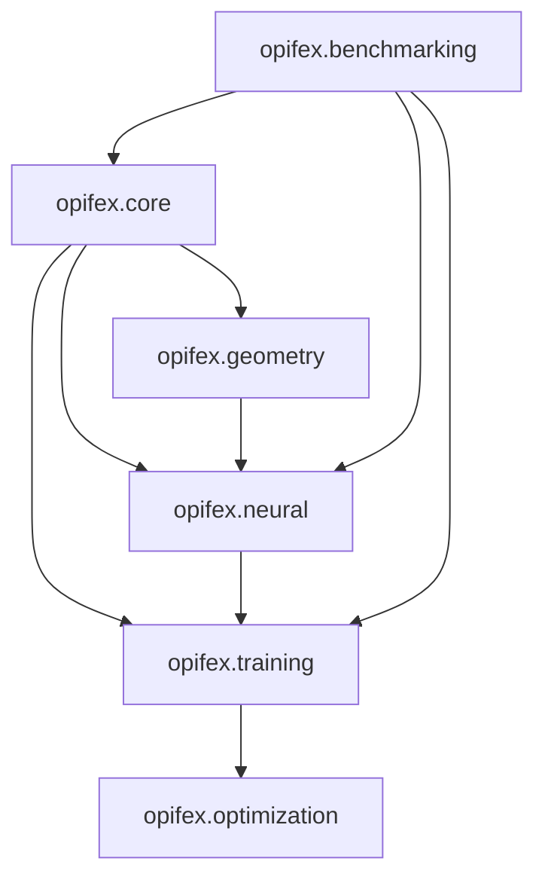

# Architecture Guide

```python
import jax
import jax.numpy as jnp
```

## Overview

Opifex follows a modular, extensible architecture built on JAX for high-performance scientific computing.

## Core Modules

### Problems (`opifex.core.problems`)

- Abstract problem definitions
- PDE, ODE, optimization problems
- Boundary conditions and domains

### Neural Networks (`opifex.neural`)

- Specialized architectures (PINNs, Neural Operators)
- Bayesian networks for uncertainty
- Quantum chemistry networks

### Training (`opifex.training`)

- Physics-informed training
- Multi-objective optimization
- Adaptive learning strategies

### Geometry (`opifex.geometry`)

- Domain representations
- Mesh generation
- Coordinate transformations

## Design Principles

### Functional Programming

```python
# Pure functions with JAX transformations
@jax.jit
def physics_loss(params, batch):
    predictions = model.apply(params, batch.inputs)
    residuals = compute_pde_residuals(predictions, batch)
    return jnp.mean(residuals**2)
```

### Immutable Data Structures

```python
# Using dataclasses for configuration
@dataclass(frozen=True)
class TrainingConfig:
    learning_rate: float = 1e-3
    batch_size: int = 32
    epochs: int = 1000
```

### Composability

```python
# Composable components
problem = PDEProblem(...)
model = PINN(...)
trainer = PhysicsInformedTrainer(model, problem)
history = trainer.train()
```

## Module Dependencies



## Extension Points

### Custom Neural Networks

```python
class CustomPINN(nn.Module):
    """Custom physics-informed architecture."""

    @nn.compact
    def __call__(self, x):
        # Implementation
        return output
```

### Custom Physics Losses

```python
def custom_physics_loss(predictions, inputs):
    """Problem-specific physics constraints."""
    # Implementation
    return loss
```

### Custom Optimizers

```python
class CustomOptimizer:
    """Domain-specific optimization algorithm."""

    def step(self, params, grads):
        # Implementation
        return updated_params
```

## Performance Considerations

### Memory Layout

- Column-major arrays for linear algebra
- Contiguous memory access patterns
- Efficient tensor operations

### Compilation Strategy

- JIT compilation for hot paths
- Static shapes for XLA optimization
- Minimal Python overhead

### Scaling

- Single-device optimization
- Multi-device parallelism (pmap)
- Distributed training (experimental)
