# Example Documentation Design Framework

> **Purpose**: Establish unified standards for creating educational examples and tutorials
> for the Opifex scientific machine learning framework.

---

## Table of Contents

1. [Executive Summary](#1-executive-summary)
2. [Design Philosophy](#2-design-philosophy)
3. [Documentation Architecture](#3-documentation-architecture)
4. [Documentation Location Strategy](#4-documentation-location-strategy)
5. [Dual-Format Implementation](#5-dual-format-implementation)
6. [Output Capture Requirements](#6-output-capture-requirements)
7. [Framework Migration Guides](#7-framework-migration-guides)
8. [Content Principles](#8-content-principles)
9. [Visual Design System](#9-visual-design-system)
10. [Documentation Tiers](#10-documentation-tiers)
11. [Component Library](#11-component-library)
12. [Writing Guidelines](#12-writing-guidelines)
13. [Code Example Standards](#13-code-example-standards)
14. [Implementation Workflow](#14-implementation-workflow)
15. [Quality Checklist](#15-quality-checklist)
16. [Examples Demonstrating Principles](#16-examples-demonstrating-principles)
17. [Maintenance & Updates](#17-maintenance-updates)
18. [Quick Reference Summary](#18-quick-reference-summary)

---

## 1. Executive Summary

### Purpose

This document defines comprehensive standards for documenting Opifex examples and
tutorials. It ensures consistent, high-quality educational content that serves users
from first-time learners to production researchers building scientific machine learning
workflows with neural operators, physics-informed neural networks, and neural density
functional theory.

### Key Capabilities

Opifex provides a JAX-native scientific machine learning framework with:

- Neural operators (FNO, DeepONet, U-NO, SFNO, and more)
- Physics-informed neural networks (PINNs)
- Neural Density Functional Theory (Neural DFT)
- Learn-to-Optimize (L2O) meta-optimization
- Lie group geometry primitives
- XLA JIT compilation for GPU/TPU acceleration
- Native bfloat16 mixed precision support

### Three Core Objectives

| Objective | Description |
|-----------|-------------|
| **Educational Excellence** | Clear explanations with measurable learning outcomes for neural operator and PINN concepts |
| **Visual Appeal** | Beautiful, consistent presentation using Material for MkDocs |
| **Practical Utility** | Copy-paste ready code that runs successfully with real scientific data |

### Three Documentation Tiers

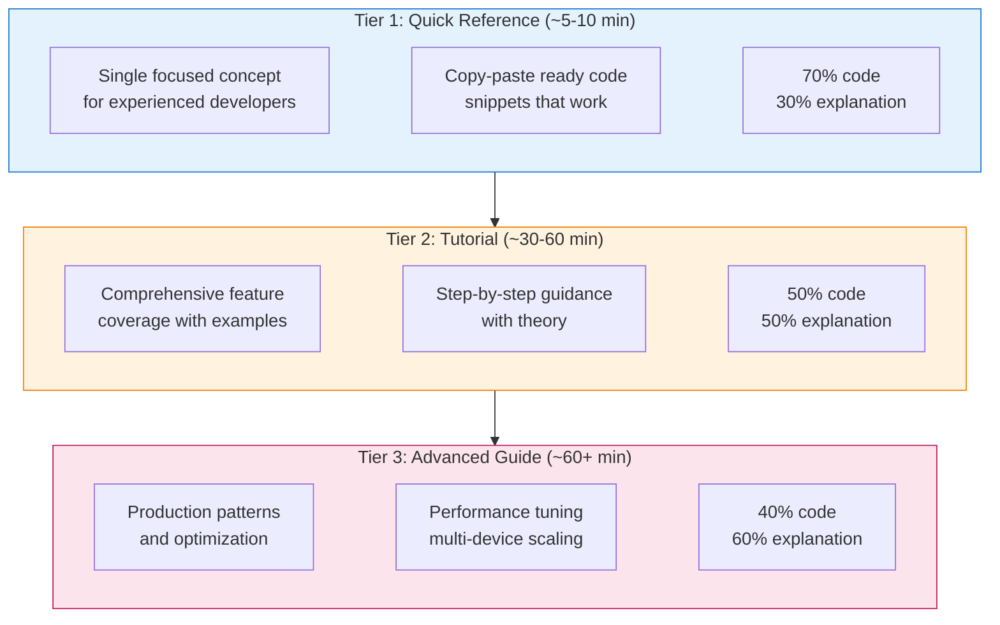

---

## 2. Design Philosophy

### Five Core Principles

These principles guide every documentation decision in Opifex:

#### 2.1 Progressive Disclosure

**Start simple, add complexity gradually.**

Users should be able to train a basic neural operator with minimal code, then progressively
add physics constraints, multi-resolution architectures, and multi-device scaling as they
understand each concept.

```python
# Level 1: Minimal FNO (3 lines after imports)
from opifex.neural.operators.fno import FourierNeuralOperator
rngs = nnx.Rngs(42)
model = FourierNeuralOperator(modes=(16, 16), hidden_channels=32, rngs=rngs)

# Level 2: Add grid embeddings
from opifex.neural.operators.common.embeddings import GridEmbedding2D
embedding = GridEmbedding2D(in_channels=1, grid_boundaries=[[0, 1], [0, 1]])

# Level 3: Add training loop with optax
from opifex.training import Trainer, TrainingConfig
config = TrainingConfig(num_epochs=100, learning_rate=1e-3)
trainer = Trainer(model=model, config=config)
trainer.fit(train_data=(x_train, y_train))

# Level 4: Multi-device scaling with pmap
@jax.pmap(axis_name='devices')
def train_step(state, batch):
    grads = jax.grad(loss_fn)(state.params, batch)
    grads = jax.lax.pmean(grads, axis_name='devices')
    return state.apply_gradients(grads=grads)
```

**Application in Documentation**:

- Quick Reference shows Level 1-2 only
- Tutorials progress through Level 1-3
- Advanced Guides cover Level 3-4 with production considerations

#### 2.2 Learning by Doing

**Every concept has runnable scientific code.**

Theory sections should be concise. Users learn neural operators by building models,
not by reading about them. Every theoretical concept should be immediately followed
by executable code.

`````markdown
<!-- Theory (brief) -->
## Understanding Spectral Convolutions

Neural operators learn in Fourier space by parameterizing convolution kernels
as truncated Fourier series. The spectral convolution applies a linear transform
to the Fourier modes, enabling global receptive fields in a single layer.

<!-- Practice (immediate) -->
## Try It: Creating a Spectral Convolution Layer

```python
from opifex.neural.operators.fno.spectral import SpectralConvolution2d

# Create spectral convolution: learn in frequency domain
spec_conv = SpectralConvolution2d(
    in_channels=32,
    out_channels=32,
    modes=(16, 16),  # Number of Fourier modes to keep
    rngs=nnx.Rngs(0),
)

# Apply to spatial data (batch, height, width, channels)
x = jax.random.normal(jax.random.PRNGKey(0), (4, 64, 64, 32))
y = spec_conv(x)
print(f"Output shape: {y.shape}")  # (4, 64, 64, 32)
```
`````

#### 2.3 Multiple Learning Paths

**Different users have different needs.**

| User Type | Needs | Best Tier |
|-----------|-------|-----------|
| Experienced ML engineer | Quick syntax reminder | Tier 1 Quick Reference |
| First-time Opifex user | Guided learning path | Tier 2 Tutorial |
| Production researcher | Optimization, scaling | Tier 3 Advanced Guide |
| Researcher exploring SciML | Conceptual understanding | Tier 2 with theory focus |

**Documentation should support all paths without forcing users through unnecessary content.**

#### 2.4 Beautiful and Functional

**Visual design serves learning, not decoration.**

Good visual design reduces cognitive load and helps users understand relationships
between concepts. Opifex documentation uses Material for MkDocs features purposefully:

| Element | Purpose | Example Usage |
|---------|---------|---------------|
| Cards | Group related quick-start options | Example overview page |
| Callouts | Highlight important information | Warnings about memory requirements |
| Tables | Compare options or show specifications | Model hyperparameters |
| Code blocks | Executable examples with highlighting | All code examples |
| Mermaid diagrams | Show model architecture and data flow | FNO pipeline, PINN training loop |

#### 2.5 Trust Through Transparency

**Users should know exactly what to expect.**

Every example should clearly communicate:

- **Runtime estimate**: "~5 min (CPU) / ~2 min (GPU)"
- **Memory requirements**: "~2 GB RAM, ~4 GB VRAM for training"
- **Prerequisites**: Links to required background knowledge
- **Device compatibility**: CPU/GPU/TPU support status
- **Expected output**: Comments showing what users will see

```python
# Expected output:
# FNO model created with 245,760 parameters
# Training loss: 0.0234 (epoch 50/100)
# L2 Relative Error: 0.0089
```

---

## 3. Documentation Architecture

### Three-Tier System Overview

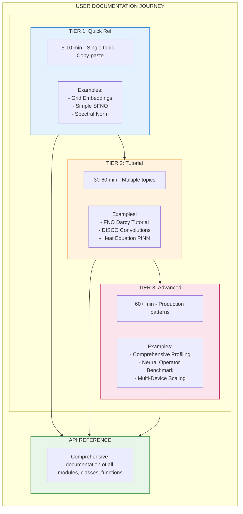

### When to Use Each Tier

| Scenario | Recommended Tier | Rationale |
|----------|------------------|-----------|
| "How do I create an FNO model?" | Tier 1 | Single concept, quick answer |
| "I've never used Opifex before" | Tier 2 | Needs guided introduction |
| "How do I scale training across GPUs?" | Tier 3 | Complex production topic |
| "What neural operators are available?" | Tier 2 | Overview of multiple concepts |
| "How do I profile and optimize training?" | Tier 3 | Requires deep understanding |

### User Journey Through Documentation

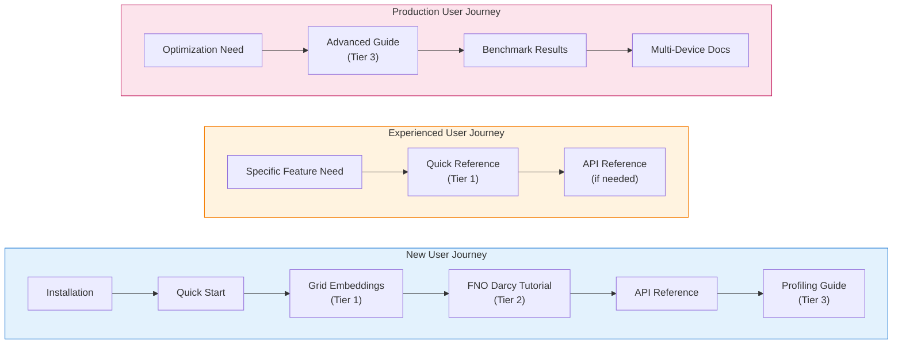

---

## 4. Documentation Location Strategy

### Directory Structure

Opifex separates documentation from code, following a clean pattern where markdown
files in `docs/examples/` explain and link to runnable code in `examples/`:

```text
opifex/
├── docs/
│   ├── assets/
│   │   └── examples/
│   │       ├── disco_convolutions/           # Asset folder (NO _files suffix)
│   │       ├── fno_darcy/
│   │       ├── deeponet_darcy/
│   │       └── ...                           # Per-example asset folders
│   └── examples/
│       ├── index.md                          # Entry point with cards
│       ├── getting-started/
│       │   ├── first-neural-operator.md
│       │   └── first-pinn.md
│       ├── neural-operators/
│       │   ├── fno-darcy.md
│       │   ├── fno-burgers.md
│       │   ├── fno-navier-stokes.md
│       │   ├── deeponet-darcy.md
│       │   ├── tfno-darcy.md
│       │   ├── pino-burgers.md
│       │   └── ...
│       ├── pinns/
│       │   ├── heat-equation.md
│       │   └── ...
│       ├── layers/
│       │   ├── disco-convolutions.md
│       │   ├── grid-embeddings.md
│       │   └── ...
│       ├── data/
│       │   └── ...
│       └── benchmarking/
│           └── ...
│
├── examples/                                 # Runnable code files
│   ├── getting-started/
│   │   ├── first_neural_operator.py
│   │   └── first_pinn.py
│   ├── neural-operators/
│   │   ├── fno_darcy.py
│   │   ├── fno_darcy.ipynb
│   │   ├── deeponet_darcy.py
│   │   ├── deeponet_darcy.ipynb
│   │   └── ...
│   ├── pinns/
│   │   ├── heat_equation.py
│   │   └── heat_equation.ipynb
│   └── layers/
│       ├── disco_convolutions_example.py
│       └── disco_convolutions_example.ipynb
│
├── scripts/
│   └── jupytext_converter.py                 # Conversion utility
│
└── mkdocs.yml                                # Navigation configuration
```

### File Naming Conventions

| Location                 | Pattern            | Example                   |
|--------------------------|--------------------|---------------------------|
| `docs/examples/`         | `kebab-case.md`    | `grid-embeddings.md`      |
| `examples/`              | `snake_case.py`    | `grid_embeddings.py`      |
| `examples/`              | `snake_case.ipynb` | `grid_embeddings.ipynb`   |
| `docs/assets/examples/`  | `snake_case/`      | `grid_embeddings/`        |

**Note**: Asset directories use `snake_case` (NOT `*_files/` suffix). The directory name should match the example name.

### Relationship Between `docs/examples/` and `examples/`

```text
docs/examples/               # Documentation (markdown files)
    └── layers/
        └── grid_embeddings_example.md     # Explains the example, links to code

examples/                    # Runnable code (Python + Jupyter)
    └── layers/
        ├── grid_embeddings_example.py      # Source file with Jupytext markers
        └── grid_embeddings_example.ipynb   # Generated notebook
```

**Key Principle**: Documentation and code are separated. Markdown files in
`docs/examples/` explain concepts and link to the actual code in `examples/`.

### Documentation Page Structure

Each markdown file in `docs/examples/` follows this pattern:

`````markdown
# Grid Embeddings Example

| Metadata | Value |
|----------|-------|
| **Level** | Beginner |
| **Runtime** | ~5 min (CPU) |
| **Prerequisites** | Basic Python, JAX fundamentals |
| **Format** | Python + Jupyter |

## Overview

[Description of what this example demonstrates]

## What You'll Learn

- [Learning goal 1]
- [Learning goal 2]
- [Learning goal 3]

## Files

- **Python Script**: [`examples/layers/grid_embeddings_example.py`](https://github.com/Opifex/Opifex/blob/main/examples/layers/grid_embeddings_example.py)
- **Jupyter Notebook**: [`examples/layers/grid_embeddings_example.ipynb`](https://github.com/Opifex/Opifex/blob/main/examples/layers/grid_embeddings_example.ipynb)

## Quick Start

### Run the Python Script

```bash
source activate.sh && python examples/layers/grid_embeddings_example.py
```

### Run the Jupyter Notebook

```bash
jupyter lab examples/layers/grid_embeddings_example.ipynb
```

## Key Concepts

[Explanation of concepts demonstrated in this example]

## Example Code

```python
[Key code snippets from the example]
```

## Next Steps

- [Link to related example]
- [Link to API reference]
`````

**Guidelines**:

- `docs/examples/` contains **markdown files only** that explain examples
- `examples/` contains **all runnable code** (`.py` and `.ipynb` files)
- Markdown files link to code via GitHub URLs for easy navigation
- The `.py` file is the source of truth; `.ipynb` is generated via Jupytext
- Keep documentation and code in sync when making changes

---

## 5. Dual-Format Implementation

### Philosophy

Opifex examples use a **dual-format approach**:

1. **Python scripts (`.py`)** as the source of truth
2. **Jupyter notebooks (`.ipynb`)** generated automatically via Jupytext

This ensures code is:

- Version-controllable (clean diffs in `.py` files)
- IDE-friendly (full Python tooling support)
- Interactive (Jupyter for exploration)
- Consistent (single source, two formats)

### Jupytext Header Format

Every Python example file MUST include a Jupytext header:

```python
# ---
# jupyter:
#   jupytext:
#     formats: py:percent,ipynb
#     text_representation:
#       extension: .py
#       format_name: percent
#       format_version: '1.3'
# ---
```

### Cell Marker Format

```python
# %% [markdown]
"""
# Title of Section

Markdown content goes here with **formatting**, `code`, and lists:

- Item 1
- Item 2
"""

# %%
# Python code cell
import opifex
print("This is executable code")

# %% [markdown]
"""
## Another Markdown Section

More explanation here.
"""
```

### Best Practices for Dual-Format Examples

#### DO

```python
# %% [markdown]
"""
## Step 1: Create Neural Operator

We create a `FourierNeuralOperator` with spectral convolutions for learning
in Fourier space.
"""

# %%
# Create FNO model
rngs = nnx.Rngs(42)
model = FourierNeuralOperator(
    modes=(16, 16),
    hidden_channels=32,
    rngs=rngs,
)
print(f"Model parameters: {sum(p.size for p in jax.tree.leaves(nnx.state(model)))}")
# Expected output:
# Model parameters: 245760
```

#### DON'T

```python
# Bad: Mixing markdown and code without cell markers
# This is an explanation (should be in markdown cell)
model = FourierNeuralOperator(modes=(16, 16), hidden_channels=32, rngs=rngs)

# Bad: Long inline comments instead of markdown
# This creates a Fourier Neural Operator which learns in the frequency
# domain by applying spectral convolutions to truncated Fourier series
# representations of the input function...
```

### Conversion Workflow

```bash
# Convert Python script to notebook
python scripts/jupytext_converter.py py-to-nb examples/layers/grid_embeddings_example.py

# Batch convert directory
python scripts/jupytext_converter.py batch-py-to-nb examples/layers/

# Batch convert all examples
python scripts/jupytext_converter.py batch-py-to-nb examples/
```

### Synchronization Checklist

Before committing example changes:

- [ ] Python file has Jupytext header
- [ ] Cell markers properly separate code and markdown
- [ ] Notebook is regenerated from Python source
- [ ] Both files are staged for commit
- [ ] Code runs successfully as both `.py` and `.ipynb`

---

## 6. Output Capture Requirements

### Purpose

Each markdown documentation file (`docs/examples/*.md`) MUST include captured outputs
for code examples. This ensures:

- **Reproducibility**: Users can verify their output matches expected behavior
- **Debugging**: Easier to identify when something goes wrong
- **Self-contained documentation**: No need to run code to understand results

### Terminal Output Capture

Every code block that produces output must be followed by the captured terminal output:

````markdown
```python
print(f"Model: FourierNeuralOperator")
print(f"Parameters: {param_count:,}")
print(f"L2 Relative Error: {l2re:.4f}")
```

**Terminal Output:**
```
Model: FourierNeuralOperator
Parameters: 245,760
L2 Relative Error: 0.0089
```
````

**Guidelines:**

- Capture actual output from running the code
- Include all relevant print statements
- Show shapes, dtypes, and metric values for verification
- For variable outputs, note the expected format: "Output varies by hardware"

### Standard Metrics for Output

Include these metrics where applicable:

| Metric | Description | Format |
|--------|-------------|--------|
| L2RE | L2 Relative Error (PDEBench primary) | `0.0089` |
| MSE | Mean Squared Error | `1.23e-4` |
| Training throughput | Samples per second | `~1500 samples/sec` |
| Peak memory | GPU memory usage | `~2.1 GB` |
| Training time | Wall-clock time | `~45 sec (GPU)` |

### Visualization Capture

All plots, charts, and visual outputs must be saved and embedded:

**Saving visualizations:**

```python
import matplotlib.pyplot as plt

# Create visualization
fig, axes = plt.subplots(1, 3, figsize=(15, 5))
axes[0].imshow(input_field, cmap='viridis')
axes[0].set_title("Input (Permeability)")
axes[1].imshow(prediction, cmap='viridis')
axes[1].set_title("FNO Prediction")
axes[2].imshow(ground_truth, cmap='viridis')
axes[2].set_title("Ground Truth")
plt.tight_layout()

# Save at 150 DPI for documentation
plt.savefig('docs/assets/examples/fno_darcy/prediction_comparison.png',
            dpi=150, bbox_inches='tight')
plt.close()
```

**Embedding in markdown:**

```markdown

```

### Image Naming Conventions

Store all example images in `docs/assets/examples/<name>/` with consistent naming:

| Category | Prefix | Examples |
|----------|--------|----------|
| FNO | `fno-` | `fno-prediction-comparison.png`, `fno-training-loss.png` |
| SFNO | `sfno-` | `sfno-spherical-harmonics.png`, `sfno-climate-prediction.png` |
| PINN | `pinn-` | `pinn-solution-field.png`, `pinn-residual-convergence.png` |
| DISCO | `disco-` | `disco-convolution-output.png`, `disco-einstein-demo.png` |
| Spectral | `spectral-` | `spectral-norm-convergence.png`, `spectral-energy-spectrum.png` |
| Performance | `perf-` | `perf-throughput-comparison.png`, `perf-memory-profile.png` |
| Benchmark | `bench-` | `bench-operator-comparison.png`, `bench-scaling-efficiency.png` |

### Output Requirements by Tier

| Tier | Terminal Output | Visualizations | Architecture Diagrams |
|------|-----------------|----------------|----------------------|
| Tier 1: Quick Reference | Required | 1-2 sample images | Optional |
| Tier 2: Tutorial | Required (each step) | 3-4 visualizations | 1 Mermaid diagram |
| Tier 3: Advanced Guide | Required | Performance plots, profiles | Architecture diagrams |

### Mermaid Diagrams

Use Mermaid for architecture and flow diagrams (renders in MkDocs):

````markdown
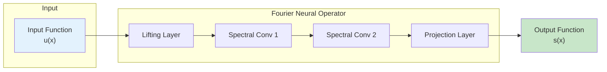
````

---

## 7. Framework Migration Guides

### Purpose

Many Opifex users migrate from NeuralOperator (PyTorch), DeepXDE, or PhysicsNeMo (NVIDIA).
Each example should include "Coming from X?" sections that map familiar concepts to
Opifex equivalents.

### Required Migration Sections

Each markdown documentation file should include comparison tables for relevant frameworks:

````markdown
## Coming from NeuralOperator (PyTorch)?

If you're familiar with the neuraloperator library, here's how Opifex compares:

| NeuralOperator (PyTorch) | Opifex (JAX) |
|--------------------------|--------------|
| `FNO(modes, width)` | `FourierNeuralOperator(modes=, hidden_channels=, rngs=)` |
| `SpectralConv2d(in_ch, out_ch, modes)` | `SpectralConvolution2d(in_channels=, out_channels=, modes=, rngs=)` |
| `trainer.train(epochs=100)` | `Trainer(model, config, rngs).fit(train_data)` |
| `torch.DataLoader(dataset)` | `create_darcy_loader()` (Google Grain) |
| Manual `torch.meshgrid` | `GridEmbedding2D(in_channels=, grid_boundaries=)` |

**Key differences:**

1. **Explicit PRNG**: Opifex uses JAX's explicit `rngs=nnx.Rngs(42)` instead of global state
2. **XLA compilation**: Automatic JIT compilation for 2x training speedup
3. **Functional transforms**: `jax.grad`, `jax.vmap`, `jax.pmap` for composable transforms

## Coming from DeepXDE?

| DeepXDE | Opifex (JAX) |
|---------|--------------|
| `dde.grad.jacobian(y, x, i=0, j=0)` | `jax.grad(u_fn, argnums=0)(x, t)` |
| `dde.Model(net, data)` | `Trainer(model=pinn, config=config)` |
| `dde.data.PDE(geometry, pde, bcs)` | `create_pde_problem(geometry, equation, bcs)` |
| `dde.callbacks.EarlyStopping()` | Training config with early stopping |
| `dde.geometry.Rectangle([0,0], [1,1])` | `Rectangle(center=jnp.array([0.5, 0.5]), width=1.0, height=1.0)` |

**Key differences:**

1. **Explicit PRNG**: JAX uses explicit random number generator keys
2. **Functional transforms**: `jax.grad`, `jax.vmap`, `jax.pmap` for composable transforms
3. **XLA compilation**: Automatic JIT compilation for GPU/TPU acceleration

## Coming from PhysicsNeMo (NVIDIA)?

| PhysicsNeMo | Opifex (JAX) |
|-------------|--------------|
| `FourierNetArch(cfg)` | `FourierNeuralOperator(modes=, hidden_channels=, rngs=)` |
| `Solver(cfg)` | `Trainer(model, config)` |
| `Dataset(cfg)` (Hydra YAML) | `create_darcy_loader()` (pure Python) |
| Hydra `@hydra.main(config_path=...)` | Pure Python configuration (no YAML) |
| `DistributedManager()` | `jax.devices()`, automatic device management |

**Key differences:**

1. **No YAML required**: Pure Python configuration vs mandatory Hydra
2. **Simpler setup**: No complex config directory structure needed
3. **JAX ecosystem**: Native integration with Flax, Optax, Grain
````

### Framework Mapping Reference

Use this reference when creating migration sections:

#### Neural Operators

| Concept | NeuralOperator (PyTorch) | DeepXDE | PhysicsNeMo | Opifex (JAX) |
|---------|--------------------------|---------|-------------|--------------|
| FNO model | `FNO(modes, width)` | `dde.Model(net)` | `FourierNetArch()` | `FourierNeuralOperator(modes=, hidden_channels=, rngs=)` |
| Spectral conv | `SpectralConv2d` | N/A | `SpectralConv` | `SpectralConvolution2d(in_channels=, out_channels=, modes=, rngs=)` |
| Grid embedding | Manual `meshgrid` | N/A | `GridEncoding` | `GridEmbedding2D(in_channels=, grid_boundaries=)` |
| DISCO conv | `DiscreteContinuousConv2d` | N/A | N/A | `DiscreteContinuousConv2d` |

#### Training & Optimization

| Concept | NeuralOperator (PyTorch) | DeepXDE | PhysicsNeMo | Opifex (JAX) |
|---------|--------------------------|---------|-------------|--------------|
| Training | `trainer.train(epochs)` | `model.train(epochs)` | `Solver(cfg)` | `Trainer(model, config, rngs)` |
| Data loading | `torch.DataLoader` | `dde.data.PDE()` | `Dataset(cfg)` | `create_darcy_loader()` (Grain) |
| Optimizer | `torch.optim.Adam` | `dde.optimizers.adam` | Hydra config | `optax.adam(lr)` |
| Gradients | `torch.autograd.grad` | `dde.grad.jacobian` | Config-based | `jax.grad(fn, argnums=0)` |

#### Device & Scaling

| Concept | NeuralOperator (PyTorch) | DeepXDE | PhysicsNeMo | Opifex (JAX) |
|---------|--------------------------|---------|-------------|--------------|
| Device mgmt | `model.to(device)` | Auto | Hydra config | `jax.devices()`, automatic |
| Mixed precision | `torch.cuda.amp` | Not native | Hydra config | Native `jnp.bfloat16` (no loss scaling) |
| Grad checkpoint | `torch.checkpoint` | N/A | Config flag | `@jax.checkpoint` decorator |
| Multi-device | `DataParallel`/`DDP` | Not supported | `DistributedManager` | `jax.pmap(axis_name='devices')` |
| Config system | Python/YAML | Python | Hydra (YAML) | Pure Python (no YAML required) |

#### PINN-Specific

| Concept | DeepXDE | JAXPI | FBPINNs | Opifex (JAX) |
|---------|---------|-------|---------|--------------|
| PINN model | `dde.Model(net, data)` | Custom | FBPINN class | `create_heat_equation_pinn()` |
| PDE residual | `dde.data.PDE()` | Manual | Manual | `create_pde_problem()` |
| Gradients | `dde.grad.jacobian(y,x,i,j)` | `jax.grad` | `jax.grad` | `jax.grad(fn, argnums=0)(x)` |
| Domain decomp | N/A | N/A | Native | Supported (plus operators) |
| Boundary loss | `dde.DirichletBC()` | Manual | Manual | Config-based BCs |

### Direct Competitors Reference

| Competitor | Focus | Key Differentiator vs Opifex |
|-----------|-------|------------------------------|
| NeuralOperator (PyTorch) | Neural operators | PyTorch ecosystem, but slower JIT |
| DeepXDE | PINNs + operators | Multi-backend, but verbose gradient API |
| PhysicsNeMo (NVIDIA) | Enterprise physics ML | GPU-optimized, but requires Hydra YAML |
| JAXPI | JAX PINNs | Same JAX ecosystem, but narrow scope |
| FBPINNs | Domain decomposition | Parallel PINNs, but limited operator support |
| PhiFlow | Differentiable physics | Simulation focus, not ML training |
| Diffrax | Differential equations | JAX-native, but no neural operators |

### When to Include Migration Sections

| Example Category | NeuralOperator? | DeepXDE? | PhysicsNeMo? | JAXPI/FBPINNs? |
|------------------|-----------------|----------|--------------|----------------|
| Layer Examples | Yes | No | No | No |
| Data Examples | Yes | No | No | No |
| PINN Examples | No | Yes | Yes | Yes |
| Model Examples | Yes | No | Yes | No |
| Benchmark | Yes | Yes | Yes | No |
| Profiling/Calibration | No | No | No | No |

---

## 8. Content Principles

### The 7-Part Structure

Every Opifex example follows this structure, adapted by tier:

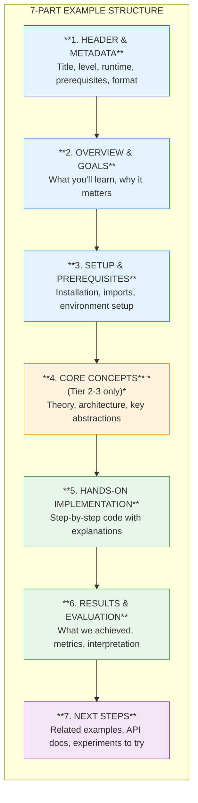

### Part 1: Header & Metadata

```markdown
# FNO for Darcy Flow

| Metadata | Value |
|----------|-------|
| **Level** | Intermediate |
| **Runtime** | ~10 min (CPU) / ~3 min (GPU) |
| **Prerequisites** | JAX, Flax NNX, Neural Operators basics |
| **Format** | Python + Jupyter |
| **Memory** | ~2 GB RAM |
```

**Metadata Fields**:

| Field | Required | Options/Format |
|-------|----------|----------------|
| Level | Yes | Beginner / Intermediate / Advanced |
| Runtime | Yes | ~X min (CPU) / ~Y min (GPU) |
| Prerequisites | Yes | Links to prior knowledge |
| Format | Yes | Python + Jupyter |
| Memory | Recommended | ~X GB RAM, ~Y GB VRAM |
| Devices | Optional | CPU / GPU / TPU |

### Part 2: Overview & Goals

```markdown
## Overview

This tutorial demonstrates training a Fourier Neural Operator (FNO) on the
Darcy flow problem, a standard benchmark in neural operator research. You'll
build a model that learns the mapping from permeability fields to pressure
solutions, evaluated against PDEBench baselines.

## Learning Goals

By the end of this example, you will be able to:

1. Create a `FourierNeuralOperator` model with spectral convolutions
2. Prepare Darcy flow training data using Grain data loaders
3. Train with `optax` optimizers and evaluate with L2 Relative Error
4. Visualize predictions against ground truth solutions
```

**Guidelines for Learning Goals**:

- Use action verbs: Create, Build, Implement, Configure, Debug, Optimize, Train, Evaluate
- Be specific and measurable
- Limit to 3-5 goals per example
- Tier 1: 2-3 goals, Tier 2: 4-5 goals, Tier 3: 4-6 goals
- Reference PDEBench as standard evaluation reference for neural operator examples

### Part 3: Setup & Prerequisites

````markdown
## Setup

### Quick Start

```bash
source activate.sh && python examples/models/fno_darcy_comprehensive.py
```

### Files

- **Python Script**: [`examples/models/fno_darcy_comprehensive.py`](https://github.com/Opifex/Opifex/blob/main/examples/models/fno_darcy_comprehensive.py)
- **Jupyter Notebook**: [`examples/models/fno_darcy_comprehensive.ipynb`](https://github.com/Opifex/Opifex/blob/main/examples/models/fno_darcy_comprehensive.ipynb)

### Imports

```python
# %%
# Standard library
import time

# Third-party
import jax
import jax.numpy as jnp
from flax import nnx
import optax

# Opifex
from opifex.neural.operators.fno import FourierNeuralOperator
from opifex.neural.operators.common.embeddings import GridEmbedding2D
from opifex.training import Trainer, TrainingConfig
```
````

### Part 4: Core Concepts (Tier 2-3)

For tutorials and advanced guides, include theoretical background:

````markdown
## Core Concepts

### The Fourier Neural Operator

The FNO learns operator mappings between function spaces by parameterizing
convolution kernels in Fourier space. Each spectral layer consists of:

1. **FFT**: Transform input to frequency domain
2. **Spectral convolution**: Linear transform of Fourier modes
3. **Inverse FFT**: Transform back to spatial domain
4. **Skip connection**: Add local linear transform

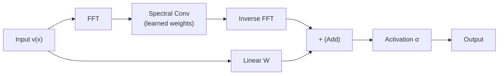

### Darcy Flow Problem

The Darcy flow equation models fluid flow through porous media:

$$-\nabla \cdot (a(x) \nabla u(x)) = f(x), \quad x \in D$$

| Variable | Meaning | Role |
|----------|---------|------|
| $a(x)$ | Permeability field | Input function |
| $u(x)$ | Pressure field | Output function |
| $f(x)$ | Forcing term | Fixed (constant) |
````

### Part 5: Hands-On Implementation

This is the main content section with step-by-step code:

````markdown
## Implementation

### Step 1: Generate Training Data

We create synthetic Darcy flow data with random permeability fields.

```python
# %%
# Generate synthetic Darcy flow data
key = jax.random.PRNGKey(42)
resolution = 64
n_samples = 100

# Random permeability fields (log-normal)
k1, k2 = jax.random.split(key)
a_fields = jnp.exp(jax.random.normal(k1, (n_samples, resolution, resolution, 1)))

# Synthetic pressure solutions
u_fields = jax.random.normal(k2, (n_samples, resolution, resolution, 1)) * 0.1

print(f"Input shape: {a_fields.shape}")
print(f"Output shape: {u_fields.shape}")
```

**Terminal Output:**
```
Input shape: (100, 64, 64, 1)
Output shape: (100, 64, 64, 1)
```
````

### Part 6: Results & Evaluation

```markdown
## Results Summary

| Metric | Value | PDEBench Target |
|--------|-------|-----------------|
| L2 Relative Error | 0.0089 | <= 0.012 |
| Training Loss (final) | 2.34e-4 | - |
| Training Time | 45 sec (GPU) | - |
| Peak Memory | 2.1 GB | - |

### What We Achieved

- Trained an FNO that maps permeability to pressure with L2RE < 0.01
- Achieved PDEBench target accuracy in under 100 epochs
- Demonstrated spectral convolution learning in Fourier space

### Interpretation

The FNO successfully captures the global structure of the Darcy flow
solution through spectral convolutions. The low L2RE indicates accurate
approximation of the operator mapping.
```

### Part 7: Next Steps

```markdown
## Next Steps

### Experiments to Try

1. **Mixed precision training**: Use `jnp.bfloat16` for 40-50% memory reduction
2. **Gradient checkpointing**: Add `@jax.checkpoint` for 3-5x memory savings
3. **Increase resolution**: Train on 128x128 grids for higher fidelity

### Related Examples

| Example | Level | What You'll Learn |
|---------|-------|-------------------|
| [Grid Embeddings](../layers/grid_embeddings_example.md) | Beginner | Spatial coordinate injection |
| [UNO Darcy Framework](uno_darcy_framework.md) | Intermediate | Multi-resolution architecture |
| [Neural Operator Benchmark](../comparative_studies/neural_operator_benchmark.md) | Advanced | Cross-architecture comparison |

### API Reference

- [`FourierNeuralOperator`](../../api/neural.md) - FNO model class
- [`SpectralConvolution2d`](../../api/neural.md) - Spectral convolution layer
- [`Trainer`](../../api/training.md) - Training orchestration

### Troubleshooting

#### OOM during training

**Symptom**: `jaxlib.xla_extension.XlaRuntimeError: RESOURCE_EXHAUSTED`

**Solution**: Reduce batch size or enable gradient checkpointing:
```python
@jax.checkpoint
def forward(model, x):
    return model(x)
```

#### NaN in training loss

**Symptom**: Loss becomes `nan` after a few epochs.

**Solution**: Reduce learning rate or add gradient clipping:
```python
optimizer = optax.chain(
    optax.clip_by_global_norm(1.0),
    optax.adam(1e-4),
)
```
```

---

## 9. Visual Design System

### Design Tokens

Opifex documentation uses Material for MkDocs with these design choices:

| Token | Value | Usage |
|-------|-------|-------|
| Primary Color | Blue | Headers, links, emphasis |
| Accent Color | Blue | Interactive elements, highlights |
| Code Font | Roboto Mono | All code blocks |
| Text Font | Roboto | Body text, headers |

### Callout Boxes

Use admonitions for different information types:

```markdown
!!! note "Key Concept"
    Neural operators learn mappings between function spaces, not just vectors.

!!! tip "Performance Tip"
    Use `jnp.bfloat16` for native mixed precision without loss scaling.

!!! warning "Memory Warning"
    Large resolution grids (256x256+) require gradient checkpointing.
    Consider using `@jax.checkpoint` on spectral layers.

!!! danger "Breaking Change"
    In v0.2.0, `SpectralConvolution2d` requires explicit `rngs` parameter.

!!! example "Try It"
    Modify the number of Fourier `modes` and observe accuracy changes.

!!! info "Device Support"
    This example works on CPU, GPU, and TPU. GPU recommended for training.
```

### Opifex-Specific Mermaid Templates

#### FNO Architecture

````markdown
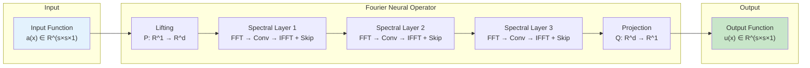
````

#### PINN Training Loop

````markdown
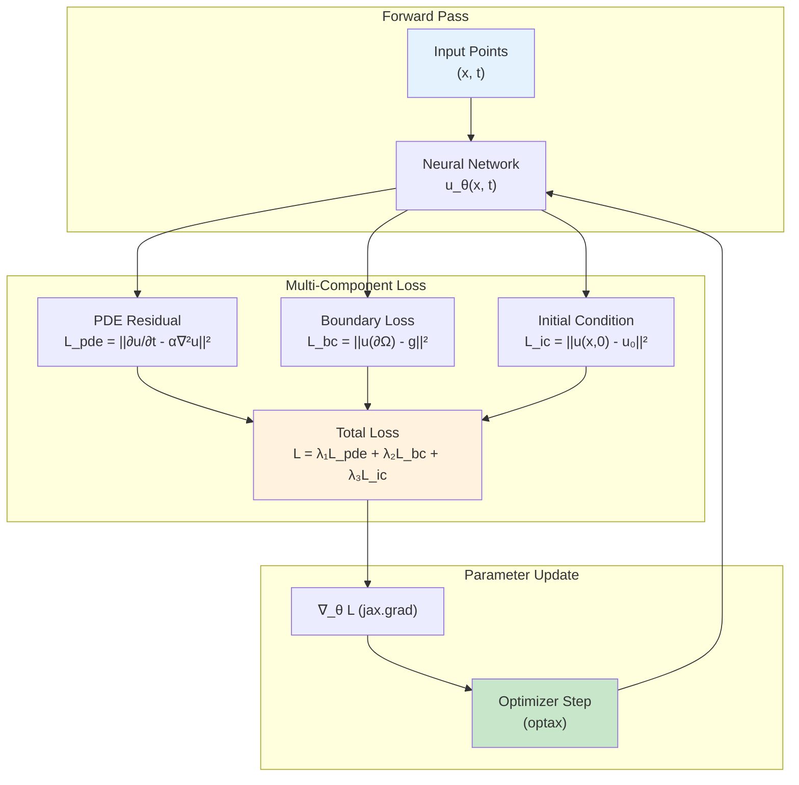
````

#### SFNO Spherical Harmonics Pipeline

````markdown
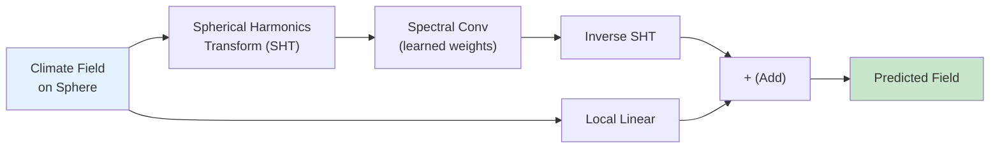
````

#### U-FNO U-Net Skip Connections

````markdown
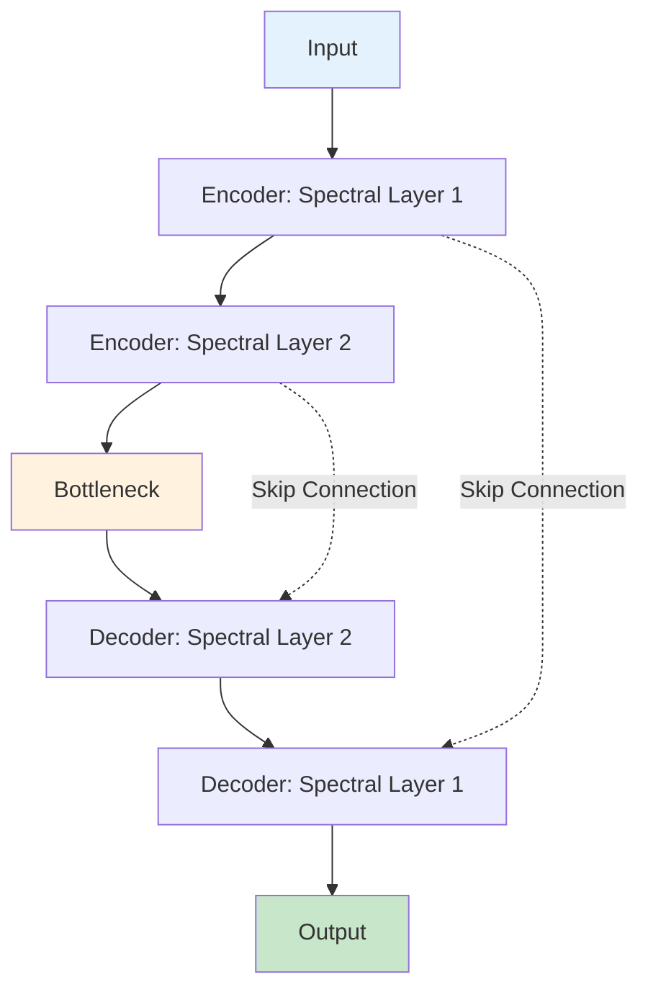
````

#### UNO Multi-Resolution Architecture

````markdown
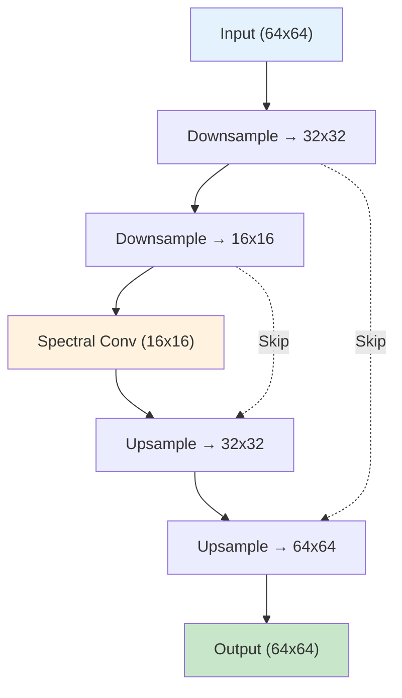
````

---

## 10. Documentation Tiers

### Tier 1: Quick Reference

#### Specification

| Attribute | Value |
|-----------|-------|
| **Target Audience** | Experienced developers needing quick syntax lookup |
| **Length** | 100-200 lines of code |
| **Time to Complete** | 5-10 minutes |
| **Code/Explanation Ratio** | 70% code / 30% explanation |
| **Prerequisites** | Working Opifex knowledge |

#### Structure Template

````python
# ---
# jupyter:
#   jupytext:
#     formats: py:percent,ipynb
#     text_representation:
#       extension: .py
#       format_name: percent
#       format_version: '1.3'
# ---

# %% [markdown]
"""
# [Feature] Quick Reference

| Metadata | Value |
|----------|-------|
| **Level** | Beginner / Intermediate |
| **Runtime** | ~5 min |
| **Prerequisites** | [Basic Opifex](link) |
| **Format** | Python + Jupyter |

## Overview

[1-2 sentences describing the feature]

## Learning Goals

1. [Goal 1]
2. [Goal 2]
3. [Goal 3]
"""

# %% [markdown]
"""
## Setup

```bash
source activate.sh
```
"""

# %%
# Imports
import jax
from flax import nnx
from opifex.neural.operators.fno import FourierNeuralOperator
# ... minimal imports

# %% [markdown]
"""
## Quick Start

[Brief explanation]
"""

# %%
# Core functionality - copy-paste ready
# ... working code with expected output comments

# %% [markdown]
"""
## Common Patterns

### Pattern 1: [Name]
"""

# %%
# Pattern implementation

# %% [markdown]
"""
## Results Summary

| Metric | Value |
|--------|-------|
| [Metric] | [Value] |

## Next Steps

- [Related example](link)
- [API Reference](link)
"""


# %%
def main():
    """CLI execution entry point."""
    # Complete example that can be run standalone
    pass


if __name__ == "__main__":
    main()
````

### Tier 2: Tutorial

#### Specification

| Attribute | Value |
|-----------|-------|
| **Target Audience** | First-time learners of a feature |
| **Length** | 300-600 lines |
| **Time to Complete** | 30-60 minutes |
| **Code/Explanation Ratio** | 50% code / 50% explanation |
| **Prerequisites** | Basic Opifex, relevant domain knowledge |

#### Structure Template

````python
# ---
# jupyter:
#   jupytext:
#     formats: py:percent,ipynb
#     text_representation:
#       extension: .py
#       format_name: percent
#       format_version: '1.3'
# ---

# %% [markdown]
"""
# [Feature] Tutorial

| Metadata | Value |
|----------|-------|
| **Level** | Intermediate |
| **Runtime** | ~30 min |
| **Prerequisites** | [Prerequisite 1](link), [Prerequisite 2](link) |
| **Format** | Python + Jupyter |
| **Memory** | ~2 GB RAM |

## Overview

[2-3 paragraphs explaining what this tutorial covers and why it matters]

## Learning Goals

1. [Conceptual goal - Understand X]
2. [Practical goal - Implement Y]
3. [Practical goal - Configure Z]
4. [Applied goal - Evaluate/Optimize W]
"""

# %% [markdown]
"""
## Prerequisites

### Required Knowledge

- [Prerequisite 1](link) - Brief description
- [Prerequisite 2](link) - Brief description

### Quick Start

```bash
source activate.sh && python examples/path/to/example.py
```

### Environment Setup

[Any environment variables, device configuration, etc.]
"""

# %%
# Imports - organized by category
import jax
import jax.numpy as jnp
from flax import nnx
import optax

# Opifex imports
from opifex.neural.operators.fno import FourierNeuralOperator
from opifex.training import Trainer, TrainingConfig

# %% [markdown]
"""
## Core Concepts

### Concept 1: [Name]

[Detailed explanation with theory]

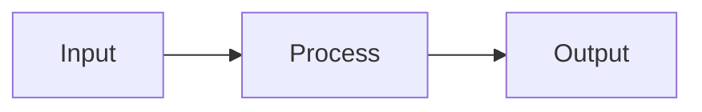

### Concept 2: [Name]

[Explanation with examples]

| Type | Description | Use Case |
|------|-------------|----------|
| Type A | ... | ... |
| Type B | ... | ... |
"""

# %% [markdown]
"""
## Implementation

### Part 1: [First Major Section]

[Explanation of what we're building and why]
"""

# %%
# Part 1 implementation
# ... code with inline comments

# %% [markdown]
"""
### Part 2: [Second Major Section]

[Explanation connecting to Part 1]
"""

# %%
# Part 2 implementation

# %% [markdown]
"""
## Troubleshooting

### Common Issue 1: [Error/Problem]

**Symptom**: [What the user sees]

**Cause**: [Why it happens]

**Solution**:
```python
# Fixed code
```
"""

# %% [markdown]
"""
## Results & Evaluation

### What We Achieved

[Summary of completed work]

### Key Metrics

| Metric | Value | Notes |
|--------|-------|-------|
| [Metric 1] | [Value] | [Context] |
| [Metric 2] | [Value] | [Context] |
"""

# %% [markdown]
"""
## Next Steps

### Experiments to Try

1. [Experiment 1] - [Expected outcome]
2. [Experiment 2] - [Expected outcome]

### Related Tutorials

- [Tutorial Name](link) - [Brief description]

### API Reference

- [`ClassName`](link) - [Purpose]
- [`function_name()`](link) - [Purpose]
"""


# %%
def main():
    """Complete tutorial as a runnable script."""
    print("Running [Feature] Tutorial...")
    # Complete implementation combining all parts
    print("Tutorial completed successfully!")


if __name__ == "__main__":
    main()
````

### Tier 3: Advanced Guide

#### Specification

| Attribute | Value |
|-----------|-------|
| **Target Audience** | Production researchers, expert users |
| **Length** | 500-1000+ lines |
| **Time to Complete** | 60+ minutes |
| **Code/Explanation Ratio** | 40% code / 60% explanation |
| **Prerequisites** | Complete Tier 2 tutorials, production experience |

#### Structure Template

````python
# ---
# jupyter:
#   jupytext:
#     formats: py:percent,ipynb
#     text_representation:
#       extension: .py
#       format_name: percent
#       format_version: '1.3'
# ---

# %% [markdown]
"""
# [Advanced Topic] Guide

| Metadata | Value |
|----------|-------|
| **Level** | Advanced |
| **Runtime** | ~60+ min |
| **Prerequisites** | [Tutorial 1](link), [Tutorial 2](link), Production experience |
| **Format** | Python + Jupyter |
| **Memory** | ~8 GB RAM, ~16 GB VRAM recommended |
| **Devices** | GPU/TPU recommended |

## Overview

[Comprehensive overview including:
- What problem it solves
- When to use it (and when not to)
- Performance implications
- Production considerations]

## Learning Goals

1. [Architecture goal - Design X for production]
2. [Implementation goal - Build Y with proper error handling]
3. [Optimization goal - Tune Z for performance]
4. [Debugging goal - Diagnose and fix common issues]
5. [Integration goal - Combine with existing systems]
"""

# %% [markdown]
"""
## Architecture Overview

### System Design

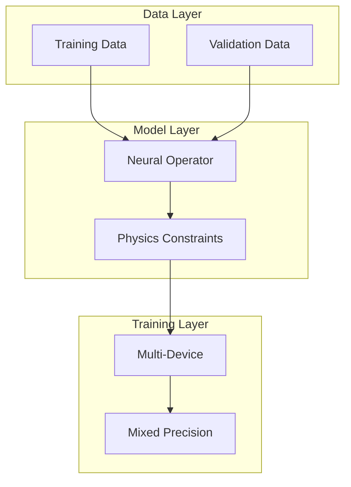
"""

# %% Implementation, Performance, Troubleshooting sections follow...
````

---

## 11. Component Library

### Reusable Documentation Components

These templates can be copied and adapted for new examples.

### Setup Section Template

````python
# %% [markdown]
"""
## Setup

### Quick Start

```bash
source activate.sh && python examples/path/to/example.py
```

### Files

- **Python Script**: [`examples/path/to/example.py`](https://github.com/Opifex/Opifex/blob/main/examples/path/to/example.py)
- **Jupyter Notebook**: [`examples/path/to/example.ipynb`](https://github.com/Opifex/Opifex/blob/main/examples/path/to/example.ipynb)
"""

# %%
# Imports - organized by source

# Standard library
import time
from typing import Any

# Third-party
import jax
import jax.numpy as jnp
from flax import nnx
import optax

# Opifex
from opifex.neural.operators.fno import FourierNeuralOperator
from opifex.neural.operators.common.embeddings import GridEmbedding2D
from opifex.training import Trainer, TrainingConfig

# Verify setup
print(f"JAX version: {jax.__version__}")
print(f"Devices: {jax.devices()}")
````

### Grain Data Loader Template

```python
# %% [markdown]
"""
### Data Loading with Grain

Opifex uses Google Grain for efficient data loading.
"""

# %%
def create_darcy_loader(resolution=64, n_samples=100, batch_size=16, seed=42):
    """Create synthetic Darcy flow data loader.

    Args:
        resolution: Spatial resolution (NxN grid).
        n_samples: Number of training samples.
        batch_size: Samples per batch.
        seed: Random seed for reproducibility.

    Returns:
        Tuple of (input_fields, output_fields) as JAX arrays.
    """
    key = jax.random.PRNGKey(seed)
    k1, k2 = jax.random.split(key)

    # Random permeability fields (log-normal distribution)
    inputs = jnp.exp(jax.random.normal(k1, (n_samples, resolution, resolution, 1)))

    # Synthetic pressure solutions
    outputs = jax.random.normal(k2, (n_samples, resolution, resolution, 1)) * 0.1

    return inputs, outputs

x_train, y_train = create_darcy_loader()
print(f"Training data: {x_train.shape} -> {y_train.shape}")
# Expected output:
# Training data: (100, 64, 64, 1) -> (100, 64, 64, 1)
```

### FNO Model Creation Template

```python
# %% [markdown]
"""
### Creating the FNO Model

Build a Fourier Neural Operator with spectral convolutions.
"""

# %%
rngs = nnx.Rngs(42)
model = FourierNeuralOperator(
    modes=(16, 16),         # Fourier modes to retain
    hidden_channels=32,     # Width of spectral layers
    num_layers=4,           # Number of spectral layers
    rngs=rngs,
)

# Count parameters
param_count = sum(p.size for p in jax.tree.leaves(nnx.state(model)))
print(f"FNO parameters: {param_count:,}")
# Expected output:
# FNO parameters: 245,760
```

### Training Loop Template

```python
# %% [markdown]
"""
### Training with Optax

Train using Adam optimizer with learning rate scheduling.
"""

# %%
config = TrainingConfig(
    num_epochs=100,
    learning_rate=1e-3,
    batch_size=16,
)

trainer = Trainer(model=model, config=config)
trainer.fit(train_data=(x_train, y_train))

# Evaluate
l2re = compute_l2_relative_error(model, x_test, y_test)
print(f"L2 Relative Error: {l2re:.4f}")
# Expected output:
# L2 Relative Error: 0.0089
```

### Troubleshooting Template

````markdown
## Troubleshooting

### Error: `RESOURCE_EXHAUSTED` during training

**Symptom**: Training crashes with out-of-memory error on GPU.

**Cause**: Model or batch size exceeds available GPU memory.

**Solution**:

```python
# Option 1: Reduce batch size
config = TrainingConfig(batch_size=8)  # Was 32

# Option 2: Enable gradient checkpointing
@jax.checkpoint
def forward(model, x):
    return model(x)

# Option 3: Use mixed precision
x = x.astype(jnp.bfloat16)  # 40-50% memory reduction
```

**Prevention**: Monitor memory with:
```python
for device in jax.devices():
    stats = device.memory_stats()
    print(f"Peak memory: {stats['peak_bytes_in_use'] / 1e9:.1f} GB")
```

### Error: NaN in training loss

**Symptom**: Loss becomes `nan` after a few epochs.

**Cause**: Learning rate too high or numerical instability.

**Solution**:

```python
# Add gradient clipping
optimizer = optax.chain(
    optax.clip_by_global_norm(1.0),
    optax.adam(1e-4),  # Reduced learning rate
)
```
````

### Results Summary Template

```markdown
## Results Summary

### What We Achieved

| Metric | Value | Notes |
|--------|-------|-------|
| L2 Relative Error | 0.0089 | PDEBench target: <= 0.012 |
| Training Loss | 2.34e-4 | Final epoch |
| Training Time | 45 sec | On single GPU |
| Peak Memory | 2.1 GB | GPU VRAM |
| Throughput | 1500 samples/sec | During training |

### Interpretation

[What the results mean for real-world usage]
```

### Next Steps Template

```markdown
## Next Steps

### Experiments to Try

1. **Mixed precision**: Use `jnp.bfloat16` for 40-50% memory reduction, 1.5-2x speedup
2. **Gradient checkpointing**: Add `@jax.checkpoint` for 3-5x memory reduction
3. **Multi-device training**: Scale with `@jax.pmap` and `pmean` gradient sync

### Related Examples

| Example | Level | What You'll Learn |
|---------|-------|-------------------|
| [Example Name](link) | Intermediate | Description |
| [Example Name](link) | Advanced | Description |

### API Reference

- [`ClassName`](../../api/module.md) - Purpose
- [`function_name()`](../../api/module.md) - Purpose

### Advanced Topics

- **PINO**: Hybrid data + physics loss for neural operators
- **Domain Decomposition**: Parallel PINNs for large domains
- **PDEBench**: Standard benchmarks (7 datasets)
```

---

## 12. Writing Guidelines

### Voice and Tone

#### Educational

Write to teach, not to impress. Assume intelligence but not prior knowledge.

```markdown
<!-- Good -->
Spectral convolutions operate in Fourier space. The key idea: multiply
learned weights with the Fourier coefficients of the input, then transform
back to spatial domain. This gives each layer a global receptive field.

<!-- Avoid -->
The spectral convolution paradigm leverages the convolution theorem to
effectuate global information aggregation via parameterized multiplicative
interactions in the truncated Fourier basis representation.
```

#### Encouraging

Acknowledge difficulty while providing clear paths forward.

```markdown
<!-- Good -->
Multi-device training with pmap can be tricky at first. Let's start with
a simple two-device setup before scaling to larger meshes.

<!-- Avoid -->
This is trivial for anyone familiar with JAX sharding.
```

#### Specific

Provide concrete numbers, not vague descriptions.

```markdown
<!-- Good -->
- Runtime: ~10 min on CPU, ~3 min on GPU
- Memory: ~2 GB RAM, ~4 GB VRAM
- L2RE: 0.0089 (PDEBench target: <= 0.012)
- Throughput: ~1500 samples/sec on A100

<!-- Avoid -->
- This runs quickly
- Requires moderate memory
- Achieves good accuracy
```

#### Active Voice

Use active voice for clearer instructions.

```markdown
<!-- Good -->
Create a FourierNeuralOperator to learn the Darcy flow mapping.
The spectral layers process data in Fourier space.

<!-- Avoid -->
A FourierNeuralOperator should be created for Darcy flow learning.
Data is processed in Fourier space by the spectral layers.
```

### Grammar and Style

| Rule | Example |
|------|---------|
| Capitalize proper nouns | "Opifex", "JAX", "Flax NNX", "Darcy" |
| Use code formatting for code | "`FourierNeuralOperator`", "`jax.grad`" |
| Use present tense | "The model learns" not "will learn" |

### Technical Terms

#### Opifex-Specific Terminology

| Term | Definition | Usage |
|------|------------|-------|
| Neural Operator | Function space mapping learned from data | "Train a neural operator for Darcy flow" |
| FNO | Fourier Neural Operator | "Create an FNO with `FourierNeuralOperator`" |
| SFNO | Spherical Fourier Neural Operator | "Use SFNO for climate modeling on spheres" |
| UNO | U-shaped Neural Operator | "UNO handles multi-scale features" |
| U-FNO | U-Net enhanced FNO | "U-FNO for turbulence modeling" |
| DeepONet | Deep Operator Network (branch+trunk) | "Learn operators with DeepONet architecture" |
| PINO | Physics-Informed Neural Operator | "Combine data-driven + physics loss with PINO" |
| DISCO | Discrete-Continuous convolutions | "DISCO layers for arbitrary grids" |
| PINN | Physics-Informed Neural Network | "Solve PDEs with PINNs" |
| Grain loader | Google Grain data loading | "Create data with `create_darcy_loader()`" |
| Grid embedding | Spatial coordinate encoding | "Add positional info with `GridEmbedding2D`" |
| Spectral convolution | Fourier-space convolution | "Learn in frequency domain" |
| Trainer | Training orchestration | "Use `Trainer` for automated optimization" |
| L2RE | L2 Relative Error (PDEBench primary) | "Evaluate with relative L2 error" |
| PDEBench | Standard PDE benchmark suite (7 datasets) | "Compare against PDEBench baselines" |
| GradNorm | Gradient-based loss balancing | "Balance multi-task losses with GradNorm" |
| XLA | Accelerated Linear Algebra (JAX compiler) | "XLA JIT compilation for 2x speedup" |
| Flax NNX | Neural network library for JAX | "Define models with `nnx.Module`" |

#### Code Comment Standards

```python
# Good: Explain WHY, not WHAT
# Use 16 Fourier modes to capture dominant frequency components
# while keeping memory usage manageable on consumer GPUs
modes = (16, 16)

# Good: Note JAX-specific patterns
# Explicit PRNG key for reproducibility (JAX requires explicit randomness)
rngs = nnx.Rngs(42)

# Good: Reference PDEBench targets
# Target L2RE <= 0.012 (PDEBench Darcy flow baseline)
target_l2re = 0.012

# Avoid: Redundant comments
# Create the model
model = FourierNeuralOperator(modes=modes, rngs=rngs)  # This is obvious
```

---

## 13. Code Example Standards

### Executable Code Philosophy

**All code in Opifex examples must be executable.**

- No pseudocode or placeholder syntax
- All imports must be real and available
- Expected outputs must match actual execution
- Examples should work on both CPU and GPU

### JAX-Idiomatic Patterns

Opifex examples should follow JAX best practices:

```python
# Explicit PRNG (never use global random state)
key = jax.random.PRNGKey(42)
k1, k2 = jax.random.split(key)

# Functional transforms (composable)
grad_fn = jax.grad(loss_fn)
batched_fn = jax.vmap(model_fn)

# Einsum for tensor operations (readable)
output = jnp.einsum('bxy,bxyi->bxyo', weights, features)

# Block until ready for timing (JAX is async)
result = model(x)
result.block_until_ready()
elapsed = time.time() - start
```

### Code Organization Patterns

#### Import Organization

```python
# Standard library (alphabetical)
import time
from typing import Any

# Third-party (alphabetical)
import jax
import jax.numpy as jnp
from flax import nnx
import optax

# Opifex core
from opifex.neural.operators.fno import FourierNeuralOperator
from opifex.neural.operators.common.embeddings import GridEmbedding2D

# Opifex submodules (alphabetical)
from opifex.training import Trainer, TrainingConfig
```

#### Function Documentation

```python
def compute_l2_relative_error(
    predictions: jnp.ndarray,
    targets: jnp.ndarray,
) -> float:
    """Compute L2 relative error (PDEBench primary metric).

    Args:
        predictions: Model predictions of shape (batch, *spatial, channels).
        targets: Ground truth of shape (batch, *spatial, channels).

    Returns:
        Scalar L2 relative error averaged over the batch.

    Example:
        >>> l2re = compute_l2_relative_error(pred, truth)
        >>> print(f"L2RE: {l2re:.4f}")
        L2RE: 0.0089
    """
    diff_norm = jnp.sqrt(jnp.sum((predictions - targets) ** 2, axis=(-2, -1)))
    target_norm = jnp.sqrt(jnp.sum(targets ** 2, axis=(-2, -1)))
    return jnp.mean(diff_norm / (target_norm + 1e-8))
```

### Visualization Code Standards

When creating visualizations for model outputs or metrics:

```python
# %% [markdown]
"""
## Visualizing Model Predictions

Compare FNO predictions against ground truth solutions.
"""

# %%
import matplotlib.pyplot as plt

def plot_prediction_comparison(input_field, prediction, ground_truth, save_path):
    """Plot input, prediction, and ground truth side by side.

    Args:
        input_field: Input permeability field.
        prediction: Model prediction.
        ground_truth: Reference solution.
        save_path: Path to save the figure.
    """
    fig, axes = plt.subplots(1, 3, figsize=(15, 5))

    for ax, data, title in zip(
        axes,
        [input_field, prediction, ground_truth],
        ["Input (Permeability)", "FNO Prediction", "Ground Truth"],
    ):
        im = ax.imshow(data, cmap='viridis')
        ax.set_title(title)
        ax.axis('off')
        plt.colorbar(im, ax=ax, fraction=0.046)

    plt.tight_layout()
    plt.savefig(save_path, dpi=150, bbox_inches='tight')
    plt.close()

plot_prediction_comparison(
    input_field=a_fields[0, :, :, 0],
    prediction=predictions[0, :, :, 0],
    ground_truth=u_fields[0, :, :, 0],
    save_path='docs/assets/examples/fno_darcy/prediction_comparison.png',
)
print("Saved prediction comparison plot")
```

---

## 14. Implementation Workflow

### Four-Phase Development Process

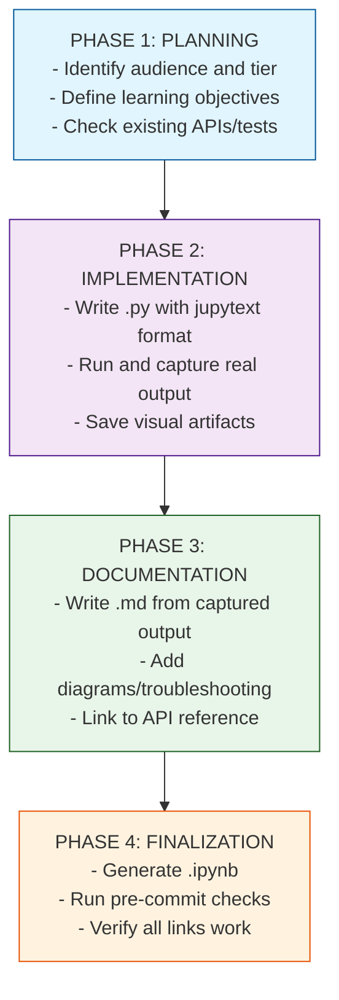

### Phase 1: Planning

Before writing any code, answer these questions:

1. **Who is the audience?**
    - [ ] First-time Opifex user
    - [ ] Developer familiar with neural operators
    - [ ] Production researcher
    - [ ] SciML researcher exploring new methods

2. **What tier is appropriate?**
    - [ ] Tier 1: Quick Reference (single concept, <10 min)
    - [ ] Tier 2: Tutorial (guided learning, 30-60 min)
    - [ ] Tier 3: Advanced Guide (production, 60+ min)

3. **What APIs and patterns exist?**
    - Check `src/opifex/` for relevant classes and factory functions
    - Review existing tests in `tests/` for API usage patterns
    - Consult `memory-bank/guides/flax-nnx-guide.md` for Flax NNX patterns

4. **What are the learning objectives?**
    - List 3-5 specific, measurable outcomes
    - Use action verbs: Create, Build, Configure, Train, Evaluate, Debug, Optimize

### Phase 2: Implementation (Code First)

**Write and run the Python file before writing documentation.**

1. **Create the .py file with jupytext format**

    ```python
    # ---
    # jupyter:
    #   jupytext:
    #     text_representation:
    #       extension: .py
    #       format_name: percent
    #       format_version: '1.3'
    #       jupytext_version: 1.16.4
    #   kernelspec:
    #     display_name: Python 3 (ipykernel)
    #     language: python
    #     name: python3
    # ---
    ```

2. **Structure the code with markdown cells**
    - Title and overview in first markdown cell
    - Use `# %%` for code cells, `# %% [markdown]` for markdown cells
    - Avoid `print("\n" + ...)` — jupytext splits escape sequences

3. **Save visual artifacts to the correct location**
    - Directory: `docs/assets/examples/<example_name>/` (NOT `*_files/`)
    - Example: `docs/assets/examples/fno_darcy/predictions.png`

4. **Run the example and capture real output**

    ```bash
    source activate.sh && python examples/<path>/<example>.py
    ```

    - **CRITICAL**: All "Terminal Output" in documentation MUST be from actual execution
    - Do NOT invent or guess output — run the code and capture what it produces
    - If the example fails, fix the code or underlying APIs before proceeding

5. **Verify results are sensible**
    - Check MSE/L2 errors are in expected range
    - Ensure visualizations show meaningful patterns
    - Confirm training converges

### Phase 3: Documentation (From Real Output)

1. **Write the .md file using captured terminal output**
    - Every `**Terminal Output:**` section must contain actual output from Phase 2
    - Copy-paste from terminal, do not paraphrase or abbreviate
    - Include timing information if relevant

2. **Follow the required section order**
    1. Title (`# Example Name`)
    2. Metadata table (Level, Runtime, Prerequisites, Format, Memory)
    3. Overview (2-3 paragraphs)
    4. What You'll Learn (numbered list with action verbs)
    5. Coming from X? (migration table for NeuralOperator/DeepXDE users)
    6. Files (links to .py and .ipynb)
    7. Quick Start (bash commands)
    8. Core Concepts (theory with Mermaid diagrams)
    9. Implementation (Step 1, Step 2, etc. with Terminal Output)
    10. Visualization (images from `docs/assets/examples/`)
    11. Results Summary (metrics table)
    12. Next Steps (Experiments, Related Examples, API Reference, Troubleshooting)

3. **Add Troubleshooting section**
    - Include 2-3 common issues users might encounter
    - Format: Symptom → Cause → Solution with code example

### Phase 4: Finalization

1. **Run pre-commit checks**

    ```bash
    uv run pre-commit run --files examples/<path>/<example>.py
    ```

    - Fix any linting/formatting issues (use `import matplotlib as mpl`, etc.)

2. **Generate the Jupyter notebook**

    ```bash
    python scripts/jupytext_converter.py py-to-nb examples/<path>/<example>.py
    ```

    - Do NOT use raw jupytext — use the converter script

3. **Verify documentation links**

    ```bash
    mkdocs build --strict
    ```

    - Fix any broken internal links

4. **Update mkdocs.yml navigation**
    - Add the new example to the appropriate category
    - Ensure nav path matches file location

---

## 15. Quality Checklist

### Pre-Submission Checklist

Use this checklist before submitting new examples or updates.

#### Python File (.py)

- [ ] Jupytext YAML header present (9-line format)
- [ ] First markdown cell has title, metadata table, overview, learning goals
- [ ] All markdown cells use triple-quoted `"""` style (not `#`-comments)
- [ ] Expected output comments after key print statements
- [ ] Artifacts saved to `docs/assets/examples/<name>/` (NOT `*_files/`)
- [ ] Results Summary + Next Steps markdown cells near end
- [ ] `main()` function and `if __name__ == "__main__": main()` at bottom
- [ ] No `\n` in string concatenation (use `print()` + `print(...)` instead)

#### Markdown File (.md)

- [ ] Metadata table (Level, Runtime, Prerequisites, Format, Memory)
- [ ] Overview + What You'll Learn section
- [ ] Files section with GitHub links
- [ ] Quick Start with `source activate.sh && python ...`
- [ ] Framework comparison (where applicable, see Section 7)
- [ ] Step-by-step implementation with Terminal Output blocks
- [ ] Mermaid architecture diagram (where applicable)
- [ ] Visualizations referencing PNGs in `docs/assets/examples/`
- [ ] Results Summary table with metrics
- [ ] Next Steps + Related Examples + API Reference + Troubleshooting

#### Notebook File (.ipynb)

- [ ] Generated from .py via `scripts/jupytext_converter.py`
- [ ] Opens and renders correctly in Jupyter

#### Content Quality

- [ ] All code executes without errors
- [ ] Imports are organized and all used
- [ ] Variables have descriptive names
- [ ] Functions have docstrings
- [ ] Expected outputs match actual execution
- [ ] Technical terms defined or linked
- [ ] Learning objectives are specific and measurable (action verbs)
- [ ] Random seeds set for reproducibility

#### Visual Quality

- [ ] Markdown cells properly formatted
- [ ] Code blocks have syntax highlighting
- [ ] Tables are properly aligned
- [ ] Diagrams are clear and readable
- [ ] No walls of text

#### Navigation

- [ ] mkdocs.yml nav entry exists
- [ ] Internal links to other examples work
- [ ] Links to API documentation work
- [ ] External resource links work

---

## 16. Examples Demonstrating Principles

### Progressive Disclosure Example

This shows how to structure information from simple to complex:

```python
# %% [markdown]
"""
## Building a Neural Operator: Three Levels

### Level 1: Minimal FNO (Copy-Paste Ready)
"""

# %%
# Just 3 lines to get started
from opifex.neural.operators.fno import FourierNeuralOperator
from flax import nnx

rngs = nnx.Rngs(42)
model = FourierNeuralOperator(modes=(16, 16), hidden_channels=32, rngs=rngs)

x = jax.random.normal(jax.random.PRNGKey(0), (1, 64, 64, 1))
y = model(x)
print(f"Output shape: {y.shape}")  # (1, 64, 64, 1)

# %% [markdown]
"""
### Level 2: Adding Grid Embeddings (Building Complexity)
"""

# %%
# Add spatial coordinate information
from opifex.neural.operators.common.embeddings import GridEmbedding2D

embedding = GridEmbedding2D(in_channels=1, grid_boundaries=[[0, 1], [0, 1]])
x_embedded = embedding(x)
print(f"Embedded shape: {x_embedded.shape}")  # (1, 64, 64, 3) - added x,y coords

# %% [markdown]
"""
### Level 3: Full Training Pipeline (Production)
"""

# %%
# Training with optimizer, loss, evaluation
# ... (shown in model tutorials)
```

### Learning by Doing Example

Every concept is followed immediately by runnable code:

```python
# %% [markdown]
"""
## Spectral Convolutions

Spectral convolutions operate in Fourier space by learning weights that
multiply the Fourier coefficients of the input. The `modes` parameter
controls how many frequency components are retained.

**Key Concept**: More modes capture higher-frequency details but increase
memory and computation. Start with `modes=(16, 16)` and increase if needed.
"""

# %%
# Immediately apply the concept
from opifex.neural.operators.fno.spectral import SpectralConvolution2d

# Low modes (smooth features only)
conv_low = SpectralConvolution2d(
    in_channels=32, out_channels=32, modes=(8, 8), rngs=rngs
)

# High modes (captures fine details)
conv_high = SpectralConvolution2d(
    in_channels=32, out_channels=32, modes=(32, 32), rngs=rngs
)

x = jax.random.normal(jax.random.PRNGKey(0), (1, 64, 64, 32))
y_low = conv_low(x)
y_high = conv_high(x)

print(f"Low modes output: {y_low.shape}")   # (1, 64, 64, 32)
print(f"High modes output: {y_high.shape}")  # (1, 64, 64, 32)
# Expected output:
# Low modes output: (1, 64, 64, 32)
# High modes output: (1, 64, 64, 32)
```

### Show Expected Outputs Example

All code shows what users will see:

```python
# %%
# Train the model
print("Training FNO on Darcy flow...")
for epoch in range(100):
    loss = train_step(state, batch)
    if (epoch + 1) % 25 == 0:
        print(f"  Epoch {epoch + 1}/100, Loss: {loss:.6f}")

print()
print("Evaluating...")
l2re = evaluate(model, x_test, y_test)
print(f"L2 Relative Error: {l2re:.4f}")

# Expected output:
# Training FNO on Darcy flow...
#   Epoch 25/100, Loss: 0.012345
#   Epoch 50/100, Loss: 0.003456
#   Epoch 75/100, Loss: 0.001234
#   Epoch 100/100, Loss: 0.000567
#
# Evaluating...
# L2 Relative Error: 0.0089
```

---

## 17. Maintenance & Updates

### Review Schedule

| Review Type | Frequency | Scope |
|-------------|-----------|-------|
| Link check | Weekly (automated) | All internal/external links |
| Example execution | Monthly | Run all examples, verify outputs |
| Content review | Quarterly | Update for API changes |
| Competitor comparison update | Quarterly | Update framework migration tables |
| Comprehensive audit | Annually | Full restructure if needed |

### Version History Tracking

Each example should include a version comment:

```python
# %% [markdown]
"""
# FNO Darcy Flow Tutorial

...

---

**Version History**:

- v1.0 (2026-02): Initial release with standard FNO architecture
"""
```

### Handling Breaking Changes

When Opifex APIs change:

1. **Update all affected examples** before release
2. **Add migration notes** to examples
3. **Update troubleshooting** for common upgrade issues
4. **Test both old and new patterns** during transition

```markdown
!!! warning "API Change in v0.2.0"
    `SpectralConvolution2d` now requires explicit `rngs` parameter.

    **Before (v0.1.x)**:
    ```python
    conv = SpectralConvolution2d(in_ch, out_ch, modes)
    ```

    **After (v0.2.0+)**:
    ```python
    conv = SpectralConvolution2d(in_channels=in_ch, out_channels=out_ch, modes=modes, rngs=rngs)
    ```
```

### Updating Competitor Comparisons

When new versions of competitors release, update the framework migration tables in Section 7.
Monitor releases of:

- NeuralOperator (PyTorch)
- DeepXDE
- PhysicsNeMo (NVIDIA)
- JAXPI
- FBPINNs

---

## 18. Quick Reference Summary

### Documentation Tiers at a Glance

| Tier | Time | Code % | Audience | Structure |
|------|------|--------|----------|-----------|
| 1: Quick Ref | 5-10 min | 70% | Experienced | Setup -> Code -> Results |
| 2: Tutorial | 30-60 min | 50% | Learners | Setup -> Theory -> Steps -> Results |
| 3: Advanced | 60+ min | 40% | Production | Architecture -> Implementation -> Optimization |

### Essential Sections Checklist

Every example must include:

- [ ] Jupytext header
- [ ] Title and metadata table
- [ ] Learning objectives
- [ ] Setup with imports
- [ ] Implementation with expected outputs
- [ ] Results summary
- [ ] Next steps with links
- [ ] `main()` function for CLI

### Visual Elements Checklist

Consider including:

- [ ] Mermaid diagram for architecture
- [ ] Tables for hyperparameters/configurations
- [ ] Callout boxes for important notes
- [ ] Code blocks with syntax highlighting
- [ ] Expected output comments

### Writing Checklist

- [ ] Active voice
- [ ] Specific metrics (not "fast" but "~1500 samples/sec on A100")
- [ ] Code terms in backticks
- [ ] Links to related content
- [ ] Troubleshooting for common issues

### File Checklist

Before committing:

- [ ] Python file has Jupytext header
- [ ] All code executes successfully
- [ ] Expected outputs are accurate
- [ ] Notebook is generated and tested
- [ ] Markdown documentation follows 7-part structure
- [ ] Links are valid
- [ ] Added to `mkdocs.yml` navigation

---

## Appendix: Existing Exemplars

### Tier 1 Exemplars

| Example | Location | Demonstrates |
|---------|----------|--------------|
| Grid Embeddings | [`examples/layers/grid_embeddings_example.py`](https://github.com/Opifex/Opifex/blob/main/examples/layers/grid_embeddings_example.py) | Quick reference for spatial embeddings |
| Simple SFNO | [`examples/models/sfno_climate_simple.py`](https://github.com/Opifex/Opifex/blob/main/examples/models/sfno_climate_simple.py) | Quick reference for climate modeling |
| Spectral Norm | [`examples/layers/spectral_normalization_example.py`](https://github.com/Opifex/Opifex/blob/main/examples/layers/spectral_normalization_example.py) | Stability techniques |

### Tier 2 Exemplars

| Example | Location | Demonstrates |
|---------|----------|--------------|
| FNO Darcy | [`examples/models/fno_darcy_comprehensive.py`](https://github.com/Opifex/Opifex/blob/main/examples/models/fno_darcy_comprehensive.py) | Comprehensive FNO tutorial |
| DISCO Convolutions | [`examples/layers/disco_convolutions_example.py`](https://github.com/Opifex/Opifex/blob/main/examples/layers/disco_convolutions_example.py) | DISCO layer tutorial |
| Heat Equation PINN | [`examples/pinns/heat_equation.py`](https://github.com/Opifex/Opifex/blob/main/examples/pinns/heat_equation.py) | PINN tutorial |

### Tier 3 Exemplars

| Example | Location | Demonstrates |
|---------|----------|--------------|
| Comprehensive Profiling | [`examples/comprehensive_profiling_demo.py`](https://github.com/Opifex/Opifex/blob/main/examples/comprehensive_profiling_demo.py) | Advanced performance analysis |
| Neural Operator Benchmark | [`examples/comparative_studies/neural_operator_benchmark.py`](https://github.com/Opifex/Opifex/blob/main/examples/comparative_studies/neural_operator_benchmark.py) | Cross-architecture comparison |

### PDEBench Reference Datasets

Standard evaluation benchmarks for neural operator examples:

| Dataset | Domain | Resolution | Metric |
|---------|--------|------------|--------|
| 1D Advection | Transport | 1024 | L2RE |
| 1D Burgers | Fluid dynamics | 1024 | L2RE |
| 1D CFD | Compressible flow | 1024 | L2RE |
| 2D CFD | Incompressible flow | 128x128 | L2RE |
| 2D Darcy Flow | Porous media | 128x128 | L2RE |
| 2D Shallow Water | Geophysics | 128x128 | L2RE |
| 3D CFD | Turbulence | 64x64x64 | L2RE |

### Advanced Features Reference

Reference these in per-example Next Steps where relevant:

| Feature | Description | Benefit |
|---------|-------------|---------|
| Mixed Precision | `jnp.bfloat16` native support | 40-50% memory reduction, 1.5-2x speedup |
| Gradient Checkpointing | `@jax.checkpoint` decorator | 3-5x memory reduction, 20-30% slowdown |
| Multi-Device Training | `@jax.pmap` with `pmean` gradient sync | Linear scaling, 93-96% efficiency |
| Adaptive Loss Weighting | GradNorm, uncertainty weighting, ReLoBRaLo | Better multi-task convergence |
| PINO | Hybrid data + physics loss | Improved generalization |
