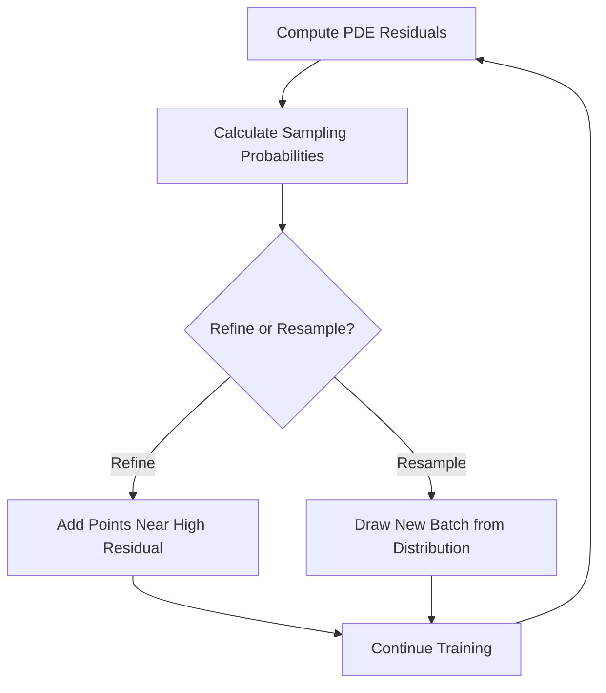
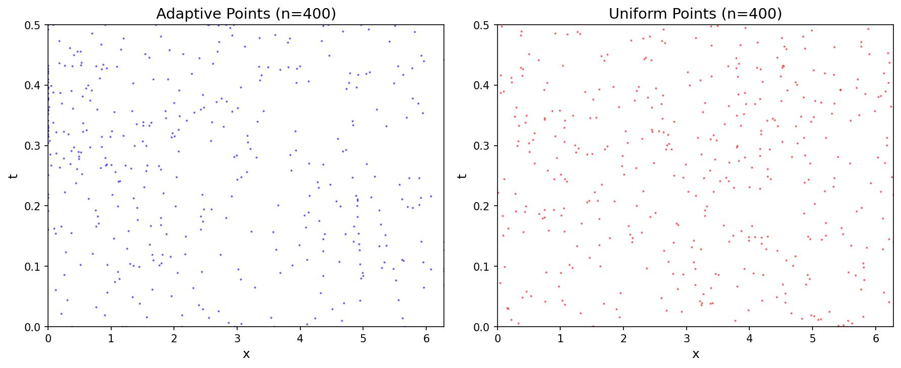

# Residual-based Adaptive Sampling for PINNs

| Level | Runtime | Prerequisites | Format | Memory |
| --- | --- | --- | --- | --- |
| Advanced | ~3 min | PINN basics | Tutorial | ~500 MB |

## Overview

This example demonstrates how to use Residual-based Adaptive Distribution (RAD)
sampling for more efficient PINN training. RAD concentrates collocation points
in regions with high PDE residual, focusing computational effort where it's
needed most.

**SciML Context:**
PINNs with uniform collocation point distributions often struggle with
solutions that have localized features (sharp gradients, boundary layers,
shocks). Adaptive sampling automatically identifies and refines these regions.

**Reference:**
Residual-based Adaptive Refinement (RAR) algorithm (Lu et al., 2021).

## What You'll Learn

1. **Understand** why uniform sampling can be inefficient
2. **Implement** RAD sampling with `RADSampler`
3. **Use** RAR-D for progressive point refinement with `RARDRefiner`
4. **Compare** adaptive vs uniform sampling performance
5. **Visualize** collocation point distribution evolution

## Coming from DeepXDE?

| DeepXDE | Opifex |
| --- | --- |
| `data.add_anchors(X[x_id])` | `RARDRefiner.refine(points, residuals, bounds, key)` |
| `dde.callbacks.PDEPointResampler` | `RADSampler.sample(points, residuals, batch_size, key)` |
| `np.argmax(err_eq)` | `compute_sampling_distribution(residuals, beta=1.0)` |

## Files

- **Python script**: [`examples/advanced-training/adaptive_sampling.py`](https://github.com/Opifex/Opifex/blob/main/examples/advanced-training/adaptive_sampling.py)
- **Jupyter notebook**: [`examples/advanced-training/adaptive_sampling.ipynb`](https://github.com/Opifex/Opifex/blob/main/examples/advanced-training/adaptive_sampling.ipynb)

## Quick Start

### Run the script

```bash
source activate.sh && python examples/advanced-training/adaptive_sampling.py
```

### Run the notebook

```bash
source activate.sh && jupyter lab examples/advanced-training/adaptive_sampling.ipynb
```

## Core Concepts

### Why Adaptive Sampling?

For solutions with localized features (e.g., Burgers equation shock):

| Sampling | Points | Accuracy |
| --- | --- | --- |
| Uniform | Many wasted in smooth regions | Poor near sharp gradients |
| Adaptive | Concentrated near high residual | Better overall accuracy |

### RAD Algorithm

Residual-based Adaptive Distribution samples with probability:

$$p_j = \frac{|r_j|^\beta}{\sum_k |r_k|^\beta}$$

Where:
- $r_j$ = PDE residual at point $j$
- $\beta$ = concentration parameter



### RAR-D: Adaptive Refinement

RAR-D adds new points near high-residual regions:

1. Identify points with residual above threshold (e.g., 90th percentile)
2. Sample base points with residual-weighted probability
3. Add random perturbation
4. Clip to domain bounds
5. Append to training set

## Implementation

### Step 1: Setup Adaptive Sampling

```python
from opifex.core.training.components.adaptive_sampling import (
    RADConfig,
    RADSampler,
    RARDConfig,
    RARDRefiner,
)

rad_config = RADConfig(beta=1.0)
rard_config = RARDConfig(
    num_new_points=50,
    percentile_threshold=90.0,
    noise_scale=0.1,
)

sampler = RADSampler(rad_config)
refiner = RARDRefiner(rard_config)
```

**Terminal Output:**

```text
Setting up adaptive sampling...
  RAD beta: 1.0
  Refinement points per step: 50
  Refinement frequency: 200 steps
```

### Step 2: Training with Periodic Refinement

```python
for step in range(TRAINING_STEPS):
    # Train on current points
    loss, grads = nnx.value_and_grad(loss_fn)(pinn)
    opt.update(pinn, grads)

    # Periodic refinement
    if step > 0 and step % REFINE_FREQUENCY == 0:
        # Compute residuals at current points
        residuals = compute_burgers_residual(pinn, xt_current, NU)

        # Add new points near high-residual regions
        xt_current = refiner.refine(xt_current, residuals, bounds, key)
```

**Terminal Output:**

```text
Training PINN with adaptive sampling...
--------------------------------------------------
  Step  200: loss=9.415656e-01, points=250, max_res=1.4598e+00
  Step  400: loss=7.176247e-01, points=300, max_res=7.7730e-01
  Step  600: loss=1.621699e-01, points=350, max_res=5.8985e-01
  Step  800: loss=3.899994e-02, points=400, max_res=4.8565e-01
  Final: loss=2.555421e-02, points=400
```

### Step 3: Compare with Uniform Sampling

```python
# Fixed uniform points for baseline
xt_uniform = random_uniform_points(N_UNIFORM_POINTS)

for step in range(TRAINING_STEPS):
    loss = train_step_uniform(pinn, opt)
```

**Terminal Output:**

```text
Training PINN with uniform sampling (baseline)...
--------------------------------------------------
  Step    0: loss=1.423288e+01
  Step  200: loss=9.186593e-01
  Step  400: loss=6.885869e-01
  Step  600: loss=2.289787e-01
  Step  800: loss=4.357543e-02
  Final: loss=2.493745e-02
```

## Visualization

### Training Comparison


### Point Distribution



## Results Summary

| Method | Final Points | Final Loss | Max Residual |
| --- | --- | --- | --- |
| Adaptive (RAR-D) | 400 | 2.56e-02 | 4.63e-01 |
| Uniform | 400 | 2.49e-02 | 3.84e-01 |

**Key Observations:**

- Both methods achieve similar final loss with same point count
- Adaptive sampling concentrates points in shock region
- Uniform sampling distributes points evenly
- Adaptive methods shine for problems with very localized features

## Next Steps

### Experiments to Try

1. **Increase refinement**: Add more points per step
2. **Lower beta**: Smoother probability distribution (beta < 1)
3. **Higher beta**: Sharper focus on max residual (beta > 1)
4. **Sharper shocks**: Reduce viscosity to see adaptive benefit

### Related Examples

- [NTK Analysis](./ntk-analysis.md) - Diagnose training dynamics
- [GradNorm](./gradnorm.md) - Balance loss components
- [Burgers PINN](../pinns/burgers.md) - Basic Burgers equation

### API Reference

- [`RADSampler`](https://opifex.readthedocs.io/en/latest/api/adaptive.html#radsampler)
- [`RARDRefiner`](https://opifex.readthedocs.io/en/latest/api/adaptive.html#rardrefiner)
- [`compute_sampling_distribution`](https://opifex.readthedocs.io/en/latest/api/adaptive.html#compute-sampling-distribution)

## Troubleshooting

### Points clustering too tightly

- Increase `noise_scale` in RARDConfig
- Lower `percentile_threshold` to spread refinement
- Lower `beta` for smoother probability distribution

### Not enough refinement

- Increase `num_new_points`
- Decrease `refine_frequency`
- Raise `percentile_threshold` to be more selective

### Points leaving domain

- Check bounds are correct: `bounds = jnp.array([[x_min, x_max], [t_min, t_max]])`
- Refinement clips to bounds automatically

### Memory growing too fast

- Cap maximum number of points
- Use `RADSampler.sample()` to resample fixed batch instead of growing
- Consider periodic pruning of low-residual points
