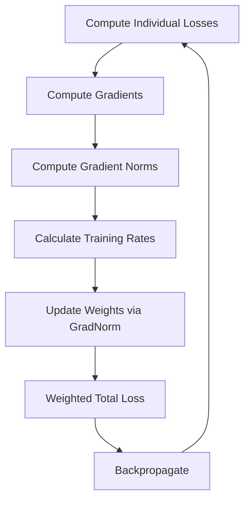
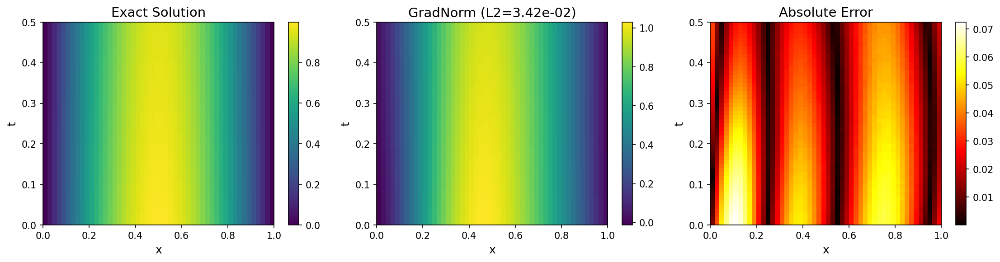

# GradNorm: Automatic Loss Balancing for PINNs

| Level | Runtime | Prerequisites | Format | Memory |
| --- | --- | --- | --- | --- |
| Advanced | ~3 min | Multi-objective training | Tutorial | ~500 MB |

## Overview

This example demonstrates how to use GradNorm for automatic loss weight
balancing in multi-objective PINN training. GradNorm dynamically adjusts
weights to equalize gradient contributions across loss components.

**SciML Context:**
PINNs with multiple loss terms (PDE residual, boundary conditions, initial
conditions) often suffer from gradient imbalance - one loss dominates and
prevents others from decreasing. GradNorm solves this automatically.

**Key Result:**
GradNorm automatically adapts weights from [1, 1, 1] to [0.75, 0.35, 0.27],
balancing training across PDE, BC, and IC losses.

## What You'll Learn

1. **Understand** the gradient imbalance problem in multi-objective training
2. **Implement** GradNorm with Opifex's `GradNormBalancer`
3. **Configure** the alpha parameter for different balancing behaviors
4. **Compare** GradNorm against fixed weight baselines
5. **Visualize** weight evolution during training

## Coming from Other Frameworks?

| Framework | Loss Balancing | Opifex Equivalent |
| --- | --- | --- |
| DeepXDE | Static `1/initial_loss` | `GradNormBalancer.update_weights()` |
| PhysicsNeMo | Manual per-field weights | `GradNormConfig(alpha=1.5)` |
| NeuralOperator | SoftAdapt, ReLoBRaLo | `GradNormBalancer` (GradNorm algorithm) |

**Note:** GradNorm (Chen et al. 2018) uses gradient norms, unlike SoftAdapt/ReLoBRaLo
which use loss ratios.

## Files

- **Python script**: [`examples/advanced-training/gradnorm.py`](https://github.com/Opifex/Opifex/blob/main/examples/advanced-training/gradnorm.py)
- **Jupyter notebook**: [`examples/advanced-training/gradnorm.ipynb`](https://github.com/Opifex/Opifex/blob/main/examples/advanced-training/gradnorm.ipynb)

## Quick Start

### Run the script

```bash
source activate.sh && python examples/advanced-training/gradnorm.py
```

### Run the notebook

```bash
source activate.sh && jupyter lab examples/advanced-training/gradnorm.ipynb
```

## Core Concepts

### The Gradient Imbalance Problem

In multi-objective PINN training, different losses often have very different
gradient magnitudes:

- **PDE loss**: Gradients from second-order derivatives (often large)
- **BC loss**: Gradients from boundary samples (often smaller)
- **IC loss**: Gradients from initial condition (varies)

Without balancing, the loss with largest gradients dominates training.

### GradNorm Algorithm

GradNorm adjusts weights to equalize gradient contributions:

$$\text{Target: } ||w_i \nabla L_i|| \approx \bar{G} \cdot r_i^\alpha$$

Where:
- $w_i$ = weight for loss $i$
- $\nabla L_i$ = gradient of loss $i$
- $\bar{G}$ = mean gradient norm
- $r_i$ = relative inverse training rate
- $\alpha$ = asymmetry parameter



### Alpha Parameter

| Alpha | Effect |
| --- | --- |
| α = 0 | Equal weighting for all tasks |
| α = 1 | Moderate balancing |
| α = 1.5 | Strong balancing (default) |
| α > 2 | Very aggressive balancing |

## Implementation

### Step 1: Setup GradNorm Balancer

```python
from opifex.core.physics.gradnorm import GradNormBalancer, GradNormConfig

config = GradNormConfig(
    alpha=1.5,           # Asymmetry parameter
    learning_rate=0.01,  # Learning rate for weight updates
    update_frequency=1,  # Update weights every step
)

balancer = GradNormBalancer(
    num_losses=3,  # PDE, BC, IC
    config=config,
    rngs=nnx.Rngs(SEED),
)
```

**Terminal Output:**

```text
Setting up GradNorm balancer...
  GradNorm alpha: 1.5
  Weight learning rate: 0.01
  Initial weights: [1. 1. 1.]
```

### Step 2: Training Loop with GradNorm

```python
for step in range(TRAINING_STEPS):
    # Compute individual losses
    losses = compute_losses(pinn)

    # Compute gradient norms
    grad_norms = compute_gradient_norms(pinn, loss_fns)

    # Update GradNorm weights
    balancer.update_weights(grad_norms, losses, initial_losses)

    # Compute weighted loss
    total_loss = balancer.compute_weighted_loss(losses)

    # Backpropagate and update model
    grads = nnx.value_and_grad(total_loss_fn)(pinn)
    opt.update(pinn, grads)
```

**Terminal Output:**

```text
Training PINN with GradNorm...
--------------------------------------------------
Initial losses: PDE=0.6117, BC=0.3028, IC=1.7055
  Step    0: loss=2.502858e+00, PDE=6.1175e-01, BC=3.0275e-01, IC=1.7055e+00
           weights: PDE=0.946, BC=1.042, IC=0.943
  Step  100: loss=1.835124e-01, PDE=3.2745e-02, BC=3.4047e-02, IC=1.9649e-01
           weights: PDE=0.285, BC=1.286, IC=0.664
  Step  500: loss=6.310889e-03, PDE=3.8685e-03, BC=1.4199e-03, IC=1.0959e-02
           weights: PDE=0.665, BC=0.543, IC=0.271
  Step 1000: loss=9.661791e-04, PDE=4.1043e-04, BC=3.4987e-04, IC=1.9863e-03
```

### Step 3: Compare with Fixed Weights

```python
# Fixed weights baseline
for step in range(TRAINING_STEPS):
    total_loss = FIXED_WEIGHT * (pde_loss + bc_loss + ic_loss)
    # ... train without adaptive balancing
```

**Terminal Output:**

```text
Training PINN with fixed weights (baseline)...
--------------------------------------------------
  Step    0: loss=2.620038e+00
  Step  500: loss=4.945495e-03
  Step 1000: loss=1.172044e-03
```

## Visualization

### Training Comparison


### Solution Quality



## Results Summary

| Method | Final Loss | PDE Loss | BC Loss | IC Loss |
| --- | --- | --- | --- | --- |
| GradNorm | 9.66e-04 | 4.10e-04 | 3.50e-04 | 1.99e-03 |
| Fixed | 1.17e-03 | 3.21e-04 | 1.35e-04 | 7.13e-04 |

**Final Weights (GradNorm):**
- w_PDE = 0.753
- w_BC = 0.350
- w_IC = 0.269

**Key Insights:**

- GradNorm automatically discovers appropriate weight ratios
- Weights adapt based on gradient magnitudes and training rates
- All loss components decrease together (balanced training)
- For well-conditioned problems, fixed weights may perform similarly

## Next Steps

### Experiments to Try

1. **Vary alpha**: Compare α=0.5, α=1.0, α=2.0
2. **Challenging problems**: Use when BC/IC losses dominate
3. **Learning rate**: Adjust GradNorm learning rate for stability
4. **Combine with NTK**: Use NTK to diagnose, GradNorm to balance

### Related Examples

- [NTK Analysis](./ntk-analysis.md) - Diagnose training dynamics
- [Adaptive Sampling](./adaptive-sampling.md) - Focus points where needed
- [Heat Equation PINN](../pinns/heat-equation.md) - Basic PINN training

### API Reference

- [`GradNormBalancer`](https://opifex.readthedocs.io/en/latest/api/gradnorm.html#gradnormbalancer)
- [`GradNormConfig`](https://opifex.readthedocs.io/en/latest/api/gradnorm.html#gradnormconfig)
- [`compute_gradient_norms`](https://opifex.readthedocs.io/en/latest/api/gradnorm.html#compute-gradient-norms)

## Troubleshooting

### Weights oscillating

- Reduce `learning_rate` in GradNormConfig
- Try lower `alpha` (e.g., 0.5)
- Weights need time to stabilize

### One weight becomes very large/small

- This is expected if tasks have very different difficulties
- Check `min_weight` and `max_weight` bounds
- Consider if the imbalanced loss is appropriate

### No improvement over fixed weights

- GradNorm helps most when losses have different scales
- For well-conditioned problems, fixed weights may suffice
- Try on problems with known gradient imbalance

### NaN in weights

- Check for NaN in losses or gradients first
- Add epsilon to gradient norms for stability
- Reduce learning rate
