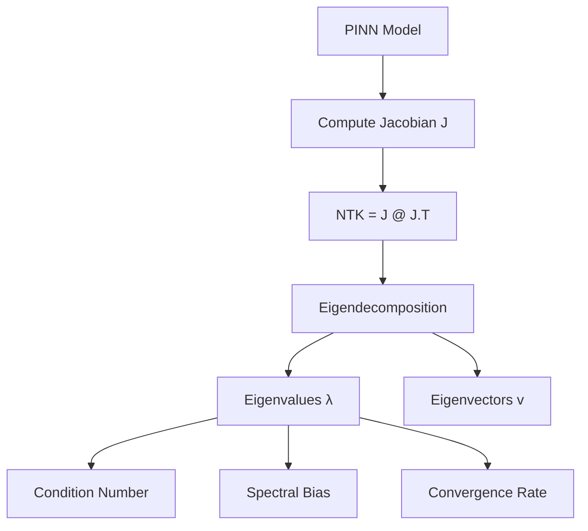
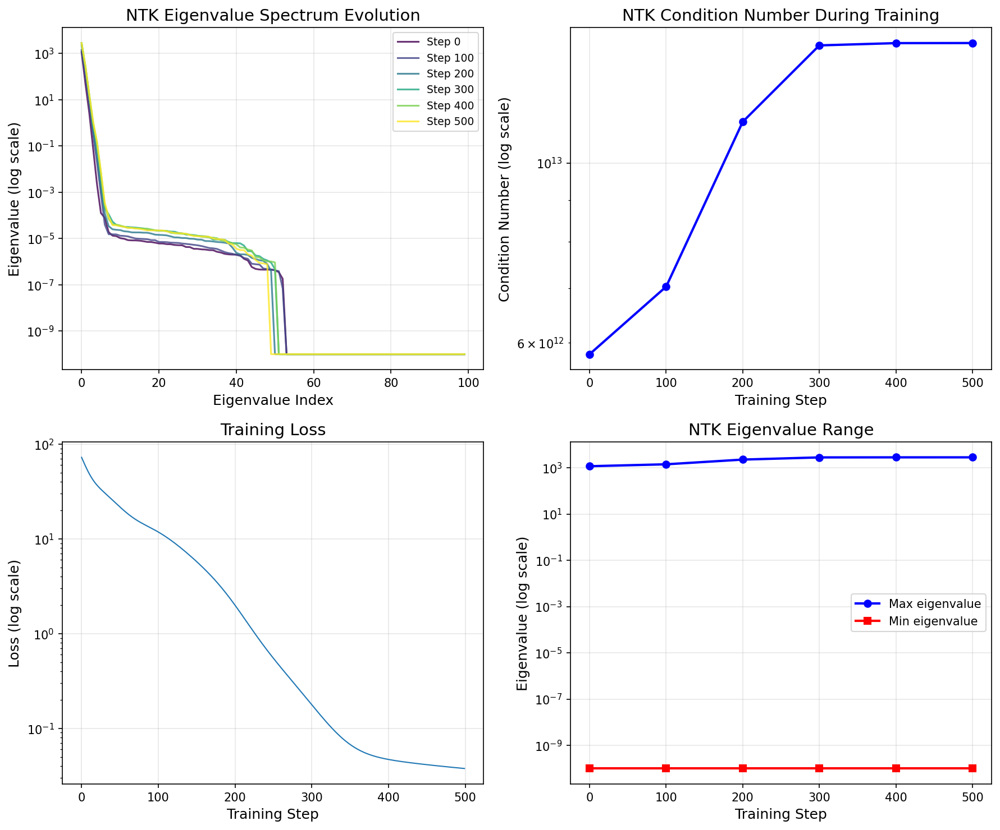
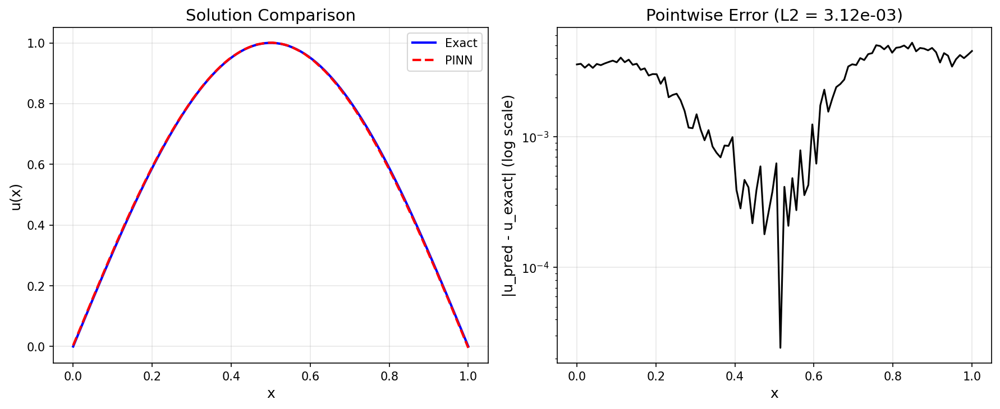

# Neural Tangent Kernel (NTK) Analysis for PINNs

| Level | Runtime | Prerequisites | Format | Memory |
| --- | --- | --- | --- | --- |
| Advanced | ~2 min | PINN basics, linear algebra | Tutorial | ~500 MB |

## Overview

This example demonstrates how to use the Neural Tangent Kernel (NTK) to diagnose
and understand PINN training dynamics. NTK analysis reveals spectral bias,
predicts convergence rates, and identifies problematic modes.

**SciML Context:**
Understanding why PINNs struggle with certain problems (high-frequency solutions,
stiff PDEs) can be explained through NTK theory. The eigenvalue spectrum
determines which solution modes are learned quickly vs slowly.

**Key Result:**
NTK eigenvalue analysis reveals condition numbers of ~10^12, indicating
significant spectral bias. Large eigenvalue gaps cause slow convergence
for certain solution modes.

## What You'll Learn

1. **Compute** the empirical NTK matrix for a PINN model
2. **Analyze** eigenvalue spectrum to understand training dynamics
3. **Detect** spectral bias from eigenvalue distribution
4. **Track** NTK evolution during training (finite-width effects)
5. **Predict** convergence rates from NTK spectrum

## Coming from Other Frameworks?

| Framework | NTK Support | Opifex Equivalent |
| --- | --- | --- |
| DeepXDE | Not implemented | `NTKWrapper.compute_ntk()` |
| PhysicsNeMo | Not implemented | `compute_eigenvalues()` |
| NeuralOperator | Not implemented | `detect_spectral_bias()` |

**Opifex is unique** in providing built-in NTK analysis tools for PINNs.

## Files

- **Python script**: [`examples/advanced-training/ntk_analysis.py`](https://github.com/Opifex/Opifex/blob/main/examples/advanced-training/ntk_analysis.py)
- **Jupyter notebook**: [`examples/advanced-training/ntk_analysis.ipynb`](https://github.com/Opifex/Opifex/blob/main/examples/advanced-training/ntk_analysis.ipynb)

## Quick Start

### Run the script

```bash
source activate.sh && python examples/advanced-training/ntk_analysis.py
```

### Run the notebook

```bash
source activate.sh && jupyter lab examples/advanced-training/ntk_analysis.ipynb
```

## Core Concepts

### Neural Tangent Kernel Theory

The NTK Θ(x, x') captures how the network output at x changes when training on x':

$$\Theta(x, x') = \nabla_\theta f(x) \cdot \nabla_\theta f(x')^T$$

For gradient descent training:
- **Large eigenvalues** → fast convergence for those modes
- **Small eigenvalues** → slow convergence (spectral bias)
- **Condition number** → ratio of max to min eigenvalue



### Key Diagnostics

| Metric | Formula | Interpretation |
| --- | --- | --- |
| Condition Number | λ_max / λ_min | Training difficulty |
| Effective Rank | (Σλ)² / Σλ² | Active learning modes |
| Spectral Bias | log(λ_max / λ_min) | Frequency learning gap |

## Implementation

### Step 1: Define PINN

```python
class PoissonPINN(nnx.Module):
    """Simple PINN for 1D Poisson equation."""

    def __init__(self, hidden_dims: list[int] | None = None, *, rngs: nnx.Rngs):
        super().__init__()
        if hidden_dims is None:
            hidden_dims = [32, 32]
        # Build network layers...
```

**Terminal Output:**

```text
Creating PINN model...
  Architecture: [1] -> [32] -> [32] -> [1]
  Parameters: 1,153
```

### Step 2: Compute Initial NTK

```python
from opifex.core.physics.ntk.wrapper import NTKWrapper
from opifex.core.physics.ntk.diagnostics import detect_spectral_bias

# Create NTK wrapper
ntk_wrapper = NTKWrapper(pinn)

# Compute NTK matrix and eigenvalues
ntk_matrix = ntk_wrapper.compute_ntk(x_ntk)
eigenvalues = ntk_wrapper.compute_eigenvalues(x_ntk)
```

**Terminal Output:**

```text
Computing initial NTK...
--------------------------------------------------
  NTK matrix shape: (100, 100)
  Eigenvalues range: [1.000000e-10, 1.162607e+03]

Initial NTK Diagnostics:
  Condition number: 5.81e+12
  Effective rank: 1.20
  Spectral bias indicator: 30.08
  Slow-converging modes: 97/100
```

### Step 3: Track NTK During Training

```python
for step in range(TRAINING_STEPS):
    loss = train_step(pinn, opt, x_train, x_bc)

    if step % NTK_COMPUTE_FREQUENCY == 0:
        eigenvalues = ntk_wrapper.compute_eigenvalues(x_ntk)
        cond = compute_condition_number(eigenvalues)
        print(f"Step {step}: loss={loss:.6e}, cond={cond:.2e}")
```

**Terminal Output:**

```text
Training PINN with NTK tracking...
--------------------------------------------------
  Step    0: loss=7.256213e+01, cond=5.81e+12
  Step  100: loss=1.181392e+01, cond=7.04e+12
  Step  200: loss=1.993417e+00, cond=1.12e+13
  Step  300: loss=1.775255e-01, cond=1.40e+13
  Step  400: loss=4.693647e-02, cond=1.41e+13
  Step  500: loss=3.767164e-02, cond=1.41e+13
```

## Visualization

### NTK Eigenvalue Spectrum Evolution



### Solution Comparison



## Results Summary

| Metric | Initial | Final |
| --- | --- | --- |
| Condition Number | 5.81e+12 | 1.41e+13 |
| Effective Rank | 1.20 | 1.40 |
| Training Loss | 7.26e+01 | 3.77e-02 |
| L2 Error | - | 3.12e-03 |

**Key Insights:**

- High condition number indicates spectral bias
- NTK evolves during training (finite-width effect)
- Low effective rank means few modes are actively learned
- Understanding NTK helps diagnose PINN training difficulties

## Next Steps

### Experiments to Try

1. **Increase network width**: How does it affect condition number?
2. **Different activations**: Compare tanh vs ReLU vs GELU
3. **Learning rate tuning**: Based on NTK eigenvalues
4. **Multi-scale problems**: Analyze NTK for high-frequency solutions

### Related Examples

- [GradNorm Loss Balancing](./gradnorm.md) - Automatic multi-task balancing
- [Adaptive Sampling](./adaptive-sampling.md) - Residual-based point distribution
- [Poisson PINN](../pinns/poisson.md) - Basic PINN training

### API Reference

- [`NTKWrapper`](https://opifex.readthedocs.io/en/latest/api/ntk.html#ntkwrapper)
- [`compute_condition_number`](https://opifex.readthedocs.io/en/latest/api/ntk.html#compute-condition-number)
- [`detect_spectral_bias`](https://opifex.readthedocs.io/en/latest/api/ntk.html#detect-spectral-bias)

## Troubleshooting

### NTK computation is slow

- Reduce `N_COLLOCATION` for NTK computation
- Use a subset of domain points for diagnostics
- NTK computation scales as O(n² * p) where n=points, p=parameters

### Negative eigenvalues

- Small negative eigenvalues are numerical noise
- Use `jnp.maximum(eigenvalues, 1e-10)` to clip
- Check if NTK matrix is symmetric (should be for same input points)

### Very high condition number

- Expected for ill-conditioned problems
- Consider using spectral bias mitigation techniques
- Multi-scale input encoding can help
