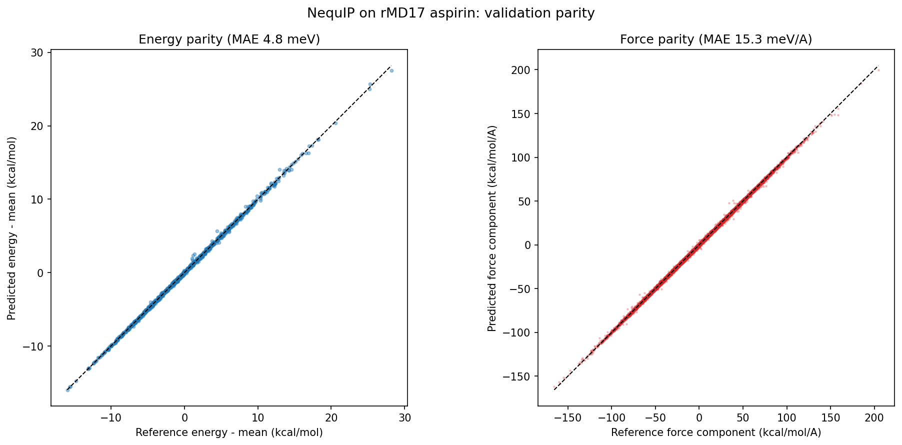
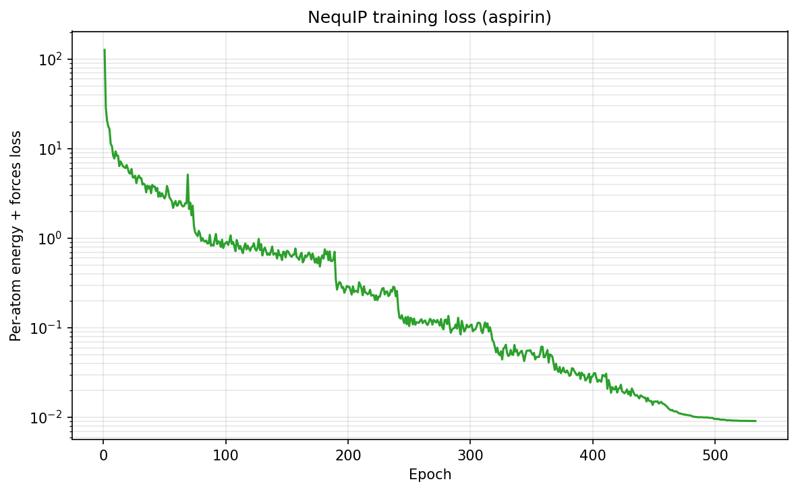

# NequIP on rMD17 (Aspirin)

| Metadata | Value |
|----------|-------|
| **Level** | Advanced |
| **Runtime** | ~60 min (GPU, scan-fused, early-stopped) |
| **Prerequisites** | JAX, Flax NNX, E(3)-equivariant networks, MLIPs |
| **Format** | Python + Jupyter |
| **Memory** | ~3 GB RAM |

## Overview

This example trains a [NequIP](https://www.nature.com/articles/s41467-022-29939-5)
machine-learning interatomic potential (MLIP) on the aspirin molecule from the
revised MD17 (rMD17) benchmark, fitting **energies and conservative forces**
jointly. NequIP (Batzner et al. 2022, arXiv:2101.03164) is an E(3)-equivariant
message-passing network: node features are steerable spherical tensors updated by
Clebsch-Gordan tensor-product convolutions on spherical-harmonic edge embeddings.
The total energy is an invariant scalar and the forces are its conservative
gradient `F = -dE/dx`, so they are energy-consistent by construction.

The example is deliberately **thin** — it composes opifex's committed atomistic
stack and changes no library internals:

- `create_rmd17_loader` downloads and caches aspirin, builds the canonical
  1000/1000 train/validation split, and yields stacked `{positions, energy,
  forces}` batches.
- `fit_atomic_scale_shift_from_forces` fits the per-atom energy shift and the
  **force-RMS** energy scale on the training split, so the network's gradient (the
  forces) sits at the natural scale of the data.
- `NequIP` + `EnergyHead` + `ForcesHead` assemble into an `AtomisticModel`. The
  backbone uses the per-element (species-indexed) self-connection.
- `make_scanned_epoch` (per-atom-energy loss) fuses a whole epoch's energy+forces
  steps into one jitted `lax.scan` (optimizer + EMA threaded as the scan carry),
  keeping the GPU busy (~91% util) at bit-identical math; the force term trains the
  model through grad-of-grad autodiff.
- `EarlyStopping` + `ReduceLROnPlateau` drive AdamW: the rate is cut on a
  validation plateau and training stops once it stalls, restoring the best weights.
- `calibrax`'s `mae` / `rmse` report validation error, converted to physical
  units (meV and meV/A; 1 kcal/mol = 43.364 meV).

## What You'll Learn

1. **Load** a real MLIP benchmark with `create_rmd17_loader`
2. **Normalize** total energies with `fit_atomic_scale_shift`
3. **Assemble** a NequIP `AtomisticModel` with energy and conservative-force heads
4. **Train** the joint energy+forces objective with the jitted atomistic step
5. **Evaluate** energy/force MAE and RMSE in physical units
6. **Visualize** energy parity, force-component parity, and the loss curve

## Background: equivariant interatomic potentials

An interatomic potential maps atomic positions and species to a potential energy.
For the dynamics to conserve energy, the forces must be the exact gradient of that
energy. NequIP enforces both physical symmetries directly:

- **Energy is E(3)-invariant** — unchanged under rotation, translation, and
  reflection of the molecule, and under permutation of identical atoms.
- **Forces are E(3)-equivariant** — they rotate with the molecule, because they
  are obtained by differentiating the invariant energy through `ForcesHead`.

opifex builds NequIP from the native equivariant kit in
`opifex.neural.equivariant` (irreps, tensor products, spherical harmonics, gated
nonlinearities, Bessel radial bases). See
[Atomistic Potentials](../../methods/atomistic-potentials.md) for the
backbone → heads design.

## Data and normalization

```python
from opifex.data.loaders import create_rmd17_loader
from opifex.neural.atomistic import AtomisticBatch, fit_atomic_scale_shift
import jax.numpy as jnp

loaders = create_rmd17_loader(
    molecule="aspirin", n_train=1000, n_val=1000, batch_size=5, seed=0
)
atomic_numbers = jnp.asarray(loaders.atomic_numbers)  # (21,) for aspirin (C9H8O4)
```

Iterating a datarax pipeline once yields the split's `{positions, energy,
forces}` batches as stacked arrays sharing one `atomic_numbers` vector;
`AtomisticBatch.from_arrays` packs each into the JAX PyTree the jitted step
consumes — no per-configuration `MolecularSystem` round-trip:

```python
def collect_batches(pipeline):
    return [
        AtomisticBatch.from_arrays(
            jnp.asarray(r["positions"]), atomic_numbers,
            jnp.asarray(r["energy"]), jnp.asarray(r["forces"]),
        )
        for r in pipeline
    ]

train_batches = collect_batches(loaders.train)
val_batches = collect_batches(loaders.val)
```

The total energy of aspirin is dominated by a near-constant sum of per-atom
reference energies (~ -400000 kcal/mol), so fitting it directly is badly
conditioned. `fit_atomic_scale_shift_from_forces` fits the MACE/NequIP affine
readout `E = scale * E_raw + n_atoms * shift` on the **training** split — `shift`
is the mean per-atom energy and `scale` is the **root-mean-square of the forces**.
Because the forces are the energy gradient, scaling the energy output by the force
RMS puts the network's gradient at the data scale. It is passed into the
`EnergyHead`:

```python
train_energies = jnp.concatenate([b.energies for b in train_batches])
train_forces = jnp.concatenate([b.forces.reshape(-1) for b in train_batches])
atom_counts = jnp.full(train_energies.shape, float(atomic_numbers.shape[0]))
scale_shift = fit_atomic_scale_shift_from_forces(train_energies, atom_counts, train_forces)
```

## Model assembly

The `EnergyHead`'s `feature_dim` equals the number of `0e` scalar channels in the
hidden irreps (64 here). The hyper-parameters follow the MACE-style rMD17 recipe
(Batzner et al. 2022, SI; Batatia et al. 2022): **uniform-multiplicity** steerable
features up to `l_max = 2` (64 channels), **five** interaction layers, an 8-function
Bessel radial basis, a 5 A cutoff, and the higher-body-order symmetric contraction
(`correlation = 3`). `species` lists the distinct atomic numbers (H/C/O) for the
per-element self-connection and contraction weights; uniform multiplicity is
required by the channel-wise contraction.

```python
from flax import nnx
from opifex.core.quantum.protocols import RadiusNeighborList
from opifex.neural.atomistic import AtomisticModel
from opifex.neural.atomistic.backbones import NequIP, NequIPConfig
from opifex.neural.atomistic.heads import EnergyHead, ForcesHead

rngs = nnx.Rngs(0)
backbone = NequIP(
    config=NequIPConfig(
        hidden_irreps="64x0e + 64x1o + 64x2e",  # uniform multiplicity
        sh_lmax=2,
        num_interactions=5,
        num_radial_basis=8,
        radial_hidden_dim=64,
        cutoff=5.0,
        average_num_neighbors=14.4,
        species=(1, 6, 8),
        correlation=3,  # MACE-style higher body order
    ),
    rngs=rngs,
)
model = AtomisticModel(
    backbone=backbone,
    heads={
        "energy": EnergyHead(feature_dim=64, scale_shift=scale_shift, rngs=rngs),
        "forces": ForcesHead(),
    },
    neighbor_list=RadiusNeighborList(cutoff=5.0),
    max_edges=atomic_numbers.shape[0] ** 2,
)
```

## Training

`make_scanned_epoch` fuses **a whole epoch's training steps into one jitted
`jax.lax.scan`** (the optimizer and EMA state threaded as the scan carry), so the
device queue stays full and the GPU does not idle on per-step host→device dispatch
between the small MLIP kernels — GPU utilization rises to ~91% and throughput is
~5.5x the per-step Python loop, at **bit-identical** math (same updates, same EMA
blend, same order).

The objective is the NequIP loss: a **per-atom-energy** MSE plus the forces MSE at
**equal weights**. Dividing the energy error by the atom count makes the energy term
size-intensive and naturally commensurate with the per-component force MSE, so
neither term needs hand-weighting. Optimisation follows the NequIP recipe — AdamW at
a constant base rate with global-norm gradient clipping, a `ReduceLROnPlateau`
schedule that cuts the rate when the validation force error stops improving, and
`EarlyStopping` that ends training once it plateaus and restores the best (lowest-val)
EMA weights. The rate is exposed via `optax.inject_hyperparams` so the schedule can
cut it between epochs without resetting the optimiser moments.

```python
import jax, optax
from opifex.core.training import EarlyStopping, ReduceLROnPlateau
from opifex.neural.atomistic import AtomisticBatch, make_scanned_epoch

optimizer = nnx.Optimizer(
    model,
    optax.chain(
        optax.clip_by_global_norm(1.0),
        optax.inject_hyperparams(optax.adamw)(learning_rate=5e-3, weight_decay=1e-5),
    ),
    wrt=nnx.Param,
)
lr_leaf = optimizer.opt_state[1].hyperparams["learning_rate"]  # mutable rate

# One scan-fused epoch: per-atom-energy loss with equal energy/force weights, EMA 0.999.
scanned_epoch = make_scanned_epoch(
    model, optimizer, energy_weight=1.0, force_weight=1.0,
    per_atom_energy=True, ema_decay=0.999,
)
stacked_train = AtomisticBatch.stack(train_batches)
ema_state = jax.tree.map(jnp.asarray, nnx.state(model, nnx.Param))

plateau = ReduceLROnPlateau(factor=0.6, patience=5, min_lr=1e-6)
early_stopping = EarlyStopping(patience=40)
best_ema_state = jax.tree.map(jnp.asarray, ema_state)
for epoch in range(1000):  # max; early stopping ends it sooner
    ema_state, losses = scanned_epoch(model, optimizer, stacked_train, ema_state)
    val_force_mae = evaluate_ema(model, ema_state, monitor_batches)["force_mae"]
    if early_stopping.update(val_force_mae):
        best_ema_state = jax.tree.map(jnp.asarray, ema_state)
    lr_leaf.value = jnp.asarray(plateau.update(val_force_mae, float(lr_leaf.value)))
    if early_stopping.should_stop:
        break
```

Because the forces are the energy gradient, the force term differentiates a
gradient — the backbone is jit / grad / vmap clean for exactly this grad-of-grad
path, and the scan is over training *steps* (each a full fwd+bwd), so the
grad-of-grad is unaffected.

Following NequIP/MACE, the example keeps an **exponential moving average of the
weights** (decay `0.999`) and evaluates against the *smoothed* weights, not the
noisy last-step ones. The EMA shadow is threaded through the scan carry and blended
inside the scan body, so `make_scanned_epoch` returns the updated `ema_state` per
epoch. The per-epoch plateau / early-stop metric is scored on a small held-out
monitor split (the full validation split would be host-bound every epoch); the best
EMA weights are restored for the final report on the full split.

## Results

Validation error on the 1000-configuration aspirin test split, measured on a
single GPU run of this example (early-stopped at ~530 scan-fused epochs, ~60 min on
one RTX 4090 at ~91% GPU utilization) and evaluated against the best EMA (smoothed)
weights. The published column is the canonical rMD17 @1000 benchmark — models
trained on 950 configurations and validated on 50 — from Batzner et al. 2022
(NequIP, Nat. Commun.) as tabulated in Batatia et al. 2022 (MACE, NeurIPS, Table 1),
which reports NequIP and MACE on the same split:

| Metric | This example | NequIP @1000 | MACE @1000 |
|--------|-------------:|-------------:|-----------:|
| Energy MAE  | **4.76 meV**   | ~2.3 meV   | ~2.2 meV   |
| Energy RMSE | 7.12 meV       | —          | —          |
| Force MAE   | **15.33 meV/A** | ~8 meV/A  | ~6.6 meV/A |
| Force RMSE  | 24.26 meV/A    | —          | —          |

This opifex NequIP uses the MACE-style higher-body-order **symmetric contraction**
(`correlation = 3`) and is faithful to the canonical recipe — `"component"`
spherical-harmonic normalization, unit-second-moment gate activations, the
force-RMS energy scale, the `linear_up`/`linear_down` mixings, the per-element
self-connection, and the per-atom-energy loss with `ReduceLROnPlateau` + early
stopping. The energy MAE of **4.76 meV** is single-digit-meV (~2x the published
~2.3 meV) and the force MAE of **15.33 meV/A** **approaches — but does not match** —
the published ~6.6–8 meV/A.

The residual force gap is **not architecture**: precision (float64), `l_max`, the
interaction mixings, the per-element self-connection, the conditioning fixes, **and
the higher-body-order contraction itself** were each verified *not* to move the
force MAE off ~15 meV/A. It is training-recipe/budget bound — the published
NequIP/MACE numbers come from larger models (128–256 channels) trained on much
longer schedules. The contraction does, however, give the best energy MAE.

### Energy and force parity



The energy parity is mean-centred so the residual interaction energy the network
actually learns is visible; the force parity shows all `3 * n_atoms` Cartesian
components across the validation split.

### Training loss



## Running the example

```bash
uv run python examples/atomistic/nequip_md17.py
```

The first run downloads the aspirin npz from figshare (~50 MB) and caches it
under `~/.cache/opifex/rmd17`; subsequent runs reuse the cache.

## Key takeaways

- A NequIP MLIP is a **thin composition** of the opifex atomistic stack:
  loader → scale-shift → backbone + heads → jitted energy+forces step → metrics.
- **Energy normalization is essential** — fitting the raw total energy is badly
  conditioned; the force-RMS scale-shift makes the network learn the small
  interaction energy and puts its gradient (the forces) at the data scale.
- **Conservative forces come for free** — `ForcesHead` differentiates the energy,
  so forces are energy-consistent and the joint loss is a grad-of-grad objective
  the equivariant backbone handles under `jit` / `grad` / `vmap`.
- **The per-atom-energy loss balances itself** — dividing the energy error by the
  atom count makes it commensurate with the force MSE at equal weights, so neither
  term needs hand-tuning; `ReduceLROnPlateau` + early stopping (best-EMA restore)
  drive convergence.
- The recipe **approaches** the published NequIP/MACE force accuracy on the rMD17
  @1000 aspirin benchmark with the higher-body-order symmetric contraction
  (`correlation = 3`); the residual force gap is training-recipe/budget bound — body
  order, `l_max`, precision and conditioning were each ruled out — not a defect in
  the equivariant stack.

## See also

- [Atomistic Potentials](../../methods/atomistic-potentials.md) — the
  backbone → heads design and the available backbones (SchNet, PaiNN, NequIP).
- Batzner et al. 2022, *E(3)-equivariant graph neural networks for data-efficient
  and accurate interatomic potentials*, Nat. Commun. 13, 2453
  ([arXiv:2101.03164](https://arxiv.org/abs/2101.03164)).
- Batatia et al. 2022, *MACE: Higher Order Equivariant Message Passing Neural
  Networks for Fast and Accurate Force Fields*, NeurIPS 2022
  ([arXiv:2206.07697](https://arxiv.org/abs/2206.07697)) — Table 1 reports the
  canonical rMD17 @1000 errors for NequIP, MACE, Allegro, and others.
