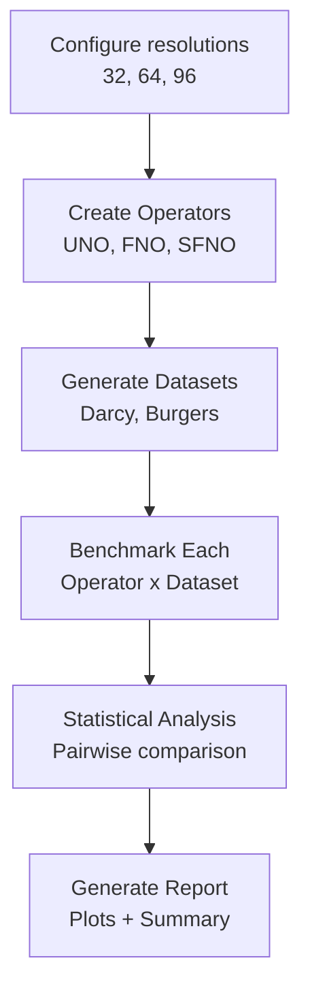

# Neural Operator Comparative Benchmark

| Metadata | Value |
|----------|-------|
| **Level** | Advanced |
| **Runtime** | ~15 min (CPU/GPU) |
| **Prerequisites** | JAX, Flax NNX, Neural Operators |
| **Format** | Python + Jupyter |
| **Memory** | ~4 GB RAM |

## Overview

This benchmark provides a comprehensive comparative analysis of three neural
operator architectures -- UNO, FNO, and SFNO -- using Opifex's benchmarking
infrastructure. It evaluates accuracy and inference time across multiple PDE
datasets at different grid resolutions.

## What You'll Learn

1. Compare UNO, FNO, and SFNO on Darcy Flow and Burgers datasets
2. Use Opifex's `BenchmarkEvaluator` and `AnalysisEngine` for systematic evaluation
3. Generate publication-ready plots and statistical analysis
4. Understand resolution-scaling behavior of different operators

## Files

- **Python Script**: [`examples/benchmarking/operator_benchmark.py`](https://github.com/Opifex/Opifex/blob/main/examples/benchmarking/operator_benchmark.py)
- **Jupyter Notebook**: [`examples/benchmarking/operator_benchmark.ipynb`](https://github.com/Opifex/Opifex/blob/main/examples/benchmarking/operator_benchmark.ipynb)

## Quick Start

### Run the Python Script

```bash
source activate.sh && python examples/benchmarking/operator_benchmark.py
```

### Run the Jupyter Notebook

```bash
jupyter lab examples/benchmarking/operator_benchmark.ipynb
```

## Operators Compared

| Operator | Architecture | Strengths |
|----------|-------------|-----------|
| **UNO** | U-Net + Fourier layers | Multi-scale features via encoder-decoder |
| **FNO** | Spectral convolutions | Resolution-invariant, fast inference |
| **SFNO** | Spherical harmonics | Natural for global/spherical domains |

## How It Works

The benchmark creates all three operators at each resolution (32x32, 64x64, 96x96),
generates synthetic datasets using `DarcyDataSource` and `BurgersDataSource`,
and evaluates each operator using `BenchmarkEvaluator.evaluate_model()`.



## Key Code Patterns

### Operator Creation

```python
from opifex.neural.operators.fno.base import FourierNeuralOperator
from opifex.neural.operators.fno.spherical import SphericalFourierNeuralOperator
from opifex.neural.operators.specialized.uno import create_uno

operators = {
    "UNO": create_uno(
        input_channels=1, output_channels=1,
        hidden_channels=64, n_layers=4, rngs=rngs,
    ),
    "FNO": FourierNeuralOperator(
        in_channels=1, out_channels=1,
        hidden_channels=64, modes=16, num_layers=4, rngs=rngs,
    ),
    "SFNO": SphericalFourierNeuralOperator(
        in_channels=1, out_channels=1,
        hidden_channels=64, lmax=16, num_layers=4, rngs=rngs,
    ),
}
```

### Benchmarking with Opifex Infrastructure

```python
from opifex.benchmarking.evaluation_engine import BenchmarkEvaluator
from opifex.benchmarking.analysis_engine import AnalysisEngine
from opifex.benchmarking.results_manager import ResultsManager

evaluator = BenchmarkEvaluator(output_dir="benchmark_results")
result = evaluator.evaluate_model(
    model=model_fn,
    model_name="FNO_64",
    input_data=dataset["x_test"],
    target_data=dataset["y_test"],
    dataset_name="Darcy_64",
)
```

### Data Generation

```python
from opifex.data.sources.darcy_source import DarcyDataSource

darcy_source = DarcyDataSource(n_samples=1000, resolution=64)
# Collect samples and split into train/test
x_all, y_all = collect_data_from_source(darcy_source, n_samples=1000)
x_train, y_train = x_all[:800], y_all[:800]
x_test, y_test = x_all[800:], y_all[800:]
```

## Running the Benchmark

```bash
# Default: resolutions 32, 64, 96 with 1000 samples
source activate.sh && python examples/benchmarking/operator_benchmark.py

# Custom configuration
source activate.sh && python examples/benchmarking/operator_benchmark.py \
    --resolutions 32 64 \
    --n-samples 500 \
    --output-dir benchmark_results/quick_test
```

## Sample Output (32x32 Resolution)

```text
INFO: Starting comprehensive neural operator comparative study!
INFO: Starting multi-resolution comparative study...
INFO: ============================================================
INFO: RESOLUTION 32x32 STUDY
INFO: ============================================================
INFO: UNO created for resolution 32
INFO: FNO created for resolution 32
INFO: SFNO created for resolution 32
INFO: Generating Darcy dataset at resolution 32...
INFO:   - Collecting 1000 samples...
INFO: Darcy dataset ready: (800, 1, 32, 32)
INFO: Benchmarking UNO on Darcy (resolution: 32)
INFO: UNO on Darcy: MSE=0.162925, Time=0.0071s
INFO: Benchmarking FNO on Darcy (resolution: 32)
INFO: FNO on Darcy: MSE=0.009750, Time=0.0040s
INFO: Benchmarking SFNO on Darcy (resolution: 32)
INFO: SFNO on Darcy: MSE=0.001069, Time=0.0083s
INFO: Saved 6 results for resolution 32
```

### Darcy Flow Results (32x32, Untrained)

| Operator | MSE | Inference Time |
|----------|-----|---------------|
| UNO | 0.1629 | 0.0071s |
| FNO | 0.0098 | 0.0040s |
| SFNO | 0.0011 | 0.0083s |

These are untrained forward-pass evaluations. SFNO achieves the lowest initial MSE
on Darcy Flow, while FNO has the fastest inference time.

## Generated Output

```
benchmark_results/neural_operator_comparison/
    mse_comparison.png                 # MSE vs resolution plots
    execution_time_comparison.png      # Execution time distributions
    statistical_analysis.json          # Pairwise statistical comparisons
    comparative_study_report.md        # Full summary report
```

## Known Limitations

The Burgers equation dataset produces multi-step outputs `(batch, channels, time_steps, H, W)`
that require reshaping before evaluation. The current benchmark evaluates operators
on Darcy Flow without issues.

## Troubleshooting

### Low MSE Variance Across Operators

**Symptom**: All operators show similar MSE values.

**Cause**: Untrained operators produce random outputs; differences reflect initialization, not learned behavior.

**Solution**: Train operators before benchmarking for meaningful accuracy comparisons:
```python
trainer = Trainer(model=model, config=TrainingConfig(num_epochs=50))
trainer.fit(train_data=(x_train, y_train))
```

### Burgers Dataset Shape Mismatch

**Symptom**: Shape error when evaluating on Burgers equation data.

**Cause**: Burgers outputs have shape `(batch, channels, time_steps, H, W)` requiring reshape.

**Solution**: Extract final timestep before evaluation:
```python
if y_test.ndim == 5:
    y_test = y_test[:, :, -1, :, :]
```

### Out of Memory at Higher Resolutions

**Symptom**: CUDA OOM at 96x96 or higher resolutions.

**Solution**: Reduce batch size or test fewer resolutions:
```bash
python examples/benchmarking/operator_benchmark.py --resolutions 32 64
```

## Next Steps

### Experiments to Try

1. **Train before benchmarking**: Integrate `Trainer.fit()` for meaningful accuracy comparison
2. **Add more operators**: Include TFNO, GINO, MGNO for broader comparison
3. **Memory profiling**: Use GPU profiling example to measure memory usage

### Related Examples

| Example | Level | What You'll Learn |
|---------|-------|-------------------|
| [GPU Profiling](./gpu-profiling.md) | Advanced | Memory and compute optimization |
| [FNO Darcy](../neural-operators/fno-darcy.md) | Intermediate | Training FNO on Darcy flow |
| [UNO Darcy](../neural-operators/uno-darcy.md) | Intermediate | Multi-resolution neural operator |

### API Reference

- [`BenchmarkEvaluator`](../../api/benchmarking.md) - Model evaluation harness
- [`AnalysisEngine`](../../api/benchmarking.md) - Statistical analysis tools
- [`ResultsManager`](../../api/benchmarking.md) - Results storage and retrieval
