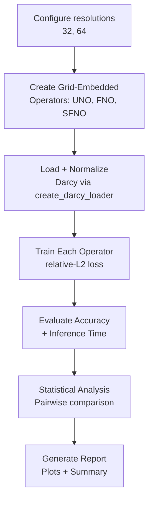

# Neural Operator Comparative Benchmark

| Metadata | Value |
|----------|-------|
| **Level** | Advanced |
| **Runtime** | ~3 min (GPU) / ~20 min (CPU) |
| **Prerequisites** | JAX, Flax NNX, Neural Operators |
| **Format** | Python + Jupyter |
| **Memory** | ~4 GB RAM |

## Overview

This benchmark provides a full comparative analysis of three neural
operator architectures -- UNO, FNO, and SFNO -- on the Darcy flow equation
using Opifex's benchmarking infrastructure. Each operator is **trained** with
the standard operator-learning recipe (grid positional embedding, Gaussian
input/output normalization, and the relative-L2 loss), so the accuracy column
reflects learned behaviour rather than random initialization. The benchmark
reports relative-L2 accuracy, MSE, parameter count, training time, and
inference time across multiple grid resolutions.

## What You'll Learn

1. Compare UNO, FNO, and SFNO on Darcy flow across grid resolutions
2. Train every operator with the proven recipe so accuracy is meaningful
3. Use Opifex's `BenchmarkEvaluator` and `AnalysisEngine` for systematic evaluation
4. Generate publication-ready plots and statistical analysis
5. Understand the accuracy / parameter / speed trade-offs between architectures

## Files

- **Python Script**: [`examples/benchmarking/operator_benchmark.py`](https://github.com/avitai/opifex/blob/main/examples/benchmarking/operator_benchmark.py)
- **Jupyter Notebook**: [`examples/benchmarking/operator_benchmark.ipynb`](https://github.com/avitai/opifex/blob/main/examples/benchmarking/operator_benchmark.ipynb)

## Quick Start

### Run the Python Script

```bash
source activate.sh && python examples/benchmarking/operator_benchmark.py
```

### Run the Jupyter Notebook

```bash
jupyter lab examples/benchmarking/operator_benchmark.ipynb
```

## Operators Compared

| Operator | Architecture | Strengths |
|----------|-------------|-----------|
| **UNO** | U-Net + Fourier layers | Multi-scale features via encoder-decoder |
| **FNO** | Spectral convolutions | Resolution-invariant, fast inference |
| **SFNO** | Spherical harmonics | Natural for global/spherical domains |

## How It Works

The benchmark creates all three operators at each resolution (32x32 and 64x64
by default), loads Darcy flow data with the datarax-backed `create_darcy_loader`,
trains each operator with the standard recipe, and then evaluates accuracy and
inference time with `BenchmarkEvaluator.evaluate_model()`.


```mermaid
flowchart TB
    A[Configure resolutions<br>32, 64] --> B[Create Grid-Embedded<br>Operators: UNO, FNO, SFNO]
    B --> C[Load + Normalize<br>Darcy via create_darcy_loader]
    C --> D[Train Each Operator<br>relative-L2 loss]
    D --> E[Evaluate Accuracy<br>+ Inference Time]
    E --> F[Statistical Analysis<br>Pairwise comparison]
    F --> G[Generate Report<br>Plots + Summary]
```

## Key Code Patterns

### Grid-Embedded Operator Creation

Every operator is wrapped with a `GridEmbedding2D` that appends normalized
`(x, y)` coordinate channels -- the standard positional encoding for spectral
operators -- and exposes a uniform channels-first interface.

```python
import jax.numpy as jnp
from flax import nnx

from opifex.neural.operators.common.embeddings import GridEmbedding2D
from opifex.neural.operators.fno.base import FourierNeuralOperator


class FNOWithGrid(nnx.Module):
    """FNO with a 2D grid positional embedding (channels-first interface)."""

    def __init__(self, in_channels, out_channels, hidden_channels, modes,
                 num_layers, *, rngs):
        super().__init__()
        self.grid_embedding = GridEmbedding2D(
            in_channels=in_channels,
            grid_boundaries=[[0.0, 1.0], [0.0, 1.0]],
        )
        self.fno = FourierNeuralOperator(
            in_channels=self.grid_embedding.out_channels,
            out_channels=out_channels, hidden_channels=hidden_channels,
            modes=modes, num_layers=num_layers, rngs=rngs,
        )

    def __call__(self, x):  # x: (batch, channels, H, W)
        x_hwc = jnp.moveaxis(x, 1, -1)
        x_embedded = self.grid_embedding(x_hwc)
        return self.fno(jnp.moveaxis(x_embedded, -1, 1))


operators = {
    "UNO": UNOWithGrid(1, 1, hidden_channels=32, modes=16, n_layers=3, rngs=rngs),
    "FNO": FNOWithGrid(1, 1, hidden_channels=32, modes=16, num_layers=4, rngs=rngs),
    "SFNO": SFNOWithGrid(1, 1, hidden_channels=32, lmax=16, num_layers=4, rngs=rngs),
}
```

> **SFNO note**: the spherical harmonic basis is built lazily and cached. Run a
> single forward pass on a concrete (non-traced) batch *before* training so the
> basis holds constants rather than `jit` tracers.

### Benchmarking with Opifex Infrastructure

```python
from calibrax.core import BenchmarkResult, Metric
from opifex.benchmarking.evaluation_engine import BenchmarkEvaluator
from opifex.benchmarking.analysis_engine import AnalysisEngine
from opifex.benchmarking.results_manager import ResultsManager

evaluator = BenchmarkEvaluator(output_dir="benchmark_results")
result = evaluator.evaluate_model(
    model=model_fn,           # un-normalizes predictions to physical space
    model_name="FNO_64",
    input_data=dataset["x_test"],
    target_data=dataset["y_test_raw"],
    dataset_name="Darcy_64",
)
# result.metrics["mse"].value, result.metrics["relative_l2"].value,
# result.metrics["parameters"].value, result.metadata["execution_time"]
```

### Training Recipe

```python
from opifex.core.training import Trainer, TrainingConfig
from opifex.core.training.config import LossConfig

config = TrainingConfig(
    num_epochs=100, learning_rate=1e-3, batch_size=32,
    loss_config=LossConfig(loss_type="relative_l2"),
)
trainer = Trainer(model=operator, config=config, rngs=nnx.Rngs(42))
trained_model, _ = trainer.fit(
    train_data=(x_train_norm, y_train_norm),
    val_data=(x_test_norm, y_test_norm),
)
```

### Data Loading and Normalization

```python
import numpy as np

from opifex.data.loaders import create_darcy_loader

loaders = create_darcy_loader(
    n_samples=1000, batch_size=32, resolution=64, seed=42,
)
# `create_darcy_loader` returns a frozen `PDELoaders` with `.train`/`.val`
# datarax pipelines. Drain both for one contiguous block; batches are already
# channels-first `(N, 1, H, W)`.
inputs: list[np.ndarray] = []
outputs: list[np.ndarray] = []
for pipeline in (loaders.train, loaders.val):
    for batch in pipeline:
        inputs.append(np.asarray(batch["input"]))
        outputs.append(np.asarray(batch["output"]))

x_train = np.concatenate(inputs, axis=0)[:1000]
y_train = np.concatenate(outputs, axis=0)[:1000]

# Fit Gaussian stats on TRAIN and normalize all splits.
x_mean, x_std = x_train.mean(), x_train.std()
y_mean, y_std = y_train.mean(), y_train.std()
x_train_norm = (x_train - x_mean) / x_std
y_train_norm = (y_train - y_mean) / y_std
# Predictions are un-normalized with (y_mean, y_std) before computing errors.
```

## Running the Benchmark

```bash
# Default: resolutions 32 and 64, 1000 training samples, 100 epochs per operator
source activate.sh && python examples/benchmarking/operator_benchmark.py
```

To customize the study, edit the `NeuralOperatorComparativeStudy(...)` call near
the bottom of the script (`resolution_sizes`, `n_train`, `num_epochs`,
`hidden_channels`, etc.).

## Sample Output

```text
INFO:__main__:RESOLUTION 32x32 STUDY
INFO:__main__:Loading Darcy dataset at resolution 32...
INFO:__main__:Darcy dataset ready: (1000, 1, 32, 32)
INFO:__main__:UNO created for resolution 32
INFO:__main__:FNO created for resolution 32
INFO:__main__:SFNO created for resolution 32
INFO:__main__:UNO on Darcy: relL2=1.9485%, MSE=2.837728e-05, params=34,465,921, train=30.0s, infer=0.0011s
INFO:__main__:FNO on Darcy: relL2=2.3043%, MSE=4.241583e-05, params=4,203,009, train=11.2s, infer=0.0008s
INFO:__main__:SFNO on Darcy: relL2=2.3631%, MSE=3.867877e-05, params=2,101,537, train=8.6s, infer=0.0008s
INFO:__main__:RESOLUTION 64x64 STUDY
INFO:__main__:Loading Darcy dataset at resolution 64...
INFO:__main__:Darcy dataset ready: (1000, 1, 64, 64)
INFO:__main__:UNO created for resolution 64
INFO:__main__:FNO created for resolution 64
INFO:__main__:SFNO created for resolution 64
INFO:__main__:UNO on Darcy: relL2=3.1666%, MSE=8.014150e-05, params=34,465,921, train=33.5s, infer=0.0040s
INFO:__main__:FNO on Darcy: relL2=2.1253%, MSE=3.458589e-05, params=4,203,009, train=13.5s, infer=0.0054s
INFO:__main__:SFNO on Darcy: relL2=2.5900%, MSE=5.104762e-05, params=2,101,537, train=10.4s, infer=0.0037s
INFO:__main__:BENCHMARK SUMMARY (Darcy flow, trained operators)
INFO:__main__:Operator    Res      Rel L2           MSE        Params   Train(s)   Infer(s)
INFO:__main__:UNO          32    1.9485%     2.838e-05    34,465,921       30.0     0.0011
INFO:__main__:FNO          32    2.3043%     4.242e-05     4,203,009       11.2     0.0008
INFO:__main__:SFNO         32    2.3631%     3.868e-05     2,101,537        8.6     0.0008
INFO:__main__:UNO          64    3.1666%     8.014e-05    34,465,921       33.5     0.0040
INFO:__main__:FNO          64    2.1253%     3.459e-05     4,203,009       13.5     0.0054
INFO:__main__:SFNO         64    2.5900%     5.105e-05     2,101,537       10.4     0.0037
INFO:__main__:Complete study finished in 147.56 seconds!
INFO:__main__:   Total benchmark runs: 6
INFO:__main__:   Successful runs: 6
INFO:__main__:   Success rate: 100.0%
```

### Per-Resolution Darcy Flow Results (Trained)

| Operator | Resolution | Rel L2 | MSE | Parameters | Train (s) | Infer (s) |
|----------|-----------|--------|-----|------------|-----------|-----------|
| UNO  | 32 | 1.95% | 2.84e-05 | 34,465,921 | 30.0 | 0.0011 |
| FNO  | 32 | 2.30% | 4.24e-05 |  4,203,009 | 11.2 | 0.0008 |
| SFNO | 32 | 2.36% | 3.87e-05 |  2,101,537 |  8.6 | 0.0008 |
| UNO  | 64 | 3.17% | 8.01e-05 | 34,465,921 | 33.5 | 0.0040 |
| FNO  | 64 | 2.13% | 3.46e-05 |  4,203,009 | 13.5 | 0.0054 |
| SFNO | 64 | 2.59% | 5.10e-05 |  2,101,537 | 10.4 | 0.0037 |

All six runs (three operators x two resolutions) complete successfully, for a
100% success rate. The full study finishes in roughly 148 seconds on a single
GPU.

### Aggregate Results (Averaged Across Resolutions)

| Operator | Rel L2 | MSE | Parameters | Train (s) | Infer (s) |
|----------|--------|-----|------------|-----------|-----------|
| UNO  | 2.56% | 5.43e-05 | 34,465,921 | 31.8 | 0.0026 |
| FNO  | 2.21% | 3.85e-05 |  4,203,009 | 12.4 | 0.0031 |
| SFNO | 2.48% | 4.49e-05 |  2,101,537 |  9.5 | 0.0023 |

All trained operators reach low-single-digit relative L2 error on Darcy flow at
both resolutions. **FNO** delivers the best accuracy averaged across resolutions
and stays resolution-robust (2.30% -> 2.13%), while **UNO** is by far the most
parameter-heavy because of its dense U-Net encoder/decoder and **SFNO** is the
most parameter-efficient and the fastest to train. (Exact numbers vary slightly
run-to-run with GPU non-determinism.)

## Generated Output

```
benchmark_results/operator_benchmark/
    accuracy_comparison.png            # Relative L2 vs resolution plots
    execution_time_comparison.png      # Inference time distributions
    statistical_analysis.json          # Pairwise statistical comparisons
    comparative_study_report.md        # Full summary report
```

## Troubleshooting

### SFNO Tracer Leak During Training

**Symptom**: `UnexpectedTracerError` from the spherical harmonic transform when
training SFNO.

**Cause**: The SHT basis is built lazily and cached; if the first call happens
inside `jit`, the cached arrays become tracers.

**Solution**: Run one forward pass on a concrete batch before calling
`Trainer.fit()` (the benchmark does this in `_train_operator`).

### Out of Memory at Higher Resolutions

**Symptom**: CUDA `RESOURCE_EXHAUSTED` when pushing to resolutions beyond the
defaults, most often with the parameter-heavy UNO.

**Solution**: Reduce `batch_size` or `hidden_channels`, or test fewer
resolutions by editing the `resolution_sizes` argument.

## Next Steps

### Experiments to Try

1. **Scale up capacity**: Increase `hidden_channels`, `modes`, and `num_epochs`
2. **Add more operators**: Include TFNO, GINO, MGNO for broader comparison
3. **Add resolutions**: Extend `resolution_sizes` (e.g. `[32, 64, 96]`) to study scaling
4. **Memory profiling**: Use the GPU profiling example to measure memory usage

### Related Examples

| Example | Level | What You'll Learn |
|---------|-------|-------------------|
| [FNO Darcy](../neural-operators/fno-darcy.md) | Intermediate | Training FNO on Darcy flow |
| [UNO Darcy](../neural-operators/uno-darcy.md) | Intermediate | Multi-resolution neural operator |

### API Reference

- [`BenchmarkResult`](../../api/benchmarking.md) - Core result container (from calibrax)
- [`BenchmarkEvaluator`](../../api/benchmarking.md) - Model evaluation harness
- [`AnalysisEngine`](../../api/benchmarking.md) - Statistical analysis tools
- [`ResultsManager`](../../api/benchmarking.md) - Results storage and retrieval
