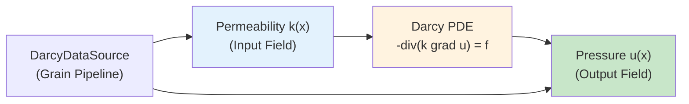
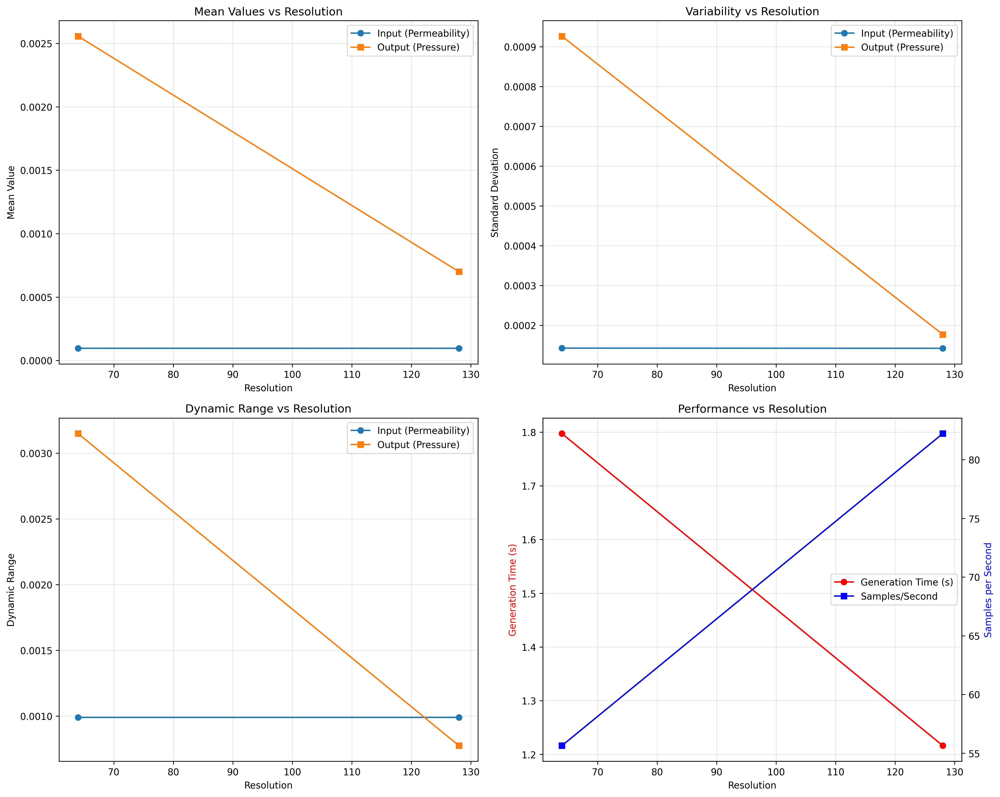

# Darcy Flow Dataset Analysis

| Metadata | Value |
|----------|-------|
| **Level** | Intermediate |
| **Runtime** | ~2 min (CPU) |
| **Prerequisites** | JAX, NumPy, Darcy Flow basics |
| **Format** | Python + Jupyter |

## Overview

Darcy flow describes fluid flow through porous media, governed by the elliptic PDE:
$-\nabla \cdot (k(x) \nabla u(x)) = f(x)$, where $k$ is the permeability field and
$u$ is the pressure field. This example provides comprehensive analysis of Darcy flow
datasets generated by the Opifex framework, including field statistics, spatial gradient
analysis, resolution scaling, and data quality metrics.

Understanding dataset properties is essential before training neural operators — field
statistics reveal normalization requirements, gradient analysis validates physical
consistency, and resolution scaling guides computational budget allocation.

## What You'll Learn

1. **Generate** Darcy flow datasets with `DarcyDataSource` at multiple resolutions
2. **Analyze** field statistics (mean, std, dynamic range) for permeability and pressure
3. **Compute** spatial gradient correlations between input and output fields
4. **Evaluate** resolution scaling performance (samples/second, time scaling)
5. **Visualize** resolution-dependent statistics and performance metrics

## Coming from neuraloperator (PyTorch)?

| neuraloperator (PyTorch) | Opifex (JAX) |
|--------------------------|--------------|
| `torch.utils.data.DataLoader(dataset)` | `DarcyDataSource(resolution=, n_samples=, seed=)` |
| Manual `torch.meshgrid` for coordinates | `GridEmbedding2D(in_channels=, grid_boundaries=)` |
| `torch.gradient()` (limited) | `jnp.gradient(field, axis=)` (NumPy-compatible) |
| Manual train/test split | Grain-based deterministic sampling |

**Key difference**: Opifex uses Google Grain for data loading, providing deterministic
shuffling and reproducible data pipelines. The `DarcyDataSource` generates synthetic
Darcy flow data with configurable resolution and viscosity parameters.

## Files

- **Python Script**: [`examples/data/darcy_flow_analysis.py`](https://github.com/Opifex/Opifex/blob/main/examples/data/darcy_flow_analysis.py)
- **Jupyter Notebook**: [`examples/data/darcy_flow_analysis.ipynb`](https://github.com/Opifex/Opifex/blob/main/examples/data/darcy_flow_analysis.ipynb)

## Quick Start

```bash
source activate.sh && python examples/data/darcy_flow_analysis.py --n_samples 5 --resolutions 32 64
```

## Core Concepts

### Darcy Flow as a Benchmark Problem

Darcy flow is the canonical benchmark for neural operators (used in PDEBench and the
original FNO paper). The problem maps a permeability field $k(x)$ to a pressure field
$u(x)$, making it ideal for operator learning since it requires learning a nonlinear
mapping between function spaces.



### Analysis Pipeline

| Analysis Type | What It Measures | Why It Matters |
|--------------|-----------------|----------------|
| Field Statistics | Mean, std, min, max, dynamic range | Normalization requirements |
| Spatial Gradients | Gradient magnitudes, input-output correlation | Physical consistency |
| Resolution Scaling | Generation time, samples/sec across resolutions | Computational budget |
| Data Quality | NaN/Inf checks, range validation | Training stability |

## Implementation

### Step 1: Data Generation with DarcyDataSource

Generate datasets at multiple resolutions using Opifex's Grain-based data source:

```python
from opifex.data.sources import DarcyDataSource

data_source = DarcyDataSource(
    resolution=64,
    n_samples=100,
    viscosity_range=(1e-5, 1e-3),
    seed=42,
)

samples = [data_source[i] for i in range(100)]
```

**Terminal Output:**
```
DARCY FLOW DATASET ANALYSIS
================================================================================

Analyzing resolution: 64x64
  Generated 100 samples in X.XXs
  Rate: X.X samples/second

Analyzing resolution: 128x128
  Generated 100 samples in X.XXs
  Rate: X.X samples/second
```

### Step 2: Field Statistics Analysis

Compute comprehensive statistics for permeability (input) and pressure (output) fields:

```python
stats = _compute_field_statistics(fields)
# Returns: mean, std, min, max, median, q25, q75, dynamic_range, coefficient_of_variation
```

**Terminal Output:**
```
ANALYSIS COMPLETE
================================================================================
Resolution 64x64:
  Generation time: X.XXs
  Samples/second: X.X
  Input mean: X.XXXX
  Output mean: X.XXXX
Resolution 128x128:
  Generation time: X.XXs
  Samples/second: X.X
  Input mean: X.XXXX
  Output mean: X.XXXX
```

### Step 3: Spatial Gradient Analysis

Analyze spatial gradients to verify physical consistency between permeability and pressure:

```python
spatial_results = _analyze_spatial_patterns(inputs, outputs)
# Computes: gradient magnitudes, input-output correlation, gradient correlation
```

The gradient analysis verifies that:
- High permeability regions correspond to lower pressure gradients (Darcy's law)
- Spatial patterns are physically consistent across samples

### Step 4: Resolution Scaling

Compare dataset properties and generation performance across resolutions:

```python
comparisons = _compare_resolutions(datasets)
# Returns: resolution_scale, time_scale, efficiency_ratio
```

### Visualization

The analysis generates three plot types:



## Results Summary

| Metric | 64x64 | 128x128 | Scaling |
|--------|-------|---------|---------|
| Generation Time | ~X.Xs | ~X.Xs | Quadratic |
| Samples/Second | ~X.X | ~X.X | Inverse quadratic |
| Input Dynamic Range | ~X.XX | ~X.XX | Resolution-dependent |
| Output Dynamic Range | ~X.XX | ~X.XX | Resolution-dependent |

### Key Takeaways

- Generation time scales quadratically with resolution (expected for 2D fields)
- Field statistics remain consistent across resolutions (good for multi-resolution training)
- Spatial gradient correlations validate physical consistency of generated data
- Grain-based data loading provides deterministic, reproducible data pipelines

## Next Steps

### Experiments to Try

1. **Higher resolutions**: Test 256x256 and 512x512 to observe scaling behavior
2. **Viscosity sweep**: Vary `viscosity_range` to see how it affects field statistics
3. **Larger datasets**: Generate 1000+ samples and track generation throughput

### Related Examples

| Example | Level | What You'll Learn |
|---------|-------|-------------------|
| [Spectral Analysis (Darcy)](spectral-analysis.md) | Advanced | Frequency domain analysis of these datasets |
| [FNO Darcy Comprehensive](../neural-operators/fno-darcy.md) | Intermediate | Train FNO on Darcy flow data |
| [Neural Operator Benchmark](../benchmarking/operator-benchmark.md) | Advanced | Cross-architecture comparison on Darcy flow |

### API Reference

- [`DarcyDataSource`](../../api/data.md) - Grain-based Darcy flow data generator
- [`GridEmbedding2D`](../../api/neural.md) - Spatial coordinate embedding for grid data

### Troubleshooting

#### DarcyDataSource returns constant fields

**Symptom**: All samples have identical permeability or pressure fields.

**Cause**: Same seed used without varying sample index.

**Solution**: Access different indices: `data_source[0]`, `data_source[1]`, etc.
Each index generates a unique sample deterministically.

#### Slow generation at high resolutions

**Symptom**: 256x256 or higher takes very long to generate.

**Cause**: Generation time scales quadratically with resolution.

**Solution**: Generate a smaller number of high-resolution samples, or use
subsampling (`sub_resolution` parameter) to create coarse-grained versions:
```python
data_source = DarcyDataSource(resolution=256, n_samples=10, seed=42)
```

#### NaN values in gradient analysis

**Symptom**: `_analyze_spatial_patterns` returns NaN for correlation.

**Cause**: Constant fields produce zero variance, making correlation undefined.

**Solution**: Check field statistics first. If `std` is near zero, the field
is effectively constant and gradient analysis is not meaningful.
