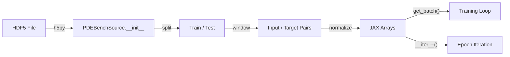

# PDEBench Dataset Loading

| Metadata | Value |
|----------|-------|
| **Level** | Beginner |
| **Runtime** | ~30 sec (GPU) |
| **Prerequisites** | JAX, h5py |
| **Format** | Python + Jupyter |

## Overview

[PDEBench](https://github.com/pdebench/PDEBench) provides HDF5-formatted
simulation trajectories across 1D/2D/3D PDEs (Burgers, Navier-Stokes, Darcy Flow,
advection, etc.). Opifex's `PDEBenchSource` provides an eager-loading interface
that converts HDF5 data to JAX arrays at initialization, then offers pure-JAX
iteration for training neural operators.

## What You'll Learn

1. **Create** synthetic HDF5 data matching the PDEBench format
2. **Load** datasets with `PDEBenchSource` — all I/O at init
3. **Inspect** shapes, sliding window pairs, and coordinate grids
4. **Batch** data for training with stateful and stateless modes
5. **Split** data into train/test sets

## Files

- **Python Script**: [`examples/data/pdebench_loading.py`](https://github.com/Opifex/Opifex/blob/main/examples/data/pdebench_loading.py)
- **Jupyter Notebook**: [`examples/data/pdebench_loading.ipynb`](https://github.com/Opifex/Opifex/blob/main/examples/data/pdebench_loading.ipynb)

## Quick Start

```bash
source activate.sh && uv run python examples/data/pdebench_loading.py
```

## Core Concepts

### PDEBench HDF5 Format

PDEBench datasets store simulation trajectories as HDF5 files:

```
/tensor   → shape (N, T, X[, Y[, Z]], C)  — N samples, T timesteps
/x, /y, /z → spatial coordinate grids (optional)
/t         → time coordinates (optional)
```

### Sliding Window Pairing

`PDEBenchSource` creates input/target pairs using a sliding window over the
time axis. With `input_steps=5` and `output_steps=5`, each sample of 20 timesteps
yields 11 overlapping windows:

```
t0–t4 → t5–t9    (window 0)
t1–t5 → t6–t10   (window 1)
...
t10–t14 → t15–t19 (window 10)
```

### Architecture Flow



## Code Walkthrough

### Loading the Dataset

```python
from opifex.data.sources.scientific import PDEBenchConfig, PDEBenchSource

config = PDEBenchConfig(
    file_path=Path("data/1D_Burgers.hdf5"),
    dataset_name="1D_Burgers",
    train_split=0.8,
    split="train",
    input_steps=5,
    output_steps=5,
    normalize=True,
)
source = PDEBenchSource(config, rngs=nnx.Rngs(0))
```

### Batching for Training

```python
# Stateful: sequential batches
batch = source.get_batch(batch_size=32)

# Stateless: random batches (for evaluation)
batch = source.get_batch(batch_size=32, key=jax.random.key(42))
```

## Expected Output

```
Created synthetic HDF5: /tmp/.../1D_Burgers_synth.hdf5
  tensor shape: (20, 20, 64, 1)
  x shape:      (64,)
  t shape:      (20,)

Dataset loaded: 176 sliding window pairs
  inputs shape:  (176, 5, 64, 1)
  targets shape: (176, 5, 64, 1)
  coordinates:   True
    x: (64,)
    t: (20,)

Train samples: 176
Test samples:  44
============================================================
PDEBench Loading Example — Complete
============================================================
Backend:      gpu
```

## Next Steps

- Download real PDEBench data from [PDEBench](https://github.com/pdebench/PDEBench)
- Train an FNO on the loaded data — see [FNO Darcy](../models/fno_darcy_comprehensive.md)
- See [Darcy Flow Analysis](darcy-flow-analysis.md) for a related data example
