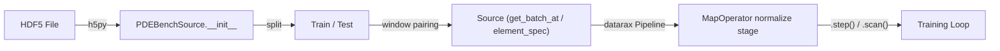

# PDEBench Dataset Loading

| Metadata | Value |
|----------|-------|
| **Level** | Beginner |
| **Runtime** | ~30 sec (GPU) |
| **Prerequisites** | JAX, h5py |
| **Format** | Python + Jupyter |

## Overview

[PDEBench](https://github.com/pdebench/PDEBench) provides HDF5-formatted
simulation trajectories across 1D/2D/3D PDEs (Burgers, Navier-Stokes, Darcy Flow,
advection, etc.). Opifex's `PDEBenchSource` is a **datarax `DataSourceModule`**: it reads the HDF5
file at init, performs the PDE-specific input/target time-window pairing (the one step datarax has
no operator for), and then exposes the standard datarax contract (`element_spec` /
stateless, JAX-traceable `get_batch_at`) so it is driven by a datarax **`Pipeline`**. Normalisation
is a composable datarax **`MapOperator`** stage, not baked into the stored arrays.
`create_pdebench_loader` assembles the source and (optional) normalize stage into a `Pipeline`.

## What You'll Learn

1. **Create** synthetic HDF5 data matching the PDEBench format
2. **Build** a datarax `Pipeline` over the dataset with `create_pdebench_loader`
3. **Inspect** the source's datarax contract (`element_spec`, `get_batch_at`) and coordinate grids
4. **Batch** data via the pipeline's JAX-traceable `.step()` / `.scan()`
5. **Normalize** with a `MapOperator` stage and **split** into train/test sets

## Files

- **Python Script**: [`examples/data/pdebench_loading.py`](https://github.com/avitai/opifex/blob/main/examples/data/pdebench_loading.py)
- **Jupyter Notebook**: [`examples/data/pdebench_loading.ipynb`](https://github.com/avitai/opifex/blob/main/examples/data/pdebench_loading.ipynb)

## Quick Start

```bash
source activate.sh && uv run python examples/data/pdebench_loading.py
```

## Core Concepts

### PDEBench HDF5 Format

PDEBench datasets store simulation trajectories as HDF5 files:

```
/tensor   → shape (N, T, X[, Y[, Z]], C)  — N samples, T timesteps
/x, /y, /z → spatial coordinate grids (optional)
/t         → time coordinates (optional)
```

### Sliding Window Pairing

`PDEBenchSource` creates input/target pairs using a sliding window over the
time axis. With `input_steps=5` and `output_steps=5`, each sample of 20 timesteps
yields 11 overlapping windows:

```
t0–t4 → t5–t9    (window 0)
t1–t5 → t6–t10   (window 1)
...
t10–t14 → t15–t19 (window 10)
```

### Architecture Flow


```mermaid
graph LR
    A["HDF5 File"] -->|h5py| B["PDEBenchSource.__init__"]
    B -->|split| C["Train / Test"]
    C -->|window pairing| D["Source (get_batch_at / element_spec)"]
    D -->|datarax Pipeline| E["MapOperator normalize stage"]
    E -->|".step() / .scan()"| F["Training Loop"]
```

## Code Walkthrough

### Building the loader (source + normalize stage + Pipeline)

```python
from opifex.data.sources.scientific import PDEBenchConfig, create_pdebench_loader

config = PDEBenchConfig(
    file_path=Path("data/1D_Burgers.hdf5"),
    dataset_name="1D_Burgers",
    train_split=0.8,
    split="train",
    input_steps=5,
    output_steps=5,
    normalize=True,   # attaches a per-channel min-max MapOperator stage
)
loader = create_pdebench_loader(config, batch_size=32)
```

### Batching for training

```python
# JAX-traceable single step (sequential position advances internally)
batch = loader.step()          # {"input": (32, 5, 64, 1), "target": (32, 5, 64, 1)}

# GPU-fused epoch — fetch + normalize + train_step compiled together
losses = loader.scan(train_step, length=steps_per_epoch, modules=(model, optimizer))
```

The source itself is still inspectable directly — `loader.source.element_spec()`,
`loader.source.get_batch_at(start, size)`, and `loader.source.coordinates`.

## Expected Output

```
========================================================================
Opifex Example: PDEBench loading on datarax (Source + MapOperator + Pipeline)
========================================================================
JAX backend: gpu
Created synthetic HDF5: /tmp/.../1D_Burgers_synth.hdf5
  tensor shape: (20, 20, 64, 1)
  x shape:      (64,)
  t shape:      (20,)

Windowed pairs: 176  (input_steps=5, output_steps=5)
  element_spec input:  (5, 64, 1)
  element_spec target: (5, 64, 1)
  coordinates: ['x', 't']

Pipeline.step() batch: input (4, 5, 64, 1), target (4, 5, 64, 1)
  normalized input range: [0.3212, 0.6788]  (MapOperator stage)

Train pairs: 176   Test pairs: 44
========================================================================
```

## Next Steps

- Download real PDEBench data from [PDEBench](https://github.com/pdebench/PDEBench)
- Drive training with `loader.scan(step_fn, length=...)` for a GPU-fused epoch
- Train an FNO on the loaded data — see [FNO Darcy](../neural-operators/fno-darcy.md)
- See [Darcy Flow Analysis](darcy-flow-analysis.md) for a related data example
