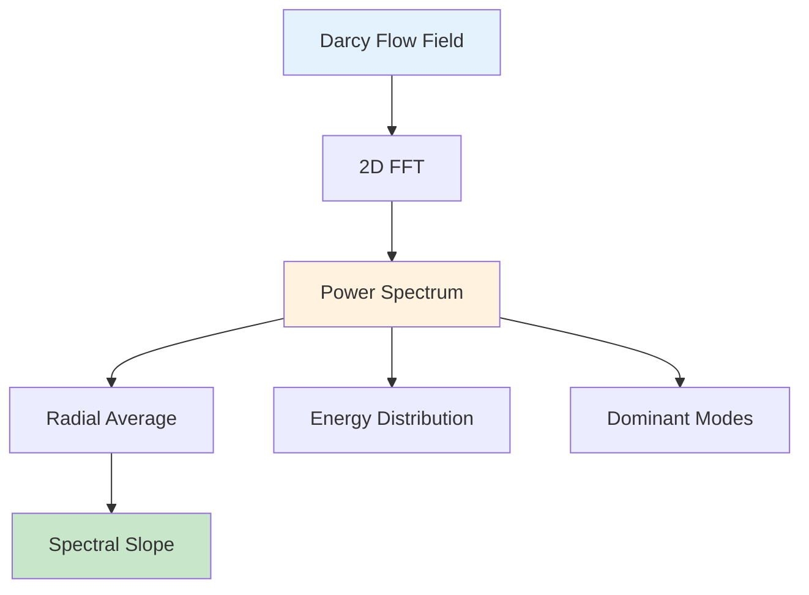

# Darcy Flow Spectral Analysis

| Metadata | Value |
|----------|-------|
| **Level** | Advanced |
| **Runtime** | ~3 min (CPU) |
| **Prerequisites** | JAX, FFT/Spectral Analysis basics |
| **Format** | Python + Jupyter |

## Overview

Spectral analysis reveals the frequency content of Darcy flow fields, which is
critical for understanding how neural operators (especially FNO) represent solutions.
FNO operates in Fourier space, so understanding the spectral properties of your data
directly informs architecture choices like mode truncation and hidden channel width.

This example computes 2D power spectral densities, energy distributions across
frequency bands, dominant Fourier modes, and spectral slopes for Darcy flow fields
generated by Opifex's `DarcyDataSource`.

## What You'll Learn

1. **Compute** 2D power spectral density with `compute_power_spectrum_2d`
2. **Analyze** energy distribution between low and high frequency bands
3. **Identify** dominant Fourier modes in pressure fields
4. **Compare** spectral properties across different grid resolutions
5. **Evaluate** spectral slopes for power-law behavior analysis

## Files

- **Python Script**: [`examples/data/darcy_flow_spectral_analysis.py`](https://github.com/Opifex/Opifex/blob/main/examples/data/darcy_flow_spectral_analysis.py)
- **Jupyter Notebook**: [`examples/data/darcy_flow_spectral_analysis.ipynb`](https://github.com/Opifex/Opifex/blob/main/examples/data/darcy_flow_spectral_analysis.ipynb)

## Quick Start

```bash
source activate.sh && python examples/data/darcy_flow_spectral_analysis.py
```

## Core Concepts

### Why Spectral Analysis for Neural Operators?

FNO learns in Fourier space by truncating high-frequency modes. Understanding the
spectral content of your data tells you:

- **How many modes to keep**: If 95% of energy is in the first 12 modes, `modes=12` suffices
- **Whether FNO is appropriate**: Data with broadband spectra may need more modes or alternative architectures
- **Resolution requirements**: Spectral slopes indicate how quickly energy decays, guiding resolution choices



### Spectral Analysis Components

| Component | What It Computes | Application |
|-----------|-----------------|-------------|
| Power Spectral Density | Energy at each frequency | Overall spectral shape |
| Radial Averaging | Isotropic spectrum from 2D PSD | 1D summary for comparison |
| Energy Distribution | Low vs high frequency energy split | Mode truncation guidance |
| Dominant Modes | Top-k most energetic frequencies | Key features to resolve |
| Spectral Slopes | Power-law exponent of PSD decay | Smoothness characterization |

## Implementation

### Step 1: Compute 2D Power Spectral Density

Compute the PSD using 2D FFT and extract radial frequency information:

```python
from examples.data.darcy_flow_spectral_analysis import (
    compute_power_spectrum_2d,
    radial_average_spectrum,
)

k_radial, power_spectrum = compute_power_spectrum_2d(field)
k_centers, avg_spectrum = radial_average_spectrum(k_radial, power_spectrum)
```

**Terminal Output:**
```
Darcy Flow Spectral Analysis - Opifex Framework
============================================================

Analyzing spectral properties at 32x32
  Generation time: X.XXXs
  Analyzing 10 samples for spectral properties...
  Low frequency energy: XX.X%
  High frequency energy: XX.X%

Analyzing spectral properties at 64x64
  Generation time: X.XXXs
  Analyzing 10 samples for spectral properties...
  Low frequency energy: XX.X%
  High frequency energy: XX.X%
```

### Step 2: Analyze Energy Distribution

Quantify the energy split between low and high frequency bands:

```python
energy_dist = analyze_spectral_energy_distribution(field, cutoff_frequency=0.3)
# Returns: total_energy, low/high_freq_energy, percentages, cutoff
```

This directly informs FNO mode selection: if low-frequency energy percentage is
above 90%, a small number of Fourier modes will capture most of the solution.

### Step 3: Identify Dominant Modes

Find the most energetic Fourier modes to understand the key spatial features:

```python
modes = compute_dominant_modes(field, n_modes=10)
# Returns: mode_indices, mode_powers, mode_frequencies, amplitudes, phases
```

### Step 4: Compare Across Resolutions

The analysis runs at multiple resolutions to verify spectral consistency:

```python
results = analyze_darcy_spectral_properties(
    n_samples=20,
    resolutions=[32, 64],
    viscosity_range=(1e-5, 1e-3),
    key=jax.random.PRNGKey(42),
)
```

### Step 5: Spectral Slope Analysis

Fit power-law models to the high-frequency spectrum to characterize solution
smoothness. Steeper slopes indicate smoother solutions that need fewer Fourier modes:

| Slope | Interpretation | FNO Guidance |
|-------|---------------|--------------|
| -2 to -3 | Moderately smooth | 12-16 modes typical |
| -3 to -5 | Very smooth | 8-12 modes sufficient |
| > -2 | Rough/turbulent | More modes or U-FNO |

### Visualization

The analysis generates a comprehensive 6-panel spectral visualization:


## Results Summary

| Metric | 32x32 | 64x64 | Interpretation |
|--------|-------|-------|----------------|
| Low-freq Energy | ~XX% | ~XX% | Most energy in low modes |
| High-freq Energy | ~XX% | ~XX% | Fine details contribute less |
| Spectral Slope | ~-X.XX | ~-X.XX | Solution smoothness |
| Dominant Mode Count | 10 | 10 | Key spatial frequencies |
| Generation Time | ~X.Xs | ~X.Xs | Scales with resolution |

### Key Takeaways

- Darcy flow fields are spectrally smooth — most energy is in low-frequency modes
- This validates FNO's approach of truncating high-frequency modes
- Spectral properties are consistent across resolutions (resolution-independent physics)
- Spectral slopes help select the optimal number of Fourier modes for FNO training
- Power-law behavior in the spectrum confirms self-similar structure of Darcy solutions

## Next Steps

### Experiments to Try

1. **Vary viscosity**: Lower viscosity creates sharper features — observe spectral broadening
2. **Mode truncation study**: Reconstruct fields with N modes and measure L2 error vs N
3. **Compare with FNO predictions**: Run spectral analysis on FNO output to verify learned spectra

### Related Examples

| Example | Level | What You'll Learn |
|---------|-------|-------------------|
| [Darcy Flow Analysis](darcy-flow-analysis.md) | Intermediate | Spatial domain statistics |
| [FNO Darcy Comprehensive](../neural-operators/fno-darcy.md) | Intermediate | Train FNO using spectral insights |
| [Fourier Continuation](../layers/fourier-continuation.md) | Intermediate | Handle non-periodic boundaries in spectral methods |
| [Neural Operator Benchmark](../benchmarking/operator-benchmark.md) | Advanced | Cross-architecture comparison |

### API Reference

- [`DarcyDataSource`](../../api/data.md) - Grain-based Darcy flow data generator
- [`FourierNeuralOperator`](../../api/neural.md) - FNO model that operates in Fourier space
- [`SpectralConvolution2d`](../../api/neural.md) - Spectral convolution layer

### Troubleshooting

#### Spectral slope fitting fails

**Symptom**: `jnp.linalg.lstsq` returns NaN or very noisy slopes.

**Cause**: Not enough high-frequency data points, or spectrum has zeros.

**Solution**: Ensure the mask `k_centers > 0.1` captures at least 5 points.
For very low-resolution data (16x16), lower the threshold:
```python
mask = k_centers > 0.05  # Lower threshold for coarse grids
```

#### Energy distribution sums to > 100%

**Symptom**: Low + high frequency percentages exceed 100%.

**Cause**: Floating point precision in frequency bin boundaries.

**Solution**: This is a cosmetic issue. The total energy is computed correctly;
percentages may have minor rounding differences at the cutoff boundary.

#### Radial averaging produces jagged spectra

**Symptom**: Radially averaged spectrum has spikes instead of smooth decay.

**Cause**: Too few bins relative to the frequency resolution.

**Solution**: Increase `n_bins` in `radial_average_spectrum`:
```python
k_centers, avg_spectrum = radial_average_spectrum(k_radial, power_spectrum, n_bins=100)
```
