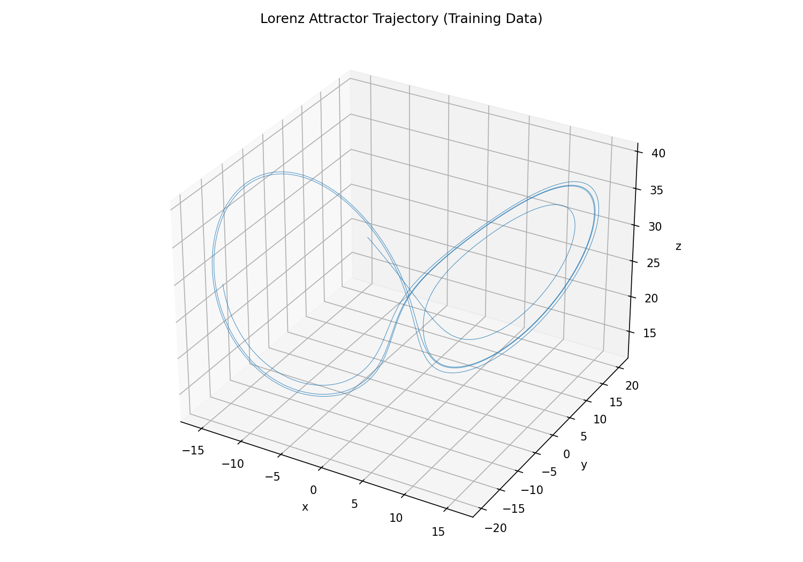
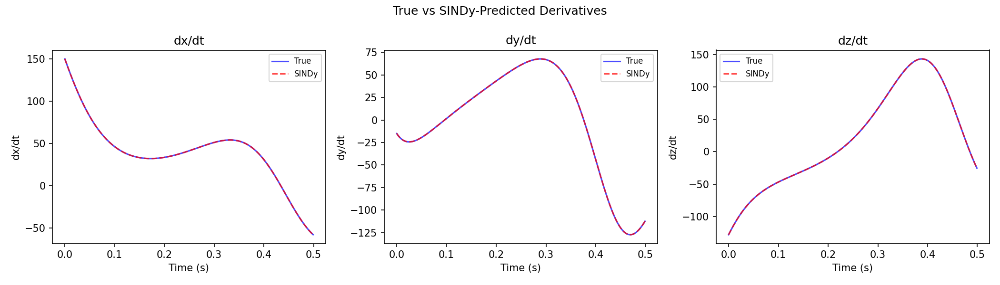
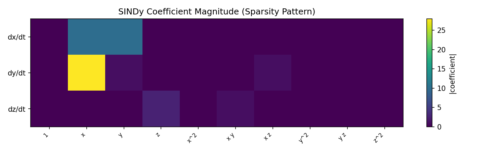

# Equation Discovery with SINDy

Automatically discover governing equations from time-series data using
Sparse Identification of Nonlinear Dynamics (SINDy).

**Source**: [`examples/discovery/sindy_lorenz.py`](https://github.com/avitai/opifex/blob/main/examples/discovery/sindy_lorenz.py) |
[`sindy_lorenz.ipynb`](https://github.com/avitai/opifex/blob/main/examples/discovery/sindy_lorenz.ipynb)

## Overview

SINDy discovers the sparsest set of nonlinear functions that explains
observed dynamics. Given state data $x(t)$ and derivatives $\dot{x}$, it
solves:

$$\dot{x} \approx \Theta(x) \, \Xi$$

where $\Theta(x)$ is a library of candidate functions (polynomials,
trigonometric, custom) and $\Xi$ is a sparse coefficient matrix found
via STLSQ (Sequential Thresholded Least Squares).

## Lorenz Attractor Trajectory



The Lorenz system with $\sigma = 10$, $\rho = 28$, $\beta = 8/3$, integrated
for 5000 steps at $dt = 0.001$.

## Lorenz System Recovery

The Lorenz attractor is the canonical test case:

$$\dot{x} = \sigma(y - x), \quad \dot{y} = x(\rho - z) - y, \quad \dot{z} = xy - \beta z$$

```python
from opifex.discovery.sindy import SINDy, SINDyConfig

config = SINDyConfig(polynomial_degree=2, threshold=0.3)
model = SINDy(config)
model.fit(x_data, x_dot)

for eq in model.equations(["x", "y", "z"]):
    print(eq)
```

**Output:**

```
dx/dt = -10.000 x + 10.000 y
dy/dt = 27.991 x + -0.998 y + -1.000 x z
dz/dt = -2.667 z + 1.000 x y
```

R² = 1.000000 — exact recovery of the Lorenz system coefficients ($\sigma = 10$,
$\rho = 28$, $\beta = 8/3 \approx 2.667$).

## True vs Predicted Derivatives



SINDy-predicted derivatives (red dashed) overlay perfectly with the true
derivatives (blue solid) across all three state variables.

## Sparsity Pattern



The coefficient matrix shows 7 nonzero terms out of 30 possible
(3 equations x 10 library terms), matching the known Lorenz structure.

## Comparison with PySINDy Reference

Both implementations recover identical equations and R² scores:

```
=== PySINDy (Reference) ===
(x0)' = -10.000 x0 +  10.000 x1
(x1)' =  28.000 x0 + -1.000 x1 + -1.000 x0 x2
(x2)' = -2.667 x2 +  1.000 x0 x1
R² score: 1.000000
Time: 0.0079s

=== Opifex SINDy (JAX-native) ===
dx/dt = -10.000 x + 10.000 y
dy/dt = 27.991 x + -0.998 y + -1.000 x z
dz/dt = -2.667 z + 1.000 x y
R² score: 1.000000
Time: 0.0180s
```

Both achieve R² = 1.000000. Opifex matches PySINDy's accuracy on the Lorenz
benchmark while being pure JAX (JIT-compilable, GPU-acceleratable, differentiable).

## Ensemble SINDy for Uncertainty

```python
from opifex.discovery.sindy import EnsembleSINDy
from opifex.discovery.sindy.config import EnsembleSINDyConfig

config = EnsembleSINDyConfig(
    polynomial_degree=2, threshold=0.3,
    n_models=20, bagging_fraction=0.8,
)
ensemble = EnsembleSINDy(config)
ensemble.fit(x_data, x_dot, key=jax.random.PRNGKey(42))
```

**Output:**

```
Ensemble equations (mean +/- std):
  dx/dt = (-10.000+/-0.000) x + (10.000+/-0.000) y
  dy/dt = (28.000+/-0.000) x + (-1.000+/-0.000) y + (-1.000+/-0.000) x z
  dz/dt = (-2.667+/-0.000) z + (1.000+/-0.000) x y

Mean coefficient uncertainty: 0.0000
Max coefficient uncertainty:  0.0002
```

Near-zero uncertainty on clean data confirms the robustness of the recovery.

## Numerical Differentiation

When derivatives are not available analytically:

```python
from opifex.discovery.sindy.utils import finite_difference

x_dot_numerical = finite_difference(x_data, dt)
model.fit(x_data, x_dot_numerical)
```

```
Numerical differentiation error (interior points): 0.301299
R² with numerical derivatives: 0.999989
```

Still excellent recovery (R² > 0.9999) even with numerically estimated derivatives.

## API Reference

| Class | Description |
|-------|-------------|
| `SINDy` | Core model: fit, predict, equations, score |
| `EnsembleSINDy` | Bootstrap aggregation for uncertainty |
| `CandidateLibrary` | Polynomial, trig, custom basis functions |
| `STLSQ` | Sequential Thresholded Least Squares optimizer |
| `SR3` | Sparse Relaxed Regularized Regression optimizer |
| `SINDyConfig` | Algorithm configuration (frozen dataclass) |
| `distill_ude_residual` | UDE neural residual to symbolic equations |

## References

- Brunton et al. (2016) "Discovering governing equations from data by sparse identification of nonlinear dynamical systems"
- Fasel et al. (2022) "Ensemble-SINDy: Robust sparse model discovery in the low-data, high-noise limit"
- PySINDy: [dynamicslab/pysindy](https://github.com/dynamicslab/pysindy)
