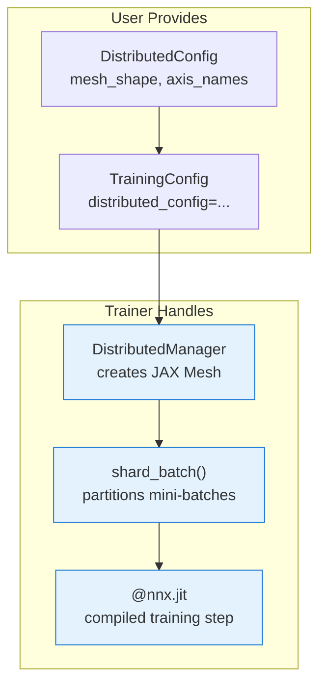

# Distributed Data-Parallel Training

| Metadata          | Value                                       |
|-------------------|---------------------------------------------|
| **Level**         | Intermediate                                |
| **Runtime**       | ~10 seconds (1 GPU), ~5 seconds (2+ GPUs)  |
| **Prerequisites** | Basic Python, JAX fundamentals              |
| **Format**        | Python + Jupyter                            |
| **Memory**        | ~500 MB RAM                                 |

## Overview

This tutorial demonstrates how to enable **SPMD data-parallel training**
across all available JAX devices using the `DistributedConfig` integration
with Opifex's `Trainer`. The distributed machinery is completely transparent —
adding just three lines transforms single-device training into multi-device
data-parallel training.

**Opifex APIs demonstrated:**

- **DistributedConfig**: Declarative device mesh topology configuration
- **TrainingConfig**: Accepts optional `distributed_config` parameter
- **Trainer**: Automatically creates `DistributedManager` and shards batches
- **DistributedManager**: Manages JAX device mesh and array sharding

**What it does:**
1. `DistributedConfig` describes the device mesh shape and axis names.
2. `Trainer.__init__` creates a `DistributedManager` from this config.
3. `Trainer.fit` shards each mini-batch across the `"data"` mesh axis
   before feeding it to the JIT-compiled training step.

## What You'll Learn

1. **Create** a `DistributedConfig` describing the device mesh topology
2. **Pass** it to `TrainingConfig` to enable distributed training
3. **Train** a model using `Trainer.fit()` with automatic batch sharding
4. **Understand** the data-parallel training pipeline in Opifex

## Files

- **Python Script**: [`examples/distributed/distributed_pde.py`](https://github.com/Opifex/Opifex/blob/main/examples/distributed/distributed_pde.py)
- **Jupyter Notebook**: [`examples/distributed/distributed_pde.ipynb`](https://github.com/Opifex/Opifex/blob/main/examples/distributed/distributed_pde.ipynb)

## Quick Start

### Run the Python Script

```bash
source activate.sh && python examples/distributed/distributed_pde.py
```

### Run the Jupyter Notebook

```bash
jupyter lab examples/distributed/distributed_pde.ipynb
```

## Core Concepts

### Data-Parallel Training in JAX

JAX's SPMD (Single Program, Multiple Data) model distributes computation
across devices by sharding arrays along named axes. Opifex wraps this
behind `DistributedConfig` so you don't need to manage meshes manually:



### Mesh Topology

A *mesh* maps physical devices to named logical axes. For pure
data-parallelism, a 1D mesh along the `"data"` axis is all you need:

| Devices | Mesh Shape | Axes      | Strategy |
|---------|-----------|-----------|----------|
| 1 GPU   | `(1,)`    | `("data",)` | data     |
| 4 GPUs  | `(4,)`    | `("data",)` | data     |
| 8 TPUs  | `(8,)`    | `("data",)` | data     |

## Implementation

### Step 1: Imports

```python
import jax
import jax.numpy as jnp
from flax import nnx

from opifex.core.training.config import TrainingConfig
from opifex.core.training.trainer import Trainer
from opifex.distributed.config import DistributedConfig
```

### Step 2: Define the Model

Any `nnx.Module` works — the distributed machinery is orthogonal
to the model definition:

```python
class SimplePDEModel(nnx.Module):
    def __init__(self, features: int = 64, rngs=None):
        if rngs is None:
            rngs = nnx.Rngs(0)
        self.layer1 = nnx.Linear(4, features, rngs=rngs)
        self.layer2 = nnx.Linear(features, 1, rngs=rngs)

    def __call__(self, x):
        return self.layer2(nnx.relu(self.layer1(x)))

model = SimplePDEModel(features=64, rngs=nnx.Rngs(42))
```

### Step 3: Configure Distributed Training

This is the key step — create a `DistributedConfig` and pass it to
`TrainingConfig`:

```python
distributed_config = DistributedConfig(
    mesh_shape=(jax.device_count(),),
    mesh_axis_names=("data",),
    strategy="data",
)

training_config = TrainingConfig(
    num_epochs=20,
    learning_rate=1e-3,
    batch_size=32,
    distributed_config=distributed_config,
)
```

### Step 4: Train

Create the `Trainer` and call `fit()` as usual:

```python
trainer = Trainer(model, training_config)

x = jax.random.normal(jax.random.PRNGKey(0), (256, 4))
y = jnp.sum(x**2, axis=-1, keepdims=True)

trained_model, metrics = trainer.fit(train_data=(x, y))
```

**Terminal Output:**

```text
============================================================
Distributed Data-Parallel Training
============================================================
JAX backend:  gpu
Devices:      1
Model parameters: 385
Mesh shape:   (1,)
Axis names:   ('data',)
Strategy:     data
Trainer created with distributed config
Training data: x=(256, 4), y=(256, 1)

Training...

============================================================
RESULTS
============================================================
  Devices used:    1
  Initial loss:    20.304531
  Final loss:      3.199348
============================================================

Distributed training complete!
```

## Results Summary

| Metric         | Value      |
|----------------|------------|
| Initial Loss   | 20.304531  |
| Final Loss     | 3.199348   |
| Parameters     | 385        |
| Epochs         | 20         |
| Batch Size     | 32         |
| Runtime        | ~10 sec    |

## Next Steps

### Experiments to Try

1. **Scale to multiple GPUs**: Set `mesh_shape=(4,)` on a 4-GPU machine
2. **FSDP strategy**: Use `strategy="fsdp"` with a 2D mesh for model parallelism
3. **Model sharding**: Combine with `nnx.with_partitioning()` for tensor parallelism
4. **Larger models**: Try with FNO or other neural operators

### Related Examples

| Example                                                      | Level        | What You'll Learn             |
|--------------------------------------------------------------|--------------|-------------------------------|
| [First PINN](../getting-started/first-pinn.md)               | Beginner     | Physics-informed training     |
| [First Neural Operator](../getting-started/first-neural-operator.md) | Beginner | Data-driven operator learning |

### API Reference

- [`DistributedConfig`](../../../api/distributed/config.md) — Mesh configuration
- [`DistributedManager`](../../../api/distributed/manager.md) — Device mesh manager
- [`TrainingConfig`](../../../api/core/training/config.md) — Training configuration
- [`Trainer`](../../../api/core/training/trainer.md) — Training loop
