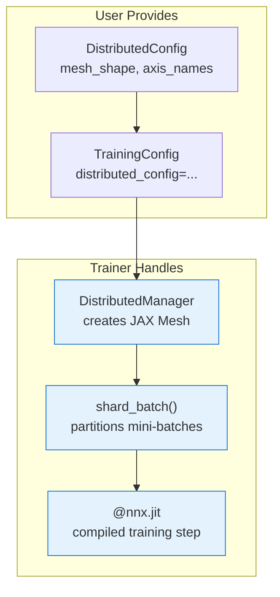

# Distributed Data-Parallel Operator Learning

| Metadata          | Value                                       |
|-------------------|---------------------------------------------|
| **Level**         | Intermediate                                |
| **Runtime**       | ~1-2 min (1 GPU); faster per-step on 2+ GPUs|
| **Prerequisites** | JAX, Flax NNX, Neural Operators basics      |
| **Format**        | Python + Jupyter                            |
| **Memory**        | ~2 GB RAM                                   |

## Overview

This tutorial trains a **Fourier Neural Operator (FNO)** on **Darcy flow** — a
2D elliptic PDE mapping a permeability coefficient field to the pressure
solution — using **SPMD data-parallel training** across all available JAX
devices via the `DistributedConfig` integration with Opifex's `Trainer`.

The point is that going distributed is a *zero-code-change* operation. You take
the exact same FNO + `Trainer` recipe from the
[FNO on Darcy Flow](../neural-operators/fno-darcy.md) example and add **one
argument**: `distributed_config` on `TrainingConfig`. The `Trainer` then builds
the JAX device mesh and shards every mini-batch across the `"data"` axis behind
the scenes. The reported test relative L2 confirms this is a genuine PDE solve,
not a toy regression.

**Opifex APIs demonstrated:**

- **DistributedConfig**: Declarative device mesh topology configuration
- **TrainingConfig**: Accepts optional `distributed_config` parameter
- **Trainer**: Automatically creates `DistributedManager` and shards batches
- **GridEmbedding2D + FourierNeuralOperator**: the operator-learning model
- **relative L2 error**: the standard physical-space operator-learning metric

**What it does:**
1. `DistributedConfig` describes the device mesh shape and axis names.
2. `Trainer.__init__` creates a `DistributedManager` from this config.
3. `Trainer.fit` shards each mini-batch across the `"data"` mesh axis
   before feeding it to the JIT-compiled training step.

## What You'll Learn

1. **Create** a `DistributedConfig` describing the device mesh topology
2. **Pass** it to `TrainingConfig` to enable distributed training
3. **Train** a grid-embedded FNO on Darcy flow with `Trainer.fit()`
4. **Evaluate** in physical pressure units with the relative L2 error

## Files

- **Python Script**: [`examples/distributed/distributed_pde.py`](https://github.com/avitai/opifex/blob/main/examples/distributed/distributed_pde.py)
- **Jupyter Notebook**: [`examples/distributed/distributed_pde.ipynb`](https://github.com/avitai/opifex/blob/main/examples/distributed/distributed_pde.ipynb)

## Quick Start

### Run the Python Script

```bash
source activate.sh && python examples/distributed/distributed_pde.py
```

### Run the Jupyter Notebook

```bash
jupyter lab examples/distributed/distributed_pde.ipynb
```

## Core Concepts

### Data-Parallel Training in JAX

JAX's SPMD (Single Program, Multiple Data) model distributes computation
across devices by sharding arrays along named axes. Opifex wraps this
behind `DistributedConfig` so you don't need to manage meshes manually:


```mermaid
graph TB
    subgraph Config["User Provides"]
        A["DistributedConfig<br/>mesh_shape, axis_names"]
        B["TrainingConfig<br/>distributed_config=..."]
    end

    subgraph Trainer["Trainer Handles"]
        C["DistributedManager<br/>creates JAX Mesh"]
        D["shard_batch()<br/>partitions mini-batches"]
        E["@nnx.jit<br/>compiled training step"]
    end

    A --> B
    B --> C
    C --> D
    D --> E

    style C fill:#e3f2fd,stroke:#1976d2
    style D fill:#e3f2fd,stroke:#1976d2
    style E fill:#e3f2fd,stroke:#1976d2
```

### Mesh Topology

A *mesh* maps physical devices to named logical axes. For pure
data-parallelism, a 1D mesh along the `"data"` axis is all you need:

| Devices | Mesh Shape | Axes      | Strategy |
|---------|-----------|-----------|----------|
| 1 GPU   | `(1,)`    | `("data",)` | data     |
| 4 GPUs  | `(4,)`    | `("data",)` | data     |
| 8 TPUs  | `(8,)`    | `("data",)` | data     |

## Implementation

### Step 1: Imports

```python
import jax
import jax.numpy as jnp
import numpy as np
from flax import nnx

from opifex.core.evaluation import predict_in_batches
from opifex.core.metrics import per_sample_relative_l2
from opifex.core.training import Trainer, TrainingConfig
from opifex.core.training.config import LossConfig, OptimizationConfig
from opifex.data.loaders import create_darcy_loader
from opifex.distributed.config import DistributedConfig
from opifex.neural.operators.common.embeddings import GridEmbedding2D
from opifex.neural.operators.fno.base import FourierNeuralOperator
```

### Step 2: Define the Model

A grid-embedded FNO — exactly the architecture from the standalone
[FNO on Darcy Flow](../neural-operators/fno-darcy.md) example. `GridEmbedding2D`
injects spatial coordinates as extra input channels; `FourierNeuralOperator`
performs the spectral operator learning. The distributed machinery is
orthogonal to the model definition:

```python
class FNOWithGrid(nnx.Module):
    def __init__(self, in_channels, out_channels, modes, hidden_channels,
                 num_layers, grid_boundaries, *, domain_padding, rngs):
        super().__init__()
        self.grid_embedding = GridEmbedding2D(
            in_channels=in_channels, grid_boundaries=grid_boundaries,
        )
        self.fno = FourierNeuralOperator(
            in_channels=self.grid_embedding.out_channels,
            out_channels=out_channels, hidden_channels=hidden_channels,
            modes=modes, num_layers=num_layers,
            domain_padding=domain_padding, rngs=rngs,
        )

    def __call__(self, x):
        x_hwc = jnp.moveaxis(x, 1, -1)
        x_embedded = self.grid_embedding(x_hwc)
        x_chw = jnp.moveaxis(x_embedded, -1, 1)
        return self.fno(x_chw)
```

### Step 3: Configure Distributed Training

This is the key step — build a `DistributedConfig` from the live device count
and pass it to `TrainingConfig`. The mesh is `(1,)` on a single GPU and `(N,)`
on N GPUs with no other change:

```python
distributed_config = DistributedConfig(
    mesh_shape=(jax.device_count(),),
    mesh_axis_names=("data",),
    strategy="data",
)

config = TrainingConfig(
    num_epochs=100,
    batch_size=32,
    loss_config=LossConfig(loss_type="relative_l2"),
    optimization_config=OptimizationConfig(
        optimizer="adamw", learning_rate=5e-3, weight_decay=1e-4,
        schedule_type="exponential", transition_steps=lr_transition_steps,
        decay_rate=0.5,
    ),
    distributed_config=distributed_config,  # <-- the only distributed-specific line
)
```

### Step 4: Load Darcy Data, Train, and Evaluate

Load real Darcy flow data via `create_darcy_loader`, apply Gaussian
normalization (fit on train), train with `Trainer.fit`, then un-normalize
predictions back to physical pressure and report the relative L2 error:

```python
loaders = create_darcy_loader(
    n_samples=1100, batch_size=32, resolution=32,
    val_fraction=100 / 1100, seed=42,
)
# ... collect + normalize splits ...

trainer = Trainer(model=model, config=config, rngs=nnx.Rngs(42))
trained_model, metrics = trainer.fit(
    train_data=(jnp.array(x_train_n), jnp.array(y_train_n)),
    val_data=(jnp.array(x_test_n), jnp.array(y_test_n)),
)

predictions = predict_in_batches(trained_model, jnp.array(x_test_n)) * y_std + y_mean
test_rel_l2 = float(jnp.mean(per_sample_relative_l2(predictions, jnp.array(y_test))))
```

**Terminal Output:**

```text
======================================================================
Distributed Data-Parallel Operator Learning (FNO on Darcy Flow)
======================================================================
JAX backend:  gpu
Devices:      1
Resolution:   32x32
Train/Test:   1000 / 100
FNO config:   modes=12, width=32, layers=4

Distributed mesh configuration:
  Mesh shape:  (1,)
  Axis names:  ('data',)
  Strategy:    data
  Num devices: 1
  (The ONLY change from single-device training is passing this config.)

Loading Darcy flow data (permeability -> pressure)...
Training data: X=(1024, 1, 32, 32), Y=(1024, 1, 32, 32)
Test data:     X=(128, 1, 32, 32), Y=(128, 1, 32, 32)

Creating FNO model with grid embedding...
Model parameters: 2,368,001

Setting up distributed Trainer...
Trainer created with distributed config

Training (data-parallel across the device mesh)...

Running evaluation (un-normalized to physical pressure)...

======================================================================
RESULTS
======================================================================
  Devices used:      1
  Model parameters:  2,368,001
  Initial train loss:0.562598
  Final train loss:  0.008267
  Test Relative L2:  0.007877
======================================================================

Distributed operator-learning complete!
```

## Results Summary

| Metric            | Value      |
|-------------------|------------|
| Initial Train Loss| 0.562598   |
| Final Train Loss  | 0.008267   |
| Test Relative L2  | 0.007877   |
| Parameters        | 2,368,001  |
| Epochs            | 100        |
| Batch Size        | 32         |
| Devices           | 1          |

The test relative L2 of ~0.0079 is a genuine Darcy FNO result — the same
accuracy you would get single-device, now produced by the data-parallel path.

## Next Steps

### Experiments to Try

1. **Scale to multiple GPUs**: Set `mesh_shape=(4,)` on a 4-GPU machine and
   watch per-step throughput improve with no other change
2. **FSDP strategy**: Use `strategy="fsdp"` with a 2D mesh for model parallelism
3. **Model sharding**: Combine with `nnx.with_partitioning()` for tensor parallelism
4. **Higher resolution**: Increase resolution and modes for even lower error

### Related Examples

| Example                                                      | Level        | What You'll Learn             |
|--------------------------------------------------------------|--------------|-------------------------------|
| [FNO on Darcy Flow](../neural-operators/fno-darcy.md)        | Intermediate | The single-device FNO recipe  |
| [First Neural Operator](../getting-started/first-neural-operator.md) | Beginner | Data-driven operator learning |

### API Reference

- [`DistributedConfig`](../../api/core.md) — Mesh configuration
- [`DistributedManager`](../../api/core.md) — Device mesh manager
- [`TrainingConfig`](../../api/training.md) — Training configuration
- [`Trainer`](../../api/training.md) — Training loop
