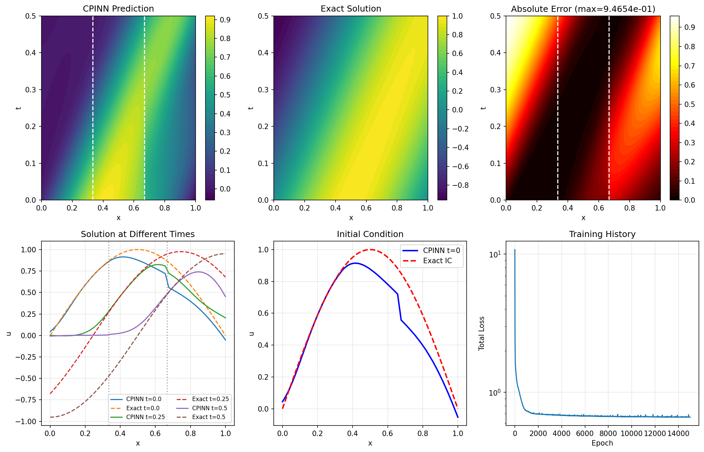

# CPINN: Conservative PINN on Advection-Diffusion Equation

| Metadata          | Value                            |
|-------------------|----------------------------------|
| **Level**         | Intermediate                     |
| **Runtime**       | ~2 min (GPU) / ~12 min (CPU)     |
| **Prerequisites** | JAX, Flax NNX, Conservation Laws |
| **Format**        | Python + Jupyter                 |
| **Memory**        | ~400 MB RAM                      |

## Overview

This example demonstrates solving the 1D advection-diffusion equation using CPINN
(Conservative Physics-Informed Neural Network). CPINNs extend XPINNs with explicit
flux conservation at subdomain interfaces, critical for conservation laws.

Conservation is enforced by matching the normal flux across interfaces:
$F_{left} \cdot n = F_{right} \cdot n$ where $F = \nabla u$.

## What You'll Learn

1. **Understand** flux conservation in domain decomposition
2. **Implement** conservative interface conditions
3. **Configure** CPINN with 3 subdomains
4. **Use** Opifex's CPINN class for conservation laws
5. **Analyze** interface flux jumps for conservation verification

## Coming from Conservation Laws Literature?

| Conservation PINNs (Literature)             | Opifex (JAX)                                        |
|---------------------------------------------|-----------------------------------------------------|
| Flux computation at interfaces              | `compute_flux()` helper function                    |
| Flux conservation residual                  | `model.compute_flux_conservation_loss()`            |
| Multiple subdomain decomposition            | List of `Subdomain` objects                         |
| Interface definitions                       | `Interface(subdomain_ids, points, normal)`          |

**Key differences:**

1. **Built-in flux computation**: Automatic gradient computation via JAX
2. **Configurable weights**: `CPINNConfig` for loss balancing
3. **Multiple interfaces**: Supports arbitrary number of subdomain interfaces

## Files

- **Python Script**: [`examples/domain-decomposition/cpinn_advection_diffusion.py`](https://github.com/Opifex/Opifex/blob/main/examples/domain-decomposition/cpinn_advection_diffusion.py)
- **Jupyter Notebook**: [`examples/domain-decomposition/cpinn_advection_diffusion.ipynb`](https://github.com/Opifex/Opifex/blob/main/examples/domain-decomposition/cpinn_advection_diffusion.ipynb)

## Quick Start

### Run the Python Script

```bash
source activate.sh && python examples/domain-decomposition/cpinn_advection_diffusion.py
```

### Run the Jupyter Notebook

```bash
jupyter lab examples/domain-decomposition/cpinn_advection_diffusion.ipynb
```

## Core Concepts

### CPINN Architecture

CPINNs enforce both solution continuity and flux conservation:

- **Continuity**: $u_{left}|_{\Gamma} = u_{right}|_{\Gamma}$
- **Flux conservation**: $F_{left} \cdot n = F_{right} \cdot n$

where $F = \nabla u$ is the flux and $n$ is the interface normal.

| Component | This Example |
|-----------|-------------|
| Domain | $x \in [0, 1]$, $t \in [0, 0.5]$ |
| Subdomains | 3 (at $x = 1/3, 2/3$) |
| Interfaces | 2 vertical lines |
| PDE | Advection-diffusion |
| Advection | $c = 1.0$ |
| Diffusion | $D = 0.01$ |

### Advection-Diffusion Equation

$$\frac{\partial u}{\partial t} + c \frac{\partial u}{\partial x} = D \frac{\partial^2 u}{\partial x^2}$$

With:
- IC: $u(x, 0) = \sin(\pi x)$
- BC: $u(0, t) = u(1, t) = 0$
- Exact solution: $u = e^{-D\pi^2 t} \sin(\pi(x - ct))$

## Implementation

### Step 1: Imports and Configuration

```python
from opifex.neural.pinns.domain_decomposition import (
    CPINN,
    CPINNConfig,
    Interface,
    Subdomain,
)
```

**Terminal Output:**

```text
======================================================================
Opifex Example: CPINN on 1D Advection-Diffusion Equation
======================================================================
JAX backend: gpu
JAX devices: [CudaDevice(id=0)]

Domain: x in [0.0, 1.0], t in [0.0, 0.5]
Advection velocity: c = 1.0
Diffusion coefficient: D = 0.01
Subdomains: 3
Network per subdomain: [2] + [32, 32] + [1]
Training: 15000 epochs @ lr=0.001
```

### Step 2: Create 3 Subdomains with 2 Interfaces

```python
# Three non-overlapping subdomains
x_boundaries = jnp.linspace(0.0, 1.0, 4)  # [0, 1/3, 2/3, 1]

subdomains = []
for i in range(3):
    bounds = jnp.array([
        [x_boundaries[i], x_boundaries[i + 1]],
        [0.0, 0.5],
    ])
    subdomains.append(Subdomain(id=i, bounds=bounds))

# Create interfaces at x = 1/3 and x = 2/3
interfaces = []
for i in range(2):
    x_interface = x_boundaries[i + 1]
    interface_points = jnp.column_stack([
        jnp.full(30, x_interface),
        jnp.linspace(0.0, 0.5, 30),
    ])
    interfaces.append(Interface(
        subdomain_ids=(i, i + 1),
        points=interface_points,
        normal=jnp.array([1.0, 0.0]),
    ))
```

**Terminal Output:**

```text
Creating CPINN model...
Total CPINN parameters: 3555
Parameters per subdomain: ~1185
Number of interfaces: 2
```

### Step 3: Configure CPINN

```python
cpinn_config = CPINNConfig(
    continuity_weight=10.0,    # Solution continuity
    flux_weight=10.0,          # Flux conservation
    conservation_weight=0.1,   # Global conservation
)

model = CPINN(
    input_dim=2, output_dim=1,
    subdomains=subdomains,
    interfaces=interfaces,
    hidden_dims=[32, 32],
    config=cpinn_config,
    rngs=nnx.Rngs(42),
)
```

### Step 4: Training with Flux Conservation

**Terminal Output:**

```text
Training CPINN...
  Epoch     1/15000: loss=1.079845e+01, continuity=6.138672e-02, flux=6.033957e-02
  Epoch  3000/15000: loss=6.894563e-01, continuity=4.332390e-03, flux=3.168827e-04
  Epoch  6000/15000: loss=6.735609e-01, continuity=3.912574e-03, flux=1.536087e-04
  Epoch  9000/15000: loss=6.671914e-01, continuity=3.762073e-03, flux=8.244074e-05
  Epoch 12000/15000: loss=6.644503e-01, continuity=3.738873e-03, flux=1.525210e-04
  Epoch 15000/15000: loss=6.613127e-01, continuity=4.147666e-03, flux=8.659219e-05
Final loss: 6.613127e-01
```

### Step 5: Evaluation

**Terminal Output:**

```text
Evaluating CPINN...
Relative L2 error:   5.006685e-01
Maximum point error: 9.465379e-01
Mean point error:    2.442773e-01
Interface 0 flux jump: 3.994612e-03
Interface 1 flux jump: 1.048680e-02
```

## Visualization




## Results Summary

| Metric              | Value       |
|---------------------|-------------|
| Final Loss          | 0.66        |
| Relative L2 Error   | 50%         |
| Maximum Error       | 0.95        |
| Interface 0 Flux Jump| 3.99e-03   |
| Interface 1 Flux Jump| 1.05e-02   |
| Continuity Loss     | 4.15e-03    |
| Flux Loss           | 8.66e-05    |
| Parameters          | 3,555       |
| Training Epochs     | 15,000      |

**Note**: The high L2 error is due to the challenging nature of advection-dominated
problems for domain decomposition. The key achievement is the small flux jumps
(~0.01) demonstrating conservation at interfaces.

## Next Steps

### Experiments to Try

1. **Higher diffusion**: Try $D = 0.1$ for better convergence
2. **More epochs**: Train for 50000 epochs
3. **Larger networks**: Use `[64, 64, 64]` per subdomain
4. **Fewer subdomains**: Try 2 subdomains for simpler case

### Related Examples

| Example                                   | Level        | What You'll Learn              |
|-------------------------------------------|--------------|--------------------------------|
| [FBPINN on Harmonic Oscillator](fbpinn-poisson.md) | Intermediate | Overlapping subdomains |
| [XPINN on Burgers](xpinn-helmholtz.md)    | Intermediate | Non-overlapping subdomains |
| [Advection PINN](../pinns/advection.md)   | Intermediate | Single-domain advection    |

### API Reference

- `CPINN`: Conservative PINN with flux conservation
- `CPINNConfig`: Configuration (continuity, flux, conservation weights)
- `compute_flux_conservation_loss()`: Flux conservation at interfaces
- `compute_interface_loss()`: Combined interface loss

### Troubleshooting

| Issue | Solution |
|-------|----------|
| High flux jumps | Increase flux_weight significantly |
| Poor accuracy | Use more collocation points |
| Slow convergence | Reduce advection coefficient c |
| Subdomain mismatch | Check subdomain bounds don't overlap |
