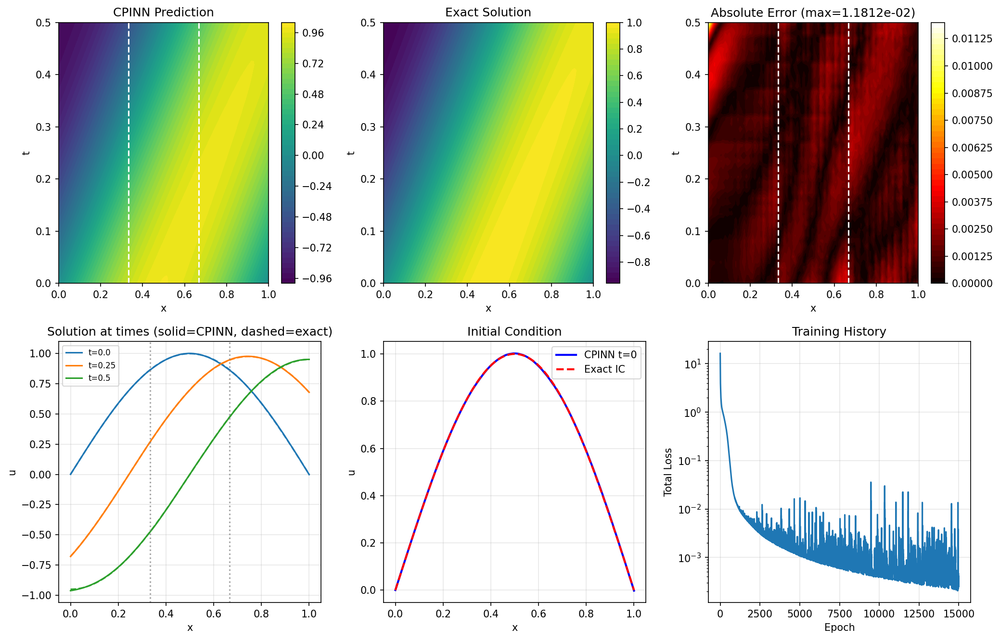
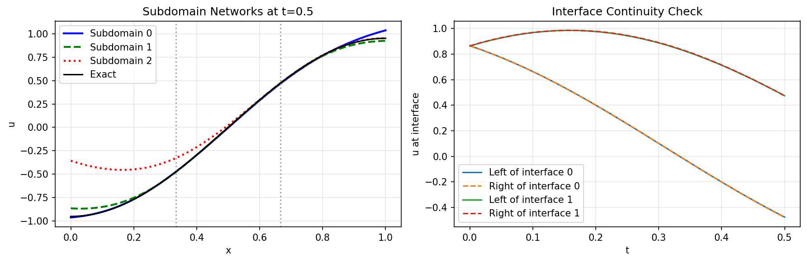

# CPINN: Conservative PINN on Advection-Diffusion Equation

| Metadata          | Value                            |
|-------------------|----------------------------------|
| **Level**         | Intermediate                     |
| **Runtime**       | ~2 min (GPU) / ~12 min (CPU)     |
| **Prerequisites** | JAX, Flax NNX, Conservation Laws |
| **Format**        | Python + Jupyter                 |
| **Memory**        | ~400 MB RAM                      |

## Overview

This example demonstrates solving the 1D advection-diffusion equation using CPINN
(Conservative Physics-Informed Neural Network). CPINNs extend XPINNs with explicit
flux conservation at subdomain interfaces, critical for conservation laws.

Conservation is enforced by matching the normal flux across interfaces:
$F_{left} \cdot n = F_{right} \cdot n$ where $F = \nabla u$.

## What You'll Learn

1. **Understand** flux conservation in domain decomposition
2. **Implement** conservative interface conditions
3. **Configure** CPINN with 3 subdomains
4. **Use** Opifex's CPINN class for conservation laws
5. **Analyze** interface flux jumps for conservation verification

## Coming from Conservation Laws Literature?

| Conservation PINNs (Literature)             | Opifex (JAX)                                        |
|---------------------------------------------|-----------------------------------------------------|
| Flux computation at interfaces              | `compute_flux()` helper function                    |
| Flux conservation residual                  | `model.compute_flux_conservation_loss()`            |
| Multiple subdomain decomposition            | List of `Subdomain` objects                         |
| Interface definitions                       | `Interface(subdomain_ids, points, normal)`          |

**Key differences:**

1. **Built-in flux computation**: Automatic gradient computation via JAX
2. **Configurable weights**: `CPINNConfig` for loss balancing
3. **Multiple interfaces**: Supports arbitrary number of subdomain interfaces

## Files

- **Python Script**: [`examples/domain-decomposition/cpinn_advection_diffusion.py`](https://github.com/avitai/opifex/blob/main/examples/domain-decomposition/cpinn_advection_diffusion.py)
- **Jupyter Notebook**: [`examples/domain-decomposition/cpinn_advection_diffusion.ipynb`](https://github.com/avitai/opifex/blob/main/examples/domain-decomposition/cpinn_advection_diffusion.ipynb)

## Quick Start

### Run the Python Script

```bash
source activate.sh && python examples/domain-decomposition/cpinn_advection_diffusion.py
```

### Run the Jupyter Notebook

```bash
jupyter lab examples/domain-decomposition/cpinn_advection_diffusion.ipynb
```

## Core Concepts

### CPINN Architecture

CPINNs enforce both solution continuity and flux conservation:

- **Continuity**: $u_{left}|_{\Gamma} = u_{right}|_{\Gamma}$
- **Flux conservation**: $F_{left} \cdot n = F_{right} \cdot n$

where $F = \nabla u$ is the flux and $n$ is the interface normal.

| Component | This Example |
|-----------|-------------|
| Domain | $x \in [0, 1]$, $t \in [0, 0.5]$ |
| Subdomains | 3 (at $x = 1/3, 2/3$) |
| Interfaces | 2 vertical lines |
| PDE | Advection-diffusion |
| Advection | $c = 1.0$ |
| Diffusion | $D = 0.01$ |

### Advection-Diffusion Equation

$$\frac{\partial u}{\partial t} + c \frac{\partial u}{\partial x} = D \frac{\partial^2 u}{\partial x^2}$$

With:
- IC: $u(x, 0) = \sin(\pi x)$
- BC: Dirichlet trace of the exact solution at $x=0,1$ (method of manufactured solutions)
- Exact solution: $u = e^{-D\pi^2 t} \sin(\pi(x - ct))$

The advecting reference field is non-zero on the boundaries ($u(0,t) = e^{-D\pi^2 t}\sin(-\pi c t)$),
so the well-posed problem imposes that exact Dirichlet trace rather than homogeneous BCs.

## Implementation

### Step 1: Imports and Configuration

```python
from opifex.neural.pinns.domain_decomposition import (
    CPINN,
    CPINNConfig,
    Interface,
    Subdomain,
)
```

**Terminal Output:**

```text
======================================================================
Opifex Example: CPINN on 1D Advection-Diffusion Equation
======================================================================
JAX backend: gpu
JAX devices: [CudaDevice(id=0)]

Domain: x in [0.0, 1.0], t in [0.0, 0.5]
Advection velocity: c = 1.0
Diffusion coefficient: D = 0.01
Subdomains: 3
Network per subdomain: [2] + [32, 32] + [1]
Training: 15000 epochs @ lr=0.001
```

### Step 2: Create 3 Subdomains with 2 Interfaces

```python
# Three non-overlapping subdomains
x_boundaries = jnp.linspace(0.0, 1.0, 4)  # [0, 1/3, 2/3, 1]

subdomains = []
for i in range(3):
    bounds = jnp.array([
        [x_boundaries[i], x_boundaries[i + 1]],
        [0.0, 0.5],
    ])
    subdomains.append(Subdomain(id=i, bounds=bounds))

# Create interfaces at x = 1/3 and x = 2/3
interfaces = []
for i in range(2):
    x_interface = x_boundaries[i + 1]
    interface_points = jnp.column_stack([
        jnp.full(30, x_interface),
        jnp.linspace(0.0, 0.5, 30),
    ])
    interfaces.append(Interface(
        subdomain_ids=(i, i + 1),
        points=interface_points,
        normal=jnp.array([1.0, 0.0]),
    ))
```

**Terminal Output:**

```text
Creating CPINN model...
Total CPINN parameters: 3555
Parameters per subdomain: ~1185
Number of interfaces: 2
```

### Step 3: Configure CPINN

```python
cpinn_config = CPINNConfig(
    continuity_weight=10.0,    # Solution continuity
    flux_weight=10.0,          # Flux conservation
    conservation_weight=0.1,   # Global conservation
)

model = CPINN(
    input_dim=2, output_dim=1,
    subdomains=subdomains,
    interfaces=interfaces,
    hidden_dims=[32, 32],
    config=cpinn_config,
    rngs=nnx.Rngs(42),
)
```

### Step 4: Training with Flux Conservation

**Terminal Output:**

```text
Training CPINN...
  Epoch     1/15000: loss=1.637436e+01, continuity=6.350811e-02, flux=5.993834e-02
  Epoch  3000/15000: loss=4.612467e-03, continuity=1.844373e-05, flux=1.749452e-04
  Epoch  6000/15000: loss=9.350888e-04, continuity=3.856273e-06, flux=2.063716e-05
  Epoch  9000/15000: loss=4.903653e-04, continuity=2.900715e-06, flux=1.414888e-05
  Epoch 12000/15000: loss=7.380115e-04, continuity=1.571379e-05, flux=6.686303e-05
  Epoch 15000/15000: loss=2.750690e-04, continuity=1.433311e-06, flux=6.760231e-06
Final loss: 2.750690e-04
```

### Step 5: Evaluation

**Terminal Output:**

```text
Evaluating CPINN...
Relative L2 error:   1.975690e-03
Maximum point error: 1.181185e-02
Mean point error:    1.093630e-03
Interface 0 flux jump: 2.526049e-03
Interface 1 flux jump: 1.803844e-03
```

## Visualization





## Results Summary

| Metric              | Value       |
|---------------------|-------------|
| Final Loss          | 2.75e-04    |
| Relative L2 Error   | 0.20%       |
| Maximum Error       | 1.18e-02    |
| Interface 0 Flux Jump| 2.53e-03   |
| Interface 1 Flux Jump| 1.80e-03   |
| Parameters          | 3,555       |
| Training Epochs     | 15,000      |

The 3-subdomain CPINN matches the manufactured exact solution to **0.2% relative L2 error**, with
small interface flux jumps (~2e-3) confirming conservation across the subdomain boundaries. (An
earlier version imposed homogeneous Dirichlet BCs that were inconsistent with the advecting
reference field, which produced a spurious ~50% error; the boundary condition now uses the exact
solution's Dirichlet trace.)

## Next Steps

### Experiments to Try

1. **Higher diffusion**: Try $D = 0.1$ for better convergence
2. **More epochs**: Train for 50000 epochs
3. **Larger networks**: Use `[64, 64, 64]` per subdomain
4. **Fewer subdomains**: Try 2 subdomains for simpler case

### Related Examples

| Example                                   | Level        | What You'll Learn              |
|-------------------------------------------|--------------|--------------------------------|
| [FBPINN on Harmonic Oscillator](fbpinn-poisson.md) | Intermediate | Overlapping subdomains |
| [XPINN on Burgers](xpinn-helmholtz.md)    | Intermediate | Non-overlapping subdomains |
| [Advection PINN](../pinns/advection.md)   | Intermediate | Single-domain advection    |

### API Reference

- `CPINN`: Conservative PINN with flux conservation
- `CPINNConfig`: Configuration (continuity, flux, conservation weights)
- `compute_flux_conservation_loss()`: Flux conservation at interfaces
- `compute_interface_loss()`: Combined interface loss

### Troubleshooting

| Issue | Solution |
|-------|----------|
| High flux jumps | Increase flux_weight significantly |
| Poor accuracy | Use more collocation points |
| Slow convergence | Reduce advection coefficient c |
| Subdomain mismatch | Check subdomain bounds don't overlap |
