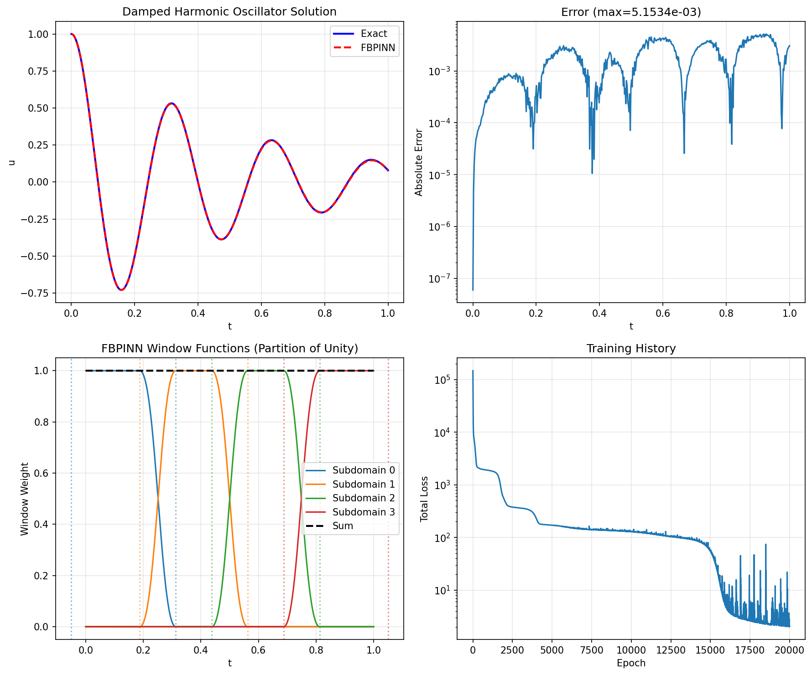

# FBPINN: Finite Basis PINN on Damped Harmonic Oscillator

| Metadata          | Value                            |
|-------------------|----------------------------------|
| **Level**         | Intermediate                     |
| **Runtime**       | ~2 min (GPU) / ~10 min (CPU)     |
| **Prerequisites** | JAX, Flax NNX, ODEs              |
| **Format**        | Python + Jupyter                 |
| **Memory**        | ~300 MB RAM                      |

## Overview

This example demonstrates solving the damped harmonic oscillator ODE using FBPINN
(Finite Basis Physics-Informed Neural Network). FBPINNs decompose the domain into
overlapping subdomains, with each subdomain having its own neural network. Smooth
window functions create a partition of unity that blends the subdomain solutions.

This is the canonical FBPINN benchmark problem from Moseley et al. (2023). The
hard boundary constraint approach ensures the initial conditions are exactly
satisfied.

## What You'll Learn

1. **Understand** the FBPINN architecture with overlapping subdomains
2. **Implement** hard boundary constraints via output transforms
3. **Configure** window functions for partition of unity blending
4. **Subclass** Opifex's FBPINN to add custom constraints
5. **Visualize** window weights and subdomain contributions

## Coming from FBPINNs (PyTorch)?

| FBPINNs (PyTorch)                           | Opifex (JAX)                                        |
|---------------------------------------------|-----------------------------------------------------|
| `problems.HarmonicOscillator1DHardBC`       | Subclass `FBPINN` with hard BC in `__call__`        |
| `constants.SUBDOMAIN_XS`                    | `Subdomain(id=i, bounds=jnp.array([[t_lo, t_hi]]))` |
| `WindowFunctions.COS_WINDOW`                | `FBPINNConfig(window_type="cosine")`                |
| `fbpinn.train()`                            | Custom training loop with `nnx.Optimizer`           |

**Key differences:**

1. **Subclassing**: Hard constraints implemented by subclassing FBPINN
2. **Explicit subdomains**: Define subdomain bounds explicitly
3. **JIT compilation**: Training loop is JIT-compiled for GPU efficiency

## Files

- **Python Script**: [`examples/domain-decomposition/fbpinn_poisson.py`](https://github.com/Opifex/Opifex/blob/main/examples/domain-decomposition/fbpinn_poisson.py)
- **Jupyter Notebook**: [`examples/domain-decomposition/fbpinn_poisson.ipynb`](https://github.com/Opifex/Opifex/blob/main/examples/domain-decomposition/fbpinn_poisson.ipynb)

## Quick Start

### Run the Python Script

```bash
source activate.sh && python examples/domain-decomposition/fbpinn_poisson.py
```

### Run the Jupyter Notebook

```bash
jupyter lab examples/domain-decomposition/fbpinn_poisson.ipynb
```

## Core Concepts

### FBPINN Architecture

FBPINNs use a partition of unity approach:

$$u(x) = \sum_i w_i(x) \cdot u_i(x) / \sum_j w_j(x)$$

where $w_i(x)$ are smooth window functions and $u_i(x)$ are subdomain networks.

| Component | This Example |
|-----------|-------------|
| Domain | $t \in [0, 1]$ |
| Subdomains | 4 overlapping regions |
| Window | Cosine (smooth, compact support) |
| ODE | $u'' + \mu u' + k u = 0$ |
| Hard BC | $u = 1 + \tanh^2(t/\sigma) \cdot u_{network}$ |

### Damped Harmonic Oscillator

The ODE describes a damped oscillator with:
- Damping coefficient: $\mu = 4$
- Spring constant: $k = 400$
- Initial conditions: $u(0) = 1$, $u'(0) = 0$

## Implementation

### Step 1: Imports and Configuration

```python
import jax
import jax.numpy as jnp
import optax
from flax import nnx

from opifex.neural.pinns.domain_decomposition import (
    FBPINN,
    FBPINNConfig,
    Subdomain,
)
```

**Terminal Output:**

```text
======================================================================
Opifex Example: FBPINN on Damped Harmonic Oscillator
======================================================================
JAX backend: gpu
JAX devices: [CudaDevice(id=0)]

Damped harmonic oscillator: u'' + 4.0*u' + 400.0*u = 0
Domain: t in [0.0, 1.0]
Subdomains: 4 (overlapping)
Hard BC: u = 1 + tanh(t/0.1)^2 * u_network
Network per subdomain: [1] + [32, 32] + [1]
Training: 20000 epochs @ lr=0.001
```

### Step 2: Create FBPINN Subclass with Hard Constraint

```python
class HarmonicOscillatorFBPINN(FBPINN):
    """FBPINN subclass with hard boundary constraint."""

    def __init__(self, subdomains, interfaces, hidden_dims, *, sd=0.1, config=None, rngs):
        super().__init__(
            input_dim=1, output_dim=1,
            subdomains=subdomains, interfaces=interfaces,
            hidden_dims=hidden_dims, config=config, rngs=rngs,
        )
        self.sd = sd

    def __call__(self, t):
        """Forward pass with hard BC: u = 1 + tanh(t/sd)^2 * u_network."""
        u_network = super().__call__(t)
        return 1.0 + jnp.tanh(t / self.sd) ** 2 * u_network
```

**Terminal Output:**

```text
Creating FBPINN model...
Total FBPINN parameters: 4612
Parameters per subdomain: ~1153

Subdomain bounds:
  Subdomain 0: [-0.050, 0.312]
  Subdomain 1: [0.188, 0.562]
  Subdomain 2: [0.438, 0.812]
  Subdomain 3: [0.688, 1.050]
```

### Step 3: Training

```python
opt = nnx.Optimizer(model, optax.adam(LEARNING_RATE), wrt=nnx.Param)

@nnx.jit
def train_step(model, opt, t_dom):
    def loss_fn(m):
        return pde_loss(m, t_dom)
    loss, grads = nnx.value_and_grad(loss_fn)(model)
    opt.update(model, grads)
    return loss
```

**Terminal Output:**

```text
Training FBPINN...
  Epoch     1/20000: loss=1.467470e+05
  Epoch  4000/20000: loss=2.309863e+02
  Epoch  8000/20000: loss=1.389566e+02
  Epoch 12000/20000: loss=1.095311e+02
  Epoch 16000/20000: loss=4.759035e+00
  Epoch 20000/20000: loss=2.047876e+00
Final loss: 2.047876e+00
```

### Step 4: Evaluation

**Terminal Output:**

```text
Evaluating FBPINN...
Relative L2 error:   6.687945e-03
Maximum point error: 5.153432e-03
Mean point error:    1.909906e-03
Mean PDE residual:   1.081548e+00
u(0) predicted:      1.000000 (exact: 1.0, hard BC)
```

## Visualization




## Results Summary

| Metric              | Value       |
|---------------------|-------------|
| Final Loss          | 2.05        |
| Relative L2 Error   | 0.67%       |
| Maximum Error       | 5.15e-03    |
| Mean PDE Residual   | 1.08        |
| u(0) (hard BC)      | **1.000000**|
| Parameters          | 4,612       |
| Training Epochs     | 20,000      |
| Window Sum          | 1.0 (exact) |

## Next Steps

### Experiments to Try

1. **More subdomains**: Try 8 or 16 subdomains for finer resolution
2. **Gaussian windows**: Use `window_type="gaussian"` instead of cosine
3. **Higher frequency**: Increase $\omega_0$ for faster oscillations
4. **Different ODEs**: Apply to heat equation or wave equation

### Related Examples

| Example                                   | Level        | What You'll Learn              |
|-------------------------------------------|--------------|--------------------------------|
| [XPINN on Burgers](xpinn-helmholtz.md)    | Intermediate | Non-overlapping subdomains     |
| [CPINN on Advection](cpinn-advection-diffusion.md) | Intermediate | Flux conservation     |
| [Heat Equation PINN](../pinns/heat-equation.md) | Beginner | Single-domain PINN         |

### API Reference

- `FBPINN`: Base FBPINN class with window functions
- `FBPINNConfig`: Configuration (window type, normalization)
- `Subdomain`: Subdomain definition with bounds
- `CosineWindow`, `GaussianWindow`: Window function implementations

### Troubleshooting

| Issue | Solution |
|-------|----------|
| Window sum not 1.0 | Extend subdomain bounds beyond domain boundary |
| High loss | Increase epochs or adjust learning rate |
| Hard BC not exact | Check output transform formula matches IC |
| Slow training | Reduce number of collocation points |
