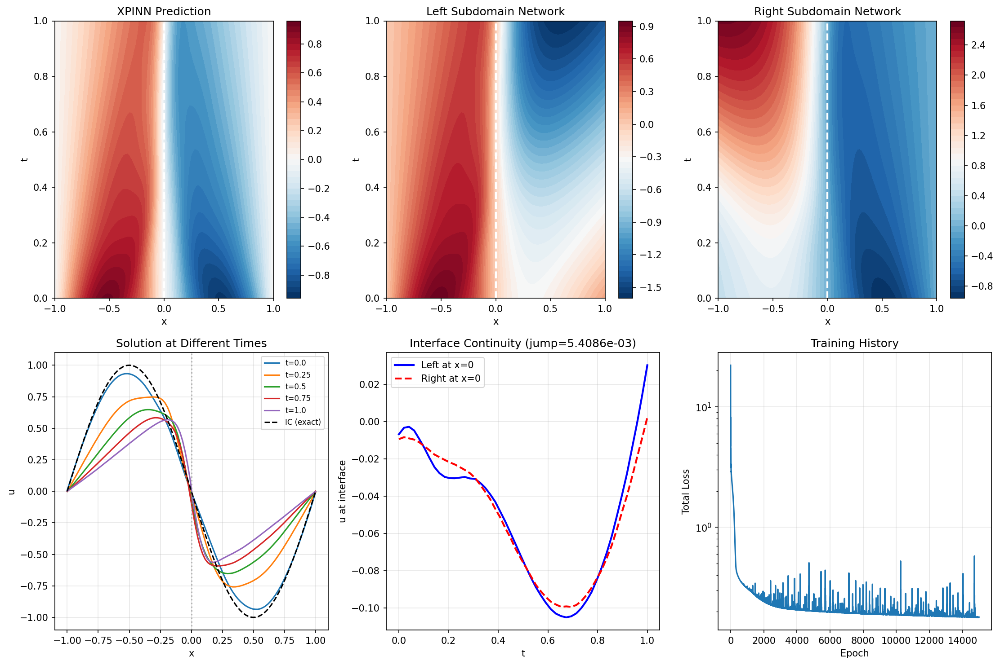
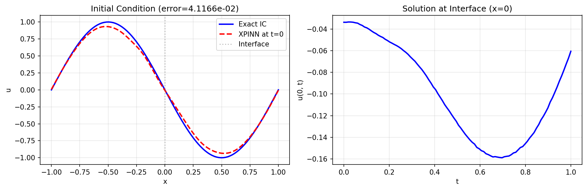

# XPINN: Extended PINN on Viscous Burgers Equation

| Metadata          | Value                            |
|-------------------|----------------------------------|
| **Level**         | Intermediate                     |
| **Runtime**       | ~2 min (GPU) / ~12 min (CPU)     |
| **Prerequisites** | JAX, Flax NNX, PDEs              |
| **Format**        | Python + Jupyter                 |
| **Memory**        | ~400 MB RAM                      |

## Overview

This example demonstrates solving the 1D viscous Burgers equation using XPINN
(Extended Physics-Informed Neural Network). XPINNs use non-overlapping subdomains
with explicit interface conditions for continuity and flux matching.

Unlike FBPINNs which use smooth window blending, XPINNs enforce interface conditions
through additional loss terms. This makes XPINNs suitable for problems where sharp
interfaces or discontinuities need to be captured.

## What You'll Learn

1. **Understand** the XPINN architecture with non-overlapping subdomains
2. **Implement** interface continuity and flux matching conditions
3. **Configure** loss weights for interface enforcement
4. **Use** Opifex's XPINN class for domain decomposition
5. **Visualize** interface discontinuity and solution quality

## Coming from XPINNs Literature?

| XPINNs (Literature)                         | Opifex (JAX)                                        |
|---------------------------------------------|-----------------------------------------------------|
| Separate networks per subdomain             | `XPINN` class with `SubdomainNetwork` list          |
| Interface continuity loss                   | `model.compute_continuity_loss()`                   |
| Flux matching loss                          | `model.compute_flux_loss()`                         |
| Weighted loss combination                   | `XPINNConfig(continuity_weight=..., flux_weight=...)`|

**Key differences:**

1. **Built-in methods**: Interface losses computed via class methods
2. **JIT-compatible**: All interface computations are JAX-compatible
3. **Configurable weights**: Easy weight adjustment via config

## Files

- **Python Script**: [`examples/domain-decomposition/xpinn_helmholtz.py`](https://github.com/Opifex/Opifex/blob/main/examples/domain-decomposition/xpinn_helmholtz.py)
- **Jupyter Notebook**: [`examples/domain-decomposition/xpinn_helmholtz.ipynb`](https://github.com/Opifex/Opifex/blob/main/examples/domain-decomposition/xpinn_helmholtz.ipynb)

## Quick Start

### Run the Python Script

```bash
source activate.sh && python examples/domain-decomposition/xpinn_helmholtz.py
```

### Run the Jupyter Notebook

```bash
jupyter lab examples/domain-decomposition/xpinn_helmholtz.ipynb
```

## Core Concepts

### XPINN Architecture

XPINNs decompose the domain into non-overlapping subdomains:

$$\Omega = \Omega_1 \cup \Omega_2 \cup \ldots \cup \Omega_N$$

At interfaces, we enforce:
- **Continuity**: $u_{left} = u_{right}$
- **Flux matching**: $\frac{\partial u}{\partial n}_{left} = \frac{\partial u}{\partial n}_{right}$

| Component | This Example |
|-----------|-------------|
| Domain | $x \in [-1, 1]$, $t \in [0, 1]$ |
| Subdomains | 2 (split at $x = 0$) |
| Interface | Vertical line at $x = 0$ |
| PDE | Viscous Burgers equation |
| Viscosity | $\nu = 0.01/\pi$ |

### Viscous Burgers Equation

$$\frac{\partial u}{\partial t} + u \frac{\partial u}{\partial x} = \nu \frac{\partial^2 u}{\partial x^2}$$

With:
- IC: $u(x, 0) = -\sin(\pi x)$
- BC: $u(-1, t) = u(1, t) = 0$

## Implementation

### Step 1: Imports and Configuration

```python
from opifex.neural.pinns.domain_decomposition import (
    Interface,
    Subdomain,
    XPINN,
    XPINNConfig,
)
```

**Terminal Output:**

```text
======================================================================
Opifex Example: XPINN on 1D Viscous Burgers Equation
======================================================================
JAX backend: gpu
JAX devices: [CudaDevice(id=0)]

Viscous Burgers: du/dt + u*du/dx = nu*d^2u/dx^2
  Viscosity: nu = 0.01/pi ~ 0.003183
Domain: x in [-1.0, 1.0], t in [0.0, 1.0]
Subdomains: 2
Network per subdomain: [2] + [40, 40, 40] + [1]
Training: 15000 epochs @ lr=0.001
```

### Step 2: Define Subdomains and Interfaces

```python
# Non-overlapping subdomains
subdomains = [
    Subdomain(id=0, bounds=jnp.array([[-1.0, 0.0], [0.0, 1.0]])),  # Left
    Subdomain(id=1, bounds=jnp.array([[0.0, 1.0], [0.0, 1.0]])),   # Right
]

# Interface at x = 0
interface_points = jnp.column_stack([
    jnp.zeros(N_INTERFACE),
    jnp.linspace(0.0, 1.0, N_INTERFACE),
])

interfaces = [
    Interface(
        subdomain_ids=(0, 1),
        points=interface_points,
        normal=jnp.array([1.0, 0.0]),
    )
]
```

**Terminal Output:**

```text
Creating XPINN model...
Total XPINN parameters: 6882
Parameters per subdomain: ~3441
```

### Step 3: Configure XPINN

```python
xpinn_config = XPINNConfig(
    continuity_weight=10.0,  # u_left = u_right
    flux_weight=10.0,        # du/dx_left = du/dx_right
    residual_weight=1.0,     # PDE residual
)

model = XPINN(
    input_dim=2, output_dim=1,
    subdomains=subdomains,
    interfaces=interfaces,
    hidden_dims=[40, 40, 40],
    config=xpinn_config,
    rngs=nnx.Rngs(42),
)
```

### Step 4: Training with Interface Conditions

**Terminal Output:**

```text
Training XPINN...
  Epoch     1/15000: loss=2.217746e+01, continuity=1.131944e-02, flux=5.758483e-01
  Epoch  3000/15000: loss=2.154962e-01, continuity=8.435045e-05, flux=5.011343e-04
  Epoch  6000/15000: loss=2.030331e-01, continuity=1.473404e-04, flux=7.426925e-04
  Epoch  9000/15000: loss=1.890347e-01, continuity=7.456433e-05, flux=2.159171e-05
  Epoch 12000/15000: loss=1.837308e-01, continuity=8.042133e-05, flux=4.365924e-05
  Epoch 15000/15000: loss=1.795815e-01, continuity=5.910662e-05, flux=1.106780e-04
Final loss: 1.795815e-01
```

### Step 5: Evaluation

**Terminal Output:**

```text
Evaluating XPINN...
IC error (mean abs):     4.116559e-02
BC error (mean abs):     1.945176e-03
Interface jump:          5.408616e-03
```

## Visualization





## Results Summary

| Metric              | Value       |
|---------------------|-------------|
| Final Loss          | 0.18        |
| IC Error            | 4.12e-02    |
| BC Error            | 1.95e-03    |
| Interface Jump      | 5.41e-03    |
| Continuity Loss     | 5.91e-05    |
| Flux Loss           | 1.11e-04    |
| Parameters          | 6,882       |
| Training Epochs     | 15,000      |

## Next Steps

### Experiments to Try

1. **More subdomains**: Split into 4 or 8 subdomains
2. **Higher viscosity**: Try $\nu = 0.1$ for smoother solutions
3. **Longer time**: Extend to $t \in [0, 2]$ to see shock formation
4. **Residual averaging**: Enable `average_residual_weight` for interface

### Related Examples

| Example                                   | Level        | What You'll Learn              |
|-------------------------------------------|--------------|--------------------------------|
| [FBPINN on Harmonic Oscillator](fbpinn-poisson.md) | Intermediate | Overlapping subdomains |
| [CPINN on Advection](cpinn-advection-diffusion.md) | Intermediate | Flux conservation      |
| [Burgers PINN](../pinns/burgers.md)       | Intermediate | Single-domain PINN     |

### API Reference

- `XPINN`: XPINN class with interface conditions
- `XPINNConfig`: Configuration (weights for losses)
- `Interface`: Interface definition with points and normal
- `compute_continuity_loss()`: Solution continuity at interfaces
- `compute_flux_loss()`: Gradient continuity at interfaces

### Troubleshooting

| Issue | Solution |
|-------|----------|
| Large interface jump | Increase continuity_weight |
| Flux discontinuity | Increase flux_weight |
| Solution mismatch at t=0 | Check IC loss weighting |
| Slow convergence | Adjust interface loss weights |
