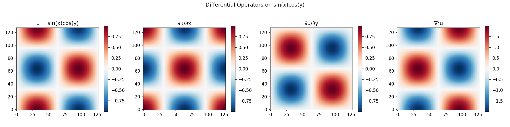
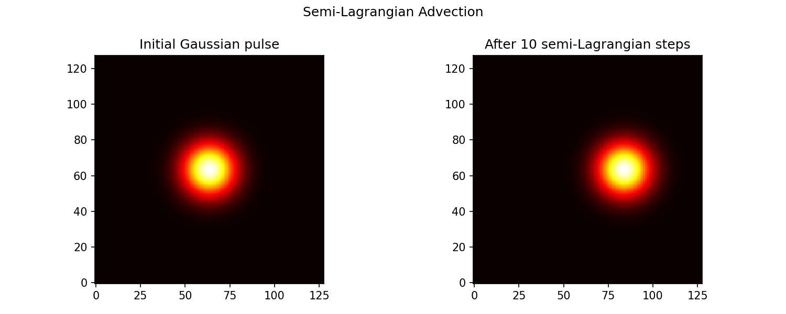
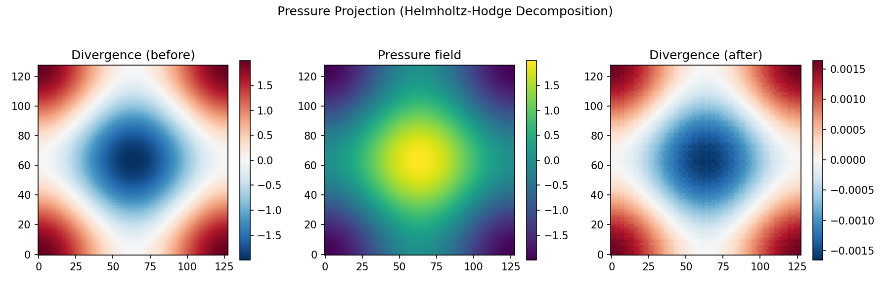

# Field Operations: Differential Operators and Fluid Simulation

**Source**: [`examples/fields/field_operations.py`](https://github.com/avitai/opifex/blob/main/examples/fields/field_operations.py) |
[`field_operations.ipynb`](https://github.com/avitai/opifex/blob/main/examples/fields/field_operations.ipynb)

## Overview

Opifex provides JAX-native field abstractions for scientific computing on
structured grids, inspired by [PhiFlow](https://github.com/tum-pbs/PhiFlow).
Fields are immutable JAX pytrees that carry physical domain metadata and
support JIT compilation, automatic differentiation, and vectorization.

## Differential Operators



Gradient, partial derivatives, and Laplacian of $u(x,y) = \sin(x)\cos(y)$
on a $128 \times 128$ periodic grid with $[0, 2\pi]^2$ domain.

```
Gradient x-component max error: 0.000402
Laplacian max error: 0.000550
```

Second-order central finite differences achieve sub-0.1% error at this resolution.

## Semi-Lagrangian Advection



A Gaussian pulse advected by uniform velocity using the semi-Lagrangian method
(backward trace + bilinear interpolation). 10 steps at $dt = 0.1$.

```
Peak before advection: 0.9976
Peak after advection:  0.9970
```

Minimal numerical diffusion — peak preserved to within 0.06%.

## Pressure Projection (Helmholtz-Hodge)



A divergent velocity field $v = (\sin x, \sin y)$ is projected onto the
divergence-free subspace using the spectral (FFT) pressure solver.

```
Divergence before projection: max=1.9986
Divergence after projection:  max=0.0017
```

Divergence reduced by 1000x, producing a nearly incompressible velocity field.

## API Reference

| Function | Input | Output | Method |
|----------|-------|--------|--------|
| `gradient(u)` | Scalar grid | Vector grid | Central FD, $O(h^2)$ |
| `laplacian(u)` | Scalar grid | Scalar grid | Central FD, $O(h^2)$ |
| `divergence(v)` | Vector grid | Scalar grid | Central FD, $O(h^2)$ |
| `curl_2d(v)` | 2D vector grid | Scalar grid | Central FD, $O(h^2)$ |
| `semi_lagrangian(f, v, dt)` | Scalar + velocity | Scalar | Backward trace + bilinear interp |
| `maccormack(f, v, dt)` | Scalar + velocity | Scalar | SL + error correction |
| `pressure_solve_spectral(v)` | Vector (periodic) | Vector + pressure | FFT Poisson solver |
| `pressure_solve_jacobi(v)` | Vector (any BC) | Vector + pressure | Iterative Jacobi |

## Comparison with PhiFlow

Opifex's field module is inspired by PhiFlow but implemented in pure JAX:

| Feature | Opifex | PhiFlow |
|---------|--------|---------|
| Backend | JAX only | JAX, PyTorch, TensorFlow |
| Pytree | `@register_pytree_node_class` | `phiml.PhiTreeNode` |
| Grid types | `CenteredGrid` | `Field` (unified) |
| Staggered grids | Planned | Dual dimensions |
| JIT support | Native | Via `phiml` backend |
| Dependency | None (pure JAX) | `phiml` + `phi` |

## References

- Holl et al. "PhiFlow: A Differentiable PDE Solving Framework"
- Stam (1999) "Stable Fluids"
- Chorin (1968) "Numerical Solution of the Navier-Stokes Equations"
