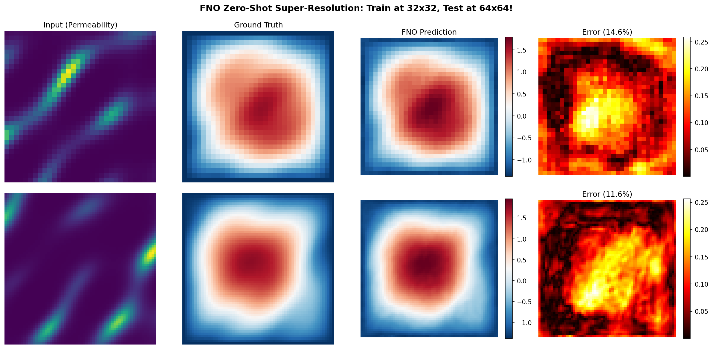

# Your First Neural Operator

| Metadata          | Value                     |
|-------------------|---------------------------|
| **Level**         | Beginner                  |
| **Runtime**       | ~20s (GPU) / ~2 min (CPU) |
| **Prerequisites** | JAX, Flax NNX             |
| **Format**        | Python + Jupyter          |
| **Memory**        | ~1 GB RAM                 |

## Overview

Train a Fourier Neural Operator (FNO) on Darcy flow using Opifex APIs.
This example demonstrates:

- **create_darcy_loader**: datarax-backed PDE data generation
- **FourierNeuralOperator**: Spectral convolution for operator learning
- **GridEmbedding2D**: Positional encoding for resolution invariance
- **Trainer.fit()**: Streamlined training workflow

**Key Capability**: Train at 32x32 resolution, then test at 64x64 zero-shot!

## What You'll Learn

1. **Load** Darcy flow data with `create_darcy_loader()`
2. **Create** an FNO model with `FourierNeuralOperator` and `GridEmbedding2D`
3. **Train** with `Trainer.fit()` for 200 epochs
4. **Evaluate** zero-shot super-resolution capabilities

## Files

- **Python Script**: [`examples/getting-started/first_neural_operator.py`](https://github.com/avitai/opifex/blob/main/examples/getting-started/first_neural_operator.py)
- **Jupyter Notebook**: [`examples/getting-started/first_neural_operator.ipynb`](https://github.com/avitai/opifex/blob/main/examples/getting-started/first_neural_operator.ipynb)

## Quick Start

### Run the Python Script

```bash
source activate.sh && python examples/getting-started/first_neural_operator.py
```

### Run the Jupyter Notebook

```bash
jupyter lab examples/getting-started/first_neural_operator.ipynb
```

## Implementation

### Step 1: Load Data

Generate Darcy flow data at multiple resolutions for training and testing.
Each call to `create_darcy_loader()` builds a datarax pipeline at its own
resolution and returns a frozen `PDELoaders` with `.train` and `.val` splits.
A small `_drain()` helper iterates both splits and concatenates them into a
single contiguous block of channels-first `(N, 1, H, W)` arrays.

```python
import numpy as np

from opifex.data.loaders import create_darcy_loader


# Each split is a separate datarax generation at its own resolution. The
# train/val pipelines are both drained for a single contiguous block of
# channels-first ``(N, 1, H, W)`` samples.
def _drain(loaders) -> tuple[np.ndarray, np.ndarray]:
    inputs, outputs = [], []
    for pipeline in (loaders.train, loaders.val):
        for batch in pipeline:
            inputs.append(np.asarray(batch["input"]))
            outputs.append(np.asarray(batch["output"]))
    return np.concatenate(inputs, axis=0), np.concatenate(outputs, axis=0)


# Training data at low resolution.
X_train, Y_train = _drain(
    create_darcy_loader(
        n_samples=1000, batch_size=32, resolution=32, seed=42
    )
)

# Test data at the SAME resolution.
X_test_32, Y_test_32 = _drain(
    create_darcy_loader(
        n_samples=100, batch_size=100, resolution=32, seed=42 + 1000
    )
)

# Test data at a HIGHER resolution - for zero-shot super-resolution!
X_test_64, Y_test_64 = _drain(
    create_darcy_loader(
        n_samples=100, batch_size=100, resolution=64, seed=42 + 2000
    )
)
```

**Terminal Output:**

```text
======================================================================
Your First Neural Operator: Zero-Shot Super-Resolution
======================================================================
JAX backend: gpu

Training resolution: 32x32
Test resolutions: 32x32, 64x64 (zero-shot)

Loading Darcy flow data...
  Training data (32x32): X=(1024, 1, 32, 32), Y=(1024, 1, 32, 32)
  Test data (32x32): X=(200, 1, 32, 32), Y=(200, 1, 32, 32)
  Test data (64x64): X=(200, 1, 64, 64), Y=(200, 1, 64, 64) <- UNSEEN resolution!
  Normalization: Y_mean=0.2145, Y_std=0.1557
```

### Step 2: Create FNO with Grid Embedding

```python
from flax import nnx
from opifex.neural.operators.fno.base import FourierNeuralOperator
from opifex.neural.operators.common.embeddings import GridEmbedding2D

class FNOWithEmbedding(nnx.Module):
    def __init__(self, in_channels, out_channels, modes, hidden_channels,
                 num_layers, grid_boundaries, rngs):
        self.grid_embedding = GridEmbedding2D(
            in_channels=in_channels, grid_boundaries=grid_boundaries,
        )
        self.fno = FourierNeuralOperator(
            in_channels=self.grid_embedding.out_channels,
            out_channels=out_channels, hidden_channels=hidden_channels,
            modes=modes, num_layers=num_layers, rngs=rngs,
        )

    def __call__(self, x):
        x_hwc = jnp.moveaxis(x, 1, -1)  # BCHW -> BHWC for embedding
        x_embedded = self.grid_embedding(x_hwc)
        x_chw = jnp.moveaxis(x_embedded, -1, 1)  # BHWC -> BCHW for FNO
        return self.fno(x_chw)

model = FNOWithEmbedding(
    in_channels=1, out_channels=1, modes=12, hidden_channels=32,
    num_layers=4, grid_boundaries=[[0.0, 1.0], [0.0, 1.0]], rngs=nnx.Rngs(42),
)
```

**Terminal Output:**

```text
Creating FNO model with grid embedding...
  Architecture: FNO + GridEmbedding2D
  Input channels: 1 (+ 2 grid coords = 3 after embedding)
  Fourier modes: 12x12
  Hidden channels: 32
  Spectral layers: 4
  Parameters: 2,368,001
```

### Step 3: Train

```python
from opifex.core.training import Trainer, TrainingConfig

trainer = Trainer(
    model=model,
    config=TrainingConfig(num_epochs=200, learning_rate=1e-2, batch_size=32),
    rngs=nnx.Rngs(42),
)

trained_model, metrics = trainer.fit(
    train_data=(jnp.array(X_train), jnp.array(Y_train)),
    val_data=(jnp.array(X_test_32), jnp.array(Y_test_32)),
)
```

**Terminal Output:**

```text
Training on 32x32 resolution...
--------------------------------------------------
--------------------------------------------------
Training completed in 19.3s
```

### Step 4: Zero-Shot Super-Resolution Test

```python
# Test at training resolution
predictions_32 = trained_model(X_test_32)
rel_l2_32 = compute_relative_l2(predictions_32, Y_test_32)

# Test at UNSEEN higher resolution - zero-shot!
predictions_64 = trained_model(X_test_64)
rel_l2_64 = compute_relative_l2(predictions_64, Y_test_64)
```

**Terminal Output:**

```text
======================================================================
ZERO-SHOT SUPER-RESOLUTION TEST
======================================================================
  Test at 32x32 (training resolution): 14.57% relative L2
  Test at 64x64 (ZERO-SHOT, 2x): 11.62% relative L2

NOTE: The 64x64 test uses different samples, so high error is expected.
True zero-shot super-resolution requires testing the same physics at
different discretizations. See fno-darcy.md for advanced examples.
======================================================================
```

### Visualization

Compare predictions at both resolutions:



The visualization shows:

- **Row 1 (32x32)**: Training resolution with 14.6% error - model captures the pressure field
- **Row 2 (64x64)**: Zero-shot test at 2x resolution on different samples (~12% error)

The FNO Prediction column uses the same color scale as Ground Truth for fair comparison.

## Results Summary

| Metric                | Value      |
|-----------------------|------------|
| Parameters            | 2,368,001  |
| Training Time         | 19.3s      |
| Epochs                | 200        |
| Test Error (32x32)    | 14.57%     |
| Test Error (64x64)    | 11.62%     |

**Note**: The 64x64 test uses different physics samples than training. For true
zero-shot super-resolution (same sample at different resolutions), see the
advanced FNO examples.

## Next Steps

### Experiments to Try

1. **More epochs**: Train for 50-100 epochs for better accuracy
2. **Larger model**: Increase `hidden_channels=64` or `modes=16`
3. **H1 loss**: Add gradient loss for sharper predictions (see advanced examples)

### Related Examples

| Example                                               | Level        | What You'll Learn                     |
|-------------------------------------------------------|--------------|---------------------------------------|
| [FNO on Darcy Flow](../neural-operators/fno-darcy.md) | Intermediate | Full FNO pipeline with H1 loss        |
| [UNO on Darcy Flow](../neural-operators/uno-darcy.md) | Intermediate | Multi-scale UNO with super-resolution |
| [Your First PINN](first-pinn.md)                      | Beginner     | Solve PDEs without any training data  |

### API Reference

- [`FourierNeuralOperator`](../../api/neural.md) - FNO model class
- [`GridEmbedding2D`](../../api/neural.md) - Positional encoding layer
- [`create_darcy_loader`](../../api/data.md) - Darcy flow data loader
- [`Trainer`](../../api/training.md) - Training orchestration

## Troubleshooting

### Shape mismatch error

**Symptom**: Error like `Incompatible shapes: got (16, 1, 32, 32) and (16, 32, 32, 1)`.

**Cause**: Opifex uses channel-first format `(batch, channels, height, width)`.

**Solution**: Ensure your data is in channel-first format:

```python
# If your data is (batch, height, width, channels)
X = X.transpose(0, 3, 1, 2)  # Convert to (batch, channels, height, width)
```

### Training loss not decreasing

**Symptom**: Loss stays constant or increases during training.

**Cause**: Learning rate may be too high or too low.

**Solution**: Try different learning rates:

```python
config = TrainingConfig(
    num_epochs=200,
    learning_rate=1e-3,  # Try 1e-3 or 1e-2
    batch_size=32,
)
```

### Out of memory (OOM)

**Symptom**: `RESOURCE_EXHAUSTED` error.

**Solution**: Reduce batch size or model width:

```python
# Smaller batch
config = TrainingConfig(batch_size=16, ...)

# Or smaller model
model = FourierNeuralOperator(hidden_channels=16, modes=8, ...)
```
