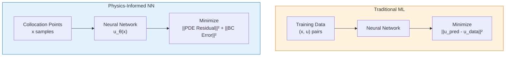
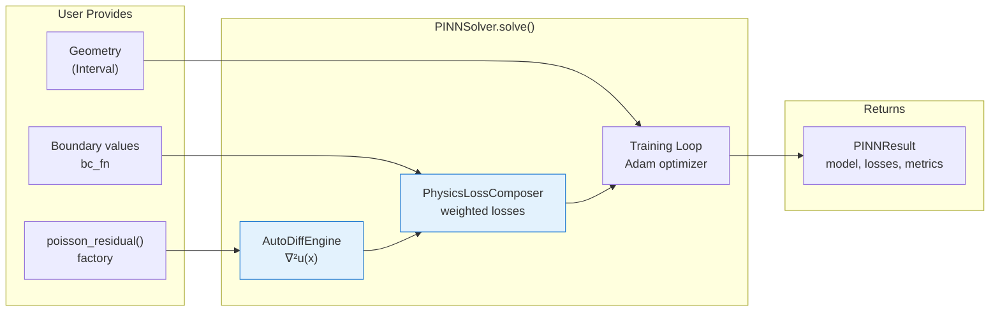
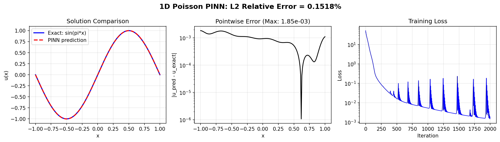

# Your First PINN: Solving the Poisson Equation

| Metadata          | Value                              |
|-------------------|------------------------------------|
| **Level**         | Beginner                           |
| **Runtime**       | ~30 seconds (GPU) / ~1 min (CPU)   |
| **Prerequisites** | Basic Python, calculus             |
| **Format**        | Python + Jupyter                   |
| **Memory**        | ~500 MB RAM                        |

## Overview

This tutorial demonstrates Physics-Informed Neural Networks (PINNs) using
Opifex's high-level APIs. You'll learn to solve PDEs WITHOUT any training data,
using only the governing equation and Opifex's built-in solver infrastructure.

**Opifex APIs demonstrated:**

- **Interval**: 1D geometry class for computational domains
- **create_poisson_pinn**: Factory function for creating Poisson PINN models
- **PINNSolver**: High-level solver with generic `solve()` method
- **poisson_residual**: Factory function to create PDE residual (explicit, not hidden)
- **PINNConfig**: Configuration composing with PhysicsLossConfig for loss weights

**Problem**: Find u(x) satisfying:

- PDE: -u''(x) = π² sin(πx) on [-1, 1]
- Boundary Conditions: u(-1) = u(1) = 0
- Exact Solution: u(x) = sin(πx)

We'll achieve **<0.2% L2 relative error** in just 2000 iterations (~30 seconds).

## What You'll Learn

1. **Understand** the PINN paradigm: embedding physics into the loss function
2. **Use** `Interval` geometry for 1D domains
3. **Use** `create_poisson_pinn` factory for creating PINN architectures
4. **Use** `poisson_residual` factory to create PDE residual functions
5. **Configure** training with `PINNConfig` (iterations, learning rate, loss weights)
6. **Solve** using `PINNSolver.solve()` with explicit residual functions
7. **Evaluate** against the known analytical solution

## Coming from DeepXDE?

If you're familiar with DeepXDE, here's how Opifex compares:

| DeepXDE                                  | Opifex (JAX)                                             |
|------------------------------------------|----------------------------------------------------------|
| `dde.geometry.Interval(-1, 1)`           | `Interval(-1.0, 1.0)`                                    |
| `dde.nn.FNN([1, 50, 50, 50, 1], "tanh")` | `create_poisson_pinn(spatial_dim=1, hidden_dims=[50,50,50])` |
| Manual loss weight tuning                | `PINNConfig(loss_config=PhysicsLossConfig(...))`         |
| `model.train(iterations=2000)`           | `PINNSolver(pinn).solve(geometry, residual_fn, bc_fn)`   |
| `model.compile("adam", lr=1e-3)`         | `PINNConfig(learning_rate=1e-3)`                         |
| String-based PDE selection               | `poisson_residual(source_fn)` — explicit factory         |

**Key differences:**

1. **Factory Functions for PDEs**: `poisson_residual()`, `heat_residual()`, etc. — explicit, type-safe, infinitely extensible
2. **Composition Pattern**: `PINNConfig` composes with `PhysicsLossConfig` for loss weights
3. **Generic Solve API**: `solve(geometry, residual_fn, bc_fn)` — same method for any PDE
4. **XLA JIT compilation**: 2-3x faster training via automatic compilation

## Files

- **Python Script**: [`examples/getting-started/first_pinn.py`](https://github.com/Opifex/Opifex/blob/main/examples/getting-started/first_pinn.py)
- **Jupyter Notebook**: [`examples/getting-started/first_pinn.ipynb`](https://github.com/Opifex/Opifex/blob/main/examples/getting-started/first_pinn.ipynb)

## Quick Start

### Run the Python Script

```bash
source activate.sh && python examples/getting-started/first_pinn.py
```

### Run the Jupyter Notebook

```bash
jupyter lab examples/getting-started/first_pinn.ipynb
```

## Core Concepts

### The PINN Paradigm

Traditional neural networks learn from data: given (input, output) pairs,
minimize prediction error. PINNs take a fundamentally different approach:
they learn from physics.



### The Poisson Equation

The 1D Poisson equation is:

$$-\frac{d^2 u}{dx^2} = f(x)$$

With source term f(x) = π² sin(πx) and boundary conditions u(-1) = u(1) = 0,
the exact solution is u(x) = sin(πx).

This is the perfect first PINN example because:

1. **Known exact solution** — we can measure error precisely
2. **Simple 1D domain** — easy to visualize
3. **Linear PDE** — stable training dynamics

### Opifex PINN Architecture

Opifex provides a high-level API that handles all the complexity:



## Implementation

### Step 1: Imports

```python
from pathlib import Path

import jax
import jax.numpy as jnp
import matplotlib as mpl
from flax import nnx

from opifex.geometry import Interval
from opifex.neural.pinns import create_poisson_pinn
from opifex.solvers import PINNConfig, PINNSolver, poisson_residual
```

**Terminal Output:**

```text
============================================================
Your First PINN: 1D Poisson Equation (Opifex APIs)
============================================================
JAX backend: gpu
```

### Step 2: Define the Problem

```python
def exact_solution(x):
    """Analytical solution: u(x) = sin(pi*x)."""
    return jnp.sin(jnp.pi * x)

def source_term(x):
    """Source term: f(x) = pi^2 * sin(pi*x)."""
    return jnp.pi**2 * jnp.sin(jnp.pi * x)

def boundary_condition(x):
    """Boundary condition: u = 0 at boundaries."""
    return jnp.zeros_like(x[..., 0])
```

### Step 3: Define the Geometry

Use Opifex's `Interval` class for 1D domains:

```python
geometry = Interval(-1.0, 1.0)
```

**Terminal Output:**

```text
Defining geometry using Interval...
  Domain: [-1.0, 1.0]
  Length: 2.0
```

### Step 4: Create the PINN Model

Use `create_poisson_pinn` factory to create an appropriate architecture:

```python
pinn = create_poisson_pinn(
    spatial_dim=1,
    hidden_dims=[50, 50, 50],
    rngs=nnx.Rngs(42),
)
```

**Terminal Output:**

```text
Creating PINN model using create_poisson_pinn()...
  Architecture: 1 -> 50 -> 50 -> 50 -> 1
  Parameters: 5,251
  Activation: tanh
```

### Step 5: Create PDE Residual

Use `poisson_residual()` factory to create the residual function:

```python
residual_fn = poisson_residual(source_term)
```

**Terminal Output:**

```text
Creating PDE residual using poisson_residual() factory...
  PDE: -∇²u = π² sin(πx)
  Residual: -∇²u - f(x) = 0
```

### Step 6: Configure and Solve

Configure training with `PINNConfig` and solve with `PINNSolver`:

```python
config = PINNConfig(
    n_interior=100,          # Interior collocation points
    n_boundary=2,            # Boundary points (just endpoints for 1D)
    num_iterations=2000,     # Training iterations
    learning_rate=1e-3,      # Adam learning rate
    print_every=500,         # Print loss every N iterations
    seed=42,
)

solver = PINNSolver(pinn)
result = solver.solve(
    geometry=geometry,
    residual_fn=residual_fn,
    bc_fn=boundary_condition,
    config=config,
)
```

**Terminal Output:**

```text
Configuring solver with PINNConfig...
  Interior points: 100
  Boundary points: 2
  Iterations: 2000
  Learning rate: 0.001
  Physics loss weight: 1.0
  Boundary loss weight: 100.0

Solving with PINNSolver.solve()...
--------------------------------------------------
  Iteration    0: loss = 5.257140e+01
  Iteration  500: loss = 1.608088e-02
  Iteration 1000: loss = 5.250988e-03
  Iteration 1500: loss = 1.302604e-02
  Iteration 1999: loss = 1.767788e-03
--------------------------------------------------
Training completed in 2.3s
Final loss: 1.767788e-03
```

### Step 7: Evaluation

```python
# Dense evaluation grid
x_eval = jnp.linspace(-1, 1, 200).reshape(-1, 1)
u_pred = result.model(x_eval).squeeze()
u_exact = exact_solution(x_eval.squeeze())

# Compute errors
l2_error = jnp.sqrt(jnp.mean((u_pred - u_exact) ** 2))
l2_relative = l2_error / jnp.sqrt(jnp.mean(u_exact**2))
max_error = jnp.max(jnp.abs(u_pred - u_exact))
```

**Terminal Output:**

```text
Evaluating solution...

============================================================
RESULTS
============================================================
  L2 Absolute Error:  0.001071
  L2 Relative Error:  0.1518%
  Maximum Error:      0.001853
============================================================

Saved: docs/assets/examples/first_pinn/solution.png

PINN example completed successfully!
Achieved 0.1518% L2 relative error with 5,251 parameters

Opifex APIs demonstrated:
  - Interval (1D geometry)
  - create_poisson_pinn (PINN factory)
  - poisson_residual (PDE residual factory)
  - PINNSolver.solve (generic solver)
  - PINNConfig (solver configuration)
```

## Visualization

The PINN learns the exact sine solution with excellent accuracy:



The plot shows:

- **Left**: PINN prediction overlaid on exact solution (nearly identical)
- **Center**: Pointwise absolute error on log scale (max ~1.9e-3)
- **Right**: Training loss convergence over 2000 iterations

## Results Summary

| Metric              | Value         |
|---------------------|---------------|
| L2 Absolute Error   | 0.001071      |
| L2 Relative Error   | 0.1518%       |
| Maximum Error       | 0.001853      |
| Final Loss          | 1.77e-03      |
| Parameters          | 5,251         |
| Training Iterations | 2,000         |
| Runtime             | ~2-3 sec (GPU) |

## Next Steps

### Experiments to Try

1. **Increase iterations**: Train for 5000+ iterations for even lower error
2. **Vary architecture**: Try `hidden_dims=[100, 100]` or `[32, 32, 32, 32]`
3. **Adjust loss weights**: Customize `PINNConfig.loss_config` for different BC enforcement
4. **Custom residuals**: Define your own residual function for any PDE

### Related Examples

| Example                                           | Level        | What You'll Learn             |
|---------------------------------------------------|--------------|-------------------------------|
| [Poisson 2D](../pinns/poisson.md)                 | Intermediate | Same problem in 2D            |
| [Burgers Equation](../pinns/burgers.md)           | Intermediate | Nonlinear PDE with shocks     |
| [Heat Equation](../pinns/heat-equation.md)        | Intermediate | Time-dependent parabolic PDE  |
| [First Neural Operator](first-neural-operator.md) | Beginner     | Data-driven operator learning |

### API Reference

- [`Interval`](../../../api/geometry.md) — 1D geometry class
- [`create_poisson_pinn`](../../../api/neural.md) — PINN factory function
- [`PINNSolver`](../../../api/physics.md) — High-level PINN solver
- [`PINNConfig`](../../../api/physics.md) — Solver configuration
- [`poisson_residual`](../../../api/physics.md) — Poisson residual factory

### Troubleshooting

#### Loss doesn't decrease

**Symptom**: Loss stays near initial value after many iterations.

**Cause**: Learning rate too low or network too small.

**Solution**: Increase learning rate or add more hidden units:

```python
config = PINNConfig(
    learning_rate=1e-2,  # Higher learning rate
    num_iterations=2000,
)

# Or use larger network
pinn = create_poisson_pinn(
    spatial_dim=1,
    hidden_dims=[100, 100, 100],  # Larger
    rngs=nnx.Rngs(42),
)
```

#### Boundary conditions not satisfied

**Symptom**: Large error at x = -1 and x = 1.

**Cause**: BC loss weight too low relative to PDE loss.

**Solution**: Customize the loss_config in `PINNConfig`:

```python
from opifex.core.physics.losses import PhysicsLossConfig

config = PINNConfig(
    loss_config=PhysicsLossConfig(
        physics_loss_weight=1.0,
        boundary_loss_weight=1000.0,  # Was 100.0
    ),
)
```

#### NaN in loss

**Symptom**: Loss becomes `nan` after a few iterations.

**Cause**: Learning rate too high or numerical instability.

**Solution**: Reduce learning rate:

```python
config = PINNConfig(
    learning_rate=1e-4,  # Reduced from 1e-3
)
```
