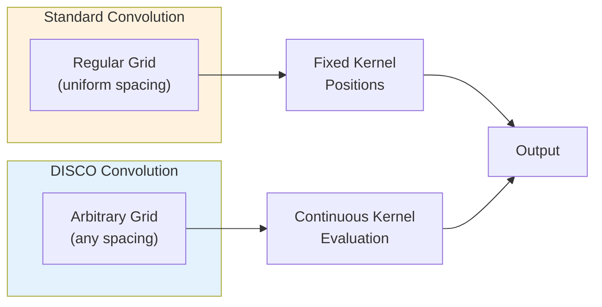
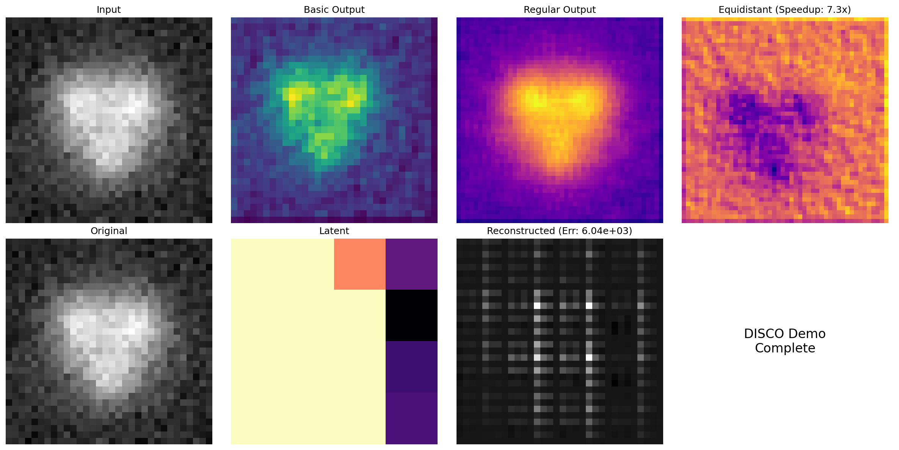

# DISCO Convolutions for Neural Operators

| Metadata | Value |
|----------|-------|
| **Level** | Intermediate |
| **Runtime** | ~5 min (CPU) |
| **Prerequisites** | JAX, Flax NNX, Convolution basics |
| **Format** | Python + Jupyter |

## Overview

Discrete-Continuous (DISCO) convolutions generalize standard convolutions to work on
both structured and unstructured grids. Unlike standard convolutions that require regular
grid spacing, DISCO convolutions can operate on arbitrary point distributions, making them
ideal for scientific applications with irregular meshes.

This example reproduces and extends the classic 'Einstein' demo from the NeuralOperator
library, demonstrating basic DISCO convolution, equidistant optimization for regular grids,
and encoder-decoder architectures built with DISCO layers.

## What You'll Learn

1. **Apply** `DiscreteContinuousConv2d` for general convolution on arbitrary grids
2. **Use** `EquidistantDiscreteContinuousConv2d` for optimized regular grid processing
3. **Build** encoder-decoder architectures with `create_disco_encoder` and `create_disco_decoder`
4. **Compare** performance between regular and equidistant DISCO variants

## Coming from NeuralOperator (PyTorch)?

| NeuralOperator (PyTorch) | Opifex (JAX) |
|--------------------------|--------------|
| `DiscreteContinuousConv2d(in_ch, out_ch, kernel)` | `DiscreteContinuousConv2d(in_channels=, out_channels=, kernel_size=, rngs=)` |
| N/A (no equidistant variant) | `EquidistantDiscreteContinuousConv2d(grid_spacing=)` |
| Manual encoder/decoder construction | `create_disco_encoder()` / `create_disco_decoder()` |

**Key difference**: Opifex adds an optimized equidistant variant and factory functions
for building encoder-decoder architectures. Explicit `rngs` parameter ensures reproducibility.

## Files

- **Python Script**: [`examples/layers/disco_convolutions_example.py`](https://github.com/Opifex/Opifex/blob/main/examples/layers/disco_convolutions_example.py)
- **Jupyter Notebook**: [`examples/layers/disco_convolutions_example.ipynb`](https://github.com/Opifex/Opifex/blob/main/examples/layers/disco_convolutions_example.ipynb)

## Quick Start

```bash
source activate.sh && python examples/layers/disco_convolutions_example.py
```

## Core Concepts

### What Are DISCO Convolutions?

Standard convolutions assume data lives on a regular grid with uniform spacing. DISCO
(Discrete-Continuous) convolutions remove this assumption by defining the convolution
kernel as a continuous function that can be evaluated at arbitrary input/output locations.



### Equidistant Optimization

When data happens to be on a regular grid, `EquidistantDiscreteContinuousConv2d`
exploits the uniform spacing for faster computation while maintaining the same
mathematical framework.

## Implementation

### Step 1: Basic DISCO Convolution

```python
from opifex.neural.operators.specialized.disco import DiscreteContinuousConv2d

disco_conv = DiscreteContinuousConv2d(
    in_channels=1,
    out_channels=4,
    kernel_size=3,
    activation=jax.nn.gelu,
    rngs=nnx.Rngs(42),
)

output = disco_conv(input_tensor)  # (1, 32, 32, 1) -> (1, 32, 32, 4)
```

**Terminal Output:**
```
Basic DISCO Convolution Demonstration
   Image Size: 32x32
   Channels: 1 -> 4
   Kernel Size: 3x3
   Input Shape: (1, 32, 32, 1)
   Output Shape: (1, 32, 32, 4)
   Convolution Time: 805.47 ms
```

### Step 2: Equidistant Optimization

For regular grids, the equidistant variant provides a speedup:

```python
from opifex.neural.operators.specialized.disco import EquidistantDiscreteContinuousConv2d

equidistant_conv = EquidistantDiscreteContinuousConv2d(
    in_channels=2,
    out_channels=3,
    kernel_size=3,
    grid_spacing=0.1,
    rngs=nnx.Rngs(44),
)
```

**Terminal Output:**
```
Equidistant DISCO Convolution Demonstration
   Image Size: 48x48
   Regular DISCO Time: 202.55 ms
   Equidistant DISCO Time: 28.85 ms
   Speedup Factor: 7.02x
```

### Step 3: Encoder-Decoder Architecture

Build a full autoencoder using DISCO layers:

```python
from opifex.neural.operators.specialized.disco import (
    create_disco_encoder,
    create_disco_decoder,
)

encoder = create_disco_encoder(
    in_channels=1,
    hidden_channels=(16, 32, 64),
    kernel_size=3,
    use_equidistant=True,
    rngs=nnx.Rngs(45),
)

decoder = create_disco_decoder(
    hidden_channels=(64, 32, 16),
    out_channels=1,
    kernel_size=3,
    use_equidistant=True,
    rngs=nnx.Rngs(46),
)
```

**Terminal Output:**
```
DISCO Encoder-Decoder Architecture Demonstration
   Encoded Shape: (1, 4, 4, 64)
   Reconstructed Shape: (1, 32, 32, 1)
   Reconstruction Error: 6037.575195
```

### Visualization



## Results Summary

| Component | Description | Key Metric |
|-----------|-------------|------------|
| Basic DISCO Conv | General convolution (32x32, 1->4 channels) | Baseline timing |
| Equidistant DISCO | Optimized for regular grids | Speedup factor varies |
| Encoder-Decoder | DISCO autoencoder (1->64->1 channels) | Reconstruction MSE |

## Next Steps

### Experiments to Try

1. **Larger kernels**: Increase `kernel_size` to 5 or 7 for broader receptive fields
2. **More channels**: Try `out_channels=16` for richer feature extraction
3. **Irregular grids**: Apply DISCO convolutions to unstructured mesh data

### Related Examples

| Example | Level | What You'll Learn |
|---------|-------|-------------------|
| [Grid Embeddings](grid-embeddings.md) | Beginner | Spatial coordinate injection for neural operators |
| [Fourier Continuation](fourier-continuation.md) | Intermediate | Boundary handling for spectral methods |
| [FNO Darcy Comprehensive](../neural-operators/fno-darcy.md) | Intermediate | Full neural operator training pipeline |

### API Reference

- [`DiscreteContinuousConv2d`](../../api/neural.md) - General DISCO convolution layer
- [`EquidistantDiscreteContinuousConv2d`](../../api/neural.md) - Optimized regular grid DISCO
- [`create_disco_encoder`](../../api/neural.md) - DISCO encoder factory function
- [`create_disco_decoder`](../../api/neural.md) - DISCO decoder factory function

### Troubleshooting

#### Shape mismatch in encoder-decoder

**Symptom**: Decoder output shape doesn't match encoder input shape.

**Cause**: Hidden channel sequence in decoder must be reversed from encoder.

**Solution**:
```python
# Encoder: (1) -> (16, 32, 64)
# Decoder: (64, 32, 16) -> (1)  # Reversed!
encoder = create_disco_encoder(in_channels=1, hidden_channels=(16, 32, 64), ...)
decoder = create_disco_decoder(hidden_channels=(64, 32, 16), out_channels=1, ...)
```

#### Slow DISCO convolution

**Symptom**: DISCO conv is much slower than expected.

**Solution**: For regular grids, use `EquidistantDiscreteContinuousConv2d` with
appropriate `grid_spacing` for optimized computation.
