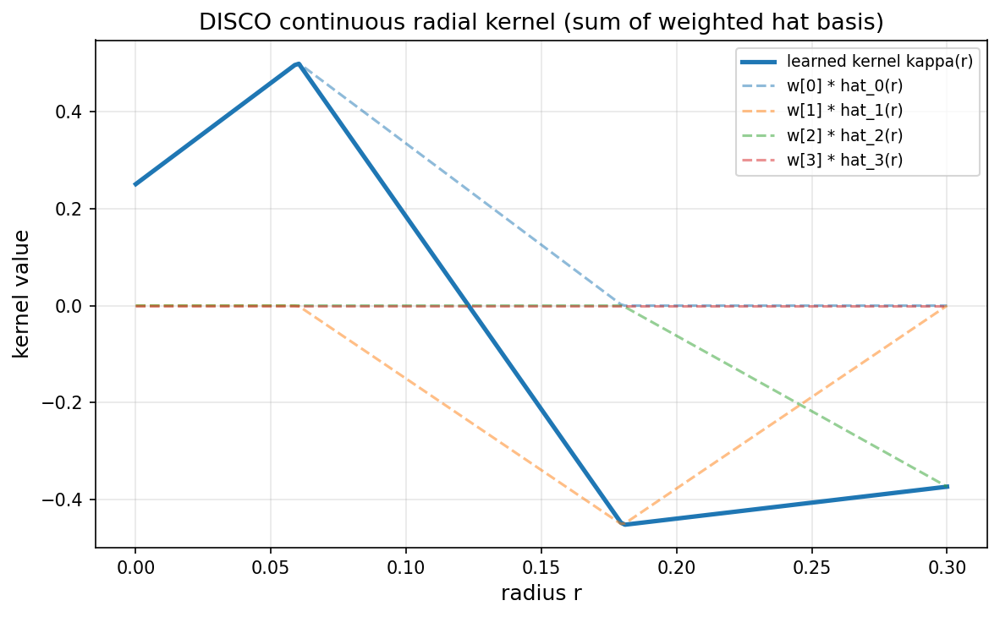

# DISCO Convolutions: Discretisation-Invariant Convolution on Arbitrary Point Sets

| Metadata | Value |
|----------|-------|
| **Level** | Advanced |
| **Runtime** | ~30 s (GPU) / ~2 min (CPU) |
| **Prerequisites** | JAX, Flax NNX, neural operators, quadrature basics |
| **Format** | Python + Jupyter |
| **Memory** | ~0.5 GB |

## Overview

A standard convolution has a fixed *pixel* kernel: its receptive field shrinks as the grid refines,
and it cannot be applied to non-grid (scattered) data at all. A **discrete-continuous (DISCO)**
convolution (Ocampo, Price & McEwen 2023, [arXiv:2209.13603](https://arxiv.org/abs/2209.13603) — the
algorithm behind NVIDIA's `torch_harmonics` and spherical neural operators) instead parameterises
the kernel as a *continuous* function `kappa(r) = Σ_k w_k φ_k(r)` and evaluates the convolution as a
quadrature against the input samples:

$$(\kappa * f)(x_o) \approx \sum_i q_i\, \kappa(x_o - x_i)\, f(x_i).$$

Because the kernel lives in physical coordinates (not pixels) and the sum is a quadrature, the
operator is **discretisation-aware**: the same learned kernel transfers across grid resolutions, and
it works on **irregular** point sets. This example demonstrates both with measurements.

The radial basis reuses opifex's [`PiecewiseLinearBasis`](../../api/neural.md) (the `torch_harmonics`
filter basis), and the filter is normalised per output point (a partition of unity) as in the
reference.

## What You'll Learn

1. Build a `DiscreteContinuousConv2d` over arbitrary input/output point sets
2. Measure **discretisation invariance**: the same kernel on a finer grid gives a consistent result
3. Apply the same operator to an **irregular** (scattered) point cloud — impossible for a pixel conv

## Files

- **Python Script**: [`examples/layers/disco_convolutions_example.py`](https://github.com/avitai/opifex/blob/main/examples/layers/disco_convolutions_example.py)
- **Jupyter Notebook**: [`examples/layers/disco_convolutions_example.ipynb`](https://github.com/avitai/opifex/blob/main/examples/layers/disco_convolutions_example.ipynb)

## Quick Start

```bash
source activate.sh && python examples/layers/disco_convolutions_example.py
```

## Coming from neuraloperator / torch_harmonics?

| neuraloperator / torch_harmonics | Opifex |
|----------------------------------|--------|
| `DiscreteContinuousConv2d(in_channels, out_channels, grid_in, grid_out, quadrature_weights, kernel_shape)` | `DiscreteContinuousConv2d(in_channels, out_channels, in_coords, out_coords, quad_weights, num_basis=, radius=, rngs=)` |
| `PiecewiseLinearFilterBasis` | `opifex.neural.equivariant.PiecewiseLinearBasis` |

The geometry (input/output positions and quadrature weights) is fixed at construction so the
normalised filter is precomputed once; the learnable parameters are the per-basis channel-mixing
weights, independent of the geometry — which is exactly what lets the *same* kernel transfer to a
new grid.

## Core Concept

The convolution factorises into a fixed geometric filter and learnable channel weights:

```text
out[b, o, d] = Σ_{i, k}  psi[o, i, k] · x[b, i, c] · weight[k, c, d]
                         └── geometry ──┘            └── learned ──┘

psi[o, i, k] = q_i · φ_k(|x_o − x_i|),  normalised so  Σ_i psi[o, i, k] = 1
```

`φ_k` are the piecewise-linear radial hats; `q_i` are quadrature weights (the measure each sample
represents). The per-output normalisation (`torch_harmonics`'s `_normalize_convolution_filter_matrix`)
is the partition of unity that gives consistent magnitude across discretisations.

## Results

### 1. Discretisation invariance (convergence)

The same continuous kernel is applied to a smooth field sampled on grids of increasing resolution,
read out at a fixed set of query points. The output converges as the grid refines:

**Terminal Output:**

```text
Discretisation invariance (same continuous kernel, refining the input grid):
------------------------------------------------------------------------
  output @ query points (24x24): [-0.0824 -0.0115 -0.0501  0.0297  0.0907]
  output @ query points (96x96): [-0.0791 -0.0115 -0.0506  0.0336  0.0813]
  relative change 24->96: 0.0826
  relative change 48->96: 0.0112  (halves as the grid refines: convergent)
```

The relative change drops from **0.083** (24×24 vs 96×96) to **0.011** (48×48 vs 96×96) — roughly a
7× reduction as the grid refines toward the continuum. A standard pixel convolution has no such
guarantee: its kernel is tied to the grid spacing, so refining the grid changes the operator.

### 2. Irregular (scattered) point set

```text
Irregular (scattered) point set:
------------------------------------------------------------------------
  500 scattered points, same kernel -> output [-0.0819 -0.0176 -0.0826  0.0094  0.1003]
  agreement with the 96x96 grid result: relative diff 0.3479
  (a standard pixel convolution cannot be applied to scattered points at all)
```

The same operator runs directly on 500 randomly scattered points using Monte-Carlo quadrature
weights — something a pixel convolution cannot do at all. The result approximates the grid
convolution (relative diff **0.35** with only 500 random points; Monte-Carlo quadrature converges as
`1/sqrt(N)`, so more points or a proper quadrature rule tighten the agreement).

### 3. The learned continuous kernel

The kernel is a weighted sum of piecewise-linear radial hat functions — a genuinely continuous
profile, not a pixel stencil:



## Results Summary

| Property | Measurement | What it shows |
|----------|-------------|---------------|
| Discretisation invariance | rel. change 0.083 (24→96) → 0.011 (48→96) | Same kernel converges as grid refines |
| Irregular-grid capability | 500 scattered points, rel. diff 0.35 vs grid | Runs on non-grid data (pixel conv cannot) |
| Continuous kernel | `Σ_k w_k φ_k(r)` over 4 hat bases | Kernel in physical coords, not pixels |

## Next Steps

### Experiments to Try

1. Increase the scattered-point count and watch the irregular-grid agreement improve (`1/sqrt(N)`).
2. Vary `num_basis` and `radius` to trade kernel expressivity against support.
3. Stack `DiscreteContinuousConv2d` layers into an encoder on an irregular mesh.

### Related Examples

| Example | Level | What You'll Learn |
|---------|-------|-------------------|
| [Grid Embeddings](grid-embeddings.md) | Beginner | Spatial coordinate injection for neural operators |
| [Spectral Normalization](spectral-normalization.md) | Intermediate | Lipschitz control for stable deep operators |
| [Fourier Continuation](fourier-continuation.md) | Intermediate | Boundary handling for spectral methods |

### API Reference

- [`DiscreteContinuousConv2d`](../../api/neural.md) — general DISCO convolution layer
- `build_disco_filter` — the normalised quadrature filter `psi[o, i, k]`
- `regular_grid` — uniform grid coordinates and quadrature weights
- [`PiecewiseLinearBasis`](../../api/neural.md) — the continuous radial basis
