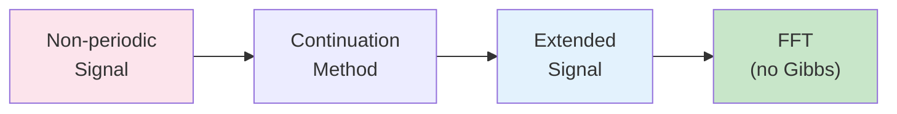

# Fourier Continuation Methods

| Metadata | Value |
|----------|-------|
| **Level** | Intermediate |
| **Runtime** | ~3 min (CPU) |
| **Prerequisites** | JAX, Signal Processing basics |
| **Format** | Python + Jupyter |

## Overview

Fourier continuation methods extend signals beyond their boundaries, which is
essential for neural operators that need to handle non-periodic boundary conditions
in spectral methods. Without proper continuation, Gibbs phenomenon causes ringing
artifacts at boundaries, degrading spectral accuracy.

This example demonstrates four continuation methods: periodic, symmetric, smooth,
and zero padding. It also shows intelligent neural boundary handling that adaptively
selects the best method, and verifies JAX transformation compatibility (JIT, grad, vmap).

## What You'll Learn

1. **Apply** basic continuation methods (periodic, symmetric, smooth, zero padding)
2. **Use** `FourierBoundaryHandler` for intelligent neural boundary selection
3. **Extend** signals in 2D with `FourierContinuationExtender`
4. **Verify** JAX compatibility (JIT, grad, vmap) with continuation methods
5. **Build** reusable continuation pipelines with `create_continuation_pipeline`

## Files

- **Python Script**: [`examples/layers/fourier_continuation_example.py`](https://github.com/Opifex/Opifex/blob/main/examples/layers/fourier_continuation_example.py)
- **Jupyter Notebook**: [`examples/layers/fourier_continuation_example.ipynb`](https://github.com/Opifex/Opifex/blob/main/examples/layers/fourier_continuation_example.ipynb)

## Quick Start

```bash
source activate.sh && python examples/layers/fourier_continuation_example.py
```

## Core Concepts

### Why Fourier Continuation?

Spectral methods (like those in FNO) assume periodic signals. When the input signal
is not periodic, truncating the Fourier series causes Gibbs phenomenon — oscillatory
artifacts near boundaries. Continuation methods extend the signal to make it "appear"
periodic, eliminating these artifacts.



### Continuation Methods

| Method | How It Works | Best For |
|--------|-------------|----------|
| Periodic | Wraps signal cyclically | Naturally periodic signals |
| Symmetric | Mirror reflection at boundary | Smooth signals, Neumann BCs |
| Smooth | Tapered transition to zero | General non-periodic signals |
| Zero Padding | Pads with zeros | Simple, baseline extension |
| Neural Handler | Learned adaptive selection | Unknown boundary behavior |

## Implementation

### Step 1: Basic Continuation Methods

Test signals are extended using four different methods:

```python
from opifex.neural.operators.specialized.fourier_continuation import (
    PeriodicContinuation,
    SymmetricContinuation,
    SmoothContinuation,
    FourierContinuationExtender,
)

methods = {
    "Periodic": PeriodicContinuation(extension_length=16),
    "Symmetric": SymmetricContinuation(extension_length=16),
    "Smooth": SmoothContinuation(extension_length=16),
    "Zero Padding": FourierContinuationExtender(
        extension_type="zero", extension_length=16
    ),
}

for method_name, extender in methods.items():
    extended = extender(signal)
    # Original signal is preserved in the middle of the extended signal
```

**Terminal Output:**
```
BASIC FOURIER CONTINUATION METHODS
==================================================

Signal: sine_wave
   Original length: 32
   Periodic    : 64 -> Shape preservation: (64,)
                 Original signal preserved: MSE = 0.00e+00
   Symmetric   : 64 -> Shape preservation: (64,)
                 Original signal preserved: MSE = 0.00e+00
   Smooth      : 64 -> Shape preservation: (64,)
                 Original signal preserved: MSE = 0.00e+00
   Zero Padding: 64 -> Shape preservation: (64,)
                 Original signal preserved: MSE = 0.00e+00
```

### Step 2: Intelligent Boundary Handling

`FourierBoundaryHandler` uses a neural network to adaptively select the best
continuation method based on signal features:

```python
from opifex.neural.operators.specialized.fourier_continuation import FourierBoundaryHandler

handler = FourierBoundaryHandler(
    continuation_methods=["periodic", "symmetric", "smooth"],
    extension_length=16,
    hidden_dim=32,
    rngs=nnx.Rngs(42),
)

# Automatically selects best method based on signal features
extended = handler(signal)
```

**Terminal Output:**
```
INTELLIGENT BOUNDARY HANDLING
==================================================
Handler configuration:
   Methods: ['periodic', 'symmetric', 'smooth']
   Extension length: 16
   Neural network: 3 method weights

Processing: sine_wave
   Signal features: mean=0.000, std=0.696, boundary_grad=0.201, periodicity=0.939
   Extended from 32 to 64 points
   Signal preservation error: 3.35e-15
```

### Step 3: 2D Signal Extension

Extension capabilities generalize to multi-dimensional signals:

```python
extender = FourierContinuationExtender(
    extension_type="symmetric",
    extension_length=8,
)

# 2D Gaussian signal: (12, 16) -> (28, 32)
extended_2d = extender(signal_2d)
```

**Terminal Output:**
```
2D SIGNAL EXTENSION
==================================================
Original 2D signal shape: (12, 16)
Extended 2D signal shape: (28, 32)
2D signal preservation error: 0.00e+00
```

### Step 4: JAX Transformation Compatibility

All continuation methods are compatible with JIT, grad, and vmap:

```python
# JIT compilation
@jax.jit
def extend_signal(signal):
    return extender(signal)

# Gradient computation
grad_fn = jax.grad(lambda s: jnp.sum(extender(s)**2))
gradients = grad_fn(test_signal)

# Vectorized mapping
batch_extended = jax.vmap(extender)(batch_signals)
```

**Terminal Output:**
```
JAX TRANSFORMATIONS COMPATIBILITY
==================================================
JIT compilation: Extended 32 -> 48
Gradient computation: Gradient shape (32,)
   Gradient norm: X.XXX
Vectorized mapping: Batch (2, 32) -> (2, 48)
```

### Step 5: Performance Benchmarks

JIT-compiled timing comparison of continuation methods:

**Terminal Output:**
```
PERFORMANCE BENCHMARKS
==================================================
Periodic  : X.XXX ms per call (JIT compiled)
Symmetric : X.XXX ms per call (JIT compiled)
Smooth    : X.XXX ms per call (JIT compiled)
```

## Results Summary

| Method | Extension Type | Signal Preservation | Use Case |
|--------|---------------|--------------------|---------|
| Periodic | Wraps signal periodically | Exact | Naturally periodic signals |
| Symmetric | Mirror reflection at boundaries | Exact | Smooth signals with defined endpoints |
| Smooth | Tapered transition to zero | Approximate | General non-periodic signals |
| Zero Padding | Pads with zeros | Exact (original region) | Simple extension |
| Neural Handler | Adaptive selection | Learned | Unknown boundary behavior |

## Next Steps

### Experiments to Try

1. **Discontinuous signals**: Test continuation on step functions and observe artifacts
2. **Extension length**: Increase `extension_length` and observe Fourier spectrum changes
3. **Neural training**: Train the boundary handler on domain-specific PDE solutions

### Related Examples

| Example | Level | What You'll Learn |
|---------|-------|-------------------|
| [Grid Embeddings](grid-embeddings.md) | Beginner | Spatial coordinate injection |
| [Spectral Normalization](spectral-normalization.md) | Intermediate | Stability for spectral layers |
| [FNO Darcy Comprehensive](../neural-operators/fno-darcy.md) | Intermediate | FNO using spectral convolutions |

### API Reference

- [`FourierContinuationExtender`](../../api/neural.md) - Core signal extension
- [`FourierBoundaryHandler`](../../api/neural.md) - Intelligent neural boundary handling
- [`PeriodicContinuation`](../../api/neural.md) - Periodic boundary extension
- [`SymmetricContinuation`](../../api/neural.md) - Symmetric/mirror boundary extension
- [`SmoothContinuation`](../../api/neural.md) - Smooth tapering extension
- [`create_continuation_pipeline`](../../api/neural.md) - Pipeline factory function

### Troubleshooting

#### Signal preservation error is non-zero

**Symptom**: Original signal region in extended output doesn't match input.

**Cause**: This may happen with the `SmoothContinuation` method which applies
tapering that can slightly affect boundary values.

**Solution**: Use `PeriodicContinuation` or `SymmetricContinuation` for exact
signal preservation. Check by comparing:
```python
original_part = extended[ext_len:-ext_len]
error = jnp.mean((original_part - signal) ** 2)
```

#### Gibbs artifacts still visible

**Symptom**: Ringing at boundaries despite using continuation.

**Solution**: Increase `extension_length` to provide more room for the transition.
Typical values are 25-50% of the original signal length.
