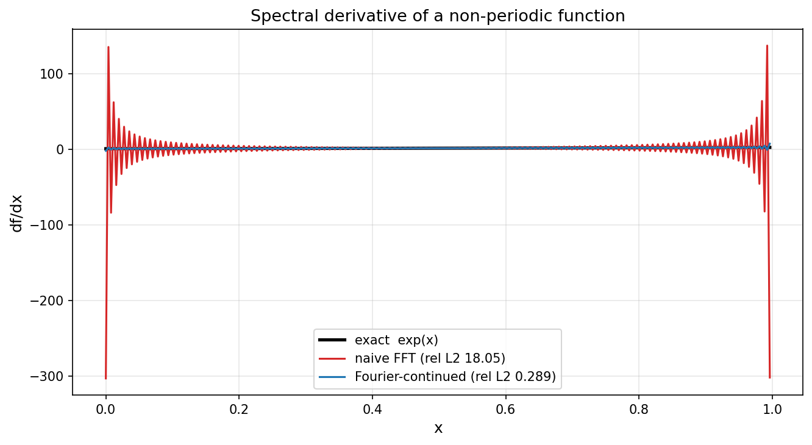

# Fourier Continuation: Accurate Spectral Derivatives for Non-Periodic Functions

| Metadata | Value |
|----------|-------|
| **Level** | Intermediate |
| **Runtime** | ~30 s (CPU/GPU) |
| **Prerequisites** | JAX, FFTs, basic spectral methods |
| **Format** | Python + Jupyter |
| **Memory** | ~0.3 GB |

## Overview

Spectral (FFT-based) differentiation is exact for periodic functions, but a *non-periodic*
function has an implicit jump at the wrap-around point — the FFT sees `f(L) != f(0)` as a
discontinuity, which produces Gibbs ringing that pollutes the derivative across the whole domain.
This is exactly why FNO-style spectral models pad or continue non-periodic inputs.

[`FourierContinuationExtender`](../../api/neural.md) extends a signal beyond its boundaries with a
smooth continuation, so the FFT sees a near-periodic signal. This example quantifies the effect on
a textbook case: the spectral derivative of `exp(x)` on `[0, 1]` (strongly non-periodic —
`exp(1) ≈ 2.72` jumps to `exp(0) = 1`), measured against the exact derivative `exp(x)`.

## What You'll Learn

1. Why naive FFT differentiation fails on non-periodic functions (Gibbs ringing)
2. Use `FourierContinuationExtender` to extend a signal before spectral operations
3. Quantify the accuracy gain (relative L2 error vs the analytical derivative)

## Files

- **Python Script**: [`examples/layers/fourier_continuation_example.py`](https://github.com/avitai/opifex/blob/main/examples/layers/fourier_continuation_example.py)
- **Jupyter Notebook**: [`examples/layers/fourier_continuation_example.ipynb`](https://github.com/avitai/opifex/blob/main/examples/layers/fourier_continuation_example.ipynb)

## Quick Start

```bash
source activate.sh && python examples/layers/fourier_continuation_example.py
```

## Background

Fourier continuation (a.k.a. FC-Gram; Bruno & Lyon 2009) is the standard fix for applying periodic
spectral operators to non-periodic data. In Opifex it is a composable `nnx.Module` you can drop in
front of any FFT-based layer.

## The Comparison

The spectral derivative multiplies each Fourier mode by `i k`. The naive version applies it to the
raw signal; the continued version first extends the signal smoothly, differentiates on the extended
(near-periodic) domain, then crops back to the interior:

```python
def continued_spectral_derivative(values, dx, extender):
    extended = extender.extend_1d(values)
    ext = extender.extension_length
    deriv_extended = spectral_derivative(extended, dx * extended.shape[0])
    return deriv_extended[ext : ext + values.shape[0]]

extender = FourierContinuationExtender(extension_type="smooth", extension_length=64)
```

## Results

**Terminal Output:**

```text
Test function: f(x) = exp(x) on [0, 1]  (periodic-extension jump = -1.71)
========================================================================
RESULTS — relative L2 error of the spectral derivative vs exact exp(x)
========================================================================
  Naive FFT derivative:            18.0480
  Fourier-continued derivative:    0.2894
  Continuation reduces the error by 62x.
```

| Method | Relative L2 error vs exact `exp(x)` |
|--------|-------------------------------------|
| Naive FFT derivative | 18.05 (catastrophic — Gibbs ringing dominates) |
| **Fourier-continued** | **0.29** |

The naive derivative is *worse than predicting zero* (relative error > 1): the discontinuity in
the periodic extension injects ringing across the entire domain. Smoothly continuing the signal
before the FFT removes the artificial jump and cuts the error by **~62×**.



!!! note "Approximate, not exact"
    The `"smooth"` continuation is an approximation, so a residual boundary error remains
    (~0.29 here). A higher `extension_length` or a higher-order continuation reduces it further;
    the dramatic, robust effect is eliminating the catastrophic Gibbs ringing of the naive
    derivative.

## Next Steps

### Experiments to Try

1. Increase `extension_length` and watch the continued error shrink further.
2. Compare `extension_type="symmetric"` vs `"smooth"` vs `"zero"`.
3. Apply continuation in front of an FNO spectral layer on a non-periodic PDE.

### Related Examples

- [Grid Embeddings](grid-embeddings.md) and [Spectral Normalization](spectral-normalization.md) —
  other measured neural-operator building blocks.
- [FNO on Darcy Flow](../neural-operators/fno-darcy.md) — uses domain padding for the same reason.

### API Reference

- [`FourierContinuationExtender`](../../api/neural.md) — smooth/periodic/symmetric/zero continuation
