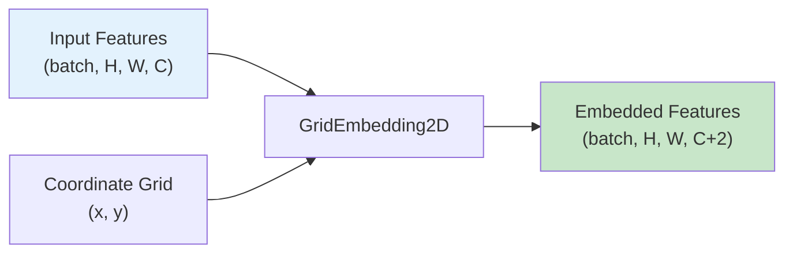
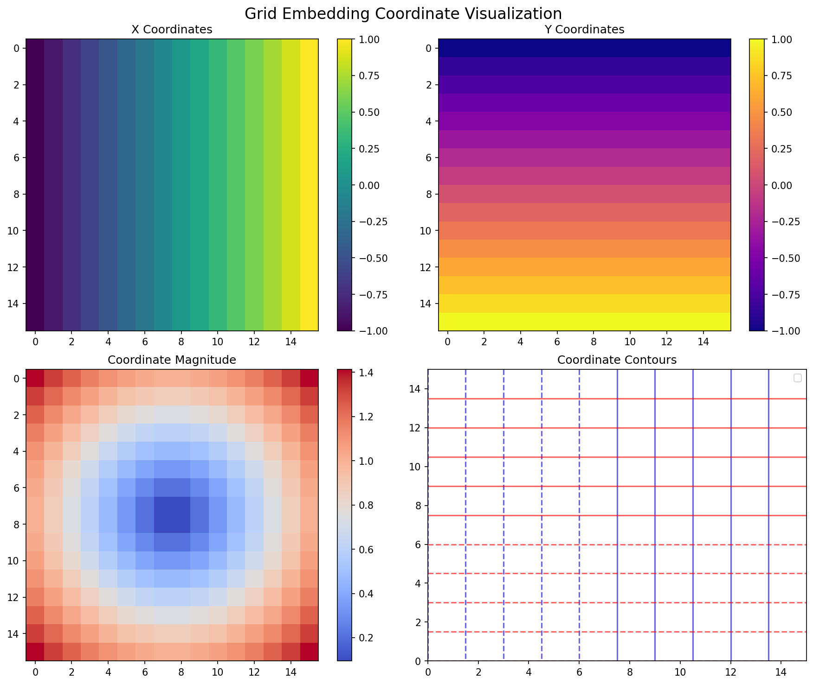

# Grid Embeddings for Neural Operators

| Metadata | Value |
|----------|-------|
| **Level** | Beginner |
| **Runtime** | ~2 min (CPU) |
| **Prerequisites** | JAX, NumPy, Neural Operators basics |
| **Format** | Python + Jupyter |

## Overview

Grid embeddings inject spatial coordinate information into neural operator inputs,
enabling the model to learn position-dependent features. This is essential for
operators like FNO that operate on spatially structured data — without coordinate
information, the model has no way to distinguish between different spatial locations.

This example demonstrates three embedding methods available in Opifex:
`GridEmbedding2D` for standard 2D coordinate injection, `GridEmbeddingND` for
arbitrary dimensions, and `SinusoidalEmbedding` for frequency-based positional
encoding (Transformer-style).

## What You'll Learn

1. **Create** spatial coordinate embeddings with `GridEmbedding2D`
2. **Generalize** embeddings to N dimensions with `GridEmbeddingND`
3. **Apply** frequency-based positional encoding with `SinusoidalEmbedding`
4. **Visualize** embedding coordinate grids and their effects

## Coming from NeuralOperator (PyTorch)?

| NeuralOperator (PyTorch) | Opifex (JAX) |
|--------------------------|--------------|
| Manual `torch.meshgrid(x, y)` + `torch.cat` | `GridEmbedding2D(in_channels=, grid_boundaries=)` |
| Custom positional encoding classes | `SinusoidalEmbedding(in_channels=, num_frequencies=)` |
| N/A (no built-in N-D embedding) | `GridEmbeddingND(in_channels=, dim=)` |

**Key difference**: Opifex provides a unified API for grid embeddings that automatically handles
coordinate normalization and channel concatenation, replacing manual meshgrid boilerplate.

## Files

- **Python Script**: [`examples/layers/grid_embeddings_example.py`](https://github.com/Opifex/Opifex/blob/main/examples/layers/grid_embeddings_example.py)
- **Jupyter Notebook**: [`examples/layers/grid_embeddings_example.ipynb`](https://github.com/Opifex/Opifex/blob/main/examples/layers/grid_embeddings_example.ipynb)

## Quick Start

```bash
source activate.sh && python examples/layers/grid_embeddings_example.py
```

## Core Concepts

### Why Grid Embeddings?

Neural operators like FNO learn mappings between function spaces. By default, these
operators are translation-invariant — they don't know *where* in the domain they're
operating. Grid embeddings break this invariance by appending coordinate information
to the input features.



### Embedding Methods Comparison

| Method | Added Channels | Best For |
|--------|----------------|----------|
| `GridEmbedding2D` | +2 (x, y) | Standard 2D spatial data |
| `GridEmbeddingND` | +N (per dimension) | Arbitrary dimensional data (3D, 4D) |
| `SinusoidalEmbedding` | +2*N*frequencies | High-frequency spatial patterns |

## Implementation

### Step 1: 2D Grid Embedding

The `GridEmbedding2D` layer appends normalized (x, y) coordinates to input features.

```python
from opifex.neural.operators.common.embeddings import GridEmbedding2D

embedding = GridEmbedding2D(
    in_channels=3,
    grid_boundaries=[[0.0, 1.0], [0.0, 1.0]],
)

# Input: (batch=4, 32, 32, 3)
# Output: (batch=4, 32, 32, 5) — 3 original + 2 coordinate channels
embedded_data = embedding(sample_input)
```

**Terminal Output:**
```
Grid Embedding 2D Demonstration
   Spatial Shape: (32, 32)
   Grid Boundaries: [[0.0, 1.0], [0.0, 1.0]]
   Input Shape: (4, 32, 32, 3)
   Output Shape: (4, 32, 32, 5)
   Output Channels: 5
   Embedding Time: 132.52 ms
```

### Step 2: N-Dimensional Grid Embedding

`GridEmbeddingND` generalizes to arbitrary spatial dimensions:

```python
from opifex.neural.operators.common.embeddings import GridEmbeddingND

embedding_3d = GridEmbeddingND(
    in_channels=2,
    dim=3,
    grid_boundaries=[[0.0, 1.0], [0.0, 1.0], [0.0, 1.0]],
)

# Input: (batch=2, 16, 16, 16, 2)
# Output: (batch=2, 16, 16, 16, 5) — 2 original + 3 coordinate channels
```

**Terminal Output:**
```
Grid Embedding 3D Demonstration
   Spatial Shape: (16, 16, 16)
   Dimensions: 3
   Input Shape: (2, 16, 16, 16, 2)
   Output Shape: (2, 16, 16, 16, 5)
   Output Channels: 5
   Coordinate Channels: 3
   Embedding Time: 157.37 ms
```

### Step 3: Sinusoidal Embedding

Transformer-style frequency-based positional encoding provides multi-scale spatial information:

```python
from opifex.neural.operators.common.embeddings import SinusoidalEmbedding

embedding = SinusoidalEmbedding(
    in_channels=3,
    num_frequencies=8,
    embedding_type="transformer",
)

# Adds 2 * 3 * 8 = 48 frequency channels
# Output channels: 3 + 48 = 51
```

**Terminal Output:**
```
Sinusoidal Embedding Demonstration
   Spatial Shape: (32, 32)
   Frequencies: 8
   Input Shape: (4, 1024, 3)
   Output Shape: (4, 1024, 48)
   Output Channels: 48
   Embedding Time: 181.06 ms
```

### Step 4: Visualization

The coordinate grids show the spatial structure injected by embeddings:



## Results Summary

| Embedding Method | Input Channels | Output Channels | Added Dimensions |
|-----------------|----------------|-----------------|------------------|
| GridEmbedding2D | 3 | 5 | +2 (x, y coordinates) |
| GridEmbeddingND (3D) | 2 | 5 | +3 (x, y, z coordinates) |
| SinusoidalEmbedding | 3 | 48 | +45 (frequency encodings) |

## Next Steps

### Experiments to Try

1. **Custom grid boundaries**: Use `[[-1, 1], [0, 2*pi]]` for non-standard domains
2. **Increase frequencies**: Try `num_frequencies=16` in sinusoidal embedding and observe channel growth
3. **Real data**: Apply embeddings to Darcy flow data before FNO training

### Related Examples

| Example | Level | What You'll Learn |
|---------|-------|-------------------|
| [DISCO Convolutions](disco-convolutions.md) | Intermediate | Convolutions on arbitrary grids |
| [Fourier Continuation](fourier-continuation.md) | Intermediate | Boundary handling for spectral methods |
| [FNO Darcy Comprehensive](../neural-operators/fno-darcy.md) | Intermediate | Full FNO training with grid embeddings |

### API Reference

- [`GridEmbedding2D`](../../api/neural.md) - 2D spatial coordinate injection
- [`GridEmbeddingND`](../../api/neural.md) - N-dimensional coordinate embedding
- [`SinusoidalEmbedding`](../../api/neural.md) - Frequency-based positional encoding
- [`regular_grid_2d`](../../api/neural.md) - Utility for generating 2D coordinate grids

### Troubleshooting

#### Wrong output channel count

**Symptom**: Output has unexpected number of channels.

**Cause**: `in_channels` parameter doesn't match actual input channel dimension.

**Solution**: Ensure `in_channels` matches your data:
```python
# If input has 1 channel (e.g., grayscale), set in_channels=1
embedding = GridEmbedding2D(in_channels=1, grid_boundaries=[[0, 1], [0, 1]])
# Output will have 3 channels (1 original + 2 coordinates)
```

#### Grid boundaries mismatch

**Symptom**: Coordinate values don't match expected physical domain.

**Solution**: Set `grid_boundaries` to match your physical domain:
```python
# For domain [0, 2*pi] x [0, 2*pi]
embedding = GridEmbedding2D(
    in_channels=1,
    grid_boundaries=[[0, 6.283], [0, 6.283]],
)
```
