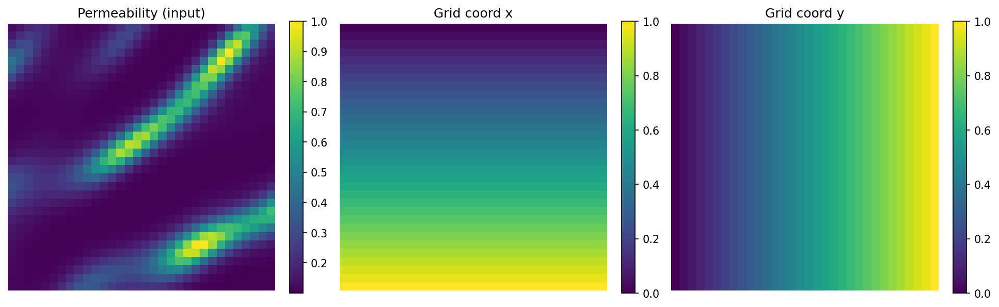

# Grid Embeddings: Why Positional Coordinates Matter for Neural Operators

| Metadata | Value |
|----------|-------|
| **Level** | Intermediate |
| **Runtime** | ~3 min (GPU) / ~12 min (CPU) |
| **Prerequisites** | JAX, Flax NNX, [FNO on Darcy](../neural-operators/fno-darcy.md) |
| **Format** | Python + Jupyter |
| **Memory** | ~1 GB |

## Overview

A Fourier Neural Operator sees only channel values at grid points — it has no intrinsic
notion of *where* each point sits in the domain. [`GridEmbedding2D`](../../api/neural.md)
injects the spatial coordinates as extra input channels, giving the operator positional
awareness. This is standard practice in neural-operator libraries (it is on by default in
`neuraloperator`), but *how much does it actually help?*

This example answers that with a controlled **ablation**: two otherwise-identical FNOs are
trained on Darcy flow — one with `GridEmbedding2D`, one without — and we measure the difference
in test accuracy. Everything else (Fourier modes, width, depth, optimiser, data, random seed) is
held fixed, so the gap is attributable to the positional encoding alone.

## What You'll Learn

1. Compose `GridEmbedding2D` with a `FourierNeuralOperator`
2. Quantify grid embedding's effect on test error (relative L2) with a clean ablation
3. Visualise the coordinate channels the embedding appends to the input
4. Understand why a boundary-value problem (fixed zero boundary) rewards positional awareness

## Files

- **Python Script**: [`examples/layers/grid_embeddings_example.py`](https://github.com/avitai/opifex/blob/main/examples/layers/grid_embeddings_example.py)
- **Jupyter Notebook**: [`examples/layers/grid_embeddings_example.ipynb`](https://github.com/avitai/opifex/blob/main/examples/layers/grid_embeddings_example.ipynb)

## Quick Start

```bash
source activate.sh && python examples/layers/grid_embeddings_example.py
```

## Coming from neuraloperator (PyTorch)?

| neuraloperator | Opifex |
|----------------|--------|
| `GridEmbeddingND(in_channels, dim, grid_boundaries)` | `GridEmbedding2D(in_channels=, grid_boundaries=)` / `GridEmbeddingND(...)` |
| `FNO(..., positional_embedding='grid')` (default on) | compose `GridEmbedding2D` then `FourierNeuralOperator` explicitly |

## Key Concept: the coordinate channels

`GridEmbedding2D` takes a channels-last field and appends two channels holding the normalised
`x` and `y` coordinates of every grid point, turning a 1-channel permeability field into a
3-channel input. Those coordinate channels are constant across samples but vary smoothly across
space, so the operator can condition its response on position — essential when the boundary
condition pins the solution at the domain edge.



## The Ablation

Both models are the same FNO (`modes=12`, `hidden_channels=32`, `num_layers=4`, `domain_padding=0.25`);
the only difference is the embedding:

```python
class FNOWithGridEmbedding(nnx.Module):
    def __init__(self, modes, hidden_channels, num_layers, *, rngs):
        self.grid_embedding = GridEmbedding2D(
            in_channels=1, grid_boundaries=[[0.0, 1.0], [0.0, 1.0]]
        )
        self.fno = FourierNeuralOperator(
            in_channels=self.grid_embedding.out_channels,  # 3
            out_channels=1, hidden_channels=hidden_channels,
            modes=modes, num_layers=num_layers, domain_padding=0.25, rngs=rngs,
        )

    def __call__(self, x):
        x_hwc = jnp.moveaxis(x, 1, -1)
        x_embedded = self.grid_embedding(x_hwc)
        return self.fno(jnp.moveaxis(x_embedded, -1, 1))
```

Both are trained identically (1000 samples, 120 epochs, `relative_l2` loss, AdamW) via
`Trainer.fit()`.

## Results

**Terminal Output:**

```text
========================================================================
RESULTS — test relative L2 error (lower is better)
========================================================================
  FNO (no grid embedding):  0.0136
  FNO + GridEmbedding2D:    0.0102
  Grid embedding reduces the relative-L2 error by 25% on this boundary-value problem.
```

| Model | Test relative L2 |
|-------|------------------|
| FNO (no grid embedding) | 0.0136 |
| **FNO + `GridEmbedding2D`** | **0.0102** |

Adding the two coordinate channels — a negligible parameter increase — cuts the relative-L2
error by **~25%**. On Darcy flow the solution is pinned to zero on the boundary, so knowing
*where* a point is relative to the boundary is genuinely informative; the grid embedding supplies
exactly that signal.

!!! note "Scope"
    This is an *in-distribution* ablation at a fixed resolution. Grid coordinates are continuous
    and so are resolution-independent, but cross-resolution generalisation on Darcy also depends on
    the input distribution matching across discretisations, which is a separate concern not measured
    here.

## Next Steps

### Experiments to Try

1. Vary `grid_boundaries` to match a non-unit domain and confirm the embedding rescales.
2. Swap `GridEmbedding2D` for `SinusoidalEmbedding` (Transformer-style frequency encoding) and
   compare.
3. Repeat the ablation on a periodic problem (e.g. Burgers) where positional awareness matters less.

### Related Examples

- [FNO on Darcy Flow](../neural-operators/fno-darcy.md) — the full FNO recipe this builds on.
- [Spectral Normalization](spectral-normalization.md) — another neural-operator building block.

### API Reference

- [`GridEmbedding2D`](../../api/neural.md) — 2D coordinate embedding
- [`FourierNeuralOperator`](../../api/neural.md) — the FNO model
- [`Trainer`](../../api/training.md) — training orchestration
