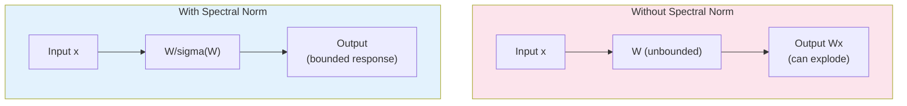

# Spectral Normalization for Neural Operators

| Metadata | Value |
|----------|-------|
| **Level** | Intermediate |
| **Runtime** | ~5 min (CPU) |
| **Prerequisites** | JAX, Flax NNX, Linear Algebra basics |
| **Format** | Python + Jupyter |

## Overview

Spectral normalization controls the Lipschitz constant of neural network layers
by normalizing weight matrices by their spectral norm (largest singular value).
This is critical for PDE-solving neural operators where stability and convergence
guarantees depend on bounded operator norms.

This example demonstrates spectral normalized linear layers, convolutions, and
attention mechanisms. It includes stability analysis comparing regular vs spectral
normalized networks, adaptive bounds, power iteration algorithm details, and
performance benchmarks.

## What You'll Learn

1. **Apply** `SpectralLinear` and `SpectralNormalizedConv` for stable neural operator layers
2. **Use** `SpectralMultiHeadAttention` for normalized attention mechanisms
3. **Configure** `AdaptiveSpectralNorm` with fixed and learnable bounds
4. **Analyze** Lipschitz constants to verify stability improvements
5. **Build** complete spectral normalized neural operators with `create_spectral_neural_operator`

## Files

- **Python Script**: [`examples/layers/spectral_normalization_example.py`](https://github.com/Opifex/Opifex/blob/main/examples/layers/spectral_normalization_example.py)
- **Jupyter Notebook**: [`examples/layers/spectral_normalization_example.ipynb`](https://github.com/Opifex/Opifex/blob/main/examples/layers/spectral_normalization_example.ipynb)

## Quick Start

```bash
source activate.sh && python examples/layers/spectral_normalization_example.py
```

## Core Concepts

### Why Spectral Normalization?

Neural operators learn mappings between function spaces. Without normalization,
weight matrices can have arbitrarily large spectral norms, leading to:

- **Exploding gradients** during training
- **Unstable predictions** that amplify input perturbations
- **Poor generalization** due to lack of Lipschitz control

Spectral normalization bounds the spectral norm to 1 (or a configurable bound),
ensuring controlled sensitivity to input changes.



### Power Iteration Algorithm

Computing the exact spectral norm requires SVD (O(n^3)). Power iteration
provides an efficient O(n) approximation by iteratively refining an estimate
of the largest singular value:

| Iterations | Accuracy | Cost |
|------------|----------|------|
| 1 | Approximate | Minimal overhead |
| 3-5 | Good for training | Standard choice |
| 10+ | Near-exact | Higher overhead |

## Implementation

### Step 1: Basic Spectral Normalization Layers

Replace standard layers with spectral normalized variants:

```python
from opifex.neural.operators.specialized.spectral_normalization import (
    SpectralLinear,
    SpectralNormalizedConv,
)

# Spectral normalized linear layer
spectral_linear = SpectralLinear(10, 5, power_iterations=5, rngs=rngs)
y = spectral_linear(x, training=True)

# Spectral normalized convolution
spectral_conv = SpectralNormalizedConv(3, 16, kernel_size=3, power_iterations=3, rngs=rngs)
y_conv = spectral_conv(x_img, training=True)
```

**Terminal Output:**
```
BASIC SPECTRAL NORMALIZATION LAYERS
==================================================

Linear Layer Comparison:
   Regular Linear: (8, 10) -> (8, 5)
   Spectral Linear: (8, 10) -> (8, 5)
   Regular kernel spectral norm: 2.018
   Spectral normalized estimate: 1.434

Convolution Layer Comparison:
   Regular Conv: (4, 32, 32, 3) -> (4, 32, 32, 16)
   Spectral Conv: (4, 32, 32, 3) -> (4, 32, 32, 16)
```

### Step 2: Spectral Normalized Attention

Multi-head attention with spectral normalization for stable sequence processing:

```python
from opifex.neural.operators.specialized.spectral_normalization import SpectralMultiHeadAttention

spectral_attention = SpectralMultiHeadAttention(
    num_heads=8,
    in_features=64,
    power_iterations=3,
    rngs=rngs,
)

output = spectral_attention(x, training=True)
```

**Terminal Output:**
```
SPECTRAL NORMALIZED ATTENTION
==================================================
Attention configuration:
   Number of heads: 8
   Feature dimension: 64
   Head dimension: 8

Processing sequence: (2, 32, 64)
   Output shape: (2, 32, 64)
```

### Step 3: Adaptive Spectral Normalization

`AdaptiveSpectralNorm` allows per-layer spectral bound tuning, with optional
learnable bounds:

```python
from opifex.neural.operators.specialized.spectral_normalization import AdaptiveSpectralNorm

adaptive_layer = AdaptiveSpectralNorm(
    base_linear,
    power_iterations=5,
    initial_bound=1.0,
    learnable_bound=True,  # Bound adjusts during training
    rngs=rngs,
)
```

**Terminal Output:**
```
ADAPTIVE SPECTRAL NORMALIZATION
==================================================
Fixed bound (1.0):
   Initial bound: 1.0
   Learnable: False
Learnable bound:
   Initial bound: 1.0
   Learnable: True
```

### Step 4: Power Iteration Algorithm

The core algorithm for efficient spectral norm estimation, tested against
exact SVD computation:

**Terminal Output:**
```
POWER ITERATION ALGORITHM
==================================================

Matrix: Identity (shape: (4, 4))
   True spectral norm (SVD): 1.000000
    1 iterations: 1.000000 (error: 0.000000, time: 344.39 ms)
    3 iterations: 1.000000 (error: 0.000000, time: 3.84 ms)
    5 iterations: 1.000000 (error: 0.000000, time: 3.66 ms)
   10 iterations: 1.000000 (error: 0.000000, time: 5.34 ms)

Matrix: Diagonal (shape: (4, 4))
   True spectral norm (SVD): 3.000000
    1 iterations: 2.682737 (error: 0.317263, time: 2.15 ms)
    3 iterations: 2.988353 (error: 0.011647, time: 4.91 ms)
    5 iterations: 2.999541 (error: 0.000459, time: 2.64 ms)
   10 iterations: 3.000000 (error: 0.000000, time: 3.78 ms)

Matrix: Random (shape: (6, 4))
   True spectral norm (SVD): 3.189911
    1 iterations: 2.980349 (error: 0.209562, time: 363.63 ms)
    3 iterations: 3.117129 (error: 0.072781, time: 3.76 ms)
    5 iterations: 3.170034 (error: 0.019876, time: 3.06 ms)
   10 iterations: 3.189305 (error: 0.000606, time: 4.89 ms)

Matrix: Large Random (shape: (128, 64))
   True spectral norm (SVD): 18.911154
    1 iterations: 14.052646 (error: 4.858508, time: 356.26 ms)
    3 iterations: 17.750385 (error: 1.160769, time: 2.42 ms)
    5 iterations: 18.417088 (error: 0.494066, time: 2.52 ms)
   10 iterations: 18.828447 (error: 0.082706, time: 3.36 ms)
```

### Step 5: Stability Analysis

Comparing Lipschitz constants between regular and spectral normalized networks:

**Terminal Output:**
```
STABILITY ANALYSIS & LIPSCHITZ CONTROL
==================================================
Network configurations:
   Regular: Linear layers with standard weights
   Spectral: SpectralLinear layers with spectral normalization

Lipschitz constant estimation:
   Regular network:
     Mean Lipschitz: 0.396 +/- 0.158
     Max Lipschitz: 0.927
   Spectral normalized network:
     Mean Lipschitz: 0.066 +/- 0.030
     Max Lipschitz: 0.168
```

### Step 6: Complete Spectral Neural Operators

Building full architectures with varying sizes:

```python
from opifex.neural.operators.fno.spectral import create_spectral_neural_operator

model = create_spectral_neural_operator(
    input_dim=64,
    output_dim=64,
    hidden_dims=(128, 128, 64),
    num_heads=8,
    power_iterations=3,
    rngs=rngs,
)
```

**Terminal Output:**
```
COMPLETE SPECTRAL NEURAL OPERATORS
==================================================

Creating Small FNO-style:
   Input/Output dims: 32 -> 32
   Hidden layers: (64, 64)
   Attention heads: 4
   Creation time: 387.87 ms

Creating Medium PDE solver:
   Input/Output dims: 64 -> 64
   Hidden layers: (128, 128, 64)
   Attention heads: 8
   Creation time: 633.09 ms

Creating Large Multi-scale:
   Input/Output dims: 128 -> 64
   Hidden layers: (256, 192, 128, 96)
   Attention heads: 16
   Creation time: 959.89 ms

Testing forward passes:
   Small FNO-style: (4, 32) -> (4, 32) (698.53 ms)
   Medium PDE solver: (4, 64) -> (4, 64) (414.97 ms)
   Large Multi-scale: (4, 128) -> (4, 64) (2268.00 ms)
```

## Results Summary

| Component | Benefit | Overhead |
|-----------|---------|----------|
| SpectralLinear | Bounded Lipschitz constant | ~10-30% |
| SpectralNormalizedConv | Stable spatial processing | ~15-25% |
| SpectralMultiHeadAttention | Stable attention weights | ~10-20% |
| AdaptiveSpectralNorm | Flexible per-layer control | ~10-20% |
| PowerIteration | Efficient O(n) norm estimation | Configurable |

### Key Takeaways

- Spectral normalization controls Lipschitz constants for stable training
- Power iteration provides efficient O(n) spectral norm estimation
- Adaptive bounds allow layer-specific flexibility
- JAX transformations (JIT, grad, vmap, Hessian) work seamlessly
- Modest overhead (~10-30%) for significant stability improvements
- Particularly beneficial for PDE-solving neural operators

## Next Steps

### Experiments to Try

1. **FNO with spectral norm**: Apply `SpectralLinear` to FNO spectral layers for stable Darcy flow training
2. **PINN stability**: Compare PINN training convergence with and without spectral normalization
3. **Adaptive bounds**: Use learnable bounds with `AdaptiveSpectralNorm` for multi-scale architectures

### Related Examples

| Example | Level | What You'll Learn |
|---------|-------|-------------------|
| [Grid Embeddings](grid-embeddings.md) | Beginner | Spatial coordinate injection |
| [FNO Darcy Comprehensive](../neural-operators/fno-darcy.md) | Intermediate | Apply spectral layers in training |
| [Neural Operator Benchmark](../benchmarking/operator-benchmark.md) | Advanced | Cross-architecture comparison |

### API Reference

- [`SpectralLinear`](../../api/neural.md) - Spectral normalized linear layer
- [`SpectralNormalizedConv`](../../api/neural.md) - Spectral normalized convolution
- [`SpectralMultiHeadAttention`](../../api/neural.md) - Spectral normalized attention
- [`AdaptiveSpectralNorm`](../../api/neural.md) - Adaptive spectral bounds
- [`PowerIteration`](../../api/neural.md) - Spectral norm estimation algorithm
- [`create_spectral_neural_operator`](../../api/neural.md) - Complete architecture factory
- [`spectral_norm_summary`](../../api/neural.md) - Model spectral norm analysis

### Troubleshooting

#### Spectral norm not converging

**Symptom**: Power iteration estimates vary significantly between forward passes.

**Cause**: Too few power iterations for the matrix size.

**Solution**: Increase `power_iterations` (3-5 is typical, use 10+ for large matrices):
```python
layer = SpectralLinear(512, 256, power_iterations=10, rngs=rngs)
```

#### Training loss oscillating

**Symptom**: Loss oscillates when using spectral normalization.

**Cause**: Spectral bound may be too restrictive, limiting model capacity.

**Solution**: Use `AdaptiveSpectralNorm` with a larger initial bound:
```python
adaptive = AdaptiveSpectralNorm(
    base_layer,
    initial_bound=2.0,      # Allow larger spectral norm
    learnable_bound=True,   # Let the model find the right bound
    rngs=rngs,
)
```

#### `training` parameter confusion

**Symptom**: Different results with `training=True` vs `training=False`.

**Cause**: Power iteration updates internal state during `training=True`.
During inference, use `training=False` to use cached spectral norm.

**Solution**:
```python
# During training
output = layer(x, training=True)   # Updates spectral norm estimate

# During inference
output = layer(x, training=False)  # Uses cached estimate
```
