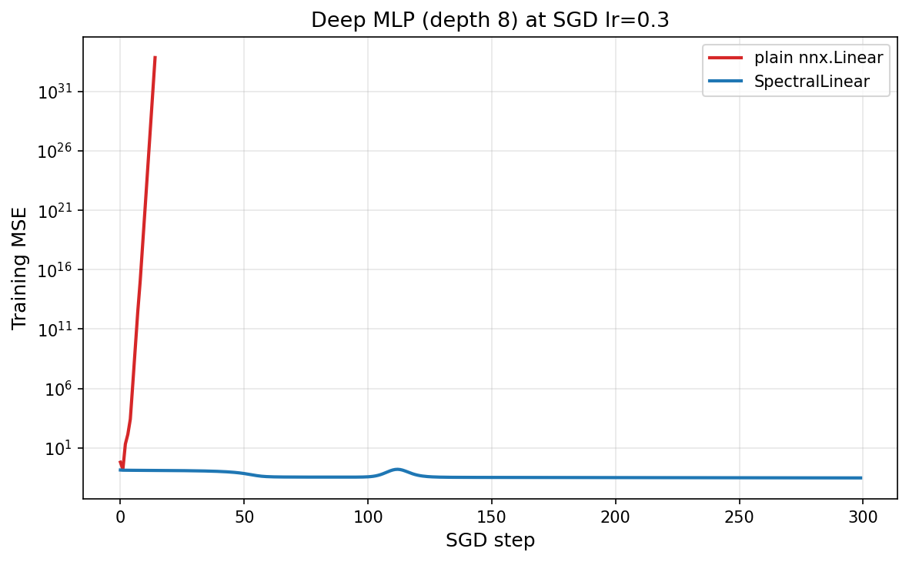

# Spectral Normalization: Lipschitz Control for Stable Deep Training

| Metadata | Value |
|----------|-------|
| **Level** | Intermediate |
| **Runtime** | ~1 min (GPU) / ~3 min (CPU) |
| **Prerequisites** | JAX, Flax NNX, basic optimisation |
| **Format** | Python + Jupyter |
| **Memory** | ~0.5 GB |

## Overview

Spectral normalization (Miyato et al. 2018, *Spectral Normalization for Generative Adversarial
Networks*, [arXiv:1802.05957](https://arxiv.org/abs/1802.05957)) divides each weight matrix by its
largest singular value, making every layer 1-Lipschitz. The product of per-layer spectral norms
upper-bounds the whole network's Lipschitz constant — and an unbounded Lipschitz constant is
exactly what makes deep networks blow up at aggressive learning rates.

This example demonstrates that value with a controlled comparison: a deep MLP trained at an
aggressive learning rate, built once with plain `nnx.Linear` layers and once with
[`SpectralLinear`](../../api/neural.md). We track the training loss and the network Lipschitz
bound (the product of per-layer spectral norms). The plain network's Lipschitz bound starts above
1000 and its training **diverges to NaN**; the spectral-normalized network keeps every layer at
spectral norm 1 and trains stably to a low error.

## What You'll Learn

1. Use `SpectralLinear` as a drop-in 1-Lipschitz replacement for `nnx.Linear`
2. Measure a network's Lipschitz bound as the product of per-layer spectral norms
3. See how Lipschitz control stabilises deep training at aggressive learning rates

## Files

- **Python Script**: [`examples/layers/spectral_normalization_example.py`](https://github.com/avitai/opifex/blob/main/examples/layers/spectral_normalization_example.py)
- **Jupyter Notebook**: [`examples/layers/spectral_normalization_example.ipynb`](https://github.com/avitai/opifex/blob/main/examples/layers/spectral_normalization_example.ipynb)

## Quick Start

```bash
source activate.sh && python examples/layers/spectral_normalization_example.py
```

## Coming from PyTorch?

| PyTorch | Opifex |
|---------|--------|
| `torch.nn.utils.parametrizations.spectral_norm(nn.Linear(...))` | `SpectralLinear(in_features=, out_features=, power_iterations=, rngs=)` |
| `spectral_norm(nn.Conv2d(...))` | `SpectralNormalizedConv(in_channels=, out_channels=, kernel_size=, rngs=)` |

## The Comparison

Both networks are the same deep MLP (width 64, depth 8, tanh activations); only the layer type
differs. `SpectralLinear` normalises each kernel by its spectral norm (via power iteration) before
the matmul, so the layer is 1-Lipschitz by construction. Both are trained with full-batch SGD at
an aggressive `lr=0.3` on a gently-sloped regression target (so the 1-Lipschitz network has ample
capacity — the comparison isolates *stability*, not capacity).

```python
class DeepMLP(nnx.Module):
    def __init__(self, width, depth, *, spectral, rngs):
        dims = [1, *([width] * depth), 1]
        layers = [
            (SpectralLinear(a, b, power_iterations=2, rngs=rngs) if spectral
             else nnx.Linear(a, b, rngs=rngs))
            for a, b in pairwise(dims)
        ]
        self.layers = nnx.List(layers)
```

## Results

**Terminal Output:**

```text
Lipschitz bound at init:  plain=1.01e+03  spectral=1.00e+00

========================================================================
RESULTS
========================================================================
Model                          final MSE       max MSE   Lipschitz bound
------------------------------------------------------------------------
plain nnx.Linear                     nan           nan               nan
SpectralLinear                2.9396e-02    1.5593e-01          1.00e+00
------------------------------------------------------------------------
Plain network destabilised: True; spectral final MSE 2.94e-02 (Lipschitz bound stays ~1 per layer).
```

| Model | Final MSE | Lipschitz bound | Outcome |
|-------|-----------|-----------------|---------|
| plain `nnx.Linear` | NaN | unbounded (≈10³ at init) | **diverges** |
| **`SpectralLinear`** | **0.029** | **1.0 per layer** | **stable** |

The plain deep network has a Lipschitz bound over 1000 at initialisation; at `lr=0.3` it blows up
to NaN within the first few steps. Spectral normalization caps every layer at spectral norm 1, so
the network is globally Lipschitz-bounded and trains stably to a low MSE — at no extra parameters,
just a power-iteration estimate per layer.



!!! note "Stability vs capacity"
    1-Lipschitz layers trade some expressivity for stability — a strict Lipschitz bound limits how
    steep a function the network can represent. The target here is deliberately gentle so capacity
    is not the bottleneck; for steeper targets, relax the constraint (fewer normalized layers) or
    use `AdaptiveSpectralNorm`, which learns a per-layer bound.

## Next Steps

### Experiments to Try

1. Lower the learning rate until the plain network also trains — find the stability threshold.
2. Swap in `SpectralNormalizedConv` and repeat with a small CNN.
3. Try `AdaptiveSpectralNorm` (learnable bound) to recover capacity while keeping stability.

### Related Examples

- [Grid Embeddings](grid-embeddings.md) — another neural-operator building block, measured.
- [FNO on Darcy Flow](../neural-operators/fno-darcy.md) — where spectral layers are used in anger.

### API Reference

- [`SpectralLinear`](../../api/neural.md), [`SpectralNormalizedConv`](../../api/neural.md),
  [`AdaptiveSpectralNorm`](../../api/neural.md)
