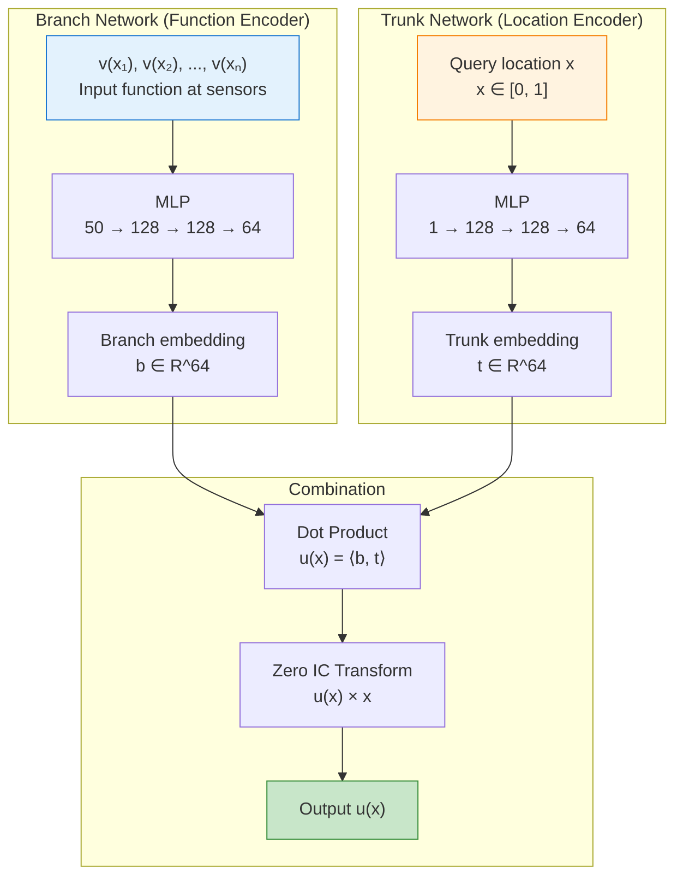
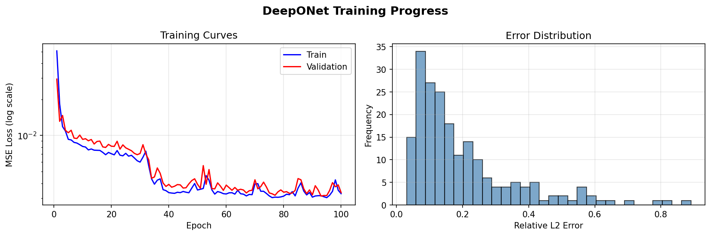

# DeepONet on Antiderivative

| Metadata | Value |
|----------|-------|
| **Level** | Beginner |
| **Runtime** | ~30s (CPU) / ~5s (GPU) |
| **Prerequisites** | JAX, Flax NNX, Neural Operators basics |
| **Format** | Python + Jupyter |
| **Memory** | ~500 MB RAM |

## Overview

This tutorial demonstrates training a DeepONet to learn the antiderivative operator, the
canonical benchmark from the original DeepONet paper (Lu et al., 2021). Given a function
v(x), the operator learns to predict u(x) = ∫₀ˣ v(t) dt.

What makes this example foundational is the **branch-trunk architecture**: unlike FNO which
operates on discretized fields, DeepONet separates function encoding (branch network) from
location encoding (trunk network). This architecture enables evaluation at arbitrary query
points without retraining, a key advantage for continuous operator learning.

## What You'll Learn

1. **Understand** the branch-trunk DeepONet architecture and its mathematical formulation
2. **Generate** synthetic antiderivative operator data using GRF basis functions
3. **Implement** custom training loop for operators with two distinct inputs
4. **Apply** physics constraints via output transformations (zero IC: u(0) = 0)
5. **Evaluate** with relative L2 error and per-sample analysis

## Coming from DeepXDE?

If you are familiar with the DeepXDE library, here is how Opifex compares for
this workflow:

| DeepXDE (TensorFlow/PyTorch) | Opifex (JAX) |
|------------------------------|--------------|
| `dde.nn.DeepONet([50, 128, 128, 64], [1, 128, 128, 64])` | `DeepONet(branch_sizes=[50, 128, 128, 64], trunk_sizes=[1, 128, 128, 64])` |
| `net.apply_output_transform(zero_ic)` | Custom `apply_zero_ic()` function |
| `dde.data.PDEOperatorCartesianProd()` | Custom NumPy data generation |
| `model.train(iterations=10000)` | Custom training loop with `nnx.Optimizer` |
| Implicit random state | Explicit `rngs=nnx.Rngs(42)` |

**Key differences:**

1. **Explicit PRNG**: Opifex uses JAX's deterministic `rngs=nnx.Rngs(seed)`
2. **Custom training**: DeepONet requires custom loop due to branch/trunk inputs
3. **XLA compilation**: Use `@nnx.jit` for faster training
4. **Functional transforms**: Full access to `jax.grad`, `jax.vmap` for composability

## Files

- **Python Script**: [`examples/neural-operators/deeponet_antiderivative.py`](https://github.com/Opifex/Opifex/blob/main/examples/neural-operators/deeponet_antiderivative.py)
- **Jupyter Notebook**: [`examples/neural-operators/deeponet_antiderivative.ipynb`](https://github.com/Opifex/Opifex/blob/main/examples/neural-operators/deeponet_antiderivative.ipynb)

## Quick Start

### Run the Python Script

```bash
source activate.sh && python examples/neural-operators/deeponet_antiderivative.py
```

### Run the Jupyter Notebook

```bash
jupyter lab examples/neural-operators/deeponet_antiderivative.ipynb
```

## Core Concepts

### The Antiderivative Operator

The antiderivative operator maps a function v(x) to its integral u(x):

$$u(x) = \int_0^x v(t) \, dt$$

With the boundary condition u(0) = 0, this defines a unique mapping from v to u.
The neural operator learns this mapping from data without explicit integration.

| Variable | Meaning | Role |
|----------|---------|------|
| v(x) | Input function | Sampled at sensor locations |
| u(x) | Antiderivative | Output to predict |
| x ∈ [0, 1] | Spatial coordinate | Query location |

### DeepONet Architecture

DeepONet separates the encoding of input functions from evaluation locations:



The key insight is that the branch network processes the **entire input function** once,
while the trunk network processes each **query location** independently. The output is
their dot product, enabling efficient evaluation at many query points.

### Why Branch-Trunk Architecture?

| Feature | DeepONet (Branch-Trunk) | FNO (Spectral) |
|---------|-------------------------|----------------|
| Query flexibility | Any continuous point | Fixed grid |
| Input representation | Function samples | Discretized field |
| Receptive field | Global (via branch) | Global (via FFT) |
| Best for | Irregular geometries, point queries | Regular grids, PDEs |

### Zero Initial Condition Constraint

The antiderivative must satisfy u(0) = 0. Instead of adding a penalty loss, we enforce
this **exactly** via output transformation:

```python
u_constrained(x) = u_network(x) × x
```

This guarantees u(0) = 0 regardless of network weights.

## Implementation

### Step 1: Imports and Setup

```python
import time
import warnings
from pathlib import Path

warnings.filterwarnings("ignore")

import jax
import jax.numpy as jnp
import matplotlib.pyplot as plt
import numpy as np
import optax
from flax import nnx

from opifex.neural.operators.deeponet import DeepONet
```

**Terminal Output:**
```
======================================================================
Opifex Example: DeepONet on Antiderivative Operator
======================================================================
JAX backend: gpu
JAX devices: [CudaDevice(id=0)]
```

### Step 2: Configuration

```python
N_SENSORS = 50       # Sensor points for input function
N_TRAIN = 1000       # Training samples
N_TEST = 200         # Test samples
BATCH_SIZE = 32
NUM_EPOCHS = 100
LEARNING_RATE = 1e-3
LATENT_DIM = 64      # Branch/trunk output dimension
SEED = 42
```

**Terminal Output:**
```
Sensors: 50
Training samples: 1000, Test samples: 200
Batch size: 32, Epochs: 100
Learning rate: 0.001, Latent dim: 64
```

| Hyperparameter | Value | Purpose |
|----------------|-------|---------|
| `N_SENSORS` | 50 | Number of input function sample points |
| `LATENT_DIM` | 64 | Shared embedding dimension |
| `N_TRAIN` | 1000 | Training dataset size |
| `NUM_EPOCHS` | 100 | Training iterations |

### Step 3: Data Generation

Generate input functions using a Gaussian Random Field (GRF) basis with random
Fourier coefficients:

```python
def generate_grf_function(x, n_modes, rng):
    """Generate smooth random function using sine basis."""
    coeffs = rng.standard_normal(n_modes)
    decay = 1.0 / (np.arange(1, n_modes + 1) ** 0.5)  # Smoothness
    coeffs = coeffs * decay

    v = np.zeros_like(x)
    for k in range(n_modes):
        v += coeffs[k] * np.sin((k + 1) * np.pi * x)
    return v

def compute_antiderivative(x, v):
    """Compute u(x) = ∫₀ˣ v(t) dt via trapezoidal rule."""
    dx = x[1] - x[0]
    u = np.zeros_like(v)
    u[1:] = np.cumsum(0.5 * (v[:-1] + v[1:])) * dx
    return u
```

**Terminal Output:**
```
Generating antiderivative dataset...
Training data: branch=(1000, 50), trunk=(50, 1)
Training targets: (1000, 50)
Test data: branch=(200, 50), targets=(200, 50)
Input:  function values v(x) at 50 sensors
Output: antiderivative u(x) at 50 locations
```

!!! note "Data Shapes"
    - Branch input: `(batch, n_sensors)` - function values at sensor locations
    - Trunk input: `(n_locations, 1)` - query coordinates (shared across batch)
    - Target: `(batch, n_locations)` - antiderivative values

### Step 4: Model Creation

DeepONet requires matching output dimensions for branch and trunk networks:

```python
model = DeepONet(
    branch_sizes=[N_SENSORS, 128, 128, LATENT_DIM],  # 50 → 64
    trunk_sizes=[1, 128, 128, LATENT_DIM],            # 1 → 64
    activation="tanh",
    rngs=nnx.Rngs(SEED),
)
```

**Terminal Output:**
```
Creating DeepONet model...
Model: DeepONet
  Branch network: 50 → 128 → 128 → 64
  Trunk network: 1 → 128 → 128 → 64
  Latent dimension: 64
  Total parameters: 56,320
```

!!! tip "Branch/Trunk Size Matching"
    `branch_sizes[-1]` must equal `trunk_sizes[-1]` (the latent dimension).
    The dot product of these embeddings produces the output.

### Step 5: Custom Training Loop

DeepONet requires a custom training loop because it has two distinct inputs:

```python
opt = nnx.Optimizer(model, optax.adam(LEARNING_RATE), wrt=nnx.Param)

def apply_zero_ic(predictions, x_coords):
    """Enforce u(0) = 0 by multiplying by x."""
    return predictions * x_coords.squeeze()

@nnx.jit
def train_step(model, opt, x_branch, x_trunk, y_target):
    def loss_fn(model):
        batch_size = x_branch.shape[0]
        trunk_batch = jnp.broadcast_to(x_trunk[None], (batch_size, *x_trunk.shape))
        y_pred = model(x_branch, trunk_batch)
        y_pred = apply_zero_ic(y_pred, x_trunk)
        return jnp.mean((y_pred - y_target) ** 2)

    loss, grads = nnx.value_and_grad(loss_fn)(model)
    opt.update(model, grads)
    return loss
```

**Terminal Output:**
```
Setting up training...
Optimizer: Adam (lr=0.001)

Starting training...
Epoch   1/100: train_loss=0.050603, val_loss=0.029469
Epoch  20/100: train_loss=0.007051, val_loss=0.008144
Epoch  40/100: train_loss=0.003344, val_loss=0.003918
Epoch  60/100: train_loss=0.003260, val_loss=0.003864
Epoch  80/100: train_loss=0.003127, val_loss=0.003372
Epoch 100/100: train_loss=0.003279, val_loss=0.003349
Training completed in 5.0s
Final train loss: 0.003279
Final val loss:   0.003349
```

### Step 6: Evaluation

**Terminal Output:**
```
Running evaluation...
Test MSE:         0.003349
Test Relative L2: 0.199779
Min Relative L2:  0.030667
Max Relative L2:  0.890716
```

### Step 7: Visualization

#### Sample Predictions

The DeepONet learns to predict the antiderivative from input function samples:


#### Training Progress

Loss curves and error distribution analysis:



## Results Summary

**Terminal Output:**
```
======================================================================
DeepONet Antiderivative example completed in 5.0s
Test MSE: 0.003349, Relative L2: 0.199779
Results saved to: docs/assets/examples/deeponet_antiderivative
======================================================================
```

| Metric | Value | Notes |
|--------|-------|-------|
| Test MSE | 0.0033 | Mean squared error |
| Mean Relative L2 | 0.20 | ~20% average relative error |
| Min Relative L2 | 0.031 | Best per-sample error |
| Max Relative L2 | 0.89 | Worst per-sample error |
| Training Time | 5.0s | On GPU (CudaDevice) |
| Parameters | 56,320 | Branch + Trunk networks |

### What We Achieved

- Built DeepONet with separate branch (function) and trunk (location) networks
- Generated antiderivative data using GRF basis functions
- Enforced zero IC constraint via output transformation
- Achieved ~20% relative L2 error with smooth input functions
- Visualized predictions showing accurate antiderivative approximation

### Interpretation

The DeepONet learns the antiderivative operator effectively for smooth GRF-based
functions. Error is typically largest near x=1 where the integral accumulates.
The output transformation guarantees u(0)=0 exactly, demonstrating how physics
constraints can be built into the architecture.

## Next Steps

### Experiments to Try

1. **Different input distributions**: Try step functions, polynomials, or mixtures
2. **Physics-informed loss**: Add du/dx = v constraint as soft regularization
3. **More sensors**: Increase `N_SENSORS=100` for better function resolution
4. **Fourier-enhanced**: Try `FourierEnhancedDeepONet` for spectral input functions
5. **2D operators**: Extend to 2D integration problems

### Related Examples

| Example | Level | What You'll Learn |
|---------|-------|-------------------|
| [DeepONet on Darcy Flow](deeponet-darcy.md) | Intermediate | 2D operator learning with grid data |
| [FNO on Burgers Equation](fno-burgers.md) | Intermediate | Spectral operator for temporal evolution |
| [FNO on Darcy Flow](fno-darcy.md) | Intermediate | Grid embedding with FNO |
| [Operator Comparison Tour](operator-tour.md) | Advanced | Compare all operator architectures |

### API Reference

- [`DeepONet`](../../api/neural.md) - Branch-trunk neural operator
- [`nnx.Optimizer`](https://flax.readthedocs.io/) - Flax NNX optimizer wrapper
- [`optax.adam`](https://optax.readthedocs.io/) - Adam optimizer

## Troubleshooting

### Shape mismatch in forward pass

**Symptom**: `ValueError` about incompatible shapes for branch/trunk.

**Cause**: Trunk input not properly broadcasted to batch dimension.

**Solution**: Use `jnp.broadcast_to` to replicate trunk across batch:
```python
batch_size = x_branch.shape[0]
trunk_batch = jnp.broadcast_to(x_trunk[None], (batch_size, *x_trunk.shape))
y_pred = model(x_branch, trunk_batch)
```

### Latent dimension mismatch

**Symptom**: `AssertionError` or shape error during model construction.

**Cause**: `branch_sizes[-1] != trunk_sizes[-1]`.

**Solution**: Ensure both networks have the same output dimension:
```python
LATENT_DIM = 64
model = DeepONet(
    branch_sizes=[..., LATENT_DIM],  # Must match
    trunk_sizes=[..., LATENT_DIM],   # Must match
)
```

### High error near x=0 despite zero IC constraint

**Symptom**: Predictions deviate near x=0 even though u(0)=0 is enforced.

**Cause**: The zero IC transform `u × x` can amplify errors for small x.

**Solution**: This is expected behavior. The constraint ensures u(0)=0 exactly,
but gradient near zero may vary. For stricter near-zero behavior, consider
adding a loss term penalizing |∂u/∂x|² near x=0.

### Training doesn't converge

**Symptom**: Loss plateaus at high value or oscillates.

**Solution**:
```python
# Reduce learning rate
LEARNING_RATE = 1e-4  # From 1e-3

# Add learning rate schedule
scheduler = optax.exponential_decay(
    init_value=1e-3,
    transition_steps=1000,
    decay_rate=0.9
)
opt = nnx.Optimizer(model, optax.adam(scheduler), wrt=nnx.Param)
```
