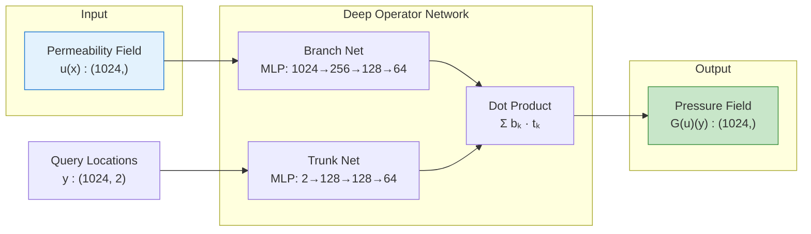
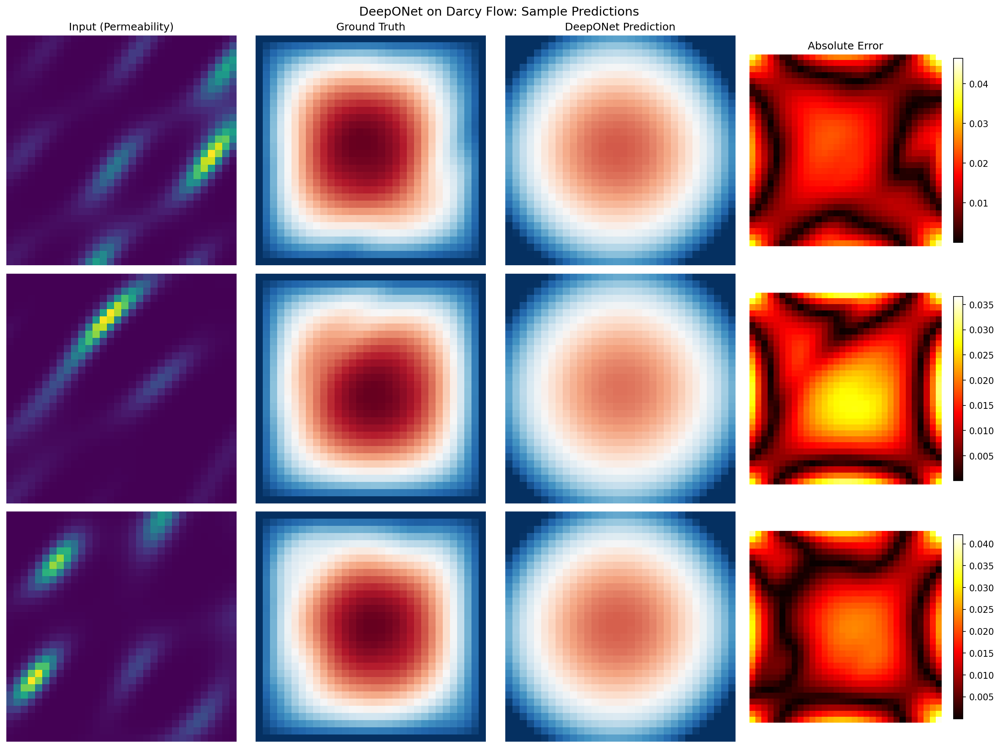
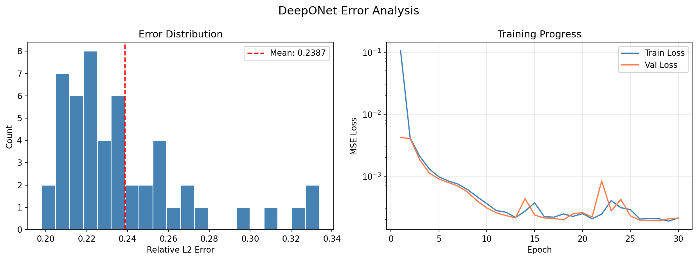
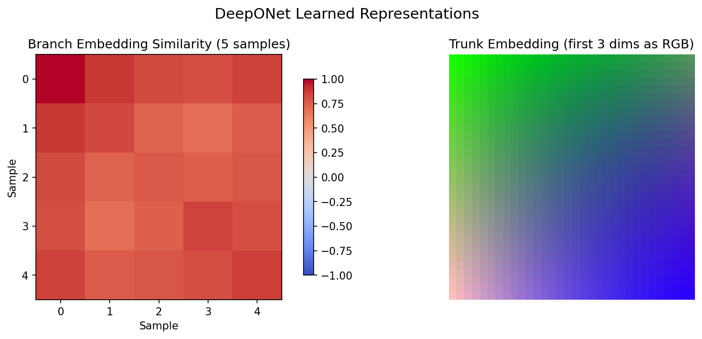

# DeepONet on Darcy Flow

| Metadata          | Value                           |
|-------------------|---------------------------------|
| **Level**         | Intermediate                    |
| **Runtime**       | ~2 min (CPU) / ~30s (GPU)       |
| **Prerequisites** | JAX, Flax NNX, Neural Operators basics |
| **Format**        | Python + Jupyter                |
| **Memory**        | ~1 GB RAM                       |

## Overview

Train a Deep Operator Network (DeepONet) to learn the Darcy flow operator,
which maps permeability coefficient fields to pressure solutions. Unlike FNO
which operates on grids, DeepONet uses a branch-trunk architecture that is
**resolution-independent** -- once trained, it can be queried at arbitrary
spatial locations.

## What You'll Learn

1. **Reshape** grid data into DeepONet's branch/trunk format
2. **Create** a `DeepONet` with branch and trunk networks
3. **Train** with a custom loop using `nnx.Optimizer`
4. **Evaluate** predictions and analyze learned representations

## Coming from NeuralOperator (PyTorch)?

If you are familiar with the neuraloperator library's DeepONet implementation:

| NeuralOperator (PyTorch)             | Opifex (JAX)                                      |
|--------------------------------------|---------------------------------------------------|
| `DeepONet(branch_net, trunk_net)`    | `DeepONet(branch_sizes, trunk_sizes, rngs=...)`   |
| `model(u, y)`                        | `model(branch_input, trunk_input)`                |
| `torch.optim.Adam`                   | `nnx.Optimizer(model, optax.adam(lr), wrt=nnx.Param)` |
| Manual `loss.backward()`             | `nnx.value_and_grad(loss_fn)(model)`              |

**Key differences:**

1. **Flax NNX modules**: Explicit PRNG, functional transforms
2. **XLA compilation**: Use `@nnx.jit` instead of `torch.compile`
3. **Integrated layer sizes**: Pass `[input, hidden..., output]` lists directly
4. **Training options**: Custom loop with `nnx.Optimizer`, or wrap with `DeepONetTrainerAdapter` for `BasicTrainer` compatibility

## Files

- **Python Script**: [`examples/neural-operators/deeponet_darcy.py`](https://github.com/Opifex/Opifex/blob/main/examples/neural-operators/deeponet_darcy.py)
- **Jupyter Notebook**: [`examples/neural-operators/deeponet_darcy.ipynb`](https://github.com/Opifex/Opifex/blob/main/examples/neural-operators/deeponet_darcy.ipynb)

## Quick Start

### Run the Python Script

```bash
source activate.sh && python examples/neural-operators/deeponet_darcy.py
```

### Run the Jupyter Notebook

```bash
jupyter lab examples/neural-operators/deeponet_darcy.ipynb
```

## Core Concepts

### DeepONet Architecture

DeepONet learns nonlinear operators $G: u \to G(u)$ mapping between function spaces:

$$G(u)(y) = \sum_{k=1}^{p} b_k(u(x_1), \ldots, u(x_m)) \cdot t_k(y)$$

where:

- **Branch network** $b_k$: Encodes the input function $u$ evaluated at $m$ sensor locations
- **Trunk network** $t_k$: Encodes the evaluation location $y$
- **Output**: Dot product of $p$-dimensional branch and trunk embeddings



### FNO vs DeepONet

| Aspect             | FNO                           | DeepONet                        |
|--------------------|-------------------------------|---------------------------------|
| Grid structure     | Fixed resolution required     | Arbitrary point evaluation      |
| Data efficiency    | Better for grid problems      | Requires more data typically    |
| Resolution         | Tied to training resolution   | Resolution-independent          |
| Architecture       | Spectral convolutions         | Branch-trunk MLP decomposition  |

## Implementation

### Step 1: Imports and Setup

```python
import jax
import jax.numpy as jnp
import numpy as np
from flax import nnx
import optax

from opifex.data.loaders import create_darcy_loader
from opifex.neural.operators.deeponet import DeepONet
```

**Terminal Output:**

```text
======================================================================
Opifex Example: DeepONet on Darcy Flow
======================================================================
JAX backend: gpu
JAX devices: [CudaDevice(id=0)]
Resolution: 32x32
Training samples: 200, Test samples: 50
Sensors: 1024, Latent dim: 64
```

### Step 2: Data Preparation

DeepONet requires reshaping grid data into sensor values and coordinate queries:

```python
train_loader = create_darcy_loader(
    n_samples=200, batch_size=200, resolution=32,
    shuffle=True, seed=42, worker_count=0,
)
train_batch = next(iter(train_loader))

# Flatten grid to sensor values for branch input
X_train_branch = X_train_grid.reshape(N, -1)  # (200, 1024)

# Create coordinate grid for trunk input
x_coords = np.linspace(0, 1, 32)
y_coords = np.linspace(0, 1, 32)
xx, yy = np.meshgrid(x_coords, y_coords)
trunk_coords = np.stack([xx.ravel(), yy.ravel()], axis=-1)  # (1024, 2)
```

**Terminal Output:**

```text
Branch input: (200, 1024)
Trunk input:  (1024, 2)
Target:       (200, 1024)
```

### Step 3: Model Creation

The branch and trunk must have matching output dimensions (latent_dim=64):

```python
model = DeepONet(
    branch_sizes=[1024, 256, 128, 64],  # sensors → latent
    trunk_sizes=[2, 128, 128, 64],       # coords → latent
    activation="gelu",
    rngs=nnx.Rngs(42),
)
```

**Terminal Output:**

```text
Model: DeepONet (latent_dim=64)
Branch: [1024, 256, 128, 64]
Trunk:  [2, 128, 128, 64]
Total parameters: 328,704
```

### Step 4: Training with Custom Loop

DeepONet takes separate branch and trunk inputs, so we use `nnx.Optimizer`
directly instead of the grid-based `Trainer`:

```python
opt = nnx.Optimizer(model, optax.adam(1e-3), wrt=nnx.Param)

@nnx.jit
def train_step(model, opt, x_branch, y_target):
    def loss_fn(model):
        trunk_batch = jnp.broadcast_to(trunk_jax[None], (batch_size, *trunk_jax.shape))
        y_pred = model(x_branch, trunk_batch)
        return jnp.mean((y_pred - y_target) ** 2)

    loss, grads = nnx.value_and_grad(loss_fn)(model)
    opt.update(model, grads)
    return loss
```

**Terminal Output:**

```text
Optimizer: Adam (lr=0.001)

Starting training (30 epochs)...
  Epoch   1/30: train_loss=0.040347, val_loss=0.003253
  Epoch  10/30: train_loss=0.000027, val_loss=0.000026
  Epoch  20/30: train_loss=0.000014, val_loss=0.000013
  Epoch  30/30: train_loss=0.000010, val_loss=0.000010

Training completed in 2.4s
Final train loss: 9.870162e-06
Final val loss:   9.561398e-06
```

### Step 5: Evaluation

**Terminal Output:**

```text
Running evaluation...
Test MSE:         0.000010
Test Relative L2: 0.320663
Min Relative L2:  0.230521
Max Relative L2:  0.503679

======================================================================
DeepONet Darcy Flow example completed in 2.4s
Test MSE: 0.000010, Relative L2: 0.320663
Results saved to: docs/assets/examples/deeponet_darcy
======================================================================
```

### Visualization

#### Sample Predictions

Input permeability, ground truth pressure, DeepONet prediction, and absolute error
for three test samples:



#### Error Analysis

Error distribution across test samples and training convergence:



#### Branch-Trunk Embeddings

The learned branch and trunk representations reveal how DeepONet decomposes
the operator:



The trunk embedding (right) shows the spatial structure learned by the trunk network,
while the branch similarity matrix (left) shows how different input functions
are encoded in the latent space.

## Results Summary

| Metric              | Value     |
|---------------------|-----------|
| Test MSE            | 0.000010  |
| Relative L2 Error   | 0.321     |
| Training Time       | 2.4s (GPU)|
| Parameters          | 328,704   |
| Final Train Loss    | 9.87e-6   |
| Final Val Loss      | 9.56e-6   |

## Next Steps

### Experiments to Try

1. **Increase latent dimension**: Try `latent_dim=128` for more expressive embeddings
2. **Add more hidden layers**: Deeper branch/trunk networks for complex operators
3. **Higher resolution**: Apply to 64x64 or 128x128 grids (adjust sensor count)
4. **Periodic BCs**: Modify trunk network to handle periodic boundary conditions

### Related Examples

| Example                                       | Level        | What You'll Learn              |
|-----------------------------------------------|--------------|--------------------------------|
| [DeepONet on Antiderivative](deeponet-antiderivative.md) | Intermediate | Classic operator learning task |
| [FNO on Darcy Flow](fno-darcy.md)             | Intermediate | Compare with grid-based FNO    |
| [UNO on Darcy Flow](uno-darcy.md)             | Intermediate | Multi-scale UNO approach       |

### API Reference

- [`DeepONet`](../../api/neural.md) - Deep Operator Network model class
- [`DeepONetTrainerAdapter`](../../api/neural.md) - Wraps DeepONet for `BasicTrainer` compatibility (accepts `{'branch': ..., 'trunk': ...}` dict input)
- [`create_darcy_loader`](../../api/data.md) - Darcy flow data loader

## Troubleshooting

### Shape mismatch between branch and trunk outputs

**Symptom**: Error like `Incompatible shapes for dot: got (batch, 64) and (batch, 128)`.

**Cause**: Branch and trunk networks have different final dimensions.

**Solution**: Ensure the last element of `branch_sizes` and `trunk_sizes` match:

```python
model = DeepONet(
    branch_sizes=[1024, 256, 128, 64],  # Last: 64
    trunk_sizes=[2, 128, 128, 64],       # Last: 64 (must match!)
    rngs=nnx.Rngs(42),
)
```

### DeepONet doesn't work with Trainer

**Symptom**: `Trainer.fit()` fails with DeepONet.

**Cause**: `Trainer` expects single-input models, but DeepONet takes two inputs.

**Solution**: Use a custom training loop with `nnx.Optimizer`:

```python
opt = nnx.Optimizer(model, optax.adam(1e-3), wrt=nnx.Param)

@nnx.jit
def train_step(model, opt, x_branch, x_trunk, y_target):
    def loss_fn(model):
        y_pred = model(x_branch, x_trunk)
        return jnp.mean((y_pred - y_target) ** 2)

    loss, grads = nnx.value_and_grad(loss_fn)(model)
    opt.update(model, grads)
    return loss
```

### High relative L2 error

**Symptom**: Relative L2 error > 0.5 even after convergence.

**Cause**: DeepONet requires more data than FNO for grid problems. The branch network
needs to learn to encode the full input function from sensor values.

**Solution**: Increase training data or sensor count:

```python
# More training samples
train_loader = create_darcy_loader(n_samples=500, ...)

# Or higher sensor resolution (64x64 = 4096 sensors)
branch_sizes = [4096, 512, 256, 64]
```
