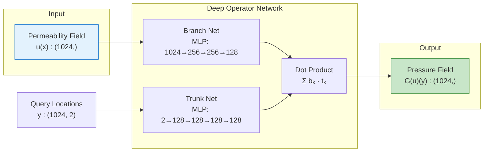
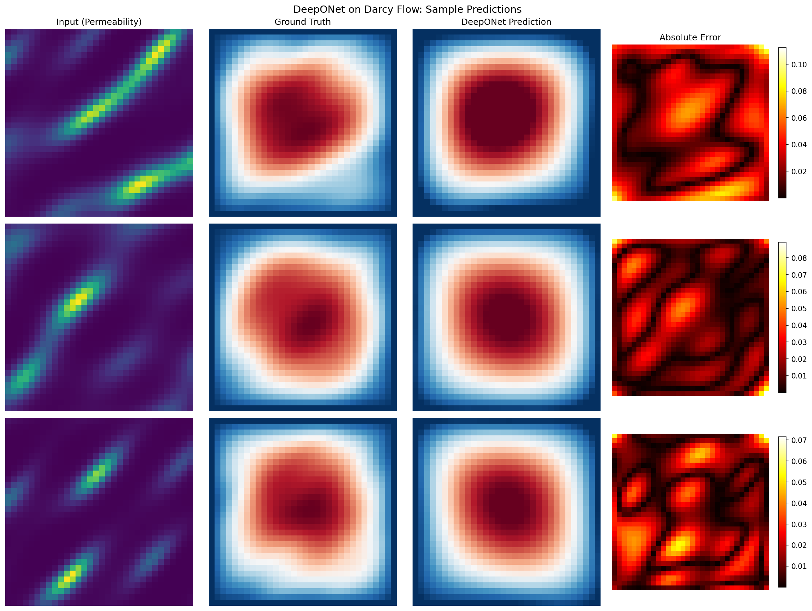
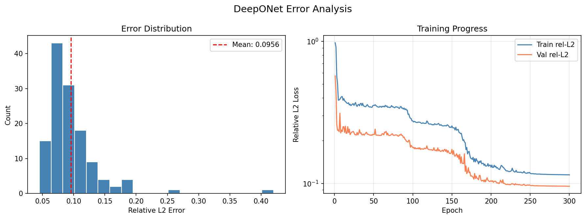
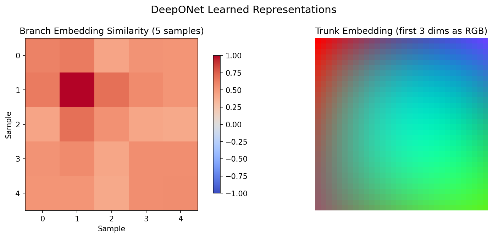

# DeepONet on Darcy Flow

| Metadata          | Value                           |
|-------------------|---------------------------------|
| **Level**         | Intermediate                    |
| **Runtime**       | ~2 min (CPU) / ~20s (GPU)       |
| **Prerequisites** | JAX, Flax NNX, Neural Operators basics |
| **Format**        | Python + Jupyter                |
| **Memory**        | ~1 GB RAM                       |

## Overview

Train a Deep Operator Network (DeepONet) to learn the Darcy flow operator,
which maps permeability coefficient fields to pressure solutions. Unlike FNO
which operates on grids, DeepONet uses a branch-trunk architecture that is
**resolution-independent** -- once trained, it can be queried at arbitrary
spatial locations.

This example applies the standard operator-learning recipe -- ~1000 training
samples, Gaussian input/output normalization, and the relative-L2 objective --
to drive the test relative L2 error to ~0.096.

## What You'll Learn

1. **Reshape** grid data into DeepONet's branch/trunk format
2. **Normalize** inputs and targets with training-set Gaussian statistics
3. **Create** a `DeepONet` with branch and trunk networks
4. **Train** with a custom loop using `nnx.Optimizer` and the relative-L2 loss
5. **Evaluate** predictions and analyze learned representations

## Coming from NeuralOperator (PyTorch)?

If you are familiar with the neuraloperator library's DeepONet implementation:

| NeuralOperator (PyTorch)             | Opifex (JAX)                                      |
|--------------------------------------|---------------------------------------------------|
| `DeepONet(branch_net, trunk_net)`    | `DeepONet(branch_sizes, trunk_sizes, rngs=...)`   |
| `model(u, y)`                        | `model(branch_input, trunk_input)`                |
| `torch.optim.Adam`                   | `nnx.Optimizer(model, optax.adam(schedule), wrt=nnx.Param)` |
| Manual `loss.backward()`             | `nnx.value_and_grad(loss_fn)(model)`              |

**Key differences:**

1. **Flax NNX modules**: Explicit PRNG, functional transforms
2. **XLA compilation**: Use `@nnx.jit` instead of `torch.compile`
3. **Integrated layer sizes**: Pass `[input, hidden..., output]` lists directly
4. **Training options**: Custom loop with `nnx.Optimizer`, or wrap with `DeepONetTrainerAdapter` for `BasicTrainer` compatibility

## Files

- **Python Script**: [`examples/neural-operators/deeponet_darcy.py`](https://github.com/avitai/opifex/blob/main/examples/neural-operators/deeponet_darcy.py)
- **Jupyter Notebook**: [`examples/neural-operators/deeponet_darcy.ipynb`](https://github.com/avitai/opifex/blob/main/examples/neural-operators/deeponet_darcy.ipynb)

## Quick Start

### Run the Python Script

```bash
source activate.sh && python examples/neural-operators/deeponet_darcy.py
```

### Run the Jupyter Notebook

```bash
jupyter lab examples/neural-operators/deeponet_darcy.ipynb
```

## Core Concepts

### DeepONet Architecture

DeepONet learns nonlinear operators $G: u \to G(u)$ mapping between function spaces:

$$G(u)(y) = \sum_{k=1}^{p} b_k(u(x_1), \ldots, u(x_m)) \cdot t_k(y)$$

where:

- **Branch network** $b_k$: Encodes the input function $u$ evaluated at $m$ sensor locations
- **Trunk network** $t_k$: Encodes the evaluation location $y$
- **Output**: Dot product of $p$-dimensional branch and trunk embeddings


```mermaid
graph LR
    subgraph Input
        A["Permeability Field<br/>u(x) : (1024,)"]
    end

    subgraph DeepONet["Deep Operator Network"]
        B["Branch Net<br/>MLP: 1024→256→256→128"]
        C["Trunk Net<br/>MLP: 2→128→128→128→128"]
        D["Dot Product<br/>Σ bₖ · tₖ"]
    end

    subgraph Output
        E["Pressure Field<br/>G(u)(y) : (1024,)"]
    end

    A --> B
    F["Query Locations<br/>y : (1024, 2)"] --> C
    B --> D
    C --> D
    D --> E

    style A fill:#e3f2fd,stroke:#1976d2
    style E fill:#c8e6c9,stroke:#388e3c
```

### FNO vs DeepONet

| Aspect             | FNO                           | DeepONet                        |
|--------------------|-------------------------------|---------------------------------|
| Grid structure     | Fixed resolution required     | Arbitrary point evaluation      |
| Data efficiency    | Better for grid problems      | Requires more data typically    |
| Resolution         | Tied to training resolution   | Resolution-independent          |
| Architecture       | Spectral convolutions         | Branch-trunk MLP decomposition  |

## Implementation

### Step 1: Imports and Setup

```python
import jax
import jax.numpy as jnp
import numpy as np
from flax import nnx
import optax

from opifex.data.loaders import create_darcy_loader
from opifex.neural.operators.deeponet import DeepONet
```

**Terminal Output:**

```text
JAX backend: gpu
JAX devices: [CudaDevice(id=0)]
Resolution: 32x32
Training samples: 1000, Test samples: 100
Sensors: 1024, Latent dim: 128
```

### Step 2: Data Preparation and Normalization

DeepONet requires reshaping grid data into sensor values and coordinate queries.
`create_darcy_loader` returns a frozen `PDELoaders` whose `.train`/`.val`
datarax pipelines yield channels-first dicts with `"input"`/`"output"` of shape
`(b, 1, res, res)`; we collect both splits and drop the channel axis. We then
fit Gaussian statistics on the training split and standardize the branch input
and the target -- the standard operator-learning normalization:

```python
n_samples = N_TRAIN + N_TEST
loaders = create_darcy_loader(
    n_samples=n_samples,
    batch_size=BATCH_SIZE,
    resolution=RESOLUTION,
    val_fraction=N_TEST / n_samples,
    seed=SEED,
)


def _collect(pipeline) -> tuple[np.ndarray, np.ndarray]:
    inputs, outputs = [], []
    for batch in pipeline:
        inputs.append(np.asarray(batch["input"]))
        outputs.append(np.asarray(batch["output"]))
    return np.concatenate(inputs, axis=0), np.concatenate(outputs, axis=0)


X_train_grid, Y_train_grid = _collect(loaders.train)  # (N, 1, res, res)
X_test_grid, Y_test_grid = _collect(loaders.val)  # (N, 1, res, res)

# Drop the channel axis so the viz/grid views are (N, res, res).
X_train_grid = X_train_grid[:, 0]
Y_train_grid = Y_train_grid[:, 0]
X_test_grid = X_test_grid[:, 0]
Y_test_grid = Y_test_grid[:, 0]

# Flatten grid to sensor values for branch input
X_train_branch = X_train_grid.reshape(X_train_grid.shape[0], -1)  # (1024, 1024)

# Create coordinate grid for trunk input
x_coords = np.linspace(0, 1, RESOLUTION)
y_coords = np.linspace(0, 1, RESOLUTION)
xx, yy = np.meshgrid(x_coords, y_coords)
trunk_coords = np.stack([xx.ravel(), yy.ravel()], axis=-1)  # (1024, 2)

# Gaussian normalization fit on the training split
x_mean, x_std = X_train_branch.mean(), X_train_branch.std()
y_mean, y_std = Y_train_flat.mean(), Y_train_flat.std()
X_train_branch_n = (X_train_branch - x_mean) / x_std
Y_train_flat_n = (Y_train_flat - y_mean) / y_std
```

**Terminal Output:**

```text
Branch input: (1024, 1024)
Trunk input:  (1024, 2)
Target:       (1024, 1024)
Input mean/std:  0.1778 / 0.1302
Output mean/std: 0.213690 / 0.155666
```

### Step 3: Model Creation

The branch and trunk must have matching output dimensions (latent_dim=128):

```python
model = DeepONet(
    branch_sizes=[1024, 256, 256, 128],  # sensors → latent
    trunk_sizes=[2, 128, 128, 128, 128],  # coords → latent
    activation="gelu",
    rngs=nnx.Rngs(42),
)
```

**Terminal Output:**

```text
Model: DeepONet (latent_dim=128)
Branch: [1024, 256, 256, 128]
Trunk:  [2, 128, 128, 128, 128]
Total parameters: 411,008
```

### Step 4: Training with Custom Loop

DeepONet takes separate branch and trunk inputs, so we use `nnx.Optimizer`
directly instead of the grid-based `Trainer`. We optimize the **relative-L2
loss** -- the standard operator-learning objective -- on the normalized fields,
using Adam with a warmup-cosine learning-rate schedule:

```python
lr_schedule = optax.warmup_cosine_decay_schedule(
    init_value=1e-4, peak_value=1e-3,
    warmup_steps=10 * steps_per_epoch,
    decay_steps=300 * steps_per_epoch, end_value=2e-5,
)
opt = nnx.Optimizer(model, optax.adam(lr_schedule), wrt=nnx.Param)


def relative_l2_loss(y_pred, y_target):
    numerator = jnp.linalg.norm(y_pred - y_target, axis=-1)
    denominator = jnp.linalg.norm(y_target, axis=-1) + 1e-8
    return jnp.mean(numerator / denominator)


@nnx.jit
def train_step(model, opt, x_branch, y_target):
    def loss_fn(model):
        trunk_batch = jnp.broadcast_to(trunk_jax[None], (batch_size, *trunk_jax.shape))
        y_pred = model(x_branch, trunk_batch)
        return relative_l2_loss(y_pred, y_target)

    loss, grads = nnx.value_and_grad(loss_fn)(model)
    opt.update(model, grads)
    return loss
```

**Terminal Output:**

```text
Optimizer: Adam + warmup-cosine (peak lr=0.001), loss: relative L2

Starting training (300 epochs)...
  Epoch   1/300: train_rel_l2=0.976938, val_rel_l2=0.570805
  Epoch  20/300: train_rel_l2=0.361212, val_rel_l2=0.220560
  Epoch  40/300: train_rel_l2=0.346964, val_rel_l2=0.226637
  Epoch  60/300: train_rel_l2=0.343366, val_rel_l2=0.218275
  Epoch  80/300: train_rel_l2=0.343839, val_rel_l2=0.218670
  Epoch 100/300: train_rel_l2=0.275530, val_rel_l2=0.178635
  Epoch 120/300: train_rel_l2=0.263607, val_rel_l2=0.173579
  Epoch 140/300: train_rel_l2=0.254315, val_rel_l2=0.171776
  Epoch 160/300: train_rel_l2=0.227417, val_rel_l2=0.160063
  Epoch 180/300: train_rel_l2=0.141780, val_rel_l2=0.108270
  Epoch 200/300: train_rel_l2=0.130007, val_rel_l2=0.104614
  Epoch 220/300: train_rel_l2=0.122391, val_rel_l2=0.098307
  Epoch 240/300: train_rel_l2=0.118580, val_rel_l2=0.097228
  Epoch 260/300: train_rel_l2=0.116379, val_rel_l2=0.096163
  Epoch 280/300: train_rel_l2=0.115441, val_rel_l2=0.095856
  Epoch 300/300: train_rel_l2=0.114946, val_rel_l2=0.095595

Training completed in 20.5s
Final train rel-L2: 1.149460e-01
Final val rel-L2:   9.559528e-02
```

### Step 5: Evaluation

Predictions are run through the model in batches and un-normalized back to
physical pressure before measuring the relative L2 error:

```python
predictions = predict_in_batches(model, X_test_jax) * y_std + y_mean
```

**Terminal Output:**

```text
Test MSE:         6.161190e-04
Test Relative L2: 0.095595
Min Relative L2:  0.045070
Max Relative L2:  0.420210

======================================================================
DeepONet Darcy Flow example completed in 20.5s
Test MSE: 0.000616, Relative L2: 0.095595
Results saved to: docs/assets/examples/deeponet_darcy
======================================================================
```

### Visualization

#### Sample Predictions

Input permeability, ground truth pressure, DeepONet prediction, and absolute error
for three test samples:



#### Error Analysis

Error distribution across test samples and training convergence:



#### Branch-Trunk Embeddings

The learned branch and trunk representations reveal how DeepONet decomposes
the operator:



The trunk embedding (right) shows the spatial structure learned by the trunk network,
while the branch similarity matrix (left) shows how different input functions
are encoded in the latent space.

## Results Summary

| Metric                  | Value       |
|-------------------------|-------------|
| Test MSE                | 6.16e-4     |
| Relative L2 Error       | 0.0956      |
| Min / Max Relative L2   | 0.0451 / 0.4202 |
| Training Time           | 20.5s (GPU) |
| Parameters              | 411,008     |
| Final Train rel-L2      | 1.15e-1     |
| Final Val rel-L2        | 9.56e-2     |

The operator-learning recipe -- 1000 training samples, Gaussian normalization,
and the relative-L2 objective with a warmup-cosine schedule -- drives the test
relative L2 to ~0.096, substantially better than an unnormalized MSE-trained
baseline.

## Next Steps

### Experiments to Try

1. **Increase latent dimension**: Try `latent_dim=256` for more expressive embeddings
2. **Add more hidden layers**: Deeper branch/trunk networks for complex operators
3. **Higher resolution**: Apply to 64x64 or 128x128 grids (adjust sensor count)
4. **Periodic BCs**: Modify trunk network to handle periodic boundary conditions

### Related Examples

| Example                                       | Level        | What You'll Learn              |
|-----------------------------------------------|--------------|--------------------------------|
| [DeepONet on Antiderivative](deeponet-antiderivative.md) | Intermediate | Classic operator learning task |
| [FNO on Darcy Flow](fno-darcy.md)             | Intermediate | Compare with grid-based FNO    |
| [UNO on Darcy Flow](uno-darcy.md)             | Intermediate | Multi-scale UNO approach       |

### API Reference

- [`DeepONet`](../../api/neural.md) - Deep Operator Network model class
- [`DeepONetTrainerAdapter`](../../api/neural.md) - Wraps DeepONet for `BasicTrainer` compatibility (accepts `{'branch': ..., 'trunk': ...}` dict input)
- [`create_darcy_loader`](../../api/data.md) - Darcy flow data loader

## Troubleshooting

### Shape mismatch between branch and trunk outputs

**Symptom**: Error like `Incompatible shapes for dot: got (batch, 64) and (batch, 128)`.

**Cause**: Branch and trunk networks have different final dimensions.

**Solution**: Ensure the last element of `branch_sizes` and `trunk_sizes` match:

```python
model = DeepONet(
    branch_sizes=[1024, 256, 128, 64],  # Last: 64
    trunk_sizes=[2, 128, 128, 64],       # Last: 64 (must match!)
    rngs=nnx.Rngs(42),
)
```

### DeepONet doesn't work with Trainer

**Symptom**: `Trainer.fit()` fails with DeepONet.

**Cause**: `Trainer` expects single-input models, but DeepONet takes two inputs.

**Solution**: Use a custom training loop with `nnx.Optimizer`:

```python
opt = nnx.Optimizer(model, optax.adam(1e-3), wrt=nnx.Param)

@nnx.jit
def train_step(model, opt, x_branch, x_trunk, y_target):
    def loss_fn(model):
        y_pred = model(x_branch, x_trunk)
        return jnp.mean((y_pred - y_target) ** 2)

    loss, grads = nnx.value_and_grad(loss_fn)(model)
    opt.update(model, grads)
    return loss
```

### High relative L2 error

**Symptom**: Relative L2 error stays above 0.2 even after many epochs.

**Cause**: The operator-learning recipe is incomplete. Training on un-normalized
fields with an MSE loss and too few samples leaves the branch network unable to
encode the input function, and DeepONet's dot-product landscape plateaus early.

**Solution**: Apply the full recipe used in this example:

```python
# 1. Use enough data (~1000 samples) and epochs (~300)
train_loader = create_darcy_loader(n_samples=1000, ...)

# 2. Gaussian-normalize the branch input and target on the TRAIN split
X_train_branch_n = (X_train_branch - x_mean) / x_std
Y_train_flat_n = (Y_train_flat - y_mean) / y_std

# 3. Optimize the relative-L2 loss (not MSE)
def relative_l2_loss(y_pred, y_target):
    num = jnp.linalg.norm(y_pred - y_target, axis=-1)
    den = jnp.linalg.norm(y_target, axis=-1) + 1e-8
    return jnp.mean(num / den)
```
