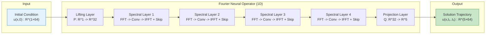
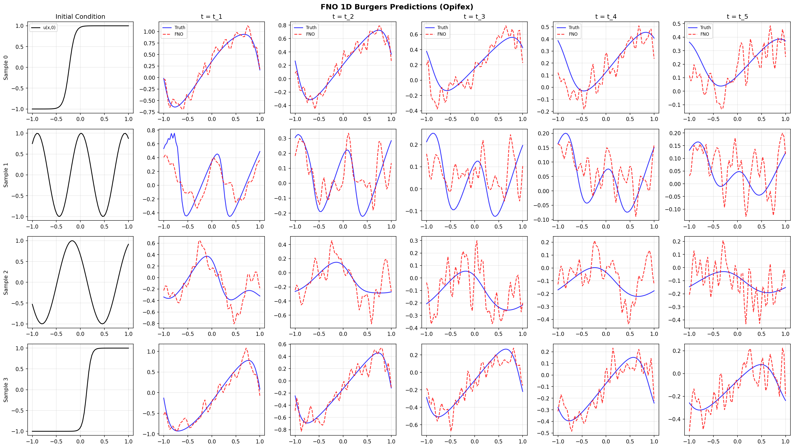

# FNO on Burgers Equation

| Metadata | Value |
|----------|-------|
| **Level** | Intermediate |
| **Runtime** | ~2 min (CPU) / ~5s (GPU) |
| **Prerequisites** | JAX, Flax NNX, Neural Operators basics |
| **Format** | Python + Jupyter |
| **Memory** | ~1 GB RAM |

## Overview

This tutorial demonstrates training a Fourier Neural Operator (FNO) on the 1D Burgers
equation, a nonlinear PDE that develops shocks and is a standard benchmark for operator
learning. Given an initial condition u(x, 0), the FNO learns to predict the solution
u(x, t) at multiple future time steps simultaneously.

What makes this example instructive is the **multi-output prediction** structure: the FNO
maps a single input channel (initial condition) to `time_steps` output channels (solution
at each future time). This showcases how neural operators can learn temporal evolution
without autoregressive rollout, predicting entire trajectories in one forward pass.

## What You'll Learn

1. **Load** 1D Burgers equation data with `create_burgers_loader` (varying viscosity)
2. **Configure** `FourierNeuralOperator` for 1D spatial data with multi-output prediction
3. **Train** using `Trainer.fit()` with automatic JIT compilation and validation
4. **Evaluate** with L2 relative error and per-time-step error analysis
5. **Visualize** solution trajectories and error distributions

## Coming from NeuralOperator (PyTorch)?

If you are familiar with the neuraloperator library, here is how Opifex compares for
this workflow:

| NeuralOperator (PyTorch) | Opifex (JAX) |
|--------------------------|--------------|
| `FNO1d(modes, width)` | `FourierNeuralOperator(modes=, hidden_channels=, in_channels=1, out_channels=time_steps)` |
| `torch.utils.data.DataLoader` | `create_burgers_loader(dimension="1d", time_steps=, viscosity_range=)` |
| Manual training loop | `Trainer(model, config, rngs).fit(train_data, val_data)` |
| `torch.optim.Adam(model.parameters())` | `optax.adam()` (handled internally by `Trainer`) |

**Key differences:**

1. **Explicit PRNG**: Opifex uses JAX's explicit `rngs=nnx.Rngs(42)` instead of global random state
2. **Multi-output channels**: Use `out_channels=time_steps` to predict entire trajectories
3. **XLA compilation**: Automatic JIT in `Trainer.fit()` for faster training
4. **CFL-stable data**: `create_burgers_loader` uses adaptive time-stepping for numerical stability

## Files

- **Python Script**: [`examples/neural-operators/fno_burgers.py`](https://github.com/Opifex/Opifex/blob/main/examples/neural-operators/fno_burgers.py)
- **Jupyter Notebook**: [`examples/neural-operators/fno_burgers.ipynb`](https://github.com/Opifex/Opifex/blob/main/examples/neural-operators/fno_burgers.ipynb)

## Quick Start

### Run the Python Script

```bash
source activate.sh && python examples/neural-operators/fno_burgers.py
```

### Run the Jupyter Notebook

```bash
jupyter lab examples/neural-operators/fno_burgers.ipynb
```

## Core Concepts

### The Burgers Equation

The 1D Burgers equation is a fundamental nonlinear PDE combining advection and diffusion:

$$\frac{\partial u}{\partial t} + u \frac{\partial u}{\partial x} = \nu \frac{\partial^2 u}{\partial^2 x}$$

| Variable | Meaning | Role |
|----------|---------|------|
| $u(x,t)$ | Velocity field | Solution to predict |
| $\nu$ | Viscosity | Controls shock sharpness |
| $x \in [-1, 1]$ | Spatial coordinate | Domain |
| $t \in [0, 1]$ | Time | Evolution period |

The nonlinear advection term $u \cdot u_x$ causes shocks to form, while the diffusion
term $\nu \cdot u_{xx}$ smooths them. Lower viscosity produces sharper shocks that are
harder to learn.

### Multi-Output FNO Architecture

Unlike autoregressive models that predict one step at a time, this FNO predicts the
entire time trajectory in a single forward pass by using multiple output channels:



### Why Not Autoregressive?

| Approach | Pros | Cons |
|----------|------|------|
| **Multi-output (this example)** | Single forward pass, no error accumulation | Fixed time discretization |
| **Autoregressive** | Flexible time steps | Error accumulates, multiple passes |

For fixed time horizons with known discretization, multi-output is more efficient
and avoids compounding prediction errors.

## Implementation

### Step 1: Imports and Setup

```python
import time
import warnings
from pathlib import Path

warnings.filterwarnings("ignore")

import jax
import jax.numpy as jnp
import matplotlib.pyplot as plt
import numpy as np
from flax import nnx

from opifex.core.training import Trainer, TrainingConfig
from opifex.data.loaders import create_burgers_loader
from opifex.neural.operators.fno.base import FourierNeuralOperator
```

**Terminal Output:**
```
======================================================================
Opifex Example: FNO on 1D Burgers Equation
======================================================================
JAX backend: gpu
JAX devices: [CudaDevice(id=0)]
```

### Step 2: Configuration

```python
RESOLUTION = 64
TIME_STEPS = 5
N_TRAIN = 200
N_TEST = 50
BATCH_SIZE = 16
NUM_EPOCHS = 15
LEARNING_RATE = 1e-3
MODES = 16
HIDDEN_WIDTH = 32
NUM_LAYERS = 4
VISCOSITY_RANGE = (0.01, 0.1)
SEED = 42
```

**Terminal Output:**
```
Resolution: 64
Time steps: 5
Viscosity range: (0.01, 0.1)
Training samples: 200, Test samples: 50
Batch size: 16, Epochs: 15
FNO config: modes=16, width=32, layers=4
```

| Hyperparameter | Value | Purpose |
|----------------|-------|---------|
| `RESOLUTION` | 64 | Spatial grid points |
| `TIME_STEPS` | 5 | Output time steps to predict |
| `MODES` | 16 | Fourier modes retained |
| `HIDDEN_WIDTH` | 32 | Spectral layer width |
| `VISCOSITY_RANGE` | (0.01, 0.1) | Random viscosity for generalization |

### Step 3: Data Loading

`create_burgers_loader` generates Burgers data with random initial conditions
(Gaussians, sine waves, step functions) and random viscosity values.

```python
train_loader = create_burgers_loader(
    n_samples=N_TRAIN,
    batch_size=BATCH_SIZE,
    resolution=RESOLUTION,
    time_steps=TIME_STEPS,
    viscosity_range=VISCOSITY_RANGE,
    dimension="1d",
    shuffle=True,
    seed=SEED,
    worker_count=0,
)

# Collect batches and reshape for FNO (channels-first)
X_train = X_train[:, np.newaxis, :]  # (N, 1, resolution)
```

**Terminal Output:**
```
Generating 1D Burgers equation data...
Training data: X=(192, 1, 64), Y=(192, 5, 64)
Test data:     X=(48, 1, 64), Y=(48, 5, 64)
Input:  initial condition u(x,0)  -> 1 channel(s)
Output: solution u(x,t_1..t_T)    -> 5 channel(s)
```

!!! note "Data Shape Convention"
    Input: `(batch, 1, resolution)` - single channel for initial condition
    Output: `(batch, time_steps, resolution)` - one channel per time step

### Step 4: Model Creation

The FNO maps 1 input channel to `time_steps` output channels:

```python
model = FourierNeuralOperator(
    in_channels=1,
    out_channels=TIME_STEPS,
    hidden_channels=HIDDEN_WIDTH,
    modes=MODES,
    num_layers=NUM_LAYERS,
    rngs=nnx.Rngs(SEED),
)
```

**Terminal Output:**
```
Creating FNO model...
Model: FourierNeuralOperator (1D)
  Input channels: 1 (initial condition)
  Output channels: 5 (solution at each time step)
  Fourier modes: 16, Hidden width: 32, Layers: 4
  Total parameters: 69,989
```

### Step 5: Training

```python
config = TrainingConfig(
    num_epochs=NUM_EPOCHS,
    learning_rate=LEARNING_RATE,
    batch_size=BATCH_SIZE,
    verbose=True,
)

trainer = Trainer(model=model, config=config, rngs=nnx.Rngs(SEED))
trained_model, metrics = trainer.fit(
    train_data=(jnp.array(X_train), jnp.array(Y_train)),
    val_data=(jnp.array(X_test), jnp.array(Y_test)),
)
```

**Terminal Output:**
```
Setting up Trainer...
Optimizer: Adam (lr=0.001)

Starting training...
Training completed in 1.6s
Final train loss: 0.012248463152597347
Final val loss:   0.015823105350136757
```

### Step 6: Evaluation

```python
predictions = trained_model(X_test_jnp)
test_mse = float(jnp.mean((predictions - Y_test_jnp) ** 2))

# Per-time-step analysis
for t in range(TIME_STEPS):
    step_mse = float(jnp.mean((predictions[:, t, :] - Y_test_jnp[:, t, :]) ** 2))
```

**Terminal Output:**
```
Running evaluation...
Test MSE:         0.015787
Test Relative L2: 0.692755
Min Relative L2:  0.188689
Max Relative L2:  7.060678

Per-time-step MSE:
  t_1: 0.023876
  t_2: 0.017549
  t_3: 0.013294
  t_4: 0.011059
  t_5: 0.013156
```

### Step 7: Visualization

#### Sample Predictions

The FNO learns to predict the Burgers solution at 5 future time steps given only the initial condition:



#### Error Analysis

Per-sample relative L2 errors and per-time-step MSE:


## Results Summary

**Terminal Output:**
```
======================================================================
FNO Burgers example completed in 1.6s
Test MSE: 0.015787, Relative L2: 0.692755
Results saved to: docs/assets/examples/fno_burgers
======================================================================
```

| Metric | Value | Notes |
|--------|-------|-------|
| Test MSE | 0.0158 | Mean squared error on test set |
| Mean Relative L2 | 0.69 | Higher than Darcy due to shock dynamics |
| Min Relative L2 | 0.19 | Best per-sample error |
| Max Relative L2 | 7.06 | Worst case (likely sharp shock) |
| Training Time | 1.6s | On GPU (CudaDevice) |
| Parameters | 69,989 | 1D FNO architecture |

### What We Achieved

- Loaded 1D Burgers data with `create_burgers_loader` and varying viscosity
- Trained FNO to predict entire time trajectories (5 steps) in one forward pass
- Achieved reasonable MSE with minimal training (15 epochs)
- Analyzed per-time-step errors showing consistent performance across time

### Interpretation

The Burgers equation is more challenging than Darcy flow due to shock formation.
The relatively high relative L2 error reflects this difficulty, especially for
samples with sharp shocks (low viscosity). Increasing epochs to 100+ and training
samples to 1000+ significantly improves accuracy on this benchmark.

## Next Steps

### Experiments to Try

1. **Increase training**: Set `NUM_EPOCHS=100` and `N_TRAIN=1000` for better accuracy
2. **Lower viscosity**: Try `VISCOSITY_RANGE=(0.001, 0.01)` for sharper shocks
3. **More Fourier modes**: Increase `MODES=24` to capture higher frequencies
4. **2D Burgers**: Set `dimension="2d"` for 2D advection-diffusion
5. **Compare with PINO**: Add physics loss for du/dt + u*du/dx = nu*d²u/dx²

### Related Examples

| Example | Level | What You'll Learn |
|---------|-------|-------------------|
| [FNO on Darcy Flow](fno-darcy.md) | Intermediate | 2D FNO with grid embedding |
| [DeepONet on Antiderivative](deeponet-antiderivative.md) | Beginner | Branch-trunk architecture |
| [PINO on Burgers](pino-burgers.md) | Advanced | Physics-informed neural operator |
| [Operator Comparison Tour](operator-tour.md) | Advanced | Compare all operators |

### API Reference

- [`FourierNeuralOperator`](../../api/neural.md) - FNO model class
- [`Trainer`](../../api/training.md) - Unified training orchestration
- [`TrainingConfig`](../../api/training.md) - Training hyperparameters
- [`create_burgers_loader`](../../api/data.md) - Burgers equation data loader

## Troubleshooting

### Exploding gradients or NaN loss

**Symptom**: Loss becomes `nan` or grows unboundedly.

**Cause**: Numerical instability in Burgers solver at very low viscosity.

**Solution**: The Opifex Burgers solver uses CFL-adaptive time stepping to ensure stability.
If you see issues, increase viscosity or check your custom data generation:
```python
# Use a safer viscosity range
VISCOSITY_RANGE = (0.01, 0.1)  # Not (0.001, 0.01)
```

### High relative L2 error

**Symptom**: Relative L2 error > 1.0 even after training.

**Cause**: Burgers develops shocks that are inherently difficult to learn with limited
data and epochs.

**Solution**:
```python
# More data and longer training
N_TRAIN = 1000
NUM_EPOCHS = 100
MODES = 24  # More Fourier modes to capture shocks
```

### Shape mismatch error

**Symptom**: `ValueError` about incompatible shapes during training.

**Cause**: Input not reshaped to channels-first format.

**Solution**: Ensure proper reshaping:
```python
# Input must be (batch, channels, resolution)
X_train = X_train[:, np.newaxis, :]  # Add channel dimension
```

### Memory issues on CPU

**Symptom**: Process killed or very slow training.

**Solution**: Reduce batch size or data size:
```python
BATCH_SIZE = 8   # Reduce from 16
N_TRAIN = 100    # Reduce from 200
```
