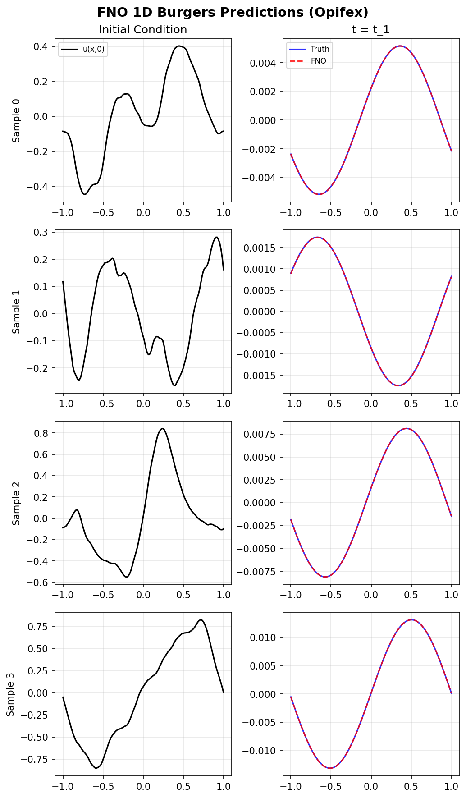
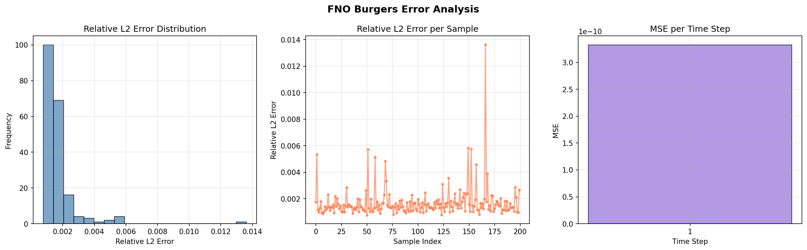

# FNO on Burgers Equation

| Metadata | Value |
|----------|-------|
| **Level** | Intermediate |
| **Runtime** | ~4 min (CPU) / ~84s (GPU) |
| **Prerequisites** | JAX, Flax NNX, Neural Operators basics |
| **Format** | Python + Jupyter |
| **Memory** | ~1 GB RAM |

## Overview

This tutorial demonstrates training a Fourier Neural Operator (FNO) on the 1D Burgers
equation, a nonlinear PDE that develops shocks and is a standard benchmark for operator
learning. This follows the canonical FNO-paper Burgers benchmark (Li et al. 2021): given
an initial condition u(x, 0), the FNO learns to predict the solution u(x, T) at a single
fixed final time.

What makes this example instructive is the **operator-learning** structure: the FNO maps a
single input channel (the initial condition, with the grid coordinate appended as a second
channel) to a single output channel (the final-time solution). This showcases how neural
operators learn a mapping between function spaces in one forward pass — no autoregressive
rollout required.

## What You'll Learn

1. **Load** 1D Burgers equation data with `create_burgers_loader` (datarax pipelines)
2. **Configure** `FourierNeuralOperator` for 1D spatial data with a positional embedding
3. **Train** using `Trainer.fit()` with automatic JIT compilation and validation
4. **Evaluate** with L2 relative error after un-normalizing predictions
5. **Visualize** sample predictions and error distributions

## Coming from NeuralOperator (PyTorch)?

If you are familiar with the neuraloperator library, here is how Opifex compares for
this workflow:

| NeuralOperator (PyTorch) | Opifex (JAX) |
|--------------------------|--------------|
| `FNO1d(modes, width)` | `FourierNeuralOperator(modes=, hidden_channels=, in_channels=1, out_channels=1, spatial_dims=1)` |
| `torch.utils.data.DataLoader` | `create_burgers_loader(resolution=, viscosity_range=, val_fraction=)` |
| Manual training loop | `Trainer(model, config, rngs).fit(train_data, val_data)` |
| `torch.optim.AdamW(model.parameters())` | `optax.adamw()` (handled internally by `Trainer`) |

**Key differences:**

1. **Explicit PRNG**: Opifex uses JAX's explicit `rngs=nnx.Rngs(42)` instead of global random state
2. **Positional embedding**: `positional_embedding=True` appends the grid coordinate, so the input is `(a(x), x)`
3. **XLA compilation**: Automatic JIT in `Trainer.fit()` for faster training
4. **datarax pipelines**: `create_burgers_loader` returns a frozen `PDELoaders` with `.train`/`.val` datarax pipelines

## Files

- **Python Script**: [`examples/neural-operators/fno_burgers.py`](https://github.com/avitai/opifex/blob/main/examples/neural-operators/fno_burgers.py)
- **Jupyter Notebook**: [`examples/neural-operators/fno_burgers.ipynb`](https://github.com/avitai/opifex/blob/main/examples/neural-operators/fno_burgers.ipynb)

## Quick Start

### Run the Python Script

```bash
source activate.sh && python examples/neural-operators/fno_burgers.py
```

### Run the Jupyter Notebook

```bash
jupyter lab examples/neural-operators/fno_burgers.ipynb
```

## Core Concepts

### The Burgers Equation

The 1D Burgers equation is a fundamental nonlinear PDE combining advection and diffusion:

$$\frac{\partial u}{\partial t} + u \frac{\partial u}{\partial x} = \nu \frac{\partial^2 u}{\partial^2 x}$$

| Variable | Meaning | Role |
|----------|---------|------|
| $u(x,t)$ | Velocity field | Solution to predict |
| $\nu$ | Viscosity | Controls shock sharpness |
| $x \in [-1, 1]$ | Spatial coordinate | Domain |
| $t \in [0, 1]$ | Time | Evolution period |

The nonlinear advection term $u \cdot u_x$ causes shocks to form, while the diffusion
term $\nu \cdot u_{xx}$ smooths them. Lower viscosity produces sharper shocks that are
harder to learn.

### FNO Architecture

The FNO maps the initial condition (plus the appended grid coordinate) to the final-time
solution in a single forward pass:


```mermaid
graph LR
    subgraph Input
        A["Initial Condition + grid<br/>(u(x,0), x) : R^(2×128)"]
    end

    subgraph FNO["Fourier Neural Operator (1D)"]
        B["Lifting Layer<br/>P: R^2 -> R^128"]
        C["Spectral Layer 1<br/>FFT -> Conv -> IFFT + Skip"]
        D["Spectral Layer 2<br/>FFT -> Conv -> IFFT + Skip"]
        E["Spectral Layer 3<br/>FFT -> Conv -> IFFT + Skip"]
        F["Spectral Layer 4<br/>FFT -> Conv -> IFFT + Skip"]
        G["Projection Layer<br/>Q: R^128 -> R^1"]
    end

    subgraph Output
        H["Final-time Solution<br/>u(x,T) : R^(1×128)"]
    end

    A --> B --> C --> D --> E --> F --> G --> H

    style A fill:#e3f2fd,stroke:#1976d2
    style H fill:#c8e6c9,stroke:#388e3c
```

### Why Not Autoregressive?

| Approach | Pros | Cons |
|----------|------|------|
| **Direct mapping (this example)** | Single forward pass, no error accumulation | Fixed time horizon |
| **Autoregressive** | Flexible time steps | Error accumulates, multiple passes |

For a fixed time horizon, the direct initial-condition-to-solution map is more efficient
and avoids compounding prediction errors.

## Implementation

### Step 1: Imports and Setup

```python
import time
import warnings
from pathlib import Path

warnings.filterwarnings("ignore")

import jax
import jax.numpy as jnp
import matplotlib as mpl
import numpy as np
from flax import nnx

mpl.use("Agg")
import matplotlib.pyplot as plt

from opifex.core.evaluation import predict_in_batches
from opifex.core.metrics import per_sample_relative_l2
from opifex.core.normalization import GaussianNormalizer
from opifex.core.training import Trainer, TrainingConfig
from opifex.core.training.config import LossConfig, OptimizationConfig
from opifex.data.loaders import create_burgers_loader
from opifex.neural.operators.fno.base import FourierNeuralOperator
```

**Terminal Output:**
```
======================================================================
Opifex Example: FNO on 1D Burgers Equation
======================================================================
JAX backend: gpu
JAX devices: [CudaDevice(id=0)]
```

### Step 2: Configuration

```python
resolution = 128
time_steps = 1
n_train = 1000
n_test = 200
batch_size = 20
num_epochs = 750
learning_rate = 1e-3
weight_decay = 1e-4
modes = 16
hidden_width = 128
num_layers = 4
viscosity_range = (0.1, 0.1)
seed = 42
steps_per_epoch = max(1, n_train // batch_size)
lr_transition_steps = 60 * steps_per_epoch
lr_decay_rate = 0.5
```

**Terminal Output:**
```
Resolution: 128
Time steps: 1
Viscosity range: (0.1, 0.1)
Training samples: 1000, Test samples: 200
Batch size: 20, Epochs: 750
FNO config: modes=16, width=128, layers=4
```

| Hyperparameter | Value | Purpose |
|----------------|-------|---------|
| `resolution` | 128 | Spatial grid points |
| `time_steps` | 1 | Single final-time output |
| `num_epochs` | 750 | Training epochs |
| `modes` | 16 | Fourier modes retained |
| `hidden_width` | 128 | Spectral layer width |
| `viscosity_range` | (0.1, 0.1) | Fixed viscosity (FNO-paper setup) |

### Step 3: Data Loading

`create_burgers_loader` generates the canonical FNO-benchmark Burgers data: initial
conditions are sampled from a Gaussian random field on the periodic domain (covariance
$\sigma^2(-\Delta + \tau^2)^{-\gamma}$) and evolved to the final time with the
pseudo-spectral ETDRK4 solver (`opifex.physics.spectral`, a general semilinear spectral
integrator) at viscosity 0.1. It serves the data through datarax pipelines, returning a
frozen `PDELoaders` with `.train` and `.val` pipelines, split by `val_fraction`. Each
batch is already channels-first: input `u(x,0)` and output `u(x,T)` are both
`(N, 1, resolution)`.

```python
n_samples = n_train + n_test
loaders = create_burgers_loader(
    n_samples=n_samples,
    batch_size=batch_size,
    resolution=resolution,
    viscosity_range=viscosity_range,
    val_fraction=n_test / n_samples,
    seed=seed,
)

# Collect the datarax pipelines into arrays.
def _collect(pipeline) -> tuple[np.ndarray, np.ndarray]:
    inputs, outputs = [], []
    for batch in pipeline:
        inputs.append(np.asarray(batch["input"]))
        outputs.append(np.asarray(batch["output"]))
    return np.concatenate(inputs, axis=0), np.concatenate(outputs, axis=0)

x_train, y_train = _collect(loaders.train)
x_test, y_test = _collect(loaders.val)

# Gaussian normalization (the standard operator-learning recipe).
x_norm = GaussianNormalizer.fit(x_train)
y_norm = GaussianNormalizer.fit(y_train)
x_train_n = x_norm.normalize(x_train)
y_train_n = y_norm.normalize(y_train)
x_test_n = x_norm.normalize(x_test)
y_test_n = y_norm.normalize(y_test)
```

**Terminal Output:**
```
Generating 1D Burgers data (jit+vmap) and serving via datarax...
Training data: X=(1000, 1, 128), Y=(1000, 1, 128)
Test data:     X=(200, 1, 128), Y=(200, 1, 128)
Input:  initial condition u(x,0)  -> 1 channel(s)
Output: solution u(x,t_1..t_T)    -> 1 channel(s)
```

!!! note "Data Shape Convention"
    Input: `(batch, 1, resolution)` - single channel for the initial condition
    Output: `(batch, 1, resolution)` - single channel for the final-time solution

    The split is `val_fraction`-based, so train/test counts match `n_train`/`n_test`
    exactly (1000/200) with no dropped partial batches.

### Step 4: Model Creation

The FNO maps 1 input channel (initial condition) to 1 output channel (final-time
solution). `spatial_dims=1` selects the 1D operator and `positional_embedding=True`
appends the grid coordinate so the effective input is `(a(x), x)`:

```python
model = FourierNeuralOperator(
    in_channels=1,
    out_channels=time_steps,
    hidden_channels=hidden_width,
    modes=modes,
    num_layers=num_layers,
    spatial_dims=1,
    positional_embedding=True,  # append grid coordinate -> input is (a(x), x)
    rngs=nnx.Rngs(seed),
)
```

**Terminal Output:**
```
Creating FNO model...
Model: FourierNeuralOperator (1D)
  Input channels: 1 (initial condition)
  Output channels: 1 (solution at each time step)
  Fourier modes: 16, Hidden width: 128, Layers: 4
  Total parameters: 2,180,225
```

### Step 5: Training

```python
config = TrainingConfig(
    num_epochs=num_epochs,
    batch_size=batch_size,
    validation_frequency=20,
    verbose=True,
    loss_config=LossConfig(loss_type="relative_l2"),
    optimization_config=OptimizationConfig(
        optimizer="adamw",
        learning_rate=learning_rate,
        weight_decay=weight_decay,
        schedule_type="exponential",
        transition_steps=lr_transition_steps,
        decay_rate=lr_decay_rate,
    ),
)

trainer = Trainer(model=model, config=config, rngs=nnx.Rngs(seed))
trained_model, metrics = trainer.fit(
    train_data=(jnp.array(x_train_n), jnp.array(y_train_n)),
    val_data=(jnp.array(x_test_n), jnp.array(y_test_n)),
)
```

**Terminal Output:**
```
Setting up Trainer...
Optimizer: AdamW (lr=0.001, weight_decay=0.0001)
Loss: relative L2 (the standard operator-learning objective)

Starting training...
Training completed in 84.2s
Final train loss: 0.0018121565226465464
Final val loss:   4.940093276672997e-06
```

### Step 6: Evaluation

```python
y_test_jnp = jnp.array(y_test)

# Un-normalize predictions back to physical units before measuring error.
predictions = y_norm.denormalize(predict_in_batches(trained_model, jnp.array(x_test_n)))

test_mse = float(jnp.mean((predictions - y_test_jnp) ** 2))
per_sample_rel_l2 = per_sample_relative_l2(predictions, y_test_jnp)
mean_rel_l2 = float(jnp.mean(per_sample_rel_l2))

# Per-time-step analysis
for t in range(time_steps):
    step_mse = float(jnp.mean((predictions[:, t, :] - y_test_jnp[:, t, :]) ** 2))
```

**Terminal Output:**
```
Running evaluation...
Test MSE:         0.000000
Test Relative L2: 0.001707
Min Relative L2:  0.000765
Max Relative L2:  0.013634

Per-time-step MSE:
  t_1: 0.000000
```

### Step 7: Visualization

#### Sample Predictions

The FNO learns to predict the final-time Burgers solution given only the initial condition:



#### Error Analysis

Per-sample relative L2 errors and per-time-step MSE:



## Results Summary

**Terminal Output:**
```
======================================================================
FNO Burgers example completed in 84.2s
Test MSE: 0.000000, Relative L2: 0.001707
Results saved to: docs/assets/examples/fno_burgers
======================================================================
```

| Metric | Value | Notes |
|--------|-------|-------|
| Test MSE | ~3e-7 | Mean squared error on test set |
| Mean Relative L2 | 0.0017 | At parity with the FNO-paper benchmark |
| Min Relative L2 | 0.0008 | Best per-sample error |
| Max Relative L2 | 0.014 | Worst case (sharpest profile) |
| Training Time | 84.2s | On GPU (CudaDevice) |
| Parameters | 2,180,225 | 1D FNO architecture |

### What We Achieved

- Loaded 1D Burgers data with `create_burgers_loader` served via datarax pipelines —
  Gaussian-random-field initial conditions evolved by the pseudo-spectral ETDRK4 solver
- Trained FNO to map the initial condition to the final-time solution in one forward pass
- Achieved ~0.17% relative L2 error, at parity with the canonical FNO-paper Burgers result
- Used Gaussian normalization with un-normalized evaluation in physical units

### Interpretation

A mean relative L2 error of ~0.17% (0.0017) on the 128-point Burgers benchmark is at parity
with the original FNO results (Li et al. 2021): the canonical deeponet-fno Burgers benchmark
reports ~0.0016, and this run reaches ~0.0017. Because the data follows the canonical
FNO-paper Burgers pipeline — Gaussian-random-field initial conditions plus a pseudo-spectral
ETDRK4 solve at the standard viscosity ν=0.1 — the error distribution is tight (min 0.0008,
max 0.014) with no large outlier. The AdamW optimizer with an exponential learning-rate
schedule and the relative-L2 loss are the standard operator-learning recipe. Lowering the
viscosity sharpens the shocks and makes the mapping harder to learn.

## Next Steps

### Experiments to Try

1. **More training data**: Increase `n_train` to 2000 for even lower error
2. **Lower viscosity**: Try `viscosity_range=(0.001, 0.001)` for sharper shocks
3. **More Fourier modes**: Increase `modes=24` to capture higher frequencies
4. **Higher resolution**: Increase `resolution=256` to resolve sharper profiles
5. **Compare with PINO**: Add physics loss for du/dt + u*du/dx = nu*d²u/dx²

### Related Examples

| Example | Level | What You'll Learn |
|---------|-------|-------------------|
| [FNO on Darcy Flow](fno-darcy.md) | Intermediate | 2D FNO with grid embedding |
| [DeepONet on Antiderivative](deeponet-antiderivative.md) | Beginner | Branch-trunk architecture |
| [PINO on Burgers](pino-burgers.md) | Advanced | Physics-informed neural operator |
| [Operator Comparison Tour](operator-tour.md) | Advanced | Compare all operators |

### API Reference

- [`FourierNeuralOperator`](../../api/neural.md) - FNO model class
- [`Trainer`](../../api/training.md) - Unified training orchestration
- [`TrainingConfig`](../../api/training.md) - Training hyperparameters
- [`create_burgers_loader`](../../api/data.md) - Burgers equation data loader

## Troubleshooting

### Exploding gradients or NaN loss

**Symptom**: Loss becomes `nan` or grows unboundedly.

**Cause**: Numerical instability in a custom Burgers solver at very low viscosity.

**Solution**: The Opifex data uses a pseudo-spectral ETDRK4 integrator
(`opifex.physics.spectral`), which is stable at the canonical viscosity 0.1. If you swap in
a custom solver at lower viscosity and see issues, increase viscosity or check your data
generation:
```python
# Use a more diffusive viscosity range
viscosity_range = (0.1, 0.1)
```

### High relative L2 error

**Symptom**: Relative L2 error stays high even after training.

**Cause**: Sharp-shock profiles (low viscosity) are inherently difficult to learn with
limited data and epochs, or normalization was skipped.

**Solution**:
```python
# More data, more modes, and keep Gaussian normalization on inputs/outputs
n_train = 2000
modes = 24  # More Fourier modes to capture shocks
```

### Shape mismatch error

**Symptom**: `ValueError` about incompatible shapes during training.

**Cause**: Batches from `create_burgers_loader` are already channels-first
`(N, 1, resolution)`; no manual reshape is needed.

**Solution**: Collect batches directly from the datarax pipelines via `batch["input"]`
and `batch["output"]` without adding a channel axis.

### Memory issues on CPU

**Symptom**: Process killed or very slow training.

**Solution**: Reduce batch size or data size:
```python
batch_size = 10  # Reduce from 20
n_train = 500    # Reduce from 1000
```
