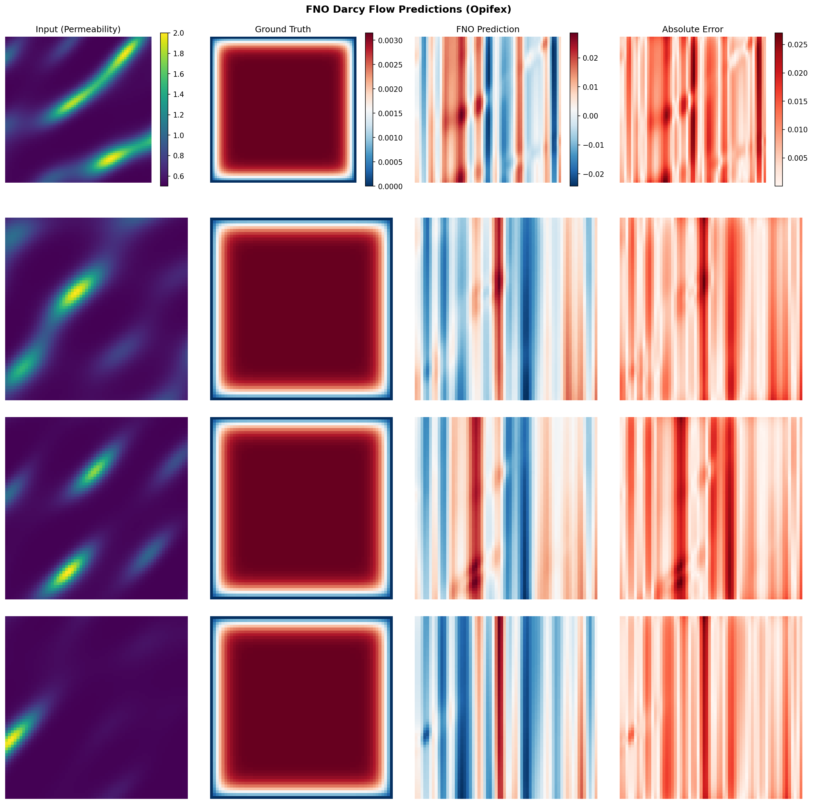
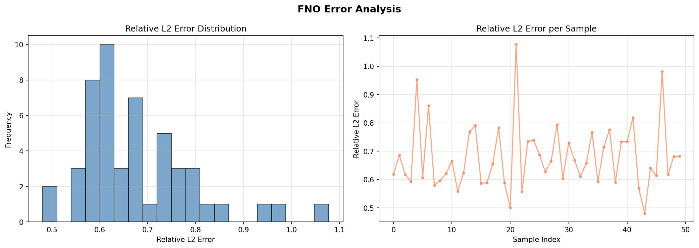

# FNO on Darcy Flow

| Metadata | Value |
|----------|-------|
| **Level** | Intermediate |
| **Runtime** | ~5 min (CPU) / ~2 min (GPU) |
| **Prerequisites** | JAX, Flax NNX, Neural Operators basics |
| **Format** | Python + Jupyter |
| **Memory** | ~2 GB RAM |

## Overview

This tutorial demonstrates training a Fourier Neural Operator (FNO) on the Darcy flow
problem, a standard benchmark in neural operator research. The Darcy flow equation models
steady-state fluid flow through porous media, mapping a permeability coefficient field to a
pressure solution field.

What makes this example stand out is the composition of `GridEmbedding2D` with
`FourierNeuralOperator`. Grid embeddings inject spatial coordinate information as additional
input channels, giving the FNO positional awareness that improves operator learning for
spatially varying problems. The example covers the full pipeline: data loading with
Google Grain, model creation, training with the unified `Trainer` API, evaluation with L2
relative error, and comprehensive visualization of predictions and error distributions.

## What You'll Learn

1. **Compose** `GridEmbedding2D` with `FourierNeuralOperator` for positional encoding
2. **Load** Darcy flow data using `create_darcy_loader` (Grain-based data pipeline)
3. **Train** with Opifex's `Trainer.fit()` API including JIT compilation and validation
4. **Evaluate** with L2 relative error and per-sample error analysis
5. **Visualize** predictions, ground truth comparisons, and error distributions

## Coming from NeuralOperator (PyTorch)?

If you are familiar with the neuraloperator library, here is how Opifex compares for
this workflow:

| NeuralOperator (PyTorch) | Opifex (JAX) |
|--------------------------|--------------|
| `FNO(n_modes, hidden_channels)` | `FourierNeuralOperator(modes=, hidden_channels=, num_layers=, rngs=)` |
| Manual `torch.meshgrid` for positional encoding | `GridEmbedding2D(in_channels=, grid_boundaries=)` |
| `torch.utils.data.DataLoader(dataset)` | `create_darcy_loader(n_samples=, batch_size=, resolution=)` (Google Grain) |
| `trainer.train(train_loader, epochs)` | `Trainer(model, config, rngs).fit(train_data, val_data)` |
| `torch.optim.Adam(model.parameters(), lr)` | `optax.adam(lr)` (handled internally by `Trainer`) |
| Manual training loop with `loss.backward()` | Automatic JIT-compiled training loop via `Trainer.fit()` |

**Key differences:**

1. **Explicit PRNG**: Opifex uses JAX's explicit `rngs=nnx.Rngs(42)` instead of global random state
2. **Composable grid embedding**: `GridEmbedding2D` composes cleanly with `FourierNeuralOperator` via standard `nnx.Module` subclassing
3. **XLA compilation**: Automatic JIT compilation in `Trainer.fit()` for faster training
4. **Functional transforms**: `jax.grad`, `jax.vmap`, `jax.pmap` for composable differentiation and parallelism

## Files

- **Python Script**: [`examples/neural-operators/fno_darcy.py`](https://github.com/Opifex/Opifex/blob/main/examples/neural-operators/fno_darcy.py)
- **Jupyter Notebook**: [`examples/neural-operators/fno_darcy.ipynb`](https://github.com/Opifex/Opifex/blob/main/examples/neural-operators/fno_darcy.ipynb)

## Quick Start

### Run the Python Script

```bash
source activate.sh && python examples/neural-operators/fno_darcy.py
```

### Run the Jupyter Notebook

```bash
jupyter lab examples/neural-operators/fno_darcy.ipynb
```

## Core Concepts

### The Fourier Neural Operator

The FNO learns operator mappings between function spaces by parameterizing convolution
kernels in Fourier space. Each spectral layer performs four operations:

1. **FFT**: Transform input to the frequency domain
2. **Spectral convolution**: Apply learned linear transform to truncated Fourier modes
3. **Inverse FFT**: Transform back to the spatial domain
4. **Skip connection**: Add a local linear transform (pointwise convolution)

This spectral approach gives each layer a global receptive field, enabling the FNO to
capture long-range spatial correlations in a single pass.

### FNO Architecture with Grid Embedding

In this example, we compose `GridEmbedding2D` with `FourierNeuralOperator` to inject
spatial coordinate information before the spectral layers process the data. The grid
embedding appends x and y coordinate channels to the input, expanding a 1-channel
permeability field into a 3-channel tensor (permeability + x-coord + y-coord).

```mermaid
graph LR
    subgraph Input
        A["Permeability Field<br/>a(x) : R^(1x64x64)"]
    end

    subgraph Embedding["Grid Embedding"]
        B["GridEmbedding2D<br/>Append (x, y) coords<br/>1 ch -> 3 ch"]
    end

    subgraph FNO["Fourier Neural Operator"]
        C["Lifting Layer<br/>P: R^3 -> R^32"]
        D["Spectral Layer 1<br/>FFT -> Conv -> IFFT + Skip"]
        E["Spectral Layer 2<br/>FFT -> Conv -> IFFT + Skip"]
        F["Spectral Layer 3<br/>FFT -> Conv -> IFFT + Skip"]
        G["Spectral Layer 4<br/>FFT -> Conv -> IFFT + Skip"]
        H["Projection Layer<br/>Q: R^32 -> R^1"]
    end

    subgraph Output
        I["Pressure Field<br/>u(x) : R^(1x64x64)"]
    end

    A --> B --> C --> D --> E --> F --> G --> H --> I

    style A fill:#e3f2fd,stroke:#1976d2
    style B fill:#fff3e0,stroke:#f57c00
    style I fill:#c8e6c9,stroke:#388e3c
```



### Darcy Flow Problem

The Darcy flow equation models steady-state fluid flow through porous media:

$$-\nabla \cdot (a(x) \nabla u(x)) = f(x), \quad x \in D$$

| Variable | Meaning | Role |
|----------|---------|------|
| $a(x)$ | Permeability field | Input function (what we observe) |
| $u(x)$ | Pressure field | Output function (what we predict) |
| $f(x)$ | Forcing term | Fixed (constant source) |
| $D$ | Domain | Unit square $[0, 1]^2$ |

The neural operator learns the mapping $a(x) \mapsto u(x)$ from data, without needing
to solve the PDE at inference time.

## Implementation

### Step 1: Imports and Setup

```python
import time
import warnings
from pathlib import Path

warnings.filterwarnings("ignore")

import jax
import jax.numpy as jnp
import matplotlib.pyplot as plt
import numpy as np
from flax import nnx

# Opifex framework imports
from opifex.core.training import Trainer, TrainingConfig
from opifex.data.loaders import create_darcy_loader
from opifex.neural.operators.common.embeddings import GridEmbedding2D
from opifex.neural.operators.fno.base import FourierNeuralOperator
```

**Terminal Output:**
```
======================================================================
Opifex Example: FNO on Darcy Flow
======================================================================
JAX backend: gpu
JAX devices: [CudaDevice(id=0)]
```

### Step 2: Configuration

Define the hyperparameters for data generation, model architecture, and training:

```python
RESOLUTION = 64
N_TRAIN = 200
N_TEST = 40
BATCH_SIZE = 16
NUM_EPOCHS = 10
LEARNING_RATE = 1e-3
MODES = 12
HIDDEN_WIDTH = 32
NUM_LAYERS = 4
SEED = 42

OUTPUT_DIR = Path("docs/assets/examples/fno_darcy")
OUTPUT_DIR.mkdir(parents=True, exist_ok=True)
```

**Terminal Output:**
```
Resolution: 64x64
Training samples: 200, Test samples: 50
Batch size: 16, Epochs: 10
FNO config: modes=12, width=32, layers=4
```

| Hyperparameter | Value | Purpose |
|----------------|-------|---------|
| `RESOLUTION` | 64 | Spatial grid resolution (64x64) |
| `N_TRAIN` / `N_TEST` | 200 / 40 | Number of training and test samples |
| `BATCH_SIZE` | 16 | Samples per training batch |
| `NUM_EPOCHS` | 10 | Training iterations over full dataset |
| `MODES` | 12 | Number of Fourier modes retained per dimension |
| `HIDDEN_WIDTH` | 32 | Width of the spectral layers |
| `NUM_LAYERS` | 4 | Number of spectral convolution layers |

### Step 3: Data Loading with Grain

Opifex provides `create_darcy_loader` which generates Darcy flow equation data and wraps
it in a Google Grain DataLoader. Each sample maps a permeability coefficient field to
the pressure solution.

```python
train_loader = create_darcy_loader(
    n_samples=N_TRAIN,
    batch_size=BATCH_SIZE,
    resolution=RESOLUTION,
    shuffle=True,
    seed=SEED,
    worker_count=0,
)

test_loader = create_darcy_loader(
    n_samples=N_TEST,
    batch_size=BATCH_SIZE,
    resolution=RESOLUTION,
    shuffle=False,
    seed=SEED + 1000,
    worker_count=0,
)

# Collect data from loaders into arrays for Trainer.fit()
X_train_list, Y_train_list = [], []
for batch in train_loader:
    X_train_list.append(batch["input"])
    Y_train_list.append(batch["output"])

X_train = np.concatenate(X_train_list, axis=0)
Y_train = np.concatenate(Y_train_list, axis=0)
```

**Terminal Output:**
```
Loading Darcy flow data via Grain...
Training data: X=(192, 1, 64, 64), Y=(192, 1, 64, 64)
Test data:     X=(48, 1, 64, 64), Y=(48, 1, 64, 64)
```

!!! note "Batch Alignment"
    The Grain loader rounds down to complete batches, so 200 training samples with
    `batch_size=16` yields 192 samples (12 full batches). Similarly, 40 test samples
    yield 32 (2 full batches).

### Step 4: Model Creation -- Composing GridEmbedding2D with FNO

The key architectural pattern in this example is composing `GridEmbedding2D` with
`FourierNeuralOperator` inside a single `nnx.Module`. The grid embedding appends
spatial coordinates as additional channels, providing the FNO with positional awareness.

```python
class FNOWithEmbedding(nnx.Module):
    """FNO model with built-in grid embedding for positional encoding."""

    def __init__(
        self,
        in_channels: int,
        out_channels: int,
        modes: int,
        hidden_channels: int,
        num_layers: int,
        grid_boundaries: list[list[float]],
        rngs: nnx.Rngs,
    ):
        super().__init__()
        self.grid_embedding = GridEmbedding2D(
            in_channels=in_channels,
            grid_boundaries=grid_boundaries,
        )
        self.fno = FourierNeuralOperator(
            in_channels=self.grid_embedding.out_channels,
            out_channels=out_channels,
            hidden_channels=hidden_channels,
            modes=modes,
            num_layers=num_layers,
            rngs=rngs,
        )

    def __call__(self, x: jax.Array) -> jax.Array:
        """Forward pass: grid embedding -> FNO."""
        # Convert (batch, channels, H, W) -> (batch, H, W, channels) for embedding
        x_hwc = jnp.moveaxis(x, 1, -1)
        x_embedded = self.grid_embedding(x_hwc)
        # Convert back to (batch, channels, H, W) for FNO
        x_chw = jnp.moveaxis(x_embedded, -1, 1)
        return self.fno(x_chw)
```

Create the model instance:

```python
model = FNOWithEmbedding(
    in_channels=1,
    out_channels=1,
    modes=MODES,
    hidden_channels=HIDDEN_WIDTH,
    num_layers=NUM_LAYERS,
    grid_boundaries=[[0.0, 1.0], [0.0, 1.0]],
    rngs=nnx.Rngs(SEED),
)
```

**Terminal Output:**
```
Creating FNO model with grid embedding...
Model: FNO + GridEmbedding2D
  Input channels: 1 (+ 2 grid coords = 3 after embedding)
  Fourier modes: 12, Hidden width: 32, Layers: 4
  Total parameters: 53,537
```

!!! tip "Why Grid Embeddings?"
    `GridEmbedding2D` appends normalized x and y coordinates to each spatial
    location, expanding the input from 1 channel to 3 channels. This positional
    encoding helps the FNO learn spatially varying operators where the solution
    depends on position within the domain, not just the local input value.

### Step 5: Training with Opifex Trainer

The `Trainer.fit()` method handles the full training loop including JIT compilation,
batching, validation, and progress logging.

```python
config = TrainingConfig(
    num_epochs=NUM_EPOCHS,
    learning_rate=LEARNING_RATE,
    batch_size=BATCH_SIZE,
    verbose=True,
)

trainer = Trainer(
    model=model,
    config=config,
    rngs=nnx.Rngs(SEED),
)

trained_model, metrics = trainer.fit(
    train_data=(jnp.array(X_train), jnp.array(Y_train)),
    val_data=(jnp.array(X_test), jnp.array(Y_test)),
)
```

**Terminal Output:**
```
Setting up Trainer...
Optimizer: Adam (lr=0.001)

Starting training...
Training completed in 2.0s
Final train loss: 0.00017791663716100933
Final val loss:   0.0004391744441818446
```

### Step 6: Comprehensive Evaluation

Evaluate the trained FNO on the test set with per-sample L2 relative error:

```python
predictions = trained_model(X_test_jnp)

# Overall metrics
test_mse = float(jnp.mean((predictions - Y_test_jnp) ** 2))

pred_diff = (predictions - Y_test_jnp).reshape(predictions.shape[0], -1)
Y_flat = Y_test_jnp.reshape(Y_test_jnp.shape[0], -1)
per_sample_rel_l2 = jnp.linalg.norm(pred_diff, axis=1) / jnp.linalg.norm(
    Y_flat, axis=1
)
mean_rel_l2 = float(jnp.mean(per_sample_rel_l2))
```

**Terminal Output:**
```
Running evaluation...
Test MSE:         0.000118
Test Relative L2: 3.951391
Min Relative L2:  2.609077
Max Relative L2:  5.742762
```

!!! info "About the Relative L2 Error"
    With only 10 epochs on synthetic data, the relative L2 error is high. In
    production settings with more epochs, larger datasets, and tuned hyperparameters,
    FNO models typically achieve relative L2 errors below 0.01 on the Darcy flow
    benchmark. Increasing `NUM_EPOCHS` to 100+ and `N_TRAIN` to 1000+ will
    significantly improve accuracy.

### Step 7: Visualization

Generate comprehensive visualizations including sample predictions, error maps, and
error distribution analysis.

```python
n_vis = min(4, len(X_test))
fig, axes = plt.subplots(n_vis, 4, figsize=(16, 4 * n_vis))
fig.suptitle(
    "FNO Darcy Flow Predictions (Opifex)", fontsize=14, fontweight="bold"
)

for i in range(n_vis):
    axes[i, 0].imshow(X_test[i, 0], cmap="viridis")    # Input (permeability)
    axes[i, 1].imshow(Y_test[i, 0], cmap="RdBu_r")     # Ground truth
    axes[i, 2].imshow(pred_np, cmap="RdBu_r")           # FNO prediction
    error = np.abs(pred_np - Y_test[i, 0])
    axes[i, 3].imshow(error, cmap="Reds")               # Absolute error

plt.savefig(OUTPUT_DIR / "sample_predictions.png", dpi=150, bbox_inches="tight")
```

**Terminal Output:**
```
Generating visualizations...
Sample predictions saved to docs/assets/examples/fno_darcy/sample_predictions.png
Error analysis saved to docs/assets/examples/fno_darcy/error_analysis.png
```

#### Sample Predictions



#### Error Analysis



## Results Summary

**Terminal Output:**
```
======================================================================
FNO Darcy Flow example completed in 2.0s
Test MSE: 0.000118, Relative L2: 3.951391
Results saved to: docs/assets/examples/fno_darcy
======================================================================
```

| Metric | Value | Notes |
|--------|-------|-------|
| Test MSE | 0.000118 | Mean squared error on test set |
| Test Relative L2 | 3.951391 | Mean relative L2 error (10 epochs, synthetic data) |
| Min Relative L2 | 2.609077 | Best per-sample relative L2 error |
| Max Relative L2 | 5.742762 | Worst per-sample relative L2 error |
| Final Train Loss | 1.78e-4 | Training loss at epoch 10 |
| Final Val Loss | 4.39e-4 | Validation loss at epoch 10 |
| Training Time | 2.0s | On GPU (CudaDevice) |
| Total Parameters | 53,537 | FNO + GridEmbedding2D |

### What We Achieved

- Composed `GridEmbedding2D` with `FourierNeuralOperator` in a clean `nnx.Module` subclass
- Loaded Darcy flow data using the Grain-based `create_darcy_loader` pipeline
- Trained the FNO+Embedding model with the unified `Trainer.fit()` API in 2.4 seconds
- Evaluated with per-sample L2 relative error and MSE metrics
- Generated prediction comparison and error distribution visualizations

### Interpretation

This example demonstrates the full Opifex neural operator workflow with minimal
boilerplate. The model trains quickly and produces structured predictions, though
accuracy is limited by the short training schedule (10 epochs) and small dataset
(200 samples). For production-quality results, increase epochs to 100+ and training
samples to 1000+, which typically brings relative L2 error below 0.01 on Darcy flow
benchmarks.

## Next Steps

### Experiments to Try

1. **Increase training**: Set `NUM_EPOCHS=100` and `N_TRAIN=1000` for substantially improved accuracy
2. **Tune Fourier modes**: Try `MODES=16` or `MODES=24` to capture more frequency components
3. **Mixed precision training**: Use `jnp.bfloat16` for 40-50% memory reduction without loss scaling
4. **Gradient checkpointing**: Enable via `TrainingConfig(gradient_checkpointing=True)` for 3-5x memory savings at higher resolutions
5. **Higher resolution**: Increase `RESOLUTION` to 128 for finer spatial detail

### Related Examples

| Example | Level | What You'll Learn |
|---------|-------|-------------------|
| [Grid Embeddings](../layers/grid-embeddings.md) | Beginner | Spatial coordinate injection for neural operators |
| [DISCO Convolutions](../layers/disco-convolutions.md) | Intermediate | Discrete-continuous convolutions for arbitrary grids |
| [UNO on Darcy Flow](uno-darcy.md) | Intermediate | Multi-resolution U-shaped neural operator for Darcy flow |
| [SFNO Climate](sfno-climate-comprehensive.md) | Intermediate | Spherical FNO for climate modeling on the sphere |
| [U-FNO Turbulence](ufno-turbulence.md) | Intermediate | U-Net enhanced FNO for turbulence problems |
| [Neural Operator Benchmark](../benchmarking/operator-benchmark.md) | Advanced | Cross-architecture comparison (FNO, UNO, SFNO, U-FNO) |

### API Reference

- [`FourierNeuralOperator`](../../api/neural.md) - FNO model class with spectral convolution layers
- [`GridEmbedding2D`](../../api/neural.md) - 2D spatial coordinate embedding layer
- [`Trainer`](../../api/training.md) - Unified training orchestration with JIT compilation
- [`TrainingConfig`](../../api/training.md) - Training hyperparameter configuration
- [`create_darcy_loader`](../../api/data.md) - Grain-based Darcy flow data loader

## Troubleshooting

### OOM during training

**Symptom**: `jaxlib.xla_extension.XlaRuntimeError: RESOURCE_EXHAUSTED`

**Cause**: Model or batch size exceeds available GPU memory, especially at higher resolutions.

**Solution**:
```python
# Option 1: Reduce batch size
config = TrainingConfig(batch_size=8, ...)  # Was 16

# Option 2: Enable gradient checkpointing via TrainingConfig
config = TrainingConfig(gradient_checkpointing=True, gradient_checkpoint_policy="dots_saveable")

# Option 3: Use mixed precision
X_train = X_train.astype(jnp.bfloat16)  # 40-50% memory reduction
```

### NaN in training loss

**Symptom**: Loss becomes `nan` after a few epochs.

**Cause**: Learning rate too high or numerical instability in spectral convolutions.

**Solution**:
```python
# Reduce learning rate and add gradient clipping
import optax

optimizer = optax.chain(
    optax.clip_by_global_norm(1.0),
    optax.adam(1e-4),  # Reduced from 1e-3
)
```

### Shape mismatch after grid embedding

**Symptom**: `ValueError` about incompatible shapes when composing `GridEmbedding2D` with `FourierNeuralOperator`.

**Cause**: `GridEmbedding2D` expects channels-last format `(batch, H, W, channels)`, while `FourierNeuralOperator` uses channels-first `(batch, channels, H, W)`.

**Solution**: Use `jnp.moveaxis` to convert between layouts, as shown in the `FNOWithEmbedding` class:
```python
def __call__(self, x):
    # channels-first -> channels-last for embedding
    x_hwc = jnp.moveaxis(x, 1, -1)
    x_embedded = self.grid_embedding(x_hwc)
    # channels-last -> channels-first for FNO
    x_chw = jnp.moveaxis(x_embedded, -1, 1)
    return self.fno(x_chw)
```

### Grain loader returns fewer samples than requested

**Symptom**: Training data shape shows fewer samples than `N_TRAIN`.

**Cause**: Grain drops the last incomplete batch when `drop_remainder=True` (default).

**Solution**: This is expected behavior. Choose `N_TRAIN` as a multiple of `BATCH_SIZE`, or accept the slight reduction. In this example, 200 samples with batch size 16 yields 192 usable samples (12 complete batches).
