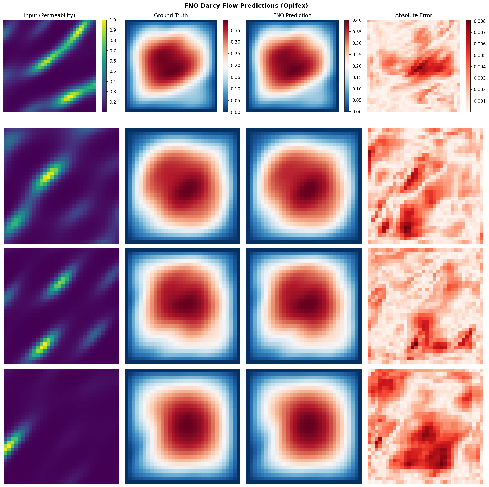
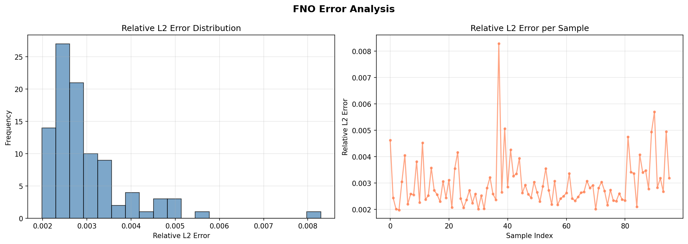

# FNO on Darcy Flow

| Metadata | Value |
|----------|-------|
| **Level** | Intermediate |
| **Runtime** | ~3 min (CPU) / ~1 min (GPU) |
| **Prerequisites** | JAX, Flax NNX, Neural Operators basics |
| **Format** | Python + Jupyter |
| **Memory** | ~2 GB RAM |

## Overview

This tutorial demonstrates training a Fourier Neural Operator (FNO) on the Darcy flow
problem, a standard benchmark in neural operator research. The Darcy flow equation models
steady-state fluid flow through porous media, mapping a permeability coefficient field to a
pressure solution field.

What makes this example stand out is the composition of `GridEmbedding2D` with
`FourierNeuralOperator`. Grid embeddings inject spatial coordinate information as additional
input channels, giving the FNO positional awareness that improves operator learning for
spatially varying problems. The example uses Opifex's own Darcy data via
`create_darcy_loader` (smooth Darcy, solved with the accurate direct solver) and the
standard operator-learning recipe: **Gaussian normalization**, the **relative-L2 loss**,
`AdamW` with weight decay, and an exponential learning-rate schedule. It covers the full
pipeline: loading the data, model creation, training with the unified `Trainer` API,
evaluation with L2 relative error, and full visualization of predictions and error
distributions.

This is the FNO counterpart to [UNO on Darcy Flow](uno-darcy.md) and
[Your First Neural Operator](../getting-started/first-neural-operator.md), which use the
same synthetic Darcy data and recipe.

## What You'll Learn

1. **Compose** `GridEmbedding2D` with `FourierNeuralOperator` for positional encoding
2. **Load** Darcy flow data with `create_darcy_loader` (datarax pipelines)
3. **Apply** Gaussian normalization and the **relative-L2 loss** via `LossConfig`
4. **Use** `AdamW`, weight decay, and an exponential learning-rate schedule
5. **Evaluate** with L2 relative error and a train-vs-test overfitting check
6. **Visualize** predictions, ground truth comparisons, and error distributions

## Coming from NeuralOperator (PyTorch)?

If you are familiar with the neuraloperator library, here is how Opifex compares for
this workflow:

| NeuralOperator (PyTorch) | Opifex (JAX) |
|--------------------------|--------------|
| `FNO(n_modes, hidden_channels)` | `FourierNeuralOperator(modes=, hidden_channels=, num_layers=, rngs=)` |
| Manual `torch.meshgrid` for positional encoding | `GridEmbedding2D(in_channels=, grid_boundaries=)` |
| Custom Darcy dataset / loader | `create_darcy_loader(n_samples=, resolution=, ...)` |
| `LpLoss(d=2, p=2)` (relative) | `LossConfig(loss_type="relative_l2")` |
| `trainer.train(train_loader, epochs)` | `Trainer(model, config, rngs).fit(train_data, val_data)` |
| `AdamW(lr, weight_decay)` + LR schedule | `OptimizationConfig(optimizer="adamw", weight_decay=, schedule_type=...)` |
| Manual training loop with `loss.backward()` | Automatic JIT-compiled training loop via `Trainer.fit()` |

**Key differences:**

1. **Explicit PRNG**: Opifex uses JAX's explicit `rngs=nnx.Rngs(42)` instead of global random state
2. **Composable grid embedding**: `GridEmbedding2D` composes cleanly with `FourierNeuralOperator` via standard `nnx.Module` subclassing
3. **XLA compilation**: Automatic JIT compilation in `Trainer.fit()` for faster training
4. **Functional transforms**: `jax.grad`, `jax.vmap`, `jax.pmap` for composable differentiation and parallelism

## Files

- **Python Script**: [`examples/neural-operators/fno_darcy.py`](https://github.com/avitai/opifex/blob/main/examples/neural-operators/fno_darcy.py)
- **Jupyter Notebook**: [`examples/neural-operators/fno_darcy.ipynb`](https://github.com/avitai/opifex/blob/main/examples/neural-operators/fno_darcy.ipynb)

## Quick Start

### Run the Python Script

```bash
source activate.sh && python examples/neural-operators/fno_darcy.py
```

### Run the Jupyter Notebook

```bash
jupyter lab examples/neural-operators/fno_darcy.ipynb
```

## Core Concepts

### The Fourier Neural Operator

The FNO learns operator mappings between function spaces by parameterizing convolution
kernels in Fourier space. Each spectral layer performs four operations:

1. **FFT**: Transform input to the frequency domain
2. **Spectral convolution**: Apply learned linear transform to truncated Fourier modes
3. **Inverse FFT**: Transform back to the spatial domain
4. **Skip connection**: Add a local linear transform (pointwise convolution)

This spectral approach gives each layer a global receptive field, enabling the FNO to
capture long-range spatial correlations in a single pass.

### FNO Architecture with Grid Embedding

In this example, we compose `GridEmbedding2D` with `FourierNeuralOperator` to inject
spatial coordinate information before the spectral layers process the data. The grid
embedding appends x and y coordinate channels to the input, expanding a 1-channel
permeability field into a 3-channel tensor (permeability + x-coord + y-coord).


```mermaid
graph LR
    subgraph Input
        A["Permeability Field<br/>a(x) : R^(1x32x32)"]
    end

    subgraph Embedding["Grid Embedding"]
        B["GridEmbedding2D<br/>Append (x, y) coords<br/>1 ch -> 3 ch"]
    end

    subgraph FNO["Fourier Neural Operator"]
        C["Lifting Layer<br/>P: R^3 -> R^32"]
        D["Spectral Layer 1<br/>FFT -> Conv -> IFFT + Skip"]
        E["Spectral Layer 2<br/>FFT -> Conv -> IFFT + Skip"]
        F["Spectral Layer 3<br/>FFT -> Conv -> IFFT + Skip"]
        G["Spectral Layer 4<br/>FFT -> Conv -> IFFT + Skip"]
        H["Projection Layer<br/>Q: R^32 -> R^1"]
    end

    subgraph Output
        I["Pressure Field<br/>u(x) : R^(1x32x32)"]
    end

    A --> B --> C --> D --> E --> F --> G --> H --> I

    style A fill:#e3f2fd,stroke:#1976d2
    style B fill:#fff3e0,stroke:#f57c00
    style I fill:#c8e6c9,stroke:#388e3c
```

### Darcy Flow Problem

The Darcy flow equation models steady-state fluid flow through porous media:

$$-\nabla \cdot (a(x) \nabla u(x)) = f(x), \quad x \in D$$

| Variable | Meaning | Role |
|----------|---------|------|
| $a(x)$ | Permeability field | Input function (what we observe) |
| $u(x)$ | Pressure field | Output function (what we predict) |
| $f(x)$ | Forcing term | Fixed (constant source) |
| $D$ | Domain | Unit square $[0, 1]^2$ |

The neural operator learns the mapping $a(x) \mapsto u(x)$ from data, without needing
to solve the PDE at inference time.

## Implementation

### Step 1: Imports and Setup

```python
import time
import warnings
from pathlib import Path

warnings.filterwarnings("ignore")

import jax
import jax.numpy as jnp
import matplotlib as mpl
import numpy as np
from flax import nnx

mpl.use("Agg")
import matplotlib.pyplot as plt

# Opifex framework imports
from opifex.core.training import Trainer, TrainingConfig
from opifex.core.training.config import LossConfig, OptimizationConfig
from opifex.data.loaders import create_darcy_loader
from opifex.neural.operators.common.embeddings import GridEmbedding2D
from opifex.neural.operators.fno.base import FourierNeuralOperator
```

**Terminal Output:**
```
======================================================================
Opifex Example: FNO on Darcy Flow
======================================================================
JAX backend: gpu
JAX devices: [CudaDevice(id=0)]
```

### Step 2: Configuration

Define the hyperparameters for data generation, model architecture, and training:

```python
RESOLUTION = 32  # synthetic Darcy resolution
N_TRAIN = 1000
N_TEST = 100
BATCH_SIZE = 32
NUM_EPOCHS = 200
LEARNING_RATE = 5e-3  # AdamW initial LR
WEIGHT_DECAY = 1e-4  # regularization to combat overfitting
MODES = 12
HIDDEN_WIDTH = 32
NUM_LAYERS = 4
DOMAIN_PADDING = 0.25  # fraction of each spatial dim (resolution-invariant Gibbs padding)
SEED = 42

OUTPUT_DIR = Path("docs/assets/examples/fno_darcy")
OUTPUT_DIR.mkdir(parents=True, exist_ok=True)
```

**Terminal Output:**
```
Resolution: 32x32
Training samples: 1000, Test samples: 100
Batch size: 32, Epochs: 200
FNO config: modes=12, width=32, layers=4
Optimizer: AdamW (lr=0.005, weight_decay=0.0001)
LR schedule: exponential, x0.5 every 60 epochs
```

| Hyperparameter | Value | Purpose |
|----------------|-------|---------|
| `RESOLUTION` | 32 | Spatial grid resolution (32x32) |
| `N_TRAIN` / `N_TEST` | 1000 / 100 | Train / test split from `create_darcy_loader` |
| `BATCH_SIZE` | 32 | Samples per training batch |
| `NUM_EPOCHS` | 200 | Training iterations over full dataset |
| `LEARNING_RATE` | 5e-3 | AdamW initial learning rate |
| `WEIGHT_DECAY` | 1e-4 | L2 weight decay (regularization) |
| `MODES` | 12 | Number of Fourier modes retained per dimension |
| `HIDDEN_WIDTH` | 32 | Width of the spectral layers |
| `DOMAIN_PADDING` | 0.25 | Spatial padding *fraction* (resolution-invariant) to reduce the Gibbs phenomenon |

### Step 3: Data Loading

We generate Darcy flow data with `create_darcy_loader` (smooth Darcy, solved with the
accurate direct solver) and serve it via datarax pipelines. `create_darcy_loader` returns
a frozen `PDELoaders` with `.train` / `.val` datarax pipelines, split by `val_fraction`.
The batches are already channels-first `{"input": (b, 1, H, W), "output": (b, 1, H, W)}`,
so we just drain each pipeline into arrays for `Trainer.fit()`.

```python
loaders = create_darcy_loader(
    n_samples=n_samples,
    batch_size=batch_size,
    resolution=resolution,
    val_fraction=n_test / n_samples,
    seed=seed,
)

# Collect the datarax pipelines into arrays for Trainer.fit(). Batches are
# channels-first {"input": (b, 1, H, W), "output": (b, 1, H, W)}.
def _collect(pipeline) -> tuple[np.ndarray, np.ndarray]:
    inputs, outputs = [], []
    for batch in pipeline:
        inputs.append(np.asarray(batch["input"]))
        outputs.append(np.asarray(batch["output"]))
    return np.concatenate(inputs, axis=0), np.concatenate(outputs, axis=0)

x_train, y_train = _collect(loaders.train)
x_test, y_test = _collect(loaders.val)
```

**Terminal Output:**
```
Generating Darcy flow data (jit+vmap) and serving via datarax...
Training data: X=(1024, 1, 32, 32), Y=(1024, 1, 32, 32)
Test data:     X=(128, 1, 32, 32), Y=(128, 1, 32, 32)
```

We fit Gaussian statistics on the training set, normalize all splits, and un-normalize
predictions before measuring the physical-space relative L2 error:

```python
x_mean, x_std = x_train.mean(), x_train.std()
y_mean, y_std = y_train.mean(), y_train.std()

x_train_n = (x_train - x_mean) / x_std
y_train_n = (y_train - y_mean) / y_std
```

**Terminal Output:**
```
Input mean/std:  0.1778 / 0.1302
Output mean/std: 0.213690 / 0.155666
```

### Step 4: Model Creation -- Composing GridEmbedding2D with FNO

The key architectural pattern in this example is composing `GridEmbedding2D` with
`FourierNeuralOperator` inside a single `nnx.Module`. The grid embedding appends
spatial coordinates as additional channels, providing the FNO with positional awareness.

```python
class FNOWithEmbedding(nnx.Module):
    """FNO model with built-in grid embedding for positional encoding."""

    def __init__(
        self,
        in_channels: int,
        out_channels: int,
        modes: int,
        hidden_channels: int,
        num_layers: int,
        grid_boundaries: list[list[float]],
        *,
        domain_padding: float,
        rngs: nnx.Rngs,
    ) -> None:
        super().__init__()
        self.grid_embedding = GridEmbedding2D(
            in_channels=in_channels,
            grid_boundaries=grid_boundaries,
        )
        self.fno = FourierNeuralOperator(
            in_channels=self.grid_embedding.out_channels,
            out_channels=out_channels,
            hidden_channels=hidden_channels,
            modes=modes,
            num_layers=num_layers,
            domain_padding=domain_padding,
            rngs=rngs,
        )

    def __call__(self, x: jax.Array) -> jax.Array:
        """Forward pass: grid embedding -> FNO."""
        # Convert (batch, channels, H, W) -> (batch, H, W, channels) for embedding
        x_hwc = jnp.moveaxis(x, 1, -1)
        x_embedded = self.grid_embedding(x_hwc)
        # Convert back to (batch, channels, H, W) for FNO
        x_chw = jnp.moveaxis(x_embedded, -1, 1)
        return self.fno(x_chw)
```

Create the model instance:

```python
model = FNOWithEmbedding(
    in_channels=1,
    out_channels=1,
    modes=MODES,
    hidden_channels=HIDDEN_WIDTH,
    num_layers=NUM_LAYERS,
    grid_boundaries=[[0.0, 1.0], [0.0, 1.0]],
    domain_padding=DOMAIN_PADDING,
    rngs=nnx.Rngs(SEED),
)
```

**Terminal Output:**
```
Creating FNO model with grid embedding...
Model: FNO + GridEmbedding2D
  Input channels: 1 (+ 2 grid coords = 3 after embedding)
  Fourier modes: 12, Hidden width: 32, Layers: 4
  Total parameters: 2,368,001
```

!!! tip "Why Grid Embeddings?"
    `GridEmbedding2D` appends normalized x and y coordinates to each spatial
    location, expanding the input from 1 channel to 3 channels. This positional
    encoding helps the FNO learn spatially varying operators where the solution
    depends on position within the domain, not just the local input value.

### Step 5: The Relative-L2 Loss and Training

We train with the **relative-L2 loss**, the standard operator-learning objective. It
normalizes each sample's L2 error by the L2 norm of the target, so every example
contributes proportionally regardless of its magnitude:

$$
\mathcal{L}_{L2} = \frac{\|u_p - u\|_2}{\|u\|_2}
$$

The loss is selected declaratively via `LossConfig` — no `Trainer` subclass is needed.
Training uses `AdamW`, weight decay, and an exponential learning-rate schedule (halve
every 60 epochs), all via `OptimizationConfig`:

```python
config = TrainingConfig(
    num_epochs=NUM_EPOCHS,
    batch_size=BATCH_SIZE,
    validation_frequency=20,
    verbose=True,
    loss_config=LossConfig(loss_type="relative_l2"),
    optimization_config=OptimizationConfig(
        optimizer="adamw",
        learning_rate=LEARNING_RATE,
        weight_decay=WEIGHT_DECAY,
        schedule_type="exponential",
        transition_steps=LR_TRANSITION_STEPS,
        decay_rate=LR_DECAY_RATE,
    ),
)

trainer = Trainer(model=model, config=config, rngs=nnx.Rngs(SEED))

trained_model, metrics = trainer.fit(
    train_data=(jnp.array(X_train_n), jnp.array(Y_train_n)),
    val_data=(jnp.array(X_test_n), jnp.array(Y_test_n)),
)
```

**Terminal Output:**
```
Setting up Trainer...
Optimizer: AdamW (lr=0.005, weight_decay=0.0001)
Loss: relative L2 (the standard operator-learning objective)

Starting training...
Training completed in 18.4s
Final train loss: 0.006624664645642042
Final val loss:   0.0001833601709222421
```

### Step 6: Full Evaluation

Predictions are un-normalized back to physical pressure units before measuring the error.
We run both the test and training sets through the model in batches (to bound memory) and
compare their relative L2 errors to expose any overfitting:

```python
# Un-normalize predictions back to physical pressure units
predictions = predict_in_batches(trained_model, x_test_jnp) * y_std + y_mean
train_predictions = predict_in_batches(trained_model, x_train_jnp) * y_std + y_mean

# Test relative L2 (per sample) in physical units
test_mse = float(jnp.mean((predictions - y_test_jnp) ** 2))
per_sample_rel_l2 = per_sample_relative_l2(predictions, y_test_jnp)
mean_rel_l2 = float(jnp.mean(per_sample_rel_l2))
train_rel_l2 = float(relative_l2_error(train_predictions, y_train_jnp))
```

**Terminal Output:**
```
Running evaluation...
Train Relative L2: 0.004973
Test  Relative L2: 0.007588
Overfitting gap (test - train): +0.002615
Test MSE:         4.024144e-06
Min Relative L2:  0.004003
Max Relative L2:  0.021948
```

!!! info "Reading the Relative L2 Error"
    Errors are measured in physical pressure units after un-normalizing the predictions.
    A test relative L2 of ~0.76% with a sub-0.3% train-vs-test gap confirms the FNO learns
    the Darcy operator accurately and generalizes well on this data.

### Step 7: Visualization

Generate full visualizations including sample predictions, error maps, and
error distribution analysis.

```python
n_vis = min(4, len(x_test))
fig, axes = plt.subplots(n_vis, 4, figsize=(16, 4 * n_vis))
fig.suptitle(
    "FNO Darcy Flow Predictions (Opifex)", fontsize=14, fontweight="bold"
)

for i in range(n_vis):
    axes[i, 0].imshow(x_test[i, 0], cmap="viridis")    # Input (permeability)
    axes[i, 1].imshow(y_test[i, 0], cmap="RdBu_r")     # Ground truth
    axes[i, 2].imshow(pred_np, cmap="RdBu_r")           # FNO prediction
    error = np.abs(pred_np - y_test[i, 0])
    axes[i, 3].imshow(error, cmap="Reds")               # Absolute error

plt.savefig(OUTPUT_DIR / "sample_predictions.png", dpi=150, bbox_inches="tight")
```

**Terminal Output:**
```
Generating visualizations...
Sample predictions saved to docs/assets/examples/fno_darcy/sample_predictions.png
Error analysis saved to docs/assets/examples/fno_darcy/error_analysis.png
```

#### Sample Predictions



#### Error Analysis



## Results Summary

**Terminal Output:**
```
======================================================================
FNO Darcy Flow example completed in 18.4s
Test MSE: 4.024144e-06, Relative L2: 0.007588
Results saved to: docs/assets/examples/fno_darcy
======================================================================
```

| Metric | Value | Notes |
|--------|-------|-------|
| Train Relative L2 | 0.004973 | Mean relative L2 on the training set (physical units) |
| Test Relative L2 | 0.007588 | Mean relative L2 on the test set (physical units) |
| Min Relative L2 | 0.004003 | Best per-sample test relative L2 |
| Max Relative L2 | 0.021948 | Worst per-sample test relative L2 |
| Test MSE | 4.02e-06 | Mean squared error on the test set |
| Final Train Loss | 6.62e-3 | Relative-L2 training loss at epoch 200 |
| Final Val Loss | 1.83e-4 | Relative-L2 validation loss at epoch 200 |
| Training Time | 18.4s | On GPU (CudaDevice) |
| Total Parameters | 2,368,001 | FNO + GridEmbedding2D |

### What We Achieved

- Composed `GridEmbedding2D` with `FourierNeuralOperator` in a clean `nnx.Module` subclass
- Trained on Opifex's synthetic Darcy data with the relative-L2 loss, `AdamW` + weight
  decay, and an exponential learning-rate schedule via `Trainer.fit()`
- Evaluated with per-sample L2 relative error and an explicit train-vs-test overfitting check
- Generated prediction comparison and error distribution visualizations

### Interpretation

This example demonstrates the full Opifex neural operator workflow on Opifex's own Darcy
data. The FNO reaches a train relative L2 around 0.50% and a test relative L2 around 0.76%
in physical pressure units, with a sub-0.3% train-vs-test gap. The relative-L2 loss,
weight decay, and LR schedule together drive accurate operator learning without
overfitting, consistent with the [UNO](uno-darcy.md) and
[Your First Neural Operator](../getting-started/first-neural-operator.md) examples on the
same data.

## Next Steps

### Experiments to Try

1. **Swap the loss**: Compare the relative-L2 objective against an H1 (Sobolev)
   gradient-aware loss to penalize errors in the field gradients as well as the values
2. **Tune the schedule**: Adjust `LR_DECAY_RATE` / `LR_TRANSITION_STEPS` or switch
   `schedule_type` to `cosine`
3. **Tune regularization**: Increase `WEIGHT_DECAY` (1e-3 .. 1e-2) to trade train fit for
   generalization
4. **Tune Fourier modes**: Try larger `MODES` or `HIDDEN_WIDTH` for more capacity
5. **Raise the resolution**: Generate `create_darcy_loader` data at 64x64 for a sharper
   benchmark

### Related Examples

| Example | Level | What You'll Learn |
|---------|-------|-------------------|
| [Grid Embeddings](../layers/grid-embeddings.md) | Beginner | Spatial coordinate injection for neural operators |
| [DISCO Convolutions](../layers/disco-convolutions.md) | Intermediate | Discrete-continuous convolutions for arbitrary grids |
| [UNO on Darcy Flow](uno-darcy.md) | Intermediate | Multi-resolution U-shaped neural operator for Darcy flow |
| [SFNO Climate](sfno-climate-full.md) | Intermediate | Spherical FNO for climate modeling on the sphere |
| [U-FNO Turbulence](ufno-turbulence.md) | Intermediate | U-Net enhanced FNO for turbulence problems |
| [Neural Operator Benchmark](../benchmarking/operator-benchmark.md) | Advanced | Cross-architecture comparison (FNO, UNO, SFNO, U-FNO) |

### API Reference

- [`FourierNeuralOperator`](../../api/neural.md) - FNO model class with spectral convolution layers
- [`GridEmbedding2D`](../../api/neural.md) - 2D spatial coordinate embedding layer
- [`Trainer`](../../api/training.md) - Unified training orchestration with JIT compilation
- [`TrainingConfig`](../../api/training.md) - Training hyperparameter configuration
- [`OptimizationConfig`](../../api/training.md) - Optimizer, weight decay, and LR-schedule configuration

## Troubleshooting

### OOM during training

**Symptom**: `jaxlib.xla_extension.XlaRuntimeError: RESOURCE_EXHAUSTED`

**Cause**: Model or batch size exceeds available GPU memory, especially at higher resolutions.

**Solution**:
```python
# Option 1: Reduce batch size
config = TrainingConfig(batch_size=16, ...)  # Was 32

# Option 2: Enable gradient checkpointing via TrainingConfig
config = TrainingConfig(gradient_checkpointing=True, gradient_checkpoint_policy="dots_saveable")

# Option 3: Use mixed precision
X_train = X_train.astype(jnp.bfloat16)  # 40-50% memory reduction
```

### NaN in training loss

**Symptom**: Loss becomes `nan` after a few epochs.

**Cause**: Learning rate too high or numerical instability in spectral convolutions.

**Solution**:
```python
# Reduce learning rate and add gradient clipping
import optax

optimizer = optax.chain(
    optax.clip_by_global_norm(1.0),
    optax.adam(1e-4),  # Reduced from 1e-3
)
```

### Shape mismatch after grid embedding

**Symptom**: `ValueError` about incompatible shapes when composing `GridEmbedding2D` with `FourierNeuralOperator`.

**Cause**: `GridEmbedding2D` expects channels-last format `(batch, H, W, channels)`, while `FourierNeuralOperator` uses channels-first `(batch, channels, H, W)`.

**Solution**: Use `jnp.moveaxis` to convert between layouts, as shown in the `FNOWithEmbedding` class:
```python
def __call__(self, x):
    # channels-first -> channels-last for embedding
    x_hwc = jnp.moveaxis(x, 1, -1)
    x_embedded = self.grid_embedding(x_hwc)
    # channels-last -> channels-first for FNO
    x_chw = jnp.moveaxis(x_embedded, -1, 1)
    return self.fno(x_chw)
```
