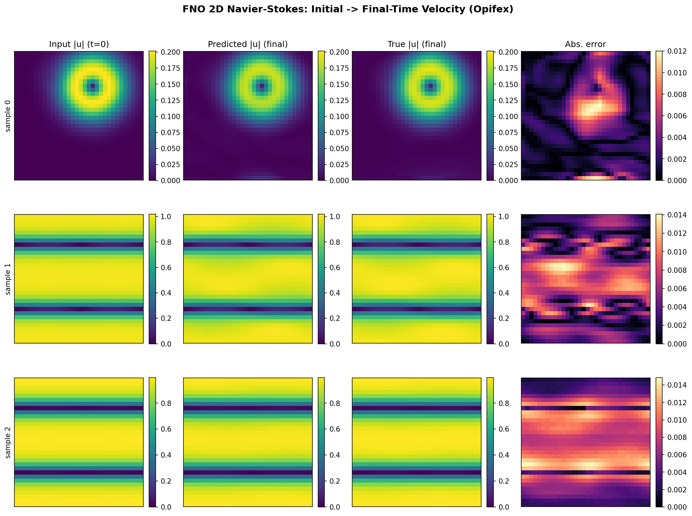
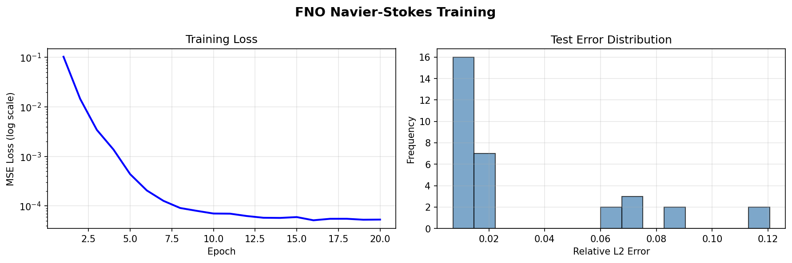

# FNO on 2D Navier-Stokes

| Metadata | Value |
|----------|-------|
| **Level** | Intermediate |
| **Runtime** | ~3 min (CPU) / ~30 sec (GPU) |
| **Prerequisites** | JAX, Flax NNX, FNO basics, CFD concepts |
| **Format** | Python + Jupyter |
| **Memory** | ~3 GB RAM |

## Overview

This example trains a Fourier Neural Operator (FNO) to learn the solution operator for the
2D incompressible Navier-Stokes equations:

$$\frac{\partial \mathbf{u}}{\partial t} + (\mathbf{u}\cdot\nabla)\mathbf{u} = -\frac{1}{\rho}\nabla p + \nu\,\nabla^2 \mathbf{u}, \qquad \nabla\cdot\mathbf{u} = 0,$$

where $\mathbf{u} = (u, v)$ is the velocity field, $p$ is pressure, $\rho$ is density, and
$\nu$ is the kinematic viscosity. The operator we learn maps the **initial velocity field**
to the **velocity field at the final time**, with the flow parameterized by viscosity. The
input and output are both two-channel fields holding the $(u, v)$ velocity components.

## What You'll Learn

- Apply the FNO as an initial-condition → final-state solution operator (CFD setting)
- Build incompressible initial conditions from a Taylor-Green vortex
- Train across different kinematic-viscosity regimes
- Evaluate final-time prediction accuracy (MSE / relative L2) and visualise velocity magnitude fields

## Files

- **Python Script**: [`examples/neural-operators/fno_navier_stokes.py`](https://github.com/avitai/opifex/blob/main/examples/neural-operators/fno_navier_stokes.py)
- **Jupyter Notebook**: [`examples/neural-operators/fno_navier_stokes.ipynb`](https://github.com/avitai/opifex/blob/main/examples/neural-operators/fno_navier_stokes.ipynb)

## Quick Start

```bash
source activate.sh && python examples/neural-operators/fno_navier_stokes.py
```

## Key Concepts

The example reuses Opifex's Navier-Stokes data via `create_navier_stokes_loader`, which
returns a frozen `PDELoaders` object whose `.train`/`.val` pipelines yield channels-first
`(b, 2, H, W)` batches — the two channels are the $(u, v)$ velocity components. The operator
maps the initial velocity field to the final-time velocity field. Compared with the scalar
[FNO on Darcy Flow](fno-darcy.md) example, the key differences are the multi-channel
input/output and the time-evolution structure of the target.

```python
from opifex.data.loaders import create_navier_stokes_loader
from opifex.neural.operators.fno.base import FourierNeuralOperator
```

The data is generated via datarax under the uniform conditioning → final-time contract.
Each batch is a dict with `"input"` (initial velocity) and `"output"` (final-time velocity):

```python
n_samples = n_train + n_test
loaders = create_navier_stokes_loader(
    n_samples=n_samples,
    batch_size=batch_size,
    resolution=resolution,
    viscosity_range=(0.001, 0.01),
    time_range=time_range,
    val_fraction=n_test / n_samples,
    seed=seed,
)


def _collect(pipeline):
    """Materialize a datarax pipeline into (inputs, outputs) numpy arrays."""
    inputs, outputs = [], []
    for batch in pipeline:
        inputs.append(np.asarray(batch["input"]))
        outputs.append(np.asarray(batch["output"]))
    return np.concatenate(inputs, axis=0), np.concatenate(outputs, axis=0)


x_train, y_train = _collect(loaders.train)
x_test, y_test = _collect(loaders.val)
```

The model uses two input channels and two output channels — both velocity fields:

```python
model = FourierNeuralOperator(
    in_channels=2,   # (u, v) initial velocity components
    out_channels=2,  # (u, v) final-time velocity components
    hidden_channels=hidden_width,
    modes=modes,
    num_layers=num_layers,
    rngs=nnx.Rngs(seed),
)
```

The loss is a plain MSE on the final-time velocity field — no trajectory reshape:

```python
def loss_fn(model, x, y):
    """MSE loss for final-time velocity field prediction."""
    y_pred = model(x)  # (batch, 2, res, res)
    return jnp.mean((y_pred - y) ** 2)
```

Evaluation reports the test MSE, the mean per-sample relative L2 error, and per-component
$(u, v)$ MSE:

```python
predictions = model(x_test_jnp)  # (batch, 2, res, res)
test_mse = float(jnp.mean((predictions - y_test_jnp) ** 2))

pred_flat = predictions.reshape(predictions.shape[0], -1)
true_flat = y_test_jnp.reshape(y_test_jnp.shape[0], -1)
rel_l2 = jnp.linalg.norm(pred_flat - true_flat, axis=1) / jnp.linalg.norm(true_flat, axis=1)
mean_rel_l2 = float(jnp.mean(rel_l2))

u_mse = float(jnp.mean((predictions[:, 0] - y_test_jnp[:, 0]) ** 2))
v_mse = float(jnp.mean((predictions[:, 1] - y_test_jnp[:, 1]) ** 2))
```

## Expected Output

```text
Generating Navier-Stokes data via datarax...
  (Using Taylor-Green vortex initial conditions)
Training: X=(104, 2, 32, 32), Y=(104, 2, 32, 32)
Test:     X=(32, 2, 32, 32), Y=(32, 2, 32, 32)
  X = (batch, 2=[u,v], res, res) = initial velocity
  Y = (batch, 2=[u,v], res, res) = velocity at final time

Creating FNO model...
Model parameters: 2,368,098

Setting up training...
Starting training...

Epoch   1/20: Loss = 0.103224
Epoch   5/20: Loss = 0.000439
Epoch  10/20: Loss = 0.000070
Epoch  15/20: Loss = 0.000060
Epoch  20/20: Loss = 0.000053

Training completed in 2.2s

Running evaluation...
Test MSE:         0.000061
Test Relative L2: 0.031566

Per-component final-time MSE:
  u-MSE=0.000073, v-MSE=0.000048
```

The FNO reaches a relative L2 error of about **0.032** (≈3.2%) on the held-out test set,
with a test MSE of $6.1\times10^{-5}$ and per-component MSE of $7.3\times10^{-5}$ ($u$) and
$4.8\times10^{-5}$ ($v$), training in roughly two seconds on a GPU.

## Results





## Next Steps

- [FNO on Burgers Equation](fno-burgers.md) — another time-dependent operator-learning task
- [U-FNO on Turbulence](ufno-turbulence.md) — U-shaped FNO for turbulent flows
- [`FourierNeuralOperator`](../../api/neural.md) — FNO model class
