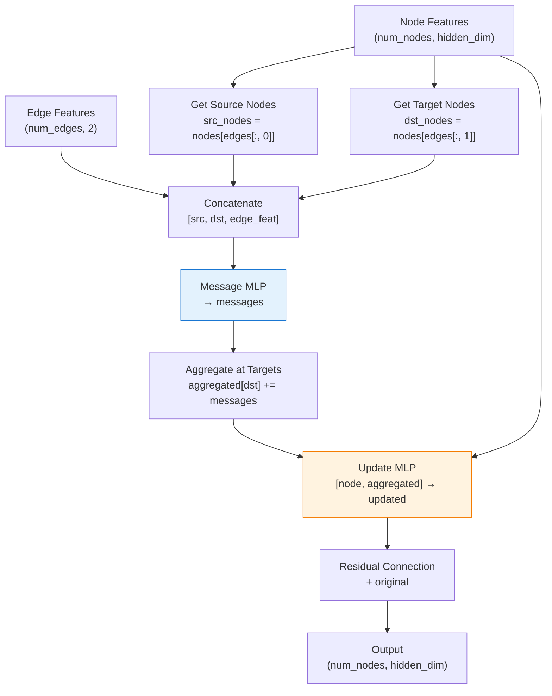

# GNO on Darcy Flow

| Metadata          | Value                           |
|-------------------|---------------------------------|
| **Level**         | Intermediate                    |
| **Runtime**       | ~2 min (CPU) / ~15s (GPU)       |
| **Prerequisites** | JAX, Flax NNX, GNN basics       |
| **Format**        | Python + Jupyter                |
| **Memory**        | ~500 MB RAM                     |

## Overview

This tutorial demonstrates training a Graph Neural Operator (GNO) on the
Darcy flow problem. GNO uses message passing neural networks to learn operators
on graph-structured data, making it naturally suited for problems with irregular
geometries or unstructured meshes.

Unlike Fourier-based operators (FNO, TFNO) that require uniform grids, GNO operates
on arbitrary node connectivity patterns. This flexibility comes at the cost of
computational efficiency on regular grids, where spectral methods excel. This example
shows how to convert regular grid data to graph format and train a GNO.

## What You'll Learn

1. **Convert** 2D grid data to graph representation using `grid_to_graph_data()`
2. **Understand** GNO's message passing architecture for operator learning
3. **Configure** graph connectivity (4-neighbor, 8-neighbor, radius-based)
4. **Train** a `GraphNeuralOperator` with custom loss on node features
5. **Visualize** predictions by converting graph output back to grid format

## Coming from NeuralOperator (PyTorch)?

If you are familiar with the neuraloperator library:

| NeuralOperator (PyTorch)                    | Opifex (JAX)                                        |
|---------------------------------------------|-----------------------------------------------------|
| `GNOBlock(radius=0.035)`                    | `GraphNeuralOperator(node_dim, hidden_dim, ...)`    |
| Runtime neighbor search (Open3D)            | Pre-computed edge indices                           |
| `NeighborSearch` module                     | `grid_to_graph_data(connectivity=8)`                |
| `IntegralTransform` with MLP kernel         | `MessagePassingLayer` with explicit edge features   |
| Handles variable node counts                | Fixed graph structure (batch-friendly)              |

**Key differences:**

1. **Pre-computed edges**: Opifex expects edge indices upfront, enabling JAX's static shapes
2. **Explicit edge features**: Edge features are computed externally and passed to the model
3. **Fixed batch structure**: All graphs in a batch must have the same node/edge counts
4. **Grid-to-graph utilities**: Built-in `grid_to_graph_data()` for regular grid conversion

## Files

- **Python Script**: [`examples/neural-operators/gno_darcy.py`](https://github.com/Opifex/Opifex/blob/main/examples/neural-operators/gno_darcy.py)
- **Jupyter Notebook**: [`examples/neural-operators/gno_darcy.ipynb`](https://github.com/Opifex/Opifex/blob/main/examples/neural-operators/gno_darcy.ipynb)

## Quick Start

### Run the Python Script

```bash
source activate.sh && python examples/neural-operators/gno_darcy.py
```

### Run the Jupyter Notebook

```bash
jupyter lab examples/neural-operators/gno_darcy.ipynb
```

## Core Concepts

### GNO Architecture

GNO applies message passing neural networks to learn operators on graphs:

```mermaid
graph LR
    subgraph Input
        A["Grid Data<br/>(1, 16, 16)"]
    end

    subgraph Preprocessing["Grid-to-Graph Conversion"]
        B["Flatten to Nodes<br/>(256 nodes)"]
        C["Create Edges<br/>(1860 edges)"]
        D["Compute Edge Features<br/>(relative positions)"]
    end

    subgraph GNO["Graph Neural Operator"]
        E["Input Projection<br/>node_dim → hidden_dim"]
        F["MessagePassingLayer 1"]
        G["MessagePassingLayer 2"]
        H["MessagePassingLayer 3"]
        I["MessagePassingLayer 4"]
        J["Output Projection<br/>hidden_dim → node_dim"]
    end

    subgraph Output
        K["Predicted Nodes<br/>(256 nodes)"]
        L["Reshape to Grid<br/>(1, 16, 16)"]
    end

    A --> B --> C --> D --> E --> F --> G --> H --> I --> J --> K --> L
```



### Message Passing Layer

Each layer computes node updates through three steps:



### When to Use GNO

| Problem Type           | GNO | FNO  | Recommendation                |
|------------------------|-----|------|-------------------------------|
| Regular 2D/3D grids    | OK  | Best | Use FNO for efficiency        |
| Irregular meshes       | Best| N/A  | GNO handles any connectivity  |
| Point clouds           | Best| N/A  | GNO works on unstructured data|
| Variable geometry      | Best| Limited | GNO adapts to node layout  |
| Large regular grids    | Slow| Fast | FNO scales better (O(N log N))|

## Implementation

### Step 1: Imports and Setup

```python
import jax
from flax import nnx

from opifex.data.loaders import create_darcy_loader
from opifex.neural.operators.graph import (
    GraphNeuralOperator,
    graph_to_grid,
    grid_to_graph_data,
)
```

**Terminal Output:**

```text
======================================================================
Opifex Example: GNO on Darcy Flow
======================================================================
JAX backend: gpu
JAX devices: [CudaDevice(id=0)]
Resolution: 16x16
Training samples: 200, Test samples: 50
Batch size: 16, Epochs: 30
GNO config: hidden_dim=32, layers=4
Graph connectivity: 8-neighbor
```

### Step 2: Data Loading and Graph Conversion

```python
train_loader = create_darcy_loader(
    n_samples=200,
    batch_size=16,
    resolution=16,
    shuffle=True,
    seed=42,
)

# Convert grid data to graph format
train_nodes, train_edges, train_edge_feats = grid_to_graph_data(
    X_train, connectivity=8
)
```

**Terminal Output:**

```text
Generating Darcy flow data...
Grid data: X=(16, 1, 16, 16), Y=(16, 1, 16, 16)

Converting grids to graphs...
Node features shape: (16, 256, 3)
Edge indices shape:  (16, 1860, 2)
Edge features shape: (16, 1860, 2)
Num nodes per graph: 256 (16x16)
Num edges per graph: 1860
```

### Step 3: Model Creation

```python
gno = GraphNeuralOperator(
    node_dim=train_nodes.shape[-1],  # 3: value + x + y
    hidden_dim=32,
    num_layers=4,
    edge_dim=train_edge_feats.shape[-1],  # 2: dx, dy
    rngs=nnx.Rngs(42),
)
```

**Terminal Output:**

```text
Creating GNO model...
GNO parameters: 25,571
```

### Step 4: Training

```python
opt = nnx.Optimizer(gno, optax.adam(1e-3), wrt=nnx.Param)

@nnx.jit
def train_step(model, opt, nodes, edges, edge_feats, targets):
    def loss_fn(model):
        pred = model(nodes, edges, edge_feats)
        # Compare value channel only (not position encoding)
        return jnp.mean((pred[:, :, 0] - targets[:, :, 0]) ** 2)

    loss, grads = nnx.value_and_grad(loss_fn)(model)
    opt.update(model, grads)
    return loss
```

**Terminal Output:**

```text
Training GNO...
  Epoch   1/30: loss=16.764143
  Epoch   5/30: loss=2.551377
  Epoch  10/30: loss=1.369779
  Epoch  15/30: loss=0.550659
  Epoch  20/30: loss=0.372531
  Epoch  25/30: loss=0.302217
  Epoch  30/30: loss=0.195386
Final GNO loss: 1.953856e-01
```

### Step 5: Evaluation

**Terminal Output:**

```text
Running evaluation...
GNO Results:
  Test MSE:         0.198459
  Relative L2:      17.064571 (min=13.048689, max=23.490587)
```

### Visualization

#### Predictions Comparison


#### Training and Graph Structure


## Results Summary

| Metric              | GNO       |
|---------------------|-----------|
| Test MSE            | 0.198459  |
| Relative L2 Error   | 17.06     |
| Parameters          | 25,571    |
| Resolution          | 16x16     |

**Note:** GNO achieves higher MSE than FNO on this regular grid problem because:
1. FNO's spectral convolutions are optimal for uniform grids
2. GNO's message passing is designed for irregular geometries
3. The 16x16 resolution was chosen to keep graph size manageable

GNO excels on problems with non-uniform meshes, complex boundaries, or varying node densities where FNO cannot be applied.

## Next Steps

### Experiments to Try

1. **Increase resolution**: Try 32x32 (requires more memory due to O(n^2) edges)
2. **Try radius-based connectivity**: Use `connectivity="radius", radius=1.5`
3. **Apply to irregular mesh**: Load mesh data instead of regular grid
4. **Combine with FNO**: Use GNO for boundary regions, FNO for interior (GINO approach)

### Related Examples

| Example                                   | Level        | What You'll Learn              |
|-------------------------------------------|--------------|--------------------------------|
| [FNO on Darcy Flow](fno-darcy.md)         | Intermediate | Spectral methods (compare MSE) |
| [Local FNO on Darcy](local-fno-darcy.md)  | Intermediate | Local + global features        |
| [DeepONet on Darcy](deeponet-darcy.md)    | Intermediate | Branch-trunk architecture      |

### API Reference

- [`GraphNeuralOperator`](../../api/neural.md) - Graph neural operator model
- [`MeshGraphNet`](../../api/neural.md) - Encoder-processor-decoder architecture for mesh-based simulation (Pfaff et al., 2021). Reuses `MessagePassingLayer` internally
- [`MessagePassingLayer`](../../api/neural.md) - Individual message passing layer
- [`grid_to_graph_data`](../../api/neural.md) - Grid to graph conversion utility
- [`graph_to_grid`](../../api/neural.md) - Graph to grid conversion utility
- [`create_darcy_loader`](../../api/data.md) - Darcy flow data loader

## Troubleshooting

### Memory error with large grids

**Symptom**: `RESOURCE_EXHAUSTED` error when increasing resolution.

**Cause**: 8-connectivity creates O(8n) edges where n = H*W nodes. At 32x32 = 1024 nodes with ~7000 edges, memory usage grows significantly.

**Solution**: Reduce connectivity or batch size:

```python
# Use 4-connectivity (fewer edges)
node_features, edge_indices, edge_features = grid_to_graph_data(
    grid, connectivity=4
)

# Or reduce batch size
BATCH_SIZE = 8
```

### GNO performs worse than FNO on regular grids

**Symptom**: Higher MSE/Relative L2 compared to FNO.

**Cause**: This is expected behavior. GNO is designed for irregular geometries; FNO's spectral convolutions are optimal for regular grids.

**Solution**: Use FNO for regular grids. Reserve GNO for:
- Unstructured meshes
- Adaptive refinement regions
- Complex boundary geometries
- Point cloud data

### JIT compilation is slow

**Symptom**: First forward pass takes a long time.

**Cause**: Message passing over many edges requires tracing.

**Solution**: The first call triggers XLA compilation. Subsequent calls are fast. For development, use smaller grids:

```python
RESOLUTION = 8  # Faster compilation for debugging
```
