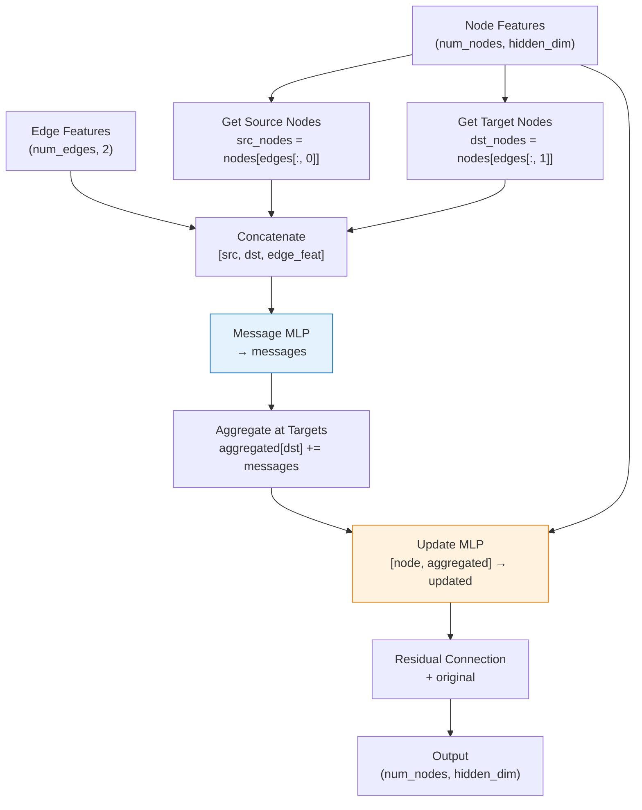
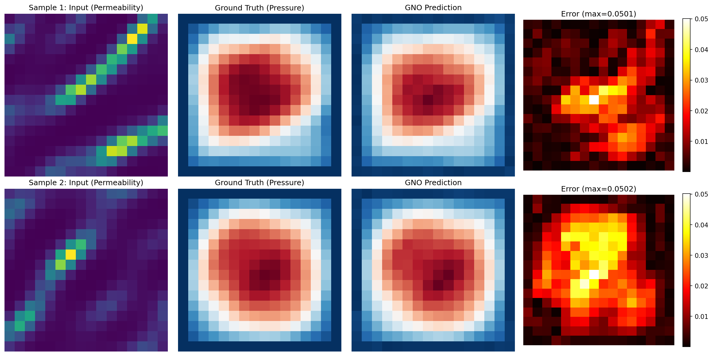
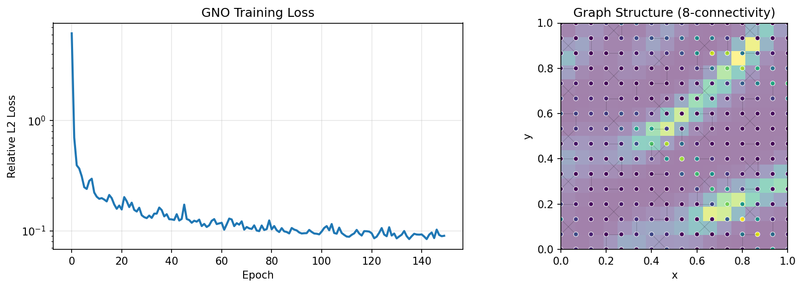

# GNO on Darcy Flow

| Metadata          | Value                           |
|-------------------|---------------------------------|
| **Level**         | Intermediate                    |
| **Runtime**       | ~5 min (CPU) / ~30s (GPU)       |
| **Prerequisites** | JAX, Flax NNX, GNN basics       |
| **Format**        | Python + Jupyter                |
| **Memory**        | ~1 GB RAM                       |

## Overview

This tutorial demonstrates training a Graph Neural Operator (GNO) on the
Darcy flow problem. GNO uses message passing neural networks to learn operators
on graph-structured data, making it naturally suited for problems with irregular
geometries or unstructured meshes.

Unlike Fourier-based operators (FNO, TFNO) that require uniform grids, GNO operates
on arbitrary node connectivity patterns. This flexibility comes at the cost of
computational efficiency on regular grids, where spectral methods excel. This example
shows how to convert regular grid data to graph format and train a GNO.

GNO samples local neighborhoods rather than global spectral modes, which makes it
genuinely harder to train on a regular Darcy grid than FNO or UNO. To make it
converge we apply the standard operator-learning recipe: ~1000 training samples,
**Gaussian normalization** of the input/output fields, the scale-invariant
**relative-L2 loss**, and mini-batched optimization. The raw Darcy pressure is tiny
(~0.05 in magnitude), so without normalization the loss gradients are negligible and
the model collapses toward predicting a constant (relative-L2 error above 1).

## What You'll Learn

1. **Convert** 2D grid data to graph representation using `grid_to_graph_data()`
2. **Understand** GNO's message passing architecture for operator learning
3. **Configure** graph connectivity (4-neighbor, 8-neighbor, radius-based)
4. **Apply** Gaussian normalization and the relative-L2 loss to make GNO converge
5. **Train** a `GraphNeuralOperator` with mini-batched optimization on node features
6. **Visualize** predictions by converting graph output back to grid format

## Coming from NeuralOperator (PyTorch)?

If you are familiar with the neuraloperator library:

| NeuralOperator (PyTorch)                    | Opifex (JAX)                                        |
|---------------------------------------------|-----------------------------------------------------|
| `GNOBlock(radius=0.035)`                    | `GraphNeuralOperator(node_dim, hidden_dim, ...)`    |
| Runtime neighbor search (Open3D)            | Pre-computed edge indices                           |
| `NeighborSearch` module                     | `grid_to_graph_data(connectivity=8)`                |
| `IntegralTransform` with MLP kernel         | `MessagePassingLayer` with explicit edge features   |
| Handles variable node counts                | Fixed graph structure (batch-friendly)              |

**Key differences:**

1. **Pre-computed edges**: Opifex expects edge indices upfront, enabling JAX's static shapes
2. **Explicit edge features**: Edge features are computed externally and passed to the model
3. **Fixed batch structure**: All graphs in a batch must have the same node/edge counts
4. **Grid-to-graph utilities**: Built-in `grid_to_graph_data()` for regular grid conversion

## Files

- **Python Script**: [`examples/neural-operators/gno_darcy.py`](https://github.com/avitai/opifex/blob/main/examples/neural-operators/gno_darcy.py)
- **Jupyter Notebook**: [`examples/neural-operators/gno_darcy.ipynb`](https://github.com/avitai/opifex/blob/main/examples/neural-operators/gno_darcy.ipynb)

## Quick Start

### Run the Python Script

```bash
source activate.sh && python examples/neural-operators/gno_darcy.py
```

### Run the Jupyter Notebook

```bash
jupyter lab examples/neural-operators/gno_darcy.ipynb
```

## Core Concepts

### GNO Architecture

GNO applies message passing neural networks to learn operators on graphs:


```mermaid
graph LR
    subgraph Input
        A["Grid Data<br/>(1, 16, 16)"]
    end

    subgraph Preprocessing["Grid-to-Graph Conversion"]
        B["Flatten to Nodes<br/>(256 nodes)"]
        C["Create Edges<br/>(1860 edges)"]
        D["Compute Edge Features<br/>(relative positions)"]
    end

    subgraph GNO["Graph Neural Operator"]
        E["Input Projection<br/>node_dim → hidden_dim"]
        F["MessagePassingLayer 1"]
        G["MessagePassingLayer 2"]
        H["MessagePassingLayer 3"]
        I["MessagePassingLayer 4"]
        J["Output Projection<br/>hidden_dim → node_dim"]
    end

    subgraph Output
        K["Predicted Nodes<br/>(256 nodes)"]
        L["Reshape to Grid<br/>(1, 16, 16)"]
    end

    A --> B --> C --> D --> E --> F --> G --> H --> I --> J --> K --> L
```

### Message Passing Layer

Each layer computes node updates through three steps:


```mermaid
graph TB
    A["Node Features<br/>(num_nodes, hidden_dim)"] --> B["Get Source Nodes<br/>src_nodes = nodes[edges[:, 0]]"]
    A --> C["Get Target Nodes<br/>dst_nodes = nodes[edges[:, 1]]"]
    D["Edge Features<br/>(num_edges, 2)"] --> E["Concatenate<br/>[src, dst, edge_feat]"]
    B --> E
    C --> E
    E --> F["Message MLP<br/>→ messages"]
    F --> G["Aggregate at Targets<br/>aggregated[dst] += messages"]
    G --> H["Update MLP<br/>[node, aggregated] → updated"]
    A --> H
    H --> I["Residual Connection<br/>+ original"]
    I --> J["Output<br/>(num_nodes, hidden_dim)"]

    style F fill:#e3f2fd,stroke:#1976d2
    style H fill:#fff3e0,stroke:#f57c00
```

### When to Use GNO

| Problem Type           | GNO | FNO  | Recommendation                |
|------------------------|-----|------|-------------------------------|
| Regular 2D/3D grids    | OK  | Best | Use FNO for efficiency        |
| Irregular meshes       | Best| N/A  | GNO handles any connectivity  |
| Point clouds           | Best| N/A  | GNO works on unstructured data|
| Variable geometry      | Best| Limited | GNO adapts to node layout  |
| Large regular grids    | Slow| Fast | FNO scales better (O(N log N))|

## Implementation

### Step 1: Imports and Setup

```python
import jax
from flax import nnx

from opifex.data.loaders import create_darcy_loader
from opifex.neural.operators.graph import (
    GraphNeuralOperator,
    graph_to_grid,
    grid_to_graph_data,
)
```

**Terminal Output:**

```text
======================================================================
Opifex Example: GNO on Darcy Flow
======================================================================
JAX backend: gpu
JAX devices: [CudaDevice(id=0)]
Resolution: 16x16
Training samples: 1000, Test samples: 100
Batch size: 32, Epochs: 150
GNO config: hidden_dim=64, layers=4
Graph connectivity: 8-neighbor
```

### Step 2: Data Loading and Graph Conversion

```python
train_loader = create_darcy_loader(
    n_samples=1000,
    batch_size=32,
    resolution=16,
    shuffle=True,
    seed=42,
)

# Collect every batch (not just the first) and add a channel dimension.
X_train, Y_train = collect_split(train_loader)  # NCHW

# Fit Gaussian statistics on the training split, normalize all splits.
x_mean, x_std = X_train.mean(), X_train.std()
y_mean, y_std = Y_train.mean(), Y_train.std()
X_train_n = (X_train - x_mean) / x_std
Y_train_n = (Y_train - y_mean) / y_std

# Convert the normalized grids to graph format.
train_nodes, train_edges, train_edge_feats = grid_to_graph_data(
    X_train_n, connectivity=8
)
train_targets, _, _ = grid_to_graph_data(Y_train_n, connectivity=8)
```

**Terminal Output:**

```text
Generating Darcy flow data...
Grid data: X=(992, 1, 16, 16), Y=(992, 1, 16, 16)
Input mean/std:  0.6350 / 0.2281
Output mean/std: 0.049656 / 0.039027

Converting grids to graphs...
Node features shape: (992, 256, 3)
Edge indices shape:  (992, 1860, 2)
Edge features shape: (992, 1860, 2)
Num nodes per graph: 256 (16x16)
Num edges per graph: 1860
```

### Step 3: Model Creation

```python
gno = GraphNeuralOperator(
    node_dim=train_nodes.shape[-1],  # 3: value + x + y
    hidden_dim=64,
    num_layers=4,
    edge_dim=train_edge_feats.shape[-1],  # 2: dx, dy
    rngs=nnx.Rngs(42),
)
```

**Terminal Output:**

```text
Creating GNO model...
GNO parameters: 100,291
```

### Step 4: Training

```python
opt = nnx.Optimizer(gno, optax.adam(1e-3), wrt=nnx.Param)

def relative_l2_loss(pred_values, target_values):
    # Scale-invariant per-sample ||pred - y|| / ||y||, averaged over the batch.
    diff = jnp.linalg.norm(pred_values - target_values, axis=1)
    denom = jnp.linalg.norm(target_values, axis=1) + 1e-8
    return jnp.mean(diff / denom)

@nnx.jit
def train_step(model, opt, nodes, edges, edge_feats, targets):
    def loss_fn(model):
        pred = model(nodes, edges, edge_feats)
        # Compare the value channel only (not the position encoding).
        return relative_l2_loss(pred[:, :, 0], targets[:, :, 0])

    loss, grads = nnx.value_and_grad(loss_fn)(model)
    opt.update(model, grads)
    return loss

# Mini-batch over the full (normalized) training set every epoch.
```

**Terminal Output:**

```text
Training GNO...
  Epoch   1/150: loss=6.366672
  Epoch  10/150: loss=0.152864
  Epoch  20/150: loss=0.140062
  Epoch  30/150: loss=0.112039
  Epoch  40/150: loss=0.088015
  Epoch  50/150: loss=0.071424
  Epoch  60/150: loss=0.071945
  Epoch  70/150: loss=0.078770
  Epoch  80/150: loss=0.060371
  Epoch  90/150: loss=0.056902
  Epoch 100/150: loss=0.058171
  Epoch 110/150: loss=0.069797
  Epoch 120/150: loss=0.056847
  Epoch 130/150: loss=0.055809
  Epoch 140/150: loss=0.059946
  Epoch 150/150: loss=0.060746
Final GNO loss: 6.074574e-02
```

### Step 5: Evaluation

**Terminal Output:**

```text
Running evaluation...
GNO Results:
  Test MSE:         6.411563e-06
  Relative L2:      0.038602 (min=0.019114, max=0.127797)
```

Predictions are un-normalized back to physical pressure (`pred * y_std + y_mean`)
before the relative-L2 error is computed, so the reported error is in physical
space. The test forward pass is run in batches to bound memory use.

### Visualization

#### Predictions Comparison



#### Training and Graph Structure



## Results Summary

| Metric              | GNO         |
|---------------------|-------------|
| Test MSE            | 6.41e-06    |
| Relative L2 Error   | 0.0386      |
| Parameters          | 100,291     |
| Resolution          | 16x16       |

**Note:** With the operator-learning recipe (Gaussian normalization +
relative-L2 loss + ~1000 samples + 150 epochs), GNO reaches a ~3.9% relative-L2
error on Darcy flow — comfortably below the 10% target for graph operators on a
regular grid. Without normalization the same model collapses to a constant
prediction (relative-L2 error above 7), because the raw Darcy pressure scale
(~0.05) starves the gradients. GNO remains slightly less accurate than spectral
operators (FNO, UNO) on uniform grids, where Fourier convolutions are optimal,
but it excels on problems with non-uniform meshes, complex boundaries, or
varying node densities where FNO cannot be applied.

## Next Steps

### Experiments to Try

1. **Increase resolution**: Try 32x32 (requires more memory due to O(n^2) edges)
2. **Try radius-based connectivity**: Use `connectivity="radius", radius=1.5`
3. **Apply to irregular mesh**: Load mesh data instead of regular grid
4. **Combine with FNO**: Use GNO for boundary regions, FNO for interior (GINO approach)

### Related Examples

| Example                                   | Level        | What You'll Learn              |
|-------------------------------------------|--------------|--------------------------------|
| [FNO on Darcy Flow](fno-darcy.md)         | Intermediate | Spectral methods (compare MSE) |
| [Local FNO on Darcy](local-fno-darcy.md)  | Intermediate | Local + global features        |
| [DeepONet on Darcy](deeponet-darcy.md)    | Intermediate | Branch-trunk architecture      |

### API Reference

- [`GraphNeuralOperator`](../../api/neural.md) - Graph neural operator model
- [`MeshGraphNet`](../../api/neural.md) - Encoder-processor-decoder architecture for mesh-based simulation (Pfaff et al., 2021). Reuses `MessagePassingLayer` internally
- [`MessagePassingLayer`](../../api/neural.md) - Individual message passing layer
- [`grid_to_graph_data`](../../api/neural.md) - Grid to graph conversion utility
- [`graph_to_grid`](../../api/neural.md) - Graph to grid conversion utility
- [`create_darcy_loader`](../../api/data.md) - Darcy flow data loader

## Troubleshooting

### Memory error with large grids

**Symptom**: `RESOURCE_EXHAUSTED` error when increasing resolution.

**Cause**: 8-connectivity creates O(8n) edges where n = H*W nodes. At 32x32 = 1024 nodes with ~7000 edges, memory usage grows significantly.

**Solution**: Reduce connectivity or batch size:

```python
# Use 4-connectivity (fewer edges)
node_features, edge_indices, edge_features = grid_to_graph_data(
    grid, connectivity=4
)

# Or reduce batch size
BATCH_SIZE = 8
```

### Relative L2 error stays above 1 (model not learning)

**Symptom**: Training MSE drops, but the test relative-L2 error is greater than 1
(worse than predicting the mean).

**Cause**: Missing normalization and/or a raw-MSE loss. The Darcy pressure field
is tiny (~0.05), so unnormalized MSE gradients are negligible and the model
collapses toward a constant. Loading only the first batch (`next(iter(loader))`)
instead of the full training set has the same effect.

**Solution**: Fit Gaussian statistics on the training split, normalize the input
and output fields, train with the scale-invariant `relative_l2` loss, and
un-normalize predictions before scoring. Collect every batch from the loader.

### GNO is less accurate than FNO on regular grids

**Symptom**: Slightly higher relative-L2 than FNO/UNO on the same grid.

**Cause**: This is expected. GNO learns from local neighborhoods; FNO/UNO
spectral convolutions are optimal on uniform grids.

**Solution**: Prefer FNO/UNO for regular grids. Reserve GNO for:
- Unstructured meshes
- Adaptive refinement regions
- Complex boundary geometries
- Point cloud data

### JIT compilation is slow

**Symptom**: First forward pass takes a long time.

**Cause**: Message passing over many edges requires tracing.

**Solution**: The first call triggers XLA compilation. Subsequent calls are fast. For development, use smaller grids:

```python
RESOLUTION = 8  # Faster compilation for debugging
```
