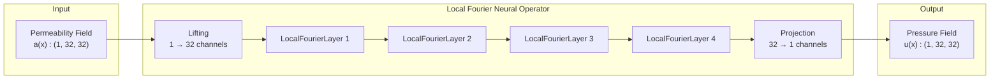
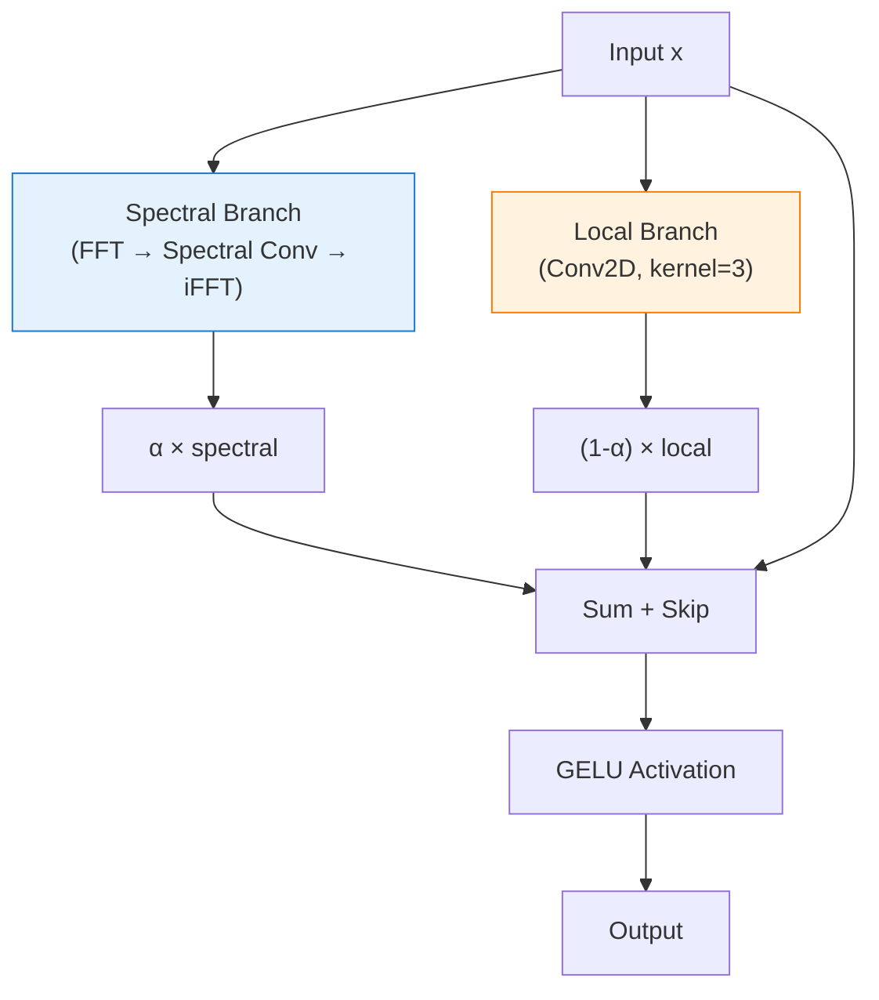
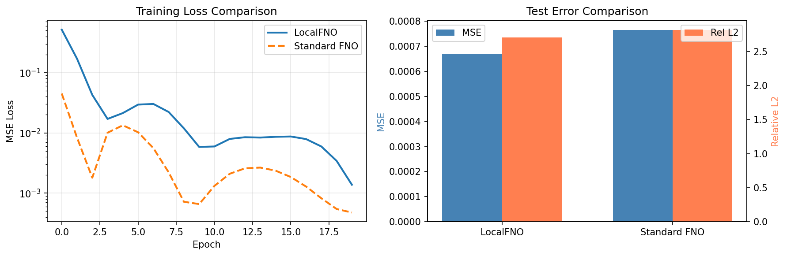

# Local FNO on Darcy Flow

| Metadata          | Value                           |
|-------------------|---------------------------------|
| **Level**         | Intermediate                    |
| **Runtime**       | ~3 min (CPU) / ~30s (GPU)       |
| **Prerequisites** | JAX, Flax NNX, FNO basics       |
| **Format**        | Python + Jupyter                |
| **Memory**        | ~1 GB RAM                       |

## Overview

This tutorial demonstrates training a Local Fourier Neural Operator (LocalFNO) on the
Darcy flow problem. LocalFNO combines global spectral convolutions with local spatial
convolutions to capture both long-range dependencies and fine-grained local features.

The key insight is that many physical systems exhibit both global patterns (e.g., overall
flow direction) and local features (e.g., boundary layers, sharp gradients). LocalFNO
addresses this by processing inputs through both spectral (global) and convolutional
(local) branches, then combining the results.

## What You'll Learn

1. **Understand** LocalFNO architecture: spectral + local convolution branches
2. **Create** a `LocalFourierNeuralOperator` with configurable kernel size
3. **Compare** LocalFNO vs standard FNO on the same problem
4. **Analyze** the trade-off between accuracy and parameter count

## Coming from NeuralOperator (PyTorch)?

If you are familiar with the neuraloperator library:

| NeuralOperator (PyTorch)                    | Opifex (JAX)                                        |
|---------------------------------------------|-----------------------------------------------------|
| No built-in LocalFNO                        | `LocalFourierNeuralOperator(..., kernel_size=3)`    |
| Manual local convolution layers             | Built-in spectral + local branch combination        |
| `torch.compile`                             | `@nnx.jit` for XLA compilation                      |
| `torch.nn.Conv2d` for local ops             | `nnx.Conv` with automatic NHWC/NCHW conversion      |

**Key differences:**

1. **Integrated local branch**: Opifex's LocalFNO has built-in local convolution per layer
2. **Mixing weight**: Configurable `mixing_weight` controls spectral vs local balance
3. **Residual connections**: Optional skip connections for improved gradient flow
4. **Factory functions**: `create_turbulence_local_fno()`, `create_wave_local_fno()` presets

## Files

- **Python Script**: [`examples/neural-operators/local_fno_darcy.py`](https://github.com/Opifex/Opifex/blob/main/examples/neural-operators/local_fno_darcy.py)
- **Jupyter Notebook**: [`examples/neural-operators/local_fno_darcy.ipynb`](https://github.com/Opifex/Opifex/blob/main/examples/neural-operators/local_fno_darcy.ipynb)

## Quick Start

### Run the Python Script

```bash
source activate.sh && python examples/neural-operators/local_fno_darcy.py
```

### Run the Jupyter Notebook

```bash
jupyter lab examples/neural-operators/local_fno_darcy.ipynb
```

## Core Concepts

### LocalFNO Architecture

LocalFNO extends FNO by adding a local convolution branch in each layer:



### LocalFourierLayer Detail

Each layer processes input through two parallel branches:



Where `α` is the `mixing_weight` parameter (default 0.5).

### When to Use LocalFNO

| Problem Type           | Standard FNO | LocalFNO    |
|------------------------|--------------|-------------|
| Smooth solutions       | Good         | Comparable  |
| Sharp gradients        | Limited      | Better      |
| Boundary layers        | Limited      | Better      |
| Turbulence (multi-scale) | Good       | Better      |
| Memory-constrained     | Better       | More params |

## Implementation

### Step 1: Imports and Setup

```python
import jax
from flax import nnx

from opifex.data.loaders import create_darcy_loader
from opifex.neural.operators.fno.local import LocalFourierNeuralOperator
from opifex.neural.operators.fno.base import FourierNeuralOperator
```

**Terminal Output:**

```text
======================================================================
Opifex Example: Local FNO on Darcy Flow
======================================================================
JAX backend: gpu
JAX devices: [CudaDevice(id=0)]
Resolution: 32x32
Training samples: 200, Test samples: 50
Batch size: 16, Epochs: 20
FNO config: modes=(12, 12), width=32, layers=4
Local kernel size: 3
```

### Step 2: Data Loading

```python
train_loader = create_darcy_loader(
    n_samples=200,
    batch_size=16,
    resolution=32,
    shuffle=True,
    seed=42,
)
```

**Terminal Output:**

```text
Generating Darcy flow data...
Training data: X=(16, 1, 32, 32), Y=(16, 1, 32, 32)
Test data:     X=(50, 1, 32, 32), Y=(50, 1, 32, 32)
```

### Step 3: Model Creation

```python
local_fno = LocalFourierNeuralOperator(
    in_channels=1,
    out_channels=1,
    hidden_channels=32,
    modes=(12, 12),
    num_layers=4,
    kernel_size=3,
    use_residual_connections=True,
    rngs=nnx.Rngs(42),
)
```

**Terminal Output:**

```text
Creating LocalFNO model...
LocalFNO parameters: 365,035

Creating standard FNO for comparison...
Standard FNO parameters: 53,473
LocalFNO overhead: 582.7%
```

### Step 4: Training

```python
opt = nnx.Optimizer(model, optax.adam(1e-3), wrt=nnx.Param)

@nnx.jit
def train_step(model, opt, x, y):
    def loss_fn(model):
        y_pred = model(x)
        return jnp.mean((y_pred - y) ** 2)

    loss, grads = nnx.value_and_grad(loss_fn)(model)
    opt.update(model, grads)
    return loss
```

**Terminal Output:**

```text
Training LocalFNO...
  Epoch   1/20: loss=0.518433
  Epoch   5/20: loss=0.021340
  Epoch  10/20: loss=0.005847
  Epoch  15/20: loss=0.008613
  Epoch  20/20: loss=0.001378
Final LocalFNO loss: 1.377639e-03

Training Standard FNO...
  Epoch   1/20: loss=0.045024
  Epoch   5/20: loss=0.013370
  Epoch  10/20: loss=0.000658
  Epoch  15/20: loss=0.002363
  Epoch  20/20: loss=0.000476
Final FNO loss: 4.763597e-04
```

### Step 5: Evaluation

**Terminal Output:**

```text
Running evaluation...
LocalFNO Results:
  Test MSE:         0.000669
  Relative L2:      2.710133 (min=2.208369, max=4.282701)

Standard FNO Results:
  Test MSE:         0.000765
  Relative L2:      2.816077 (min=1.666520, max=4.716997)

Comparison:
  MSE improvement (LocalFNO vs FNO): +12.5%
  Rel L2 improvement: +3.8%
```

### Visualization

#### Predictions Comparison


#### Training and Error Analysis



## Results Summary

| Metric              | LocalFNO  | Standard FNO |
|---------------------|-----------|--------------|
| Test MSE            | 0.000669  | 0.000765     |
| Relative L2 Error   | 2.71      | 2.82         |
| Parameters          | 365,035   | 53,473       |
| MSE Improvement     | +12.5%    | (baseline)   |

## Next Steps

### Experiments to Try

1. **Vary kernel size**: Try `kernel_size=5` or `kernel_size=7` for larger receptive fields
2. **Adjust mixing weight**: Use `mixing_weight=0.3` to emphasize local features
3. **Disable residual connections**: Set `use_residual_connections=False` for comparison
4. **Apply to turbulence**: Use `create_turbulence_local_fno()` preset for turbulent flows

### Related Examples

| Example                                   | Level        | What You'll Learn              |
|-------------------------------------------|--------------|--------------------------------|
| [FNO on Darcy Flow](fno-darcy.md)         | Intermediate | Standard FNO baseline          |
| [FNO on Burgers Equation](fno-burgers.md) | Intermediate | 1D temporal evolution          |
| [U-FNO on Turbulence](ufno-turbulence.md) | Advanced     | Multi-scale U-Net + FNO        |

### API Reference

- [`LocalFourierNeuralOperator`](../../api/neural.md) - Local FNO model class
- [`LocalFourierLayer`](../../api/neural.md) - Individual local Fourier layer
- [`create_turbulence_local_fno`](../../api/neural.md) - Preset for turbulent flows
- [`create_darcy_loader`](../../api/data.md) - Darcy flow data loader

## Troubleshooting

### LocalFNO uses more memory than expected

**Symptom**: `RESOURCE_EXHAUSTED` error or high memory usage.

**Cause**: LocalFNO has ~7x more parameters than standard FNO due to local convolution layers.

**Solution**: Reduce hidden channels or use smaller kernel size:

```python
model = LocalFourierNeuralOperator(
    hidden_channels=16,  # Reduce from 32
    kernel_size=3,       # Keep small
    ...
)
```

### Training is slower than standard FNO

**Symptom**: Each epoch takes significantly longer.

**Cause**: Additional local convolution operations add computational overhead.

**Solution**: LocalFNO is designed for problems where local features matter. For smooth
problems, use standard FNO. For multi-scale problems, the accuracy improvement may
justify the extra cost.

### Relative L2 error is high

**Symptom**: Relative L2 > 1.0 despite low MSE.

**Cause**: The target field has small absolute values, making relative error high.

**Solution**: This is expected for some problems. Focus on MSE or increase training data:

```python
train_loader = create_darcy_loader(n_samples=500, ...)  # More data
```
