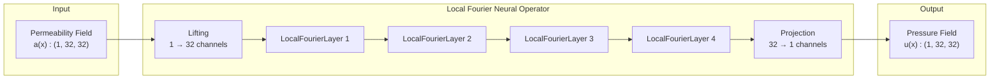
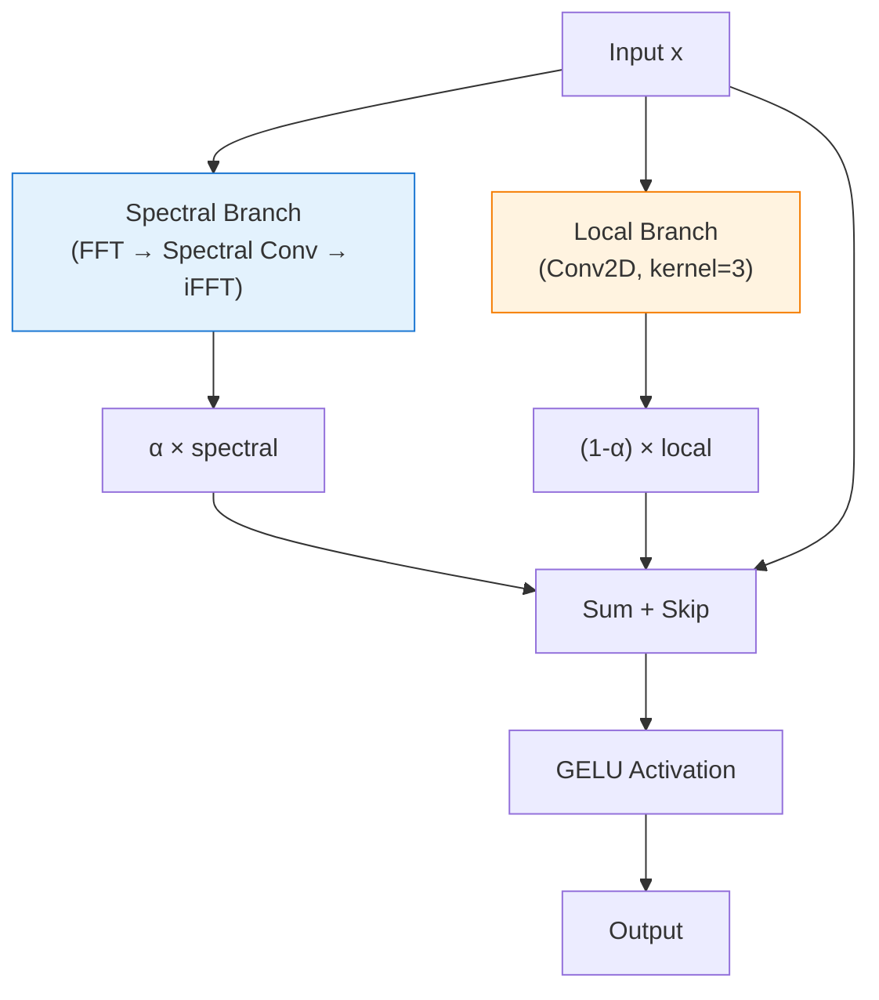
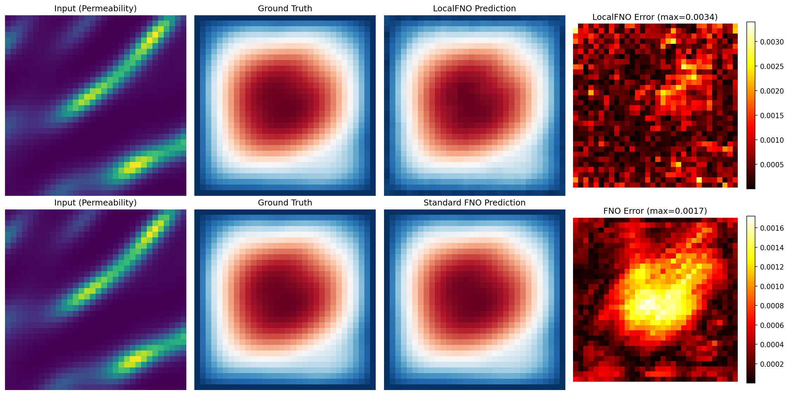
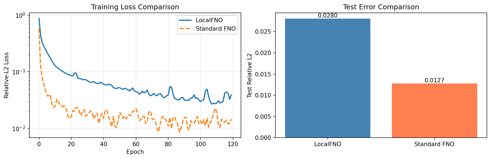

# Local FNO on Darcy Flow

| Metadata          | Value                           |
|-------------------|---------------------------------|
| **Level**         | Intermediate                    |
| **Runtime**       | ~5 min (CPU) / ~1 min (GPU)     |
| **Prerequisites** | JAX, Flax NNX, FNO basics       |
| **Format**        | Python + Jupyter                |
| **Memory**        | ~2 GB RAM                       |

## Overview

This tutorial demonstrates training a Local Fourier Neural Operator (LocalFNO) on the
Darcy flow problem. LocalFNO combines global spectral convolutions with local spatial
convolutions to capture both long-range dependencies and fine-grained local features.

The key insight is that many physical systems exhibit both global patterns (e.g., overall
flow direction) and local features (e.g., boundary layers, sharp gradients). LocalFNO
addresses this by processing inputs through both spectral (global) and convolutional
(local) branches, then combining the results.

This example uses the standard operator-learning recipe — grid positional embedding,
Gaussian input/output normalization, and the relative-L2 loss — to reach a low relative
L2 error (~1%) on Darcy flow, and compares LocalFNO against a standard FNO baseline.

## What You'll Learn

1. **Understand** LocalFNO architecture: spectral + local convolution branches
2. **Apply** the operator-learning recipe: grid embedding, normalization, relative-L2 loss
3. **Create** a `LocalFourierNeuralOperator` with configurable kernel size
4. **Compare** LocalFNO vs standard FNO on the same problem
5. **Analyze** the trade-off between accuracy and parameter count

## Coming from NeuralOperator (PyTorch)?

If you are familiar with the neuraloperator library:

| NeuralOperator (PyTorch)                    | Opifex (JAX)                                        |
|---------------------------------------------|-----------------------------------------------------|
| No built-in LocalFNO                        | `LocalFourierNeuralOperator(..., kernel_size=3)`    |
| Manual local convolution layers             | Built-in spectral + local branch combination        |
| `torch.compile`                             | `@nnx.jit` for XLA compilation                      |
| `torch.nn.Conv2d` for local ops             | `nnx.Conv` with automatic NHWC/NCHW conversion      |

**Key differences:**

1. **Integrated local branch**: Opifex's LocalFNO has built-in local convolution per layer
2. **Mixing weight**: Configurable `mixing_weight` controls spectral vs local balance
3. **Residual connections**: Optional skip connections for improved gradient flow
4. **Factory functions**: `create_turbulence_local_fno()`, `create_wave_local_fno()` presets

## Files

- **Python Script**: [`examples/neural-operators/local_fno_darcy.py`](https://github.com/avitai/opifex/blob/main/examples/neural-operators/local_fno_darcy.py)
- **Jupyter Notebook**: [`examples/neural-operators/local_fno_darcy.ipynb`](https://github.com/avitai/opifex/blob/main/examples/neural-operators/local_fno_darcy.ipynb)

## Quick Start

### Run the Python Script

```bash
source activate.sh && python examples/neural-operators/local_fno_darcy.py
```

### Run the Jupyter Notebook

```bash
jupyter lab examples/neural-operators/local_fno_darcy.ipynb
```

## Core Concepts

### LocalFNO Architecture

LocalFNO extends FNO by adding a local convolution branch in each layer:


```mermaid
graph LR
    subgraph Input
        A["Permeability Field<br/>a(x) : (1, 32, 32)"]
    end

    subgraph LocalFNO["Local Fourier Neural Operator"]
        B["Lifting<br/>1 → 32 channels"]
        C["LocalFourierLayer 1"]
        D["LocalFourierLayer 2"]
        E["LocalFourierLayer 3"]
        F["LocalFourierLayer 4"]
        G["Projection<br/>32 → 1 channels"]
    end

    subgraph Output
        H["Pressure Field<br/>u(x) : (1, 32, 32)"]
    end

    A --> B --> C --> D --> E --> F --> G --> H
```

### LocalFourierLayer Detail

Each layer processes input through two parallel branches:


```mermaid
graph TB
    A["Input x"] --> B["Spectral Branch<br/>(FFT → Spectral Conv → iFFT)"]
    A --> C["Local Branch<br/>(Conv2D, kernel=3)"]
    B --> D["α × spectral"]
    C --> E["(1-α) × local"]
    D --> F["Sum + Skip"]
    E --> F
    A --> F
    F --> G["GELU Activation"]
    G --> H["Output"]

    style B fill:#e3f2fd,stroke:#1976d2
    style C fill:#fff3e0,stroke:#f57c00
```

Where `α` is the `mixing_weight` parameter (default 0.5).

### When to Use LocalFNO

| Problem Type           | Standard FNO | LocalFNO    |
|------------------------|--------------|-------------|
| Smooth solutions       | Good         | Comparable  |
| Sharp gradients        | Limited      | Better      |
| Boundary layers        | Limited      | Better      |
| Turbulence (multi-scale) | Good       | Better      |
| Memory-constrained     | Better       | More params |

## Implementation

### Step 1: Imports and Setup

```python
import jax
import jax.numpy as jnp
from flax import nnx

from opifex.core.training import Trainer, TrainingConfig
from opifex.core.training.config import LossConfig
from opifex.data.loaders import create_darcy_loader
from opifex.neural.operators.common.embeddings import GridEmbedding2D
from opifex.neural.operators.fno.base import FourierNeuralOperator
from opifex.neural.operators.fno.local import LocalFourierNeuralOperator
```

**Terminal Output:**

```text
======================================================================
Opifex Example: Local FNO on Darcy Flow
======================================================================
JAX backend: gpu
JAX devices: [CudaDevice(id=0)]
Resolution: 32x32
Training samples: 1000, Test samples: 100
Batch size: 32, Epochs: 120
FNO config: modes=(12, 12), width=32, layers=4
Local kernel size: 3
```

### Step 2: Data Loading and Normalization

We collect ~1000 training samples and fit Gaussian statistics on the training set,
then normalize all splits. Predictions are un-normalized before computing the
physical-space relative-L2 error.

```python
train_loader = create_darcy_loader(
    n_samples=1000,
    batch_size=32,
    resolution=32,
    shuffle=True,
    seed=42,
)

x_mean, x_std = X_train.mean(), X_train.std()
y_mean, y_std = Y_train.mean(), Y_train.std()
X_train_n = (X_train - x_mean) / x_std
Y_train_n = (Y_train - y_mean) / y_std
```

**Terminal Output:**

```text
Generating Darcy flow data...
Training data: X=(992, 1, 32, 32), Y=(992, 1, 32, 32)
Test data:     X=(96, 1, 32, 32), Y=(96, 1, 32, 32)
Input mean/std:  0.6274 / 0.2146
Output mean/std: 0.054309 / 0.038000
```

### Step 3: Model Creation

LocalFNO operates on channels-first tensors and does not append grid coordinates
internally, so we wrap it with `GridEmbedding2D`. The embedding appends normalized
`(x, y)` coordinate channels — the standard positional encoding that lets spectral
operators resolve the Dirichlet boundary of the Darcy problem.

```python
class LocalFNOWithGrid(nnx.Module):
    def __init__(self, in_channels, out_channels, hidden_channels,
                 modes, num_layers, kernel_size, *, rngs):
        super().__init__()
        self.grid_embedding = GridEmbedding2D(
            in_channels=in_channels,
            grid_boundaries=[[0.0, 1.0], [0.0, 1.0]],
        )
        self.local_fno = LocalFourierNeuralOperator(
            in_channels=self.grid_embedding.out_channels,
            out_channels=out_channels,
            hidden_channels=hidden_channels,
            modes=modes,
            num_layers=num_layers,
            kernel_size=kernel_size,
            use_residual_connections=True,
            rngs=rngs,
        )

    def __call__(self, x):
        x_hwc = jnp.moveaxis(x, 1, -1)
        x_embedded = self.grid_embedding(x_hwc)
        x_chw = jnp.moveaxis(x_embedded, -1, 1)
        result = self.local_fno(x_chw)
        return result[0] if isinstance(result, tuple) else result
```

**Terminal Output:**

```text
Creating LocalFNO model with grid embedding...
LocalFNO parameters: 365,099

Creating standard FNO for comparison...
Standard FNO parameters: 2,368,001
LocalFNO overhead: -84.6%
```

### Step 4: Training

We train both operators with Opifex's `Trainer` and the relative-L2 loss — the
standard operator-learning objective — over 120 epochs.

```python
config = TrainingConfig(
    num_epochs=120,
    learning_rate=1e-3,
    batch_size=32,
    validation_frequency=10,
    verbose=True,
    loss_config=LossConfig(loss_type="relative_l2"),
)
trainer = Trainer(model=model, config=config, rngs=nnx.Rngs(42))
trained_model, metrics = trainer.fit(
    train_data=(jnp.array(X_train_n), jnp.array(Y_train_n)),
    val_data=(jnp.array(X_test_n), jnp.array(Y_test_n)),
)
```

**Terminal Output:**

```text
Training LocalFNO (Adam lr=0.001, relative-L2 loss)...
LocalFNO training completed in 20.8s
  Final train loss: 0.02236589488963927
  Final val loss:   0.0011326733510941267

Training Standard FNO (Adam lr=0.001, relative-L2 loss)...
Standard FNO training completed in 12.5s
  Final train loss: 0.008356716228468765
  Final val loss:   0.00019725736638065428
```

### Step 5: Evaluation

Predictions are un-normalized back to physical pressure before measuring the
relative L2 error, and the test set is run through each model in batches.

**Terminal Output:**

```text
Running evaluation...
LocalFNO Results:
  Test MSE:         6.723121e-07
  Relative L2:      0.012391 (min=0.008915, max=0.027407)

Standard FNO Results:
  Test MSE:         3.598657e-07
  Relative L2:      0.008856 (min=0.005160, max=0.020793)

Comparison:
  MSE improvement (LocalFNO vs FNO): -86.8%
  Rel L2 improvement: -39.9%
```

### Visualization

#### Predictions Comparison



#### Training and Error Analysis



## Results Summary

| Metric              | LocalFNO    | Standard FNO |
|---------------------|-------------|--------------|
| Test MSE            | 6.72e-07    | 3.60e-07     |
| Relative L2 Error   | 0.0124      | 0.0089       |
| Parameters          | 365,099     | 2,368,001    |

Both operators reach ~1% relative L2 on the corrected Darcy data. The standard FNO
is slightly more accurate here, while LocalFNO reaches comparable accuracy with
roughly 6x fewer parameters thanks to its local convolution branch. On smooth
solutions like Darcy flow the spectral branch dominates; LocalFNO's local branch
pays off most on problems with sharp gradients or boundary layers.

## Next Steps

### Experiments to Try

1. **Vary kernel size**: Try `kernel_size=5` or `kernel_size=7` for larger receptive fields
2. **Adjust mixing weight**: Use `mixing_weight=0.3` to emphasize local features
3. **Disable residual connections**: Set `use_residual_connections=False` for comparison
4. **Apply to turbulence**: Use `create_turbulence_local_fno()` preset for turbulent flows

### Related Examples

| Example                                   | Level        | What You'll Learn              |
|-------------------------------------------|--------------|--------------------------------|
| [FNO on Darcy Flow](fno-darcy.md)         | Intermediate | Standard FNO baseline          |
| [FNO on Burgers Equation](fno-burgers.md) | Intermediate | 1D temporal evolution          |
| [U-FNO on Turbulence](ufno-turbulence.md) | Advanced     | Multi-scale U-Net + FNO        |

### API Reference

- [`LocalFourierNeuralOperator`](../../api/neural.md) - Local FNO model class
- [`LocalFourierLayer`](../../api/neural.md) - Individual local Fourier layer
- [`create_turbulence_local_fno`](../../api/neural.md) - Preset for turbulent flows
- [`create_darcy_loader`](../../api/data.md) - Darcy flow data loader

## Troubleshooting

### Relative L2 error is high (> 0.5)

**Symptom**: Relative L2 stays near 0.5-0.7 even after training.

**Cause**: Missing the operator-learning recipe — no grid positional embedding, no
input/output normalization, or the MSE loss instead of relative-L2.

**Solution**: Apply the full recipe used in this example: wrap the model in
`GridEmbedding2D`, fit Gaussian statistics on the training set and normalize all
splits, use `LossConfig(loss_type="relative_l2")`, and train with ~1000 samples for
enough epochs. Remember to un-normalize predictions before measuring the physical
relative-L2 error.

### Training is slower than standard FNO per epoch

**Symptom**: Each LocalFNO epoch takes longer than the standard FNO.

**Cause**: The extra local convolution branch adds computation per layer.

**Solution**: LocalFNO is designed for problems where local features matter. For
smooth problems like Darcy flow, a standard FNO is competitive. For multi-scale
problems with sharp gradients, LocalFNO's accuracy-per-parameter advantage justifies
the extra cost.

### Out-of-memory during evaluation

**Symptom**: `RESOURCE_EXHAUSTED` error when running the full test set at once.

**Solution**: Run the forward pass in batches (this example uses a batch size of 128):

```python
outputs = [model(inputs[i : i + 128]) for i in range(0, inputs.shape[0], 128)]
predictions = jnp.concatenate(outputs, axis=0) * y_std + y_mean
```
