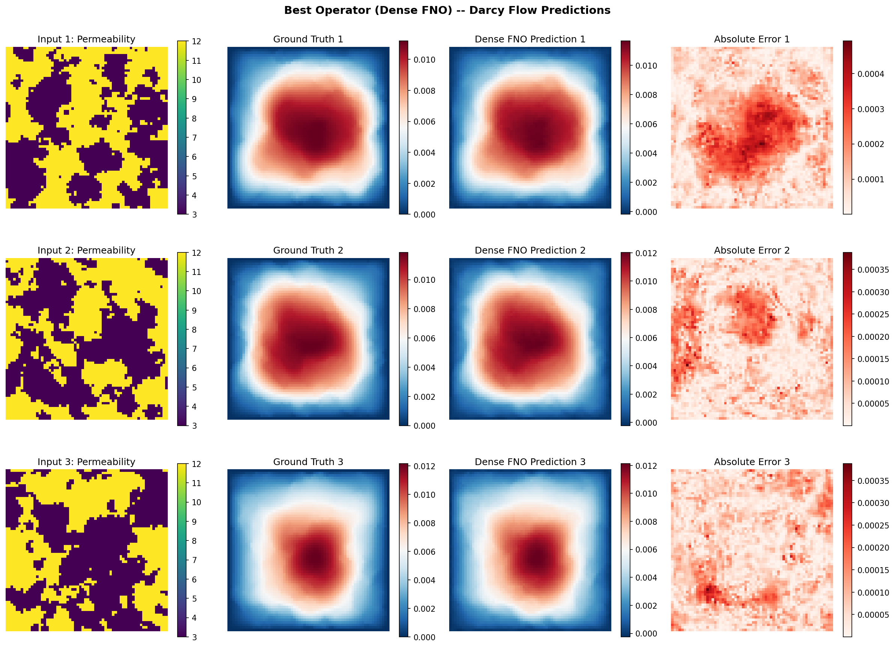
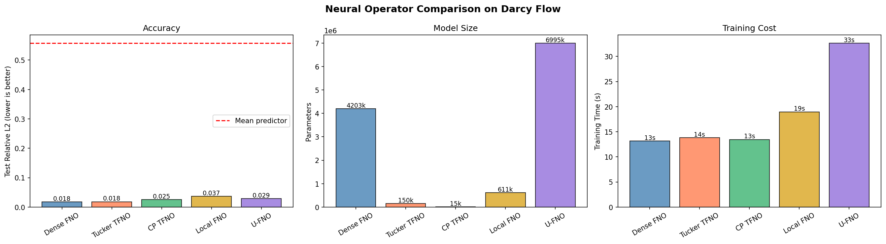

# Neural Operator Comparison Tour

| Metadata | Value |
|----------|-------|
| **Level** | Advanced |
| **Runtime** | ~10 min (CPU), ~3 min (GPU) |
| **Prerequisites** | JAX, Flax NNX, Neural Operators |
| **Format** | Python + Jupyter |

## Overview

This example tours the Fourier-family neural operators in Opifex and runs a
**fair, head-to-head comparison** of them on a single Darcy-flow benchmark. Every
operator is trained with the *same* recipe -- grid positional embedding, Gaussian
input/output normalization, the relative-L2 loss, and an identical optimizer
budget -- so the resulting accuracy and parameter counts are directly comparable.

Unlike single-model tutorials, this demo maps the trade-offs across the
`opifex.neural.operators` Fourier family. Each operator maps a high-contrast
permeability field `a(x) ∈ {3, 12}` to the Darcy pressure solution of
`-∇·(a∇u) = 1`. We report the test relative-L2 error, the parameter count, and the
training time, then visualise the trade-offs.

## What You'll Learn

1. **Discover operators** with `list_operators()` and `recommend_operator()`
2. **Apply one recipe uniformly** across Dense FNO, Tucker/CP Tensorized FNO,
   Local FNO, and U-FNO
3. **Read a fair accuracy-vs-parameters comparison** on real Darcy data
4. **Understand the Tucker/CP compression trade-off** against a dense FNO
5. **Validate against a floor** -- every operator must beat a mean predictor

## Coming from NeuralOperator (PyTorch)?

If you are familiar with the neuraloperator library, here is how Opifex compares for
this workflow:

| NeuralOperator (PyTorch) | Opifex (JAX) |
|--------------------------|--------------|
| `FNO(n_modes, hidden_channels)` | `FourierNeuralOperator(modes=, hidden_channels=, num_layers=, positional_embedding=True, rngs=)` |
| `TFNO(n_modes, hidden_channels, factorization)` | `create_tucker_fno(modes=, hidden_channels=, rank=, rngs=)` / `create_cp_fno(...)` |
| Local FNO with manual conv branches | `LocalFourierNeuralOperator(modes=, hidden_channels=, num_layers=, rngs=)` |
| `UNO(...)` with manual U-Net wiring | `UFourierNeuralOperator(modes=, hidden_channels=, num_levels=, rngs=)` |
| No built-in operator factory | `create_operator("SFNO", ...)` and `recommend_operator("global_climate")` |
| `torch.optim.Adam(model.parameters(), lr)` | `optax.adam(lr)` (handled internally by `Trainer`) |

**Key differences:**

1. **Explicit PRNG**: Opifex uses JAX's explicit `rngs=nnx.Rngs(42)` instead of global random state
2. **Factory system**: `create_operator()` and `recommend_operator()` provide guided operator selection
3. **XLA compilation**: All forward passes are JIT-compiled automatically for hardware acceleration
4. **Functional transforms**: `jax.grad`, `jax.vmap`, `jax.pmap` compose cleanly with every operator variant

## Files

- **Python Script**: [`examples/neural-operators/operator_tour.py`](https://github.com/avitai/opifex/blob/main/examples/neural-operators/operator_tour.py)
- **Jupyter Notebook**: [`examples/neural-operators/operator_tour.ipynb`](https://github.com/avitai/opifex/blob/main/examples/neural-operators/operator_tour.ipynb)

## Quick Start

### Run the Python Script

```bash
source activate.sh && python examples/neural-operators/operator_tour.py
```

### Run the Jupyter Notebook

```bash
jupyter lab examples/neural-operators/operator_tour.ipynb
```

## Core Concepts

### The Fourier Operator Family

Opifex provides a unified framework where every Fourier-family operator shares the
same `(in_channels, out_channels, hidden_channels, modes, rngs)` interface and the
same channels-first `(batch, channels, height, width)` data layout. This tour
compares five of them.

| Operator | Full Name | Distinguishing Feature |
|----------|-----------|------------------------|
| **Dense FNO** | Fourier Neural Operator | Full (dense) spectral weights; the baseline |
| **Tucker TFNO** | Tucker-Tensorized FNO | Spectral weights stored as a Tucker factorization |
| **CP TFNO** | CP-Tensorized FNO | Spectral weights stored as a CP factorization (most compact) |
| **Local FNO** | Local Fourier Neural Operator | Adds local convolution branches to the spectral path |
| **U-FNO** | U-Net Fourier Neural Operator | Multi-scale encoder-decoder over spectral blocks |

### Operator Discovery System

The factory system provides three entry points:

- `list_operators()` -- returns all available operators grouped by category
- `recommend_operator(application)` -- suggests the best operator for a given application
- `create_operator(name, **kwargs)` -- instantiates any operator by name

### The Shared Recipe (Fair Comparison)

The comparison is only meaningful if every operator is given the same chance. We
apply the proven operator-learning recipe identically:

- **Grid positional embedding** -- FNO and the Tensorized FNOs append normalized
  `(x, y)` coordinate channels internally; Local FNO and U-FNO are wrapped so they
  receive the same channels.
- **Gaussian normalization** of inputs and outputs, fit on the training split.
- **Relative-L2 loss** via `LossConfig(loss_type="relative_l2")`.
- **Identical budget** -- 1024 train samples, 100 epochs, Adam at `1e-3`.

## Implementation

### Step 1: Imports and Setup

```python
import time
import warnings
from pathlib import Path
from typing import Any

warnings.filterwarnings("ignore")

import jax
import jax.numpy as jnp
import matplotlib as mpl
import numpy as np
from flax import nnx

mpl.use("Agg")
import matplotlib.pyplot as plt

from opifex.core.training import Trainer, TrainingConfig
from opifex.core.training.config import LossConfig
from opifex.data.loaders import create_darcy_loader
from opifex.neural.operators import (
    FourierNeuralOperator,
    LocalFourierNeuralOperator,
    UFourierNeuralOperator,
    list_operators,
    recommend_operator,
)
from opifex.neural.operators.fno._positional import append_grid_coordinates
from opifex.neural.operators.fno.tensorized import create_cp_fno, create_tucker_fno
```

**Terminal Output:**
```text
======================================================================
Opifex Example: Neural Operator Comparison Tour on Darcy Flow
======================================================================
JAX backend: gpu
JAX devices: [CudaDevice(id=0)]
Resolution: 64x64
Training samples: 1024, Test samples: 256
Shared FNO config: modes=16, width=32, layers=4
```

### Step 2: Operator Discovery

The factory lists every available operator by category and recommends one per
application domain.

```python
for category, operators in list_operators().items():
    print(f"  {category}: {', '.join(operators)}")

applications = [
    "turbulent_flow", "global_climate", "molecular_dynamics",
    "cad_geometry", "safety_critical", "parameter_efficient",
]
for app in applications:
    rec = recommend_operator(app)
    print(f"  {app:20s}: {rec['primary']} - {rec['reason']}")
```

**Terminal Output:**
```text
======================================================================
OPERATOR DISCOVERY
======================================================================
Available operators by category:
  fourier_operators: FNO, TFNO, UFNO, SFNO, LocalFNO, AM-FNO
  deeponet_family: DeepONet, FourierDeepONet, AdaptiveDeepONet
  graph_operators: GNO, MGNO
  uncertainty_aware: FNO, DeepONet, PINO, TFNO, UFNO, SFNO, LocalFNO, AM-FNO, MS-FNO, FourierDeepONet, AdaptiveDeepONet, MultiPhysicsDeepONet, GINO, MGNO, UQNO, LNO, WNO, GNO, OperatorNet
  adapter_capable: FNO, DeepONet, PINO, TFNO, UFNO, SFNO, LocalFNO, AM-FNO, MS-FNO, FourierDeepONet, AdaptiveDeepONet, MultiPhysicsDeepONet, GINO, MGNO, UQNO, LNO, WNO, GNO, OperatorNet
  geometry_aware: GINO, GNO, MGNO
  parameter_efficient: TFNO, LNO

Recommendations by application:
  turbulent_flow      : UFNO - Multi-scale encoder-decoder for turbulent structures
  global_climate      : SFNO - Spherical harmonics for global atmospheric modeling
  molecular_dynamics  : MGNO - Multipole expansion for long-range molecular interactions
  cad_geometry        : GINO - Geometry-aware processing for complex CAD shapes
  safety_critical     : UQNO - Uncertainty quantification for safety-critical decisions
  parameter_efficient : TFNO - Tensor factorization for memory efficiency
```

### Step 3: Data Loading and Normalization

The Darcy loader generates a binary high-contrast permeability field and the exact
pressure solution. A single `create_darcy_loader(...)` call returns a frozen
`PDELoaders` with `.train` and `.val` datarax pipelines, split by `val_fraction`.
We drain each pipeline into channels-first arrays and fit Gaussian statistics on
the training set.

```python
n_samples = N_TRAIN + N_TEST
loaders = create_darcy_loader(
    n_samples=n_samples,
    batch_size=BATCH_SIZE,
    resolution=RESOLUTION,
    field_type="binary",
    coeff_range=PERMEABILITY_VALUES,
    val_fraction=N_TEST / n_samples,
    seed=SEED,
)

X_train, Y_train = collect_darcy_split(loaders.train)
X_test, Y_test = collect_darcy_split(loaders.val)
# ... fit Gaussian statistics and normalize ...
x_mean, x_std = X_train.mean(), X_train.std()
y_mean, y_std = Y_train.mean(), Y_train.std()
X_train_n = jnp.array((X_train - x_mean) / x_std)
Y_train_n = jnp.array((Y_train - y_mean) / y_std)
```

The `collect_darcy_split` helper drains a datarax pipeline into
channels-first `(N, 1, H, W)` arrays:

```python
def collect_darcy_split(pipeline: Any) -> tuple[np.ndarray, np.ndarray]:
    """Drain a datarax pipeline into channels-first ``(N, 1, H, W)`` arrays."""
    inputs, outputs = [], []
    for batch in pipeline:
        inputs.append(np.asarray(batch["input"]))
        outputs.append(np.asarray(batch["output"]))
    return np.concatenate(inputs, axis=0), np.concatenate(outputs, axis=0)
```

**Terminal Output:**
```text
Generating Darcy flow data...
Training data: X=(1024, 1, 64, 64), Y=(1024, 1, 64, 64)
Test data:     X=(256, 1, 64, 64), Y=(256, 1, 64, 64)
Input mean/std:  7.4976 / 4.5000
Output mean/std: 0.005354 / 0.003583
```

### Step 4: Building the Comparison Set

All five operators map `(batch, 1, H, W)` permeability to pressure. Local FNO and
U-FNO are wrapped so they receive the same grid-coordinate channels as the FNO /
TFNO family -- the only difference between models is the architecture.

```python
class GridWrapped(nnx.Module):
    """Append grid coordinates before applying an operator without built-in embedding."""

    def __init__(self, operator: nnx.Module) -> None:
        super().__init__()
        self.operator = operator

    def __call__(self, x: jax.Array) -> jax.Array:
        return self.operator(append_grid_coordinates(x))


grid_in_channels = 1 + 2  # permeability + (x, y) coordinate channels
operators = {
    "Dense FNO": FourierNeuralOperator(
        in_channels=1, out_channels=1, hidden_channels=HIDDEN_CHANNELS,
        modes=MODES, num_layers=NUM_LAYERS, positional_embedding=True,
        rngs=nnx.Rngs(SEED),
    ),
    "Tucker TFNO": create_tucker_fno(
        in_channels=1, out_channels=1, hidden_channels=HIDDEN_CHANNELS,
        modes=(MODES, MODES), rank=TUCKER_RANK, num_layers=NUM_LAYERS,
        rngs=nnx.Rngs(SEED + 1),
    ),
    "CP TFNO": create_cp_fno(
        in_channels=1, out_channels=1, hidden_channels=HIDDEN_CHANNELS,
        modes=(MODES, MODES), rank=CP_RANK, num_layers=NUM_LAYERS,
        rngs=nnx.Rngs(SEED + 2),
    ),
    "Local FNO": GridWrapped(LocalFourierNeuralOperator(
        in_channels=grid_in_channels, out_channels=1, hidden_channels=HIDDEN_CHANNELS,
        modes=(MODES, MODES), num_layers=NUM_LAYERS, rngs=nnx.Rngs(SEED + 3),
    )),
    "U-FNO": GridWrapped(UFourierNeuralOperator(
        in_channels=grid_in_channels, out_channels=1, hidden_channels=HIDDEN_CHANNELS,
        modes=(MODES, MODES), num_levels=UFNO_LEVELS, rngs=nnx.Rngs(SEED + 4),
    )),
}
```

**Terminal Output:**
```text
Comparison operators (parameter counts):
  Dense FNO     : 4,203,009 params
  Tucker TFNO   : 150,017 params
  CP TFNO       : 14,913 params
  Local FNO     : 610,859 params
  U-FNO         : 6,994,881 params
```

!!! note "Tensorized FNO Compression"
    The dense FNO uses full spectral weights, while the Tucker and CP factorized
    FNOs store the same spectral operators in low-rank form. At `rank=0.5` the
    Tucker TFNO is **28x** smaller and the CP TFNO is **282x** smaller than the
    dense FNO -- and on this benchmark they stay within a hair of its accuracy.

### Step 5: Training Each Operator

Every operator reuses the *same* `Trainer` configuration: Adam at `1e-3`, the
relative-L2 loss, and 100 epochs. Only the architecture changes between runs.

```python
config = TrainingConfig(
    num_epochs=100, learning_rate=1e-3, batch_size=32,
    validation_frequency=10, verbose=False,
    loss_config=LossConfig(loss_type="relative_l2"),
)
trainer = Trainer(model=model, config=config, rngs=nnx.Rngs(42))
trained_model, metrics = trainer.fit(
    train_data=(X_train_n, Y_train_n),
    val_data=(X_test_n, Y_test_n),
)
# Un-normalize predictions before measuring physical-space relative L2
predictions = predict_in_batches(trained_model, X_test_n) * y_std + y_mean
```

**Terminal Output:**
```text
======================================================================
TRAINING COMPARISON
======================================================================

----------------------------------------------------------------------
Training Dense FNO (4,203,009 params)...
  Dense FNO: rel-L2=0.0177, MSE=1.404e-08, time=13.2s, final val loss=0.0016

----------------------------------------------------------------------
Training Tucker TFNO (150,017 params)...
  Tucker TFNO: rel-L2=0.0183, MSE=1.433e-08, time=13.8s, final val loss=0.0010

----------------------------------------------------------------------
Training CP TFNO (14,913 params)...
  CP TFNO: rel-L2=0.0253, MSE=2.778e-08, time=13.5s, final val loss=0.0026

----------------------------------------------------------------------
Training Local FNO (610,859 params)...
  Local FNO: rel-L2=0.0367, MSE=5.626e-08, time=19.0s, final val loss=0.0049

----------------------------------------------------------------------
Training U-FNO (6,994,881 params)...
  U-FNO: rel-L2=0.0293, MSE=3.993e-08, time=32.6s, final val loss=0.0028
```

### Step 6: Mean-Predictor Floor

A fair comparison needs a floor. The mean predictor always outputs the training
mean pressure -- any operator worth using must beat it.

```python
mean_field = jnp.full_like(Y_test_jnp, float(Y_train.mean()))
mean_baseline_rel_l2 = float(jnp.mean(relative_l2(mean_field, Y_test_jnp)))
```

**Terminal Output:**
```text
Mean-predictor relative-L2: 0.5576
Every trained operator must beat this floor to be useful.
```

## Results Summary

**Terminal Output:**
```text
======================================================================
COMPARISON SUMMARY (sorted by relative-L2)
======================================================================

Operator          Rel-L2         MSE      Params   vs FNO   Time(s)
-------------------------------------------------------------------
Dense FNO         0.0177   1.404e-08   4,203,009    1.00x      13.2
Tucker TFNO       0.0183   1.433e-08     150,017   28.02x      13.8
CP TFNO           0.0253   2.778e-08      14,913  281.84x      13.5
U-FNO             0.0293   3.993e-08   6,994,881    0.60x      32.6
Local FNO         0.0367   5.626e-08     610,859    6.88x      19.0
Mean predictor    0.5576

Best accuracy: Dense FNO (rel-L2=0.0177)
```

### Comparison Table

| Operator | Test Rel-L2 | Test MSE | Parameters | Size vs Dense FNO |
|----------|------------|----------|------------|-------------------|
| Dense FNO | **0.0177** | 1.404e-08 | 4,203,009 | 1.00x (baseline) |
| Tucker TFNO | 0.0183 | 1.433e-08 | 150,017 | 28.02x smaller |
| CP TFNO | 0.0253 | 2.778e-08 | 14,913 | 281.84x smaller |
| U-FNO | 0.0293 | 3.993e-08 | 6,994,881 | 0.60x (larger) |
| Local FNO | 0.0367 | 5.626e-08 | 610,859 | 6.88x smaller |
| Mean predictor | 0.5576 | -- | -- | -- |

### Predictions (Best Operator)



The most accurate operator (Dense FNO) recovers the Darcy pressure field with a
small absolute error concentrated near the high-contrast permeability interfaces.

### Accuracy, Size, and Cost



The three bar charts summarise the trade-offs: test accuracy (lower is better),
parameter count (lower is more efficient), and training time.

### What We Achieved

- Trained five Fourier-family operators on the *same* Darcy benchmark with the
  *same* recipe, so accuracy and size are directly comparable
- Established a clear floor: every operator beats the mean predictor (0.5576) by
  more than an order of magnitude
- Demonstrated the Tensorized FNO compression story -- the Tucker TFNO matches the
  dense FNO's accuracy (0.0183 vs 0.0177) at **28x** fewer parameters, and the CP
  TFNO stays competitive (0.0253) at **282x** fewer parameters
- Verified that Local FNO and U-FNO learn the operator competitively when given
  the same grid-embedding recipe

## Next Steps

### Experiments to Try

1. **Sweep the factorization rank**: Try Tucker / CP `rank` of 0.25, 0.5, 0.75 to
   map the accuracy-compression curve
2. **Add Tensor-Train**: Compare `create_tt_fno()` against Tucker and CP
3. **Increase capacity**: Raise `hidden_channels`, `modes`, or `num_layers`
4. **Specialized operators**: Apply SFNO, GINO, MGNO, or UQNO on their native
   domains (climate, geometry, molecules, uncertainty)
5. **Use the factory**: Let `recommend_operator()` guide architecture selection
   for new problem domains

### Related Examples

| Example | Level | What You'll Learn |
|---------|-------|-------------------|
| [FNO on Darcy Flow](fno-darcy.md) | Intermediate | Standard FNO training pipeline on Darcy flow |
| [TFNO on Darcy Flow](tfno-darcy.md) | Intermediate | The Tucker compression story in depth |
| [UNO on Darcy Flow](uno-darcy.md) | Intermediate | Multi-resolution U-shaped neural operator |
| [Local FNO on Darcy Flow](local-fno-darcy.md) | Intermediate | Combined local + global Fourier operations |
| [Grid Embeddings](../layers/grid-embeddings.md) | Beginner | Spatial coordinate injection for neural operators |

### API Reference

- [`FourierNeuralOperator`](../../api/neural.md) -- Dense FNO with spectral convolution layers
- [`create_tucker_fno`](../../api/neural.md) -- Tucker-factorized (Tensorized) FNO
- [`create_cp_fno`](../../api/neural.md) -- CP-factorized (Tensorized) FNO
- [`LocalFourierNeuralOperator`](../../api/neural.md) -- Local FNO with conv + spectral branches
- [`UFourierNeuralOperator`](../../api/neural.md) -- U-FNO with multi-scale encoder-decoder
- [`create_operator`](../../api/neural.md) -- Factory function for creating any operator by name
- [`recommend_operator`](../../api/neural.md) -- Application-aware operator recommendation
- [`list_operators`](../../api/neural.md) -- List all available operators by category

## Troubleshooting

### An operator does not beat the mean predictor

**Symptom**: A trained operator's relative-L2 is near `0.5576` (the mean-predictor floor).

**Cause**: The model is not learning -- usually a missing positional embedding or
un-normalized targets.

**Solution**: Confirm the input carries grid coordinates (built in for FNO / TFNO,
added by `GridWrapped` for Local FNO / U-FNO), that inputs and outputs are
Gaussian-normalized, and that the loss is `relative_l2`.

### OOM during training

**Symptom**: `RESOURCE_EXHAUSTED` when training the larger operators (U-FNO).

**Cause**: U-FNO with `num_levels=3` and `hidden_channels=32` doubles channels per
level, so it is the largest model in the tour.

**Solution**: Reduce `HIDDEN_CHANNELS`, lower `UFNO_LEVELS`, or shrink `BATCH_SIZE`.

### Slow first epoch

**Symptom**: The first epoch of each operator is much slower than the rest.

**Cause**: The first forward/backward pass triggers XLA compilation. Subsequent
steps reuse the compiled program.

**Solution**: This is expected; the reported training times already include
compilation. Run on GPU for the fastest turnaround.
```
