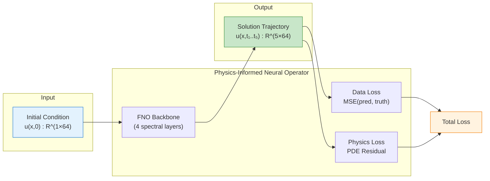

# PINO on Burgers Equation

| Metadata          | Value                           |
|-------------------|---------------------------------|
| **Level**         | Advanced                        |
| **Runtime**       | ~5 min (CPU) / ~1 min (GPU)     |
| **Prerequisites** | JAX, Flax NNX, FNO, PDEs basics |
| **Format**        | Python + Jupyter                |
| **Memory**        | ~2 GB RAM                       |

## Overview

This tutorial demonstrates training a Physics-Informed Neural Operator (PINO) on the
1D Burgers equation. PINO combines the FNO architecture with physics-informed loss,
enabling training with reduced data requirements by enforcing PDE constraints.

The Burgers equation:

$$\frac{\partial u}{\partial t} + u \frac{\partial u}{\partial x} = \nu \frac{\partial^2 u}{\partial x^2}$$

where $u$ is velocity, $\nu$ is viscosity, and subscripts denote partial derivatives.

## What You'll Learn

1. **Understand** PINO architecture: FNO backbone + physics loss
2. **Implement** PDE residual computation using finite differences
3. **Configure** multi-objective loss weighting
4. **Analyze** physics loss contribution to training dynamics
5. **Compare** data-only FNO vs physics-informed PINO

## Coming from NeuralOperator (PyTorch)?

If you are familiar with the neuraloperator library's PINO examples:

| NeuralOperator (PyTorch)              | Opifex (JAX)                                  |
|---------------------------------------|-----------------------------------------------|
| `FNO(..., physics_loss=True)`         | `FourierNeuralOperator` + custom physics loss |
| Manual PDE residual computation       | `compute_burgers_residual()` helper           |
| `trainer.train(..., physics_weight)`  | Custom training loop with weighted losses     |
| `torch.autograd.grad` for derivatives | `jax.grad` or finite differences              |

**Key differences:**

1. **Modular physics loss**: Opifex separates FNO backbone from physics constraints
2. **Finite difference residual**: Uses explicit finite differences for PDE residual
3. **Custom training loop**: Full control over loss weighting and optimization
4. **JAX transforms**: Use `jax.vmap` for batched residual computation

## Files

- **Python Script**: [`examples/neural-operators/pino_burgers.py`](https://github.com/Opifex/Opifex/blob/main/examples/neural-operators/pino_burgers.py)
- **Jupyter Notebook**: [`examples/neural-operators/pino_burgers.ipynb`](https://github.com/Opifex/Opifex/blob/main/examples/neural-operators/pino_burgers.ipynb)

## Quick Start

### Run the Python Script

```bash
source activate.sh && python examples/neural-operators/pino_burgers.py
```

### Run the Jupyter Notebook

```bash
jupyter lab examples/neural-operators/pino_burgers.ipynb
```

## Core Concepts

### Physics-Informed Loss

PINO combines two loss components:

1. **Data loss**: MSE between predictions and ground truth
2. **Physics loss**: Mean squared PDE residual

$$\mathcal{L}_{\text{total}} = w_d \mathcal{L}_{\text{data}} + w_p \mathcal{L}_{\text{physics}}$$

The physics loss ensures predictions satisfy the Burgers equation:

$$\mathcal{L}_{\text{physics}} = \mathbb{E}\left[\left(u_t + u \cdot u_x - \nu u_{xx}\right)^2\right]$$

### PINO Architecture



### Loss Weighting

The `physics_weight` parameter controls the balance:

| physics_weight | Effect                                |
|----------------|---------------------------------------|
| 0.0            | Data-only FNO (no physics constraint) |
| 0.01 - 0.1     | Mild physics regularization           |
| 0.1 - 1.0      | Strong physics constraint             |
| > 1.0          | Physics-dominated training            |

## Implementation

### Step 1: Imports and Setup

```python
import jax
import jax.numpy as jnp
from flax import nnx

from opifex.data.loaders import create_burgers_loader
from opifex.neural.operators.fno.base import FourierNeuralOperator
```

**Terminal Output:**

```text
======================================================================
Opifex Example: PINO on 1D Burgers Equation
======================================================================
JAX backend: gpu
JAX devices: [CudaDevice(id=0)]
Resolution: 64
Time steps: 5
Viscosity: 0.05
Training samples: 200, Test samples: 50
Batch size: 16, Epochs: 20
FNO config: modes=16, width=32, layers=4
Loss weights: data=1.0, physics=0.1
```

### Step 2: Data Loading

```python
train_loader = create_burgers_loader(
    n_samples=200,
    batch_size=16,
    resolution=64,
    time_steps=5,
    viscosity_range=(0.01, 0.1),
    dimension="1d",
    seed=42,
)
```

**Terminal Output:**

```text
Generating 1D Burgers equation data...
Training data: X=(192, 1, 64), Y=(192, 5, 64)
Test data:     X=(48, 1, 64), Y=(48, 5, 64)
```

### Step 3: Physics Loss Definition

The PDE residual is computed using finite differences:

```python
def compute_burgers_residual(u, dx, dt, nu):
    # Time derivative: (u(t+1) - u(t)) / dt
    u_t = (u[:, 1:, :] - u[:, :-1, :]) / dt

    # Spatial derivatives using central differences
    u_x = (u[:, :, 2:] - u[:, :, :-2]) / (2 * dx)
    u_xx = (u[:, :, 2:] - 2 * u[:, :, 1:-1] + u[:, :, :-2]) / (dx**2)

    # Burgers residual
    residual = u_t + u * u_x - nu * u_xx
    return residual
```

**Terminal Output:**

```text
Defining physics loss functions...
Grid: dx=0.0312, dt=0.2000
Burgers PDE: u_t + u*u_x = 0.05*u_xx
```

### Step 4: Model Creation

```python
model = FourierNeuralOperator(
    in_channels=1,
    out_channels=5,  # Predict 5 time steps
    hidden_channels=32,
    modes=16,
    num_layers=4,
    rngs=nnx.Rngs(42),
)
```

**Terminal Output:**

```text
Creating PINO model (FNO backbone)...
Model parameters: 69,989
```

### Step 5: Custom Training Loop

```python
def pino_loss(model, x, y, physics_weight=0.1):
    pred = model(x)
    data_loss = jnp.mean((pred - y) ** 2)
    physics_loss = jnp.mean(compute_burgers_residual(pred, dx, dt, nu) ** 2)
    return data_loss + physics_weight * physics_loss, (data_loss, physics_loss)
```

**Terminal Output:**

```text
Setting up PINO training...
Starting PINO training...
Optimizer: Adam (lr=0.001)

Epoch   1/20: Total=0.373948, Data=0.113593, Physics=2.603551
Epoch   5/20: Total=0.096795, Data=0.061356, Physics=0.354391
Epoch  10/20: Total=0.065367, Data=0.035909, Physics=0.294572
Epoch  15/20: Total=0.049430, Data=0.024689, Physics=0.247415
Epoch  20/20: Total=0.040649, Data=0.020030, Physics=0.206196

Training completed in 2.2s
```

### Step 6: Evaluation

**Terminal Output:**

```text
Running evaluation...
Test MSE:          0.022945
Test Relative L2:  0.625167
Test Physics Loss: 0.296343

Per-time-step MSE:
  t_1: 0.056789
  t_2: 0.024147
  t_3: 0.012882
  t_4: 0.010615
  t_5: 0.010288
```

### Visualization

#### Sample Predictions


#### Training Analysis


## Results Summary

| Metric            | Value      |
|-------------------|------------|
| Test MSE          | 0.023      |
| Relative L2 Error | 0.625      |
| Physics Residual  | 0.296      |
| Training Time     | 2.2s (GPU) |
| Parameters        | 69,989     |

## Next Steps

### Experiments to Try

1. **Vary physics_weight**: Try values 0.01, 0.1, 1.0 and compare convergence
2. **Compare with FNO**: Run data-only FNO (physics_weight=0) for baseline
3. **Adaptive weighting**: Implement SoftAdapt or ReLoBRaLo for automatic balancing
4. **2D Burgers**: Extend to 2D advection-diffusion
5. **Spectral derivatives**: Replace finite differences with FFT-based differentiation

### Related Examples

| Example                                         | Level        | What You'll Learn             |
|-------------------------------------------------|--------------|-------------------------------|
| [FNO on Burgers Equation](fno-burgers.md)       | Intermediate | Data-only FNO baseline        |
| [FNO on Darcy Flow](fno-darcy.md)               | Intermediate | 2D elliptic PDE               |
| [Heat Equation PINN](../pinns/heat-equation.md) | Beginner     | Physics-only neural network   |
| [TFNO on Darcy Flow](tfno-darcy.md)             | Intermediate | Tensorized FNO with compress. |

### API Reference

- [`FourierNeuralOperator`](../../api/neural.md) - FNO model class
- [`create_burgers_loader`](../../api/data.md) - Burgers equation data loader

### Troubleshooting

#### Physics loss dominates training

**Symptom**: Data loss not decreasing while physics loss drops quickly.

**Cause**: `physics_weight` too high relative to data loss scale.

**Solution**: Reduce `physics_weight` or normalize both losses:

```python
physics_weight = 0.01  # Start small
# Or normalize: physics_loss / physics_loss.detach() * target_scale
```

#### NaN in physics loss

**Symptom**: Physics loss becomes `nan` during training.

**Cause**: Numerical instability in finite difference computation with large gradients.

**Solution**: Use gradient clipping or reduce learning rate:

```python
optimizer = optax.chain(
    optax.clip_by_global_norm(1.0),
    optax.adam(1e-4),  # Lower learning rate
)
```

#### High relative L2 error

**Symptom**: Relative L2 > 1.0 even after convergence.

**Cause**: Burgers shocks are inherently difficult; physics loss may conflict with data fitting.

**Solution**: Increase training data or use curriculum learning:

```python
# Start with high viscosity (smooth solutions), decrease over epochs
for epoch in range(epochs):
    nu = max(0.01, 0.1 - epoch * 0.005)  # Curriculum
```
