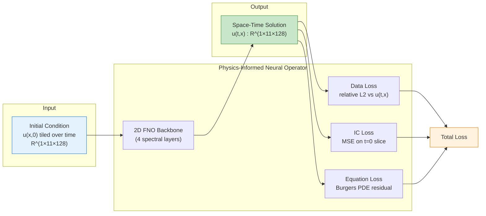

# PINO on Burgers Equation

| Metadata          | Value                           |
|-------------------|---------------------------------|
| **Level**         | Advanced                        |
| **Runtime**       | ~3 min (CPU) / ~1-2 min (GPU)   |
| **Prerequisites** | JAX, Flax NNX, FNO, PDEs basics |
| **Format**        | Python + Jupyter                |
| **Memory**        | ~2 GB RAM                       |

## Overview

This tutorial trains a Physics-Informed Neural Operator (PINO) on the 1D viscous
Burgers equation. PINO pairs the FNO architecture with a physics-informed loss so
the learned operator both fits the data *and* satisfies the governing PDE.

The Burgers equation:

$$\frac{\partial u}{\partial t} + u \frac{\partial u}{\partial x} = \nu \frac{\partial^2 u}{\partial x^2}$$

where $u$ is velocity, $\nu$ is viscosity, and subscripts denote partial
derivatives. The spatial domain is the periodic interval $[0, 1)$.

### The genuine PINO setup

Following Li et al. (2021), *Physics-Informed Neural Operator for Learning
Partial Differential Equations*, and the reference implementation in
`neuraloperator` (`scripts/train_burgers_pino.py`), the operator maps the initial
condition $u(x, 0)$ — broadcast/repeated across the time axis — to the **full
space-time solution** $u(t, x)$, a 2D field over $(\text{time}, \text{space})$.

A 2D FNO is the backbone: the input is the tiled initial condition of shape
`(batch, 1, nt, nx)` and the output is the predicted field `(batch, 1, nt, nx)`.

Training minimises three terms (cf. `neuralop.losses.equation_losses`
`BurgersEqnLoss` + `ICLoss`):

- **data loss**: mean relative L2 between the predicted and the ground-truth
  space-time trajectory,
- **IC loss**: MSE between the predicted $t = 0$ slice and the true initial
  condition,
- **equation loss**: the mean-squared Burgers PDE residual
  $u_t + u\,u_x - \nu\,u_{xx}$ evaluated by finite differences over the whole
  predicted field.

The viscosity $\nu = 0.01$ is shared between the data-generating spectral solver
and the equation loss, so the supervised physics is self-consistent.

## What You'll Learn

1. **Understand** the PINO operator: IC tiled over time $\to$ full $u(t, x)$ field
2. **Implement** the Burgers PDE residual with finite differences
3. **Combine** data + IC + equation losses with fixed weights
4. **Generate** self-consistent Burgers trajectories with the spectral solver

## Coming from NeuralOperator (PyTorch)?

If you are familiar with the `neuraloperator` library's PINO example:

| NeuralOperator (PyTorch)                  | Opifex (JAX)                                   |
|-------------------------------------------|------------------------------------------------|
| `FNO(n_modes=(16,16), ...)` (2D)          | `FourierNeuralOperator(spatial_dims=2, ...)`   |
| `BurgersEqnLoss(visc=0.01, method="fdm")` | `equation_loss()` finite-difference residual   |
| `ICLoss()`                                | MSE on the predicted `pred[:, 0, :]` slice     |
| `LpLoss(d=2, p=2)`                         | `relative_l2()` over the full trajectory       |
| `Relobralo` adaptive aggregator           | Fixed weights (data / IC / equation)           |
| `Burgers1dTimeDataProcessor` (repeat `x`) | `tile_ic()` repeats the IC over the time axis  |

**Key differences:**

1. **On-device data generation**: trajectories are built with the pseudo-spectral
   ETDRK4 Burgers solver, vmapped over the batch — no external data files
2. **Fixed loss weights**: a clean, reproducible alternative to the reference's
   Relobralo aggregator; the weights follow the same (data, IC, equation) ordering
3. **JAX transforms**: a single `jit(vmap(...))` call generates the whole dataset

## Files

- **Python Script**: [`examples/neural-operators/pino_burgers.py`](https://github.com/avitai/opifex/blob/main/examples/neural-operators/pino_burgers.py)
- **Jupyter Notebook**: [`examples/neural-operators/pino_burgers.ipynb`](https://github.com/avitai/opifex/blob/main/examples/neural-operators/pino_burgers.ipynb)

## Quick Start

### Run the Python Script

```bash
source activate.sh && python examples/neural-operators/pino_burgers.py
```

### Run the Jupyter Notebook

```bash
jupyter lab examples/neural-operators/pino_burgers.ipynb
```

## Core Concepts

### Physics-Informed Loss

The total loss combines three components:

$$\mathcal{L}_{\text{total}} = w_d\,\mathcal{L}_{\text{data}} + w_{ic}\,\mathcal{L}_{\text{IC}} + w_{eq}\,\mathcal{L}_{\text{eqn}}$$

with fixed weights $w_d = 1.0$, $w_{ic} = 5.0$, $w_{eq} = 0.5$, where

$$\mathcal{L}_{\text{data}} = \mathbb{E}\left[\frac{\lVert \hat u - u \rVert_2}{\lVert u \rVert_2}\right], \qquad
\mathcal{L}_{\text{IC}} = \mathbb{E}\left[\big(\hat u(0, \cdot) - u(0, \cdot)\big)^2\right]$$

and the equation loss is the mean-squared Burgers PDE residual over the full
predicted field:

$$\mathcal{L}_{\text{eqn}} = \mathbb{E}\left[\left(u_t + u\,u_x - \nu\,u_{xx}\right)^2\right]$$

### PINO Architecture


```mermaid
graph LR
    subgraph Input
        A["Initial Condition<br/>u(x,0) tiled over time<br/>R^(1×11×128)"]
    end

    subgraph PINO["Physics-Informed Neural Operator"]
        B["2D FNO Backbone<br/>(4 spectral layers)"]
        C["Data Loss<br/>relative L2 vs u(t,x)"]
        D["IC Loss<br/>MSE on t=0 slice"]
        E["Equation Loss<br/>Burgers PDE residual"]
    end

    subgraph Output
        F["Space-Time Solution<br/>u(t,x) : R^(1×11×128)"]
    end

    A --> B --> F
    F --> C
    F --> D
    F --> E
    C --> G["Total Loss"]
    D --> G
    E --> G

    style A fill:#e3f2fd,stroke:#1976d2
    style F fill:#c8e6c9,stroke:#388e3c
    style G fill:#fff3e0,stroke:#f57c00
```

## Implementation

### Step 1: Imports and Setup

```python
import jax
import jax.numpy as jnp
from flax import nnx

from opifex.neural.operators.fno.base import FourierNeuralOperator
from opifex.physics.spectral.steppers import solve_burgers_spectral
```

**Terminal Output:**

```text
======================================================================
Opifex Example: PINO on 1D Burgers Equation
======================================================================
JAX backend: gpu
JAX devices: [CudaDevice(id=0)]
Grid: nx=128, nt=11, viscosity=0.01
Trajectories: train=1000, test=200
FNO config: modes=16, width=32, layers=4
Loss weights: data=1.0, ic=5.0, equation=0.5
Spacings: dx=0.00781, dt=0.10000
```

### Step 2: Data Generation

Initial conditions are periodic spectral Gaussian random fields (the canonical
FNO/PINO benchmark IC, covariance $\sigma^2(-\Delta + \tau^2 I)^{-\gamma}$). Each
IC is evolved to the full trajectory $u(t, x)$ with the pseudo-spectral ETDRK4
Burgers solver, vmapped over the batch on device. `solve_burgers_spectral`
returns `(num_snapshots + 1, nx)` real snapshots **including** the initial
condition, i.e. exactly the `nt = NUM_TIME` time frames the model trains on.

```python
def per_sample(key):
    ic = _burgers_ic(key, NUM_SPACE)
    return solve_burgers_spectral(
        ic, VISCOSITY, domain_extent=1.0, time_final=1.0,
        num_steps=250, num_snapshots=NUM_TIME - 1,
    )

keys = jax.vmap(jax.random.PRNGKey)(seed + jnp.arange(n_samples))
trajectories = jax.jit(jax.vmap(per_sample))(keys)  # (n, nt, nx)
```

**Terminal Output:**

```text
Generating Burgers space-time trajectories (jit+vmap spectral solver)...
Train trajectories: (1000, 11, 128)
Test trajectories:  (200, 11, 128)
```

### Step 3: PDE Residual

The residual is computed by finite differences over the predicted field
`(batch, nt, nx)`: a forward difference in time, periodic central differences in
space. This mirrors `neuralop.losses.equation_losses.BurgersEqnLoss`
(`method="fdm"`).

```python
def compute_burgers_residual(u, dx, dt, nu):
    u_t = (u[:, 1:, :] - u[:, :-1, :]) / dt          # forward diff in time
    u_level = u[:, :-1, :]
    u_right = jnp.roll(u_level, shift=-1, axis=-1)    # periodic wrap
    u_left = jnp.roll(u_level, shift=1, axis=-1)
    u_x = (u_right - u_left) / (2.0 * dx)
    u_xx = (u_right - 2.0 * u_level + u_left) / (dx**2)
    return u_t + u_level * u_x - nu * u_xx
```

### Step 4: Model Creation

The IC is tiled over the time axis to shape `(batch, 1, nt, nx)`; a 2D FNO maps it
to the full space-time field. Space is periodic, so no domain padding is used.

```python
model = FourierNeuralOperator(
    in_channels=1,
    out_channels=1,
    hidden_channels=32,
    modes=16,
    num_layers=4,
    spatial_dims=2,
    positional_embedding=True,
    domain_padding=0.0,
    rngs=nnx.Rngs(SEED),
)
```

**Terminal Output:**

```text
Creating PINO model (2D FNO backbone over (time, space))...
Model parameters: 4,203,009
```

### Step 5: Training

AdamW with a cosine-decayed learning rate (decayed over the total number of
mini-batch updates). Each step adds the data, IC, and equation losses with fixed
weights.

```python
def pino_loss_fn(model, ic_tiled, trajectory, ic):
    pred = model(ic_tiled)[:, 0]                       # (batch, nt, nx)
    data_loss = relative_l2(pred, trajectory)          # data L2
    ic_loss = jnp.mean((pred[:, 0, :] - ic) ** 2)      # IC anchor
    eqn_loss = equation_loss(pred, DX, DT, VISCOSITY)  # PDE residual
    total = data_loss + 5.0 * ic_loss + 0.5 * eqn_loss
    return total, {"data": data_loss, "ic": ic_loss, "equation": eqn_loss}
```

**Terminal Output:**

```text
Starting PINO training...
Optimizer: AdamW (cosine-decayed lr from 0.001)
Epoch    1/800: Total=1.388993, Data=0.633944, IC=8.641672e-02, Equation=6.459318e-01
Epoch  100/800: Total=0.089785, Data=0.039767, IC=2.801668e-03, Equation=7.201982e-02
Epoch  200/800: Total=0.086708, Data=0.037631, IC=2.748990e-03, Equation=7.066499e-02
Epoch  300/800: Total=0.085388, Data=0.036472, IC=2.710348e-03, Equation=7.072789e-02
Epoch  400/800: Total=0.084342, Data=0.035752, IC=2.695936e-03, Equation=7.022096e-02
Epoch  500/800: Total=0.084057, Data=0.035349, IC=2.689569e-03, Equation=7.052071e-02
Epoch  600/800: Total=0.083881, Data=0.035248, IC=2.685199e-03, Equation=7.041378e-02
Epoch  700/800: Total=0.083803, Data=0.035190, IC=2.684461e-03, Equation=7.038072e-02
Epoch  800/800: Total=0.083786, Data=0.035148, IC=2.684370e-03, Equation=7.043306e-02

Training completed in 61.0s
```

### Step 6: Evaluation

Accuracy is the relative L2 over the **full** held-out trajectory. The IC RMS
error and the mean PDE residual (physics consistency) are reported on the test
set.

```python
predictions = model(test_input)[:, 0]                       # (N, nt, nx)
test_rel_l2 = float(relative_l2(predictions, test_traj))
test_ic_error = float(jnp.sqrt(jnp.mean((predictions[:, 0] - test_ic) ** 2)))
test_residual = float(equation_loss(predictions, DX, DT, VISCOSITY))
```

**Terminal Output:**

```text
Running evaluation...
Test relative L2 (full trajectory): 0.033574
Test IC RMS error (t=0 slice):      5.167113e-02
Test mean PDE residual (MSE):        2.177162e-01
```

### Visualization

#### Sample Space-Time Solutions

Ground truth, prediction, and absolute error for three test trajectories. The
error concentrates near $t = 0$ — where the initial condition has the sharpest
features — and along the convective shock fronts, exactly where Burgers dynamics
are hardest.


#### Training Analysis


## Results Summary

| Metric                          | Value        |
|---------------------------------|--------------|
| Test relative L2 (full traj.)   | 0.0336       |
| Test IC RMS error (t=0 slice)   | 0.052        |
| Test mean PDE residual (MSE)    | 0.218        |
| Final total training loss       | 0.084        |
| Training Time                   | 61s (GPU)    |
| Parameters                      | 4,203,009    |

The PINO recovers the full space-time Burgers solution operator to about **3.4%
relative L2** on held-out trajectories, with the predicted $t = 0$ slice closely
matching the true initial condition.

## Next Steps

### Experiments to Try

1. **Vary the loss weights** (data / IC / equation) and study the trade-off
2. **Adaptive weighting**: swap fixed weights for SoftAdapt or ReLoBRaLo
3. **Denser time grid**: increase `NUM_TIME` for finer temporal resolution
4. **Spectral derivatives**: replace finite differences with FFT-based residuals
5. **Varying viscosity**: add $\nu$ as an extra input channel to the operator

### Related Examples

| Example                                         | Level        | What You'll Learn             |
|-------------------------------------------------|--------------|-------------------------------|
| [FNO on Burgers Equation](fno-burgers.md)       | Intermediate | Data-only FNO baseline        |
| [FNO on Darcy Flow](fno-darcy.md)               | Intermediate | 2D elliptic PDE               |
| [Burgers PINN](../pinns/burgers.md)             | Beginner     | Physics-only neural network   |
| [TFNO on Darcy Flow](tfno-darcy.md)             | Intermediate | Tensorized FNO with compress. |

### API Reference

- [`FourierNeuralOperator`](../../api/neural.md) — FNO model class
- [`solve_burgers_spectral`](../../api/physics.md) — pseudo-spectral Burgers solver

### Troubleshooting

#### Training loss freezes early

**Symptom**: the loss stops changing after a few dozen epochs.

**Cause**: the cosine learning-rate schedule decays over too few steps. It is
stepped once per **mini-batch update**, not per epoch.

**Solution**: set the decay length to `NUM_EPOCHS * n_batches`:

```python
schedule = optax.cosine_decay_schedule(LEARNING_RATE, NUM_EPOCHS * n_batches)
```

#### High PDE residual relative to the data error

**Symptom**: the test PDE residual is larger than the data relative L2.

**Cause**: the finite-difference residual amplifies errors near the steep IC and
the convective shocks, where the field has large spatial gradients.

**Solution**: raise `EQUATION_WEIGHT`, refine the grid (`NUM_SPACE`, `NUM_TIME`),
or use spectral derivatives for a more accurate residual.
