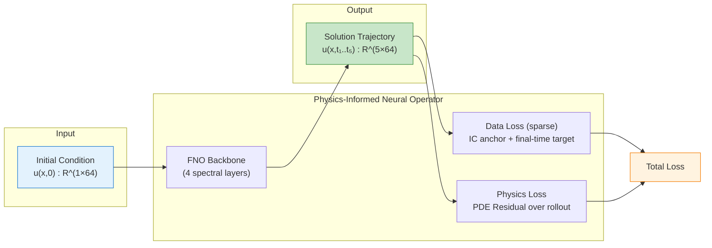
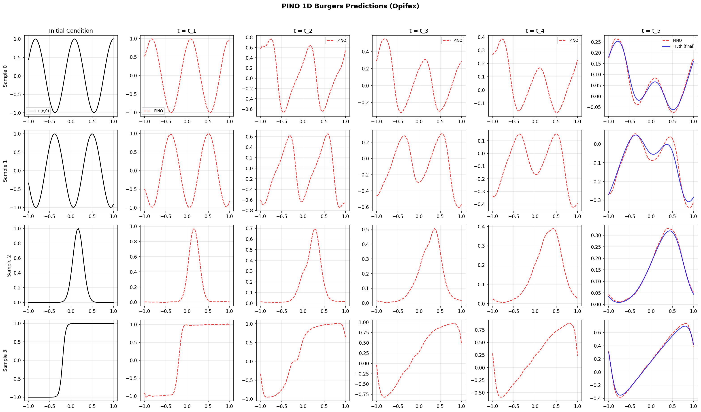
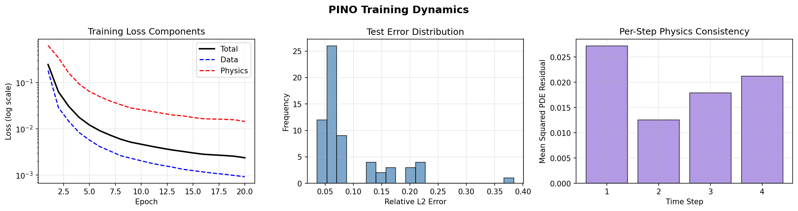

# PINO on Burgers Equation

| Metadata          | Value                           |
|-------------------|---------------------------------|
| **Level**         | Advanced                        |
| **Runtime**       | ~5 min (CPU) / ~1 min (GPU)     |
| **Prerequisites** | JAX, Flax NNX, FNO, PDEs basics |
| **Format**        | Python + Jupyter                |
| **Memory**        | ~2 GB RAM                       |

## Overview

This tutorial demonstrates training a Physics-Informed Neural Operator (PINO) on the
1D Burgers equation. PINO combines the FNO architecture with physics-informed loss,
enabling training with reduced data requirements by enforcing PDE constraints.

The Burgers equation:

$$\frac{\partial u}{\partial t} + u \frac{\partial u}{\partial x} = \nu \frac{\partial^2 u}{\partial x^2}$$

where $u$ is velocity, $\nu$ is viscosity, and subscripts denote partial derivatives.

### A genuinely semi-supervised scheme

The PDE data layer is served through **datarax** under a uniform operator
contract: each sample's input is the initial condition $u(x,0)$ and its target is
the **final-time** solution $u(x,T)$ only — both channels-first `(N, 1, 64)`. There
is no dense ground-truth trajectory.

The PINO is trained against this *sparse* supervision. The FNO still predicts the
full space-time rollout (`out_channels = TIME_STEPS`), but the data loss only
anchors two frames:

- the predicted **initial** frame to the input IC $u(x,0)$, and
- the predicted **final** frame to the final-time target $u(x,T)$.

The **physics** loss (Burgers PDE residual) constrains every predicted time step in
between, filling the unsupervised interior of the trajectory. This is what makes the
scheme genuinely semi-supervised: the physics term — not labelled data — drives the
intermediate dynamics. Evaluation accuracy is measured at the supervised final time,
and the per-time-step output reports the **PDE residual** (physics consistency of the
rollout), not an error against a ground-truth trajectory.

## What You'll Learn

1. **Understand** PINO architecture: FNO backbone + physics loss
2. **Implement** PDE residual computation using finite differences
3. **Configure** multi-objective loss weighting
4. **Analyze** physics loss contribution to training dynamics
5. **Compare** data-only FNO vs physics-informed PINO

## Coming from NeuralOperator (PyTorch)?

If you are familiar with the neuraloperator library's PINO examples:

| NeuralOperator (PyTorch)              | Opifex (JAX)                                  |
|---------------------------------------|-----------------------------------------------|
| `FNO(..., physics_loss=True)`         | `FourierNeuralOperator` + custom physics loss |
| Manual PDE residual computation       | `compute_burgers_residual()` helper           |
| `trainer.train(..., physics_weight)`  | Custom training loop with weighted losses     |
| `torch.autograd.grad` for derivatives | `jax.grad` or finite differences              |

**Key differences:**

1. **Modular physics loss**: Opifex separates FNO backbone from physics constraints
2. **Finite difference residual**: Uses explicit finite differences for PDE residual
3. **Custom training loop**: Full control over loss weighting and optimization
4. **JAX transforms**: Use `jax.vmap` for batched residual computation

## Files

- **Python Script**: [`examples/neural-operators/pino_burgers.py`](https://github.com/avitai/opifex/blob/main/examples/neural-operators/pino_burgers.py)
- **Jupyter Notebook**: [`examples/neural-operators/pino_burgers.ipynb`](https://github.com/avitai/opifex/blob/main/examples/neural-operators/pino_burgers.ipynb)

## Quick Start

### Run the Python Script

```bash
source activate.sh && python examples/neural-operators/pino_burgers.py
```

### Run the Jupyter Notebook

```bash
jupyter lab examples/neural-operators/pino_burgers.ipynb
```

## Core Concepts

### Physics-Informed Loss

PINO combines two loss components:

1. **Data loss (sparse)**: MSE anchoring the predicted IC frame to the input
   $u(x,0)$ plus the predicted final frame to the final-time target $u(x,T)$ —
   no dense trajectory supervision
2. **Physics loss**: Mean squared Burgers PDE residual over the *full* predicted
   space-time rollout

$$\mathcal{L}_{\text{total}} = w_d \mathcal{L}_{\text{data}} + w_p \mathcal{L}_{\text{physics}}$$

$$\mathcal{L}_{\text{data}} = \underbrace{\big\| \hat u(\cdot, t_1) - u(\cdot, 0) \big\|^2}_{\text{IC anchor}} + \underbrace{\big\| \hat u(\cdot, t_T) - u(\cdot, T) \big\|^2}_{\text{final-time target}}$$

The physics loss ensures predictions satisfy the Burgers equation:

$$\mathcal{L}_{\text{physics}} = \mathbb{E}\left[\left(u_t + u \cdot u_x - \nu u_{xx}\right)^2\right]$$

### PINO Architecture


```mermaid
graph LR
    subgraph Input
        A["Initial Condition<br/>u(x,0) : R^(1×64)"]
    end

    subgraph PINO["Physics-Informed Neural Operator"]
        B["FNO Backbone<br/>(4 spectral layers)"]
        C["Data Loss (sparse)<br/>IC anchor + final-time target"]
        D["Physics Loss<br/>PDE Residual over rollout"]
    end

    subgraph Output
        E["Solution Trajectory<br/>u(x,t₁..t₅) : R^(5×64)"]
    end

    A --> B --> E
    E --> C
    E --> D
    C --> F["Total Loss"]
    D --> F

    style A fill:#e3f2fd,stroke:#1976d2
    style E fill:#c8e6c9,stroke:#388e3c
    style F fill:#fff3e0,stroke:#f57c00
```

### Loss Weighting

The `physics_weight` parameter controls the balance:

| physics_weight | Effect                                |
|----------------|---------------------------------------|
| 0.0            | Data-only FNO (no physics constraint) |
| 0.01 - 0.1     | Mild physics regularization           |
| 0.1 - 1.0      | Strong physics constraint             |
| > 1.0          | Physics-dominated training            |

## Implementation

### Step 1: Imports and Setup

```python
import jax
import jax.numpy as jnp
from flax import nnx

from opifex.data.loaders import create_burgers_loader
from opifex.neural.operators.fno.base import FourierNeuralOperator
```

**Terminal Output:**

```text
======================================================================
Opifex Example: PINO on 1D Burgers Equation
======================================================================
JAX backend: gpu
JAX devices: [CudaDevice(id=0)]
Resolution: 64, Time steps: 5, Viscosity: 0.05
Training samples: 200, Test samples: 50
FNO config: modes=16, width=32, layers=4
Loss weights: data=1.0, physics=0.1
Grid: dx=0.0312, dt=0.2000
```

### Step 2: Data Loading

`create_burgers_loader` returns a frozen `PDELoaders` (`.train` / `.val`)
served via datarax. Following the uniform operator contract, each batch's
`"input"` is the initial condition $u(x,0)$ and `"output"` is the **final-time**
solution $u(x,T)$ only — both channels-first `(N, 1, resolution)`. The example
collects the batched pipelines into in-memory arrays for the training loop:

```python
n_samples = N_TRAIN + N_TEST
loaders = create_burgers_loader(
    n_samples=n_samples,
    batch_size=BATCH_SIZE,
    resolution=RESOLUTION,
    viscosity_range=VISCOSITY_RANGE,  # (0.05, 0.05) — fixed for physics loss
    val_fraction=N_TEST / n_samples,
    seed=SEED,
)

def _collect(pipeline) -> tuple[np.ndarray, np.ndarray]:
    inputs, outputs = [], []
    for batch in pipeline:
        inputs.append(np.asarray(batch["input"]))
        outputs.append(np.asarray(batch["output"]))
    return np.concatenate(inputs, axis=0), np.concatenate(outputs, axis=0)

X_train, Y_train = _collect(loaders.train)  # X, Y(final-time): (N, 1, 64)
X_test, Y_test = _collect(loaders.val)
```

**Terminal Output:**

```text
Generating 1D Burgers data (jit+vmap) and serving via datarax...
Training data: X=(208, 1, 64), Y(final-time)=(208, 1, 64)
Test data:     X=(64, 1, 64), Y(final-time)=(64, 1, 64)
```

### Step 3: Physics Loss Definition

The PDE residual is computed over the full predicted rollout `u` of shape
`(batch, time_steps, resolution)` using finite differences. Spatial derivatives
are taken at the time midpoint so the time and space stencils align:

```python
def compute_burgers_residual(u, dx, dt, nu):
    # Time derivative: (u(t+1) - u(t)) / dt
    u_t = (u[:, 1:, :] - u[:, :-1, :]) / dt

    # Use u at the midpoint in time for the spatial derivatives
    u_mid = 0.5 * (u[:, 1:, :] + u[:, :-1, :])
    u_x = (u_mid[:, :, 2:] - u_mid[:, :, :-2]) / (2 * dx)
    u_xx = (u_mid[:, :, 2:] - 2 * u_mid[:, :, 1:-1] + u_mid[:, :, :-2]) / (dx**2)

    u_interior = u_mid[:, :, 1:-1]
    u_t_interior = u_t[:, :, 1:-1]

    # Burgers residual: u_t + u * u_x - nu * u_xx = 0
    return u_t_interior + u_interior * u_x - nu * u_xx
```

### Step 4: Model Creation

```python
model = FourierNeuralOperator(
    in_channels=1,
    out_channels=TIME_STEPS,  # predict the full 5-step rollout
    hidden_channels=HIDDEN_WIDTH,
    modes=MODES,
    num_layers=NUM_LAYERS,
    spatial_dims=1,
    rngs=nnx.Rngs(SEED),
)
```

**Terminal Output:**

```text
Creating PINO model (FNO backbone)...
Model parameters: 140,229
```

### Step 5: Custom Training Loop

The data term is sparse: it anchors the predicted IC frame `y_pred[:, :1]` to the
input `x` and the predicted final frame `y_pred[:, -1:]` to the final-time target
`y_true` `(batch, 1, resolution)`. The physics term constrains the whole rollout.

```python
def pino_loss_fn(model, x, y_true, dx, dt, nu, data_weight, physics_weight):
    y_pred = model(x)  # (batch, time_steps, resolution)
    ic_loss = jnp.mean((y_pred[:, :1, :] - x) ** 2)        # IC anchor
    final_loss = jnp.mean((y_pred[:, -1:, :] - y_true) ** 2)  # final-time target
    data_loss = ic_loss + final_loss
    pde_loss = physics_loss(y_pred, dx, dt, nu)            # residual over rollout
    total_loss = data_weight * data_loss + physics_weight * pde_loss
    return total_loss, {"data_loss": data_loss, "physics_loss": pde_loss}
```

**Terminal Output:**

```text
Starting PINO training...
Optimizer: Adam (lr=0.001)
Epoch   1/20: Total=0.247254, Data=0.183517, Physics=0.637368
Epoch   5/20: Total=0.012081, Data=0.005691, Physics=0.063905
Epoch  10/20: Total=0.004628, Data=0.002027, Physics=0.026006
Epoch  15/20: Total=0.003003, Data=0.001242, Physics=0.017616
Epoch  20/20: Total=0.002359, Data=0.000916, Physics=0.014432

Training completed in 1.6s
```

### Step 6: Evaluation

Accuracy is measured at the supervised final time using the predicted final frame
`predictions[:, -1:]` against the final-time target. The per-time-step output is the
mean-squared **PDE residual** along the rollout (physics consistency), not an error
against a ground-truth trajectory — none exists in the sparse-supervision scheme.

```python
predictions = model(X_test_jnp)          # (N, TIME_STEPS, resolution)
final_pred = predictions[:, -1:, :]      # predicted u(x, T)

test_mse = float(jnp.mean((final_pred - Y_test_jnp) ** 2))
test_physics_loss = float(physics_loss(predictions, DX, DT, VISCOSITY))

step_residual = jnp.mean(
    compute_burgers_residual(predictions, DX, DT, VISCOSITY) ** 2, axis=(0, 2)
)
```

**Terminal Output:**

```text
Running evaluation...
Test MSE (final time):  0.000460
Test Relative L2:       0.093838
Test Physics Loss:      0.019707

Per-time-step PDE residual (physics consistency of the rollout):
  t_1: 2.719606e-02
  t_2: 1.252618e-02
  t_3: 1.791604e-02
  t_4: 2.118988e-02
```

### Visualization

#### Sample Predictions



#### Training Analysis



## Results Summary

| Metric                       | Value       |
|------------------------------|-------------|
| Test MSE (final time)        | 0.00046     |
| Relative L2 Error (final t)  | 0.094       |
| Physics Loss (rollout)       | 0.020       |
| Training Time                | 1.6s (GPU)  |
| Parameters                   | 140,229     |

## Next Steps

### Experiments to Try

1. **Vary physics_weight**: Try values 0.01, 0.1, 1.0 and compare convergence
2. **Compare with FNO**: Run data-only FNO (physics_weight=0) for baseline
3. **Adaptive weighting**: Implement SoftAdapt or ReLoBRaLo for automatic balancing
4. **2D Burgers**: Extend to 2D advection-diffusion
5. **Spectral derivatives**: Replace finite differences with FFT-based differentiation

### Related Examples

| Example                                         | Level        | What You'll Learn             |
|-------------------------------------------------|--------------|-------------------------------|
| [FNO on Burgers Equation](fno-burgers.md)       | Intermediate | Data-only FNO baseline        |
| [FNO on Darcy Flow](fno-darcy.md)               | Intermediate | 2D elliptic PDE               |
| [Heat Equation PINN](../pinns/heat-equation.md) | Beginner     | Physics-only neural network   |
| [TFNO on Darcy Flow](tfno-darcy.md)             | Intermediate | Tensorized FNO with compress. |

### API Reference

- [`FourierNeuralOperator`](../../api/neural.md) - FNO model class
- [`create_burgers_loader`](../../api/data.md) - Burgers equation data loader

### Troubleshooting

#### Physics loss dominates training

**Symptom**: Data loss not decreasing while physics loss drops quickly.

**Cause**: `physics_weight` too high relative to data loss scale.

**Solution**: Reduce `physics_weight` or normalize both losses:

```python
physics_weight = 0.01  # Start small
# Or normalize: physics_loss / jax.lax.stop_gradient(physics_loss) * target_scale
```

#### NaN in physics loss

**Symptom**: Physics loss becomes `nan` during training.

**Cause**: Numerical instability in finite difference computation with large gradients.

**Solution**: Use gradient clipping or reduce learning rate:

```python
optimizer = optax.chain(
    optax.clip_by_global_norm(1.0),
    optax.adam(1e-4),  # Lower learning rate
)
```

#### High final-time relative L2 error

**Symptom**: Final-time relative L2 stays high (well above ~0.1) after convergence.

**Cause**: With only the IC and final frames supervised, the physics weight may be
too low to constrain the interior rollout, or Burgers shocks make the physics loss
conflict with the sparse data anchors.

**Solution**: Raise `physics_weight` to lean harder on the PDE residual, add training
samples, or use curriculum learning:

```python
# Start with high viscosity (smooth solutions), decrease over epochs
for epoch in range(epochs):
    nu = max(0.01, 0.1 - epoch * 0.005)  # Curriculum
```
