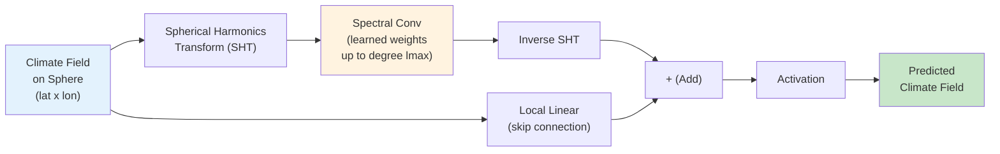
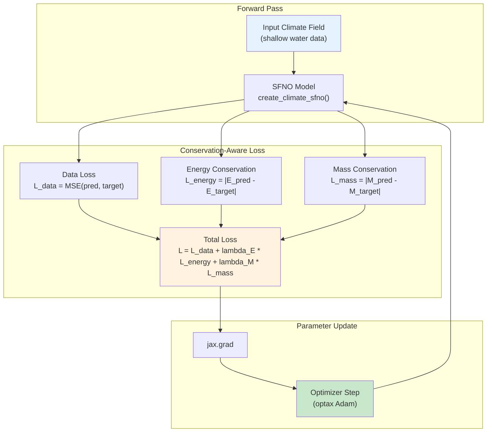
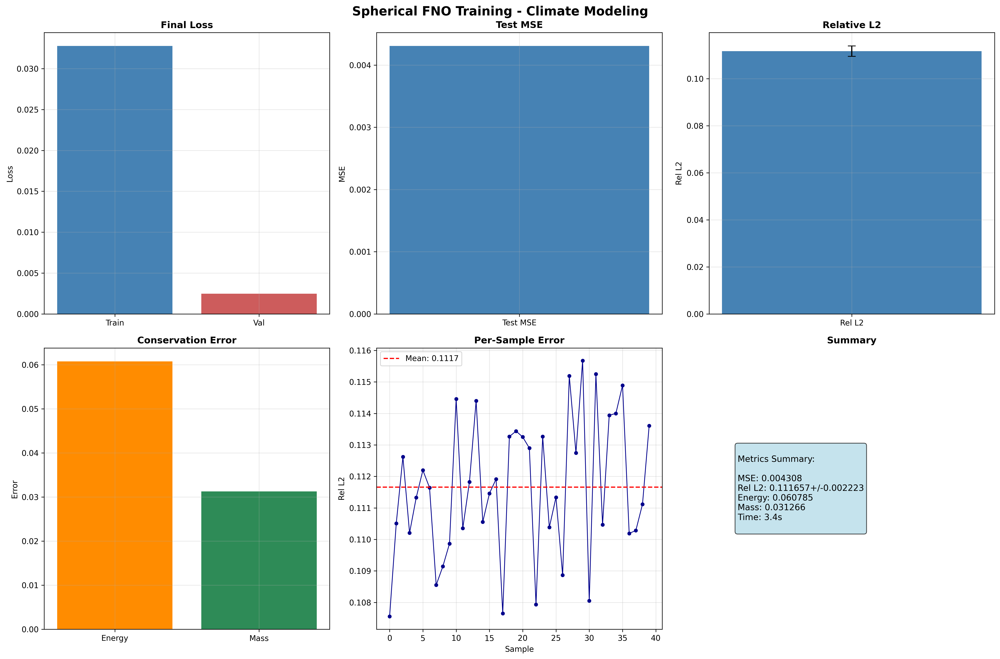
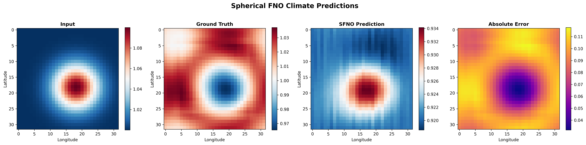

# Comprehensive SFNO for Climate Modeling

| Metadata | Value |
|----------|-------|
| **Level** | Advanced |
| **Runtime** | ~10 min (CPU) / ~4 sec (GPU) |
| **Prerequisites** | JAX, Flax NNX, Spherical Harmonics, Conservation Laws |
| **Format** | Python + Jupyter |
| **Memory** | ~2 GB RAM |
| **Devices** | CPU / GPU (GPU recommended) |

## Overview

This example demonstrates comprehensive Spherical Fourier Neural Operator (SFNO) functionality for climate modeling using the Opifex framework with JAX/Flax NNX. The SFNO extends the standard FNO to spherical geometries by replacing Fourier transforms with spherical harmonic transforms, making it the natural architecture for global climate and weather prediction tasks where data lives on the surface of a sphere.

The example covers the full pipeline: creating an SFNO model with `create_climate_sfno`, loading shallow water equation data via `create_shallow_water_loader` (Google Grain), training with conservation-aware physics loss through `ConservationConfig`, evaluating energy and mass conservation, and performing spherical harmonic spectral analysis of predictions.

Conservation-aware training is a key feature of this example. By configuring `ConservationConfig` with energy and mass conservation laws, the `Trainer` adds physics-informed loss terms that penalize violations of fundamental physical invariants -- ensuring the learned operator respects the underlying physics of climate dynamics.

## What You'll Learn

1. **Build** a comprehensive SFNO model with `create_climate_sfno` for spherical domain climate data
2. **Configure** conservation-aware training with `ConservationConfig` for energy and mass conservation
3. **Analyze** spherical harmonic power spectra to evaluate spectral fidelity of predictions
4. **Evaluate** energy and mass conservation metrics for physics-informed model quality
5. **Visualize** climate fields, error distributions, and spectral analysis on spherical domains

## Coming from NeuralOperator (PyTorch)?

| NeuralOperator (PyTorch) | Opifex (JAX) |
|--------------------------|--------------|
| `SFNO(spectral_transform, ...)` | `create_climate_sfno(in_channels=, out_channels=, lmax=, rngs=)` |
| `SphericalConv(in_ch, out_ch, modes)` | Spherical spectral convolution via `lmax` parameter |
| Manual conservation loss implementation | `ConservationConfig(laws=["energy", "mass"])` built into `Trainer` |
| `trainer.train(epochs=100)` | `Trainer(model, config, rngs).fit(train_data, val_data)` |
| `torch.DataLoader(dataset)` | `create_shallow_water_loader()` (Google Grain) |

**Key differences:**

1. **Built-in conservation**: Opifex integrates energy and mass conservation directly into the training loop via `ConservationConfig`, eliminating manual loss implementation
2. **Factory functions**: `create_climate_sfno` handles architecture configuration for climate applications
3. **Explicit PRNG**: JAX's `rngs=nnx.Rngs(42)` ensures reproducible model initialization
4. **XLA compilation**: Automatic JIT compilation provides training speedups on GPU/TPU

## Coming from PhysicsNeMo (NVIDIA)?

| PhysicsNeMo | Opifex (JAX) |
|-------------|--------------|
| `FourierNeuralOperatorNet(cfg)` | `create_climate_sfno(in_channels=, out_channels=, lmax=, rngs=)` |
| Hydra YAML for conservation config | `ConservationConfig(laws=["energy", "mass"])` (pure Python) |
| `Solver(cfg)` | `Trainer(model, config, rngs)` |
| `DistributedManager()` | `jax.devices()`, automatic device management |

**Key differences:**

1. **No YAML required**: Pure Python configuration vs mandatory Hydra config files
2. **Simpler setup**: No complex config directory structure needed
3. **JAX ecosystem**: Native integration with Flax, Optax, Grain

## Files

- **Python Script**: [`examples/neural-operators/sfno_climate_comprehensive.py`](https://github.com/Opifex/Opifex/blob/main/examples/neural-operators/sfno_climate_comprehensive.py)
- **Jupyter Notebook**: [`examples/neural-operators/sfno_climate_comprehensive.ipynb`](https://github.com/Opifex/Opifex/blob/main/examples/neural-operators/sfno_climate_comprehensive.ipynb)

## Quick Start

### Run the Python Script

```bash
source activate.sh && python examples/neural-operators/sfno_climate_comprehensive.py
```

### Run the Jupyter Notebook

```bash
jupyter lab examples/neural-operators/sfno_climate_comprehensive.ipynb
```

## Core Concepts

### The Spherical Fourier Neural Operator

The SFNO adapts the FNO architecture to spherical geometry. Instead of standard 2D Fourier transforms, it uses spherical harmonic transforms (SHT) to operate in the spectral domain of the sphere. The `lmax` parameter controls the maximum spherical harmonic degree retained, analogous to `modes` in a standard FNO.



Each SFNO spectral layer consists of:

1. **Spherical Harmonic Transform (SHT)**: Project the input field onto spherical harmonic basis functions $Y_l^m(\theta, \phi)$
2. **Spectral convolution**: Apply learned linear transforms to the spherical harmonic coefficients up to degree `lmax`
3. **Inverse SHT**: Transform back to the spatial (lat/lon) domain
4. **Skip connection**: Add a local linear transform of the input

### Conservation-Aware Training

Climate models must respect fundamental physical conservation laws. Opifex's `ConservationConfig` adds physics-informed loss terms that penalize violations of energy and mass conservation during training.



### Shallow Water Equations

The shallow water equations (SWE) model large-scale geophysical fluid dynamics on the sphere. They form a standard benchmark for climate modeling architectures:

| Variable | Meaning | Role |
|----------|---------|------|
| $h$ | Fluid depth | Conserved quantity (mass) |
| $u, v$ | Velocity components | Momentum carriers |
| $E = \frac{1}{2}(u^2 + v^2 + gh^2)$ | Total energy | Conservation target |

The 3-channel input/output (height + 2 velocity components) tests the SFNO's ability to learn coupled multi-field dynamics while preserving conservation properties.

## Implementation

### Step 1: Imports and Setup

```python
import time
import warnings
from pathlib import Path

warnings.filterwarnings("ignore")

import jax
import jax.numpy as jnp
import matplotlib.pyplot as plt
import numpy as np
from flax import nnx

from opifex.core.training import ConservationConfig, Trainer, TrainingConfig
from opifex.data.loaders import create_shallow_water_loader
from opifex.neural.operators.fno.spherical import create_climate_sfno
```

**Terminal Output:**
```
======================================================================
Opifex Example: Comprehensive Spherical FNO for Climate Modeling
======================================================================
JAX backend: gpu
JAX devices: [CudaDevice(id=0)]
```

!!! info "Device Support"
    This example works on both CPU and GPU. GPU is recommended for faster training.
    The JAX backend is detected automatically.

### Step 2: Configuration

Define the key hyperparameters controlling the SFNO architecture and training:

```python
RESOLUTION = 32
N_TRAIN = 200
N_TEST = 40
BATCH_SIZE = 8
NUM_EPOCHS = 5
LEARNING_RATE = 1e-3
LMAX = 8
IN_CHANNELS = 3
OUT_CHANNELS = 3
SEED = 42

OUTPUT_DIR = Path("docs/assets/examples/sfno_climate_comprehensive")
OUTPUT_DIR.mkdir(parents=True, exist_ok=True)
```

**Terminal Output:**
```
Resolution: 32x32, Samples: 200/40
Batch: 8, Epochs: 5, lmax: 8
```

| Parameter | Value | Purpose |
|-----------|-------|---------|
| `RESOLUTION` | 32 | Spatial grid resolution (lat x lon) |
| `LMAX` | 8 | Maximum spherical harmonic degree |
| `IN_CHANNELS` / `OUT_CHANNELS` | 3 | Height + u-velocity + v-velocity |
| `NUM_EPOCHS` | 5 | Training iterations (increase for better accuracy) |
| `LEARNING_RATE` | 1e-3 | Adam optimizer step size |

### Step 3: Data Loading with Grain

Load shallow water equation data using Opifex's Grain-based data loader:

```python
train_loader = create_shallow_water_loader(
    n_samples=N_TRAIN, batch_size=BATCH_SIZE, resolution=RESOLUTION,
    shuffle=True, seed=SEED + 3000, worker_count=0)
test_loader = create_shallow_water_loader(
    n_samples=N_TEST, batch_size=BATCH_SIZE, resolution=RESOLUTION,
    shuffle=False, seed=SEED + 4000, worker_count=0)

X_train_list, Y_train_list = [], []
for batch in train_loader:
    X_train_list.append(batch["input"])
    Y_train_list.append(batch["output"])
X_train = np.concatenate(X_train_list, axis=0)
Y_train = np.concatenate(Y_train_list, axis=0)
```

**Terminal Output:**
```
Loading shallow water equation data via Grain...
Train: X=(200, 3, 32, 32), Y=(200, 3, 32, 32)
Test:  X=(40, 3, 32, 32), Y=(40, 3, 32, 32)
```

!!! note "Data Shape Convention"
    The data shape is `(samples, channels, lat, lon)` where the 3 channels correspond
    to the height field and two velocity components of the shallow water equations.

### Step 4: Model Creation

Create the SFNO model using the `create_climate_sfno` factory function:

```python
model = create_climate_sfno(
    in_channels=IN_CHANNELS, out_channels=OUT_CHANNELS,
    lmax=LMAX, rngs=nnx.Rngs(SEED))
```

**Terminal Output:**
```
Creating Spherical FNO model...
Model: SFNO (lmax=8), channels: 3->3
```

The `lmax=8` parameter means the SFNO retains spherical harmonic coefficients up to degree 8. Higher `lmax` captures finer spatial features but increases computation and memory.

### Step 5: Conservation-Aware Training

Configure the `Trainer` with `ConservationConfig` to add energy and mass conservation loss terms:

```python
config = TrainingConfig(
    num_epochs=NUM_EPOCHS, learning_rate=LEARNING_RATE,
    batch_size=BATCH_SIZE, verbose=True,
    conservation_config=ConservationConfig(
        laws=["energy", "mass"], energy_tolerance=1e-6, energy_monitoring=True))
trainer = Trainer(model=model, config=config, rngs=nnx.Rngs(SEED))

trained_model, metrics = trainer.fit(
    train_data=(jnp.array(X_train), jnp.array(Y_train)),
    val_data=(jnp.array(X_test), jnp.array(Y_test)))
```

**Terminal Output:**
```
Setting up Trainer with conservation-aware loss...
Optimizer: Adam (lr=0.001), Conservation: energy, mass

Starting training...
Done in 3.5s | Train: 0.03277627006173134 | Val: 0.0024642879143357277
```

!!! tip "ConservationConfig"
    The `ConservationConfig` object controls which physical conservation laws are
    enforced during training. Setting `laws=["energy", "mass"]` adds penalty terms
    for violations of energy and mass conservation. The `energy_tolerance` parameter
    controls the threshold for conservation monitoring.

### Step 6: Comprehensive Evaluation

Evaluate the trained model on test data with per-sample error statistics and conservation metrics:

```python
predictions = trained_model(X_test_jnp)
test_mse = float(jnp.mean((predictions - Y_test_jnp) ** 2))

# Per-sample relative L2 errors
per_sample_errors = []
for i in range(X_test_jnp.shape[0]):
    p, t = predictions[i:i+1], Y_test_jnp[i:i+1]
    per_sample_errors.append(
        float(jnp.sqrt(jnp.sum((p-t)**2)) / jnp.sqrt(jnp.sum(t**2))))

# Conservation metrics
pred_energy = jnp.mean(predictions**2, axis=(2, 3))
target_energy = jnp.mean(Y_test_jnp**2, axis=(2, 3))
energy_conservation = float(jnp.mean(jnp.abs(pred_energy - target_energy)))

pred_mass = jnp.mean(predictions, axis=(2, 3))
target_mass = jnp.mean(Y_test_jnp, axis=(2, 3))
mass_conservation = float(jnp.mean(jnp.abs(pred_mass - target_mass)))
```

**Terminal Output:**
```
Running comprehensive evaluation...
MSE: 0.004308 | Rel L2: 0.111657+/-0.002223
Energy Conserv: 0.060785 | Mass Conserv: 0.031266
```

### Step 7: Visualizations

The example generates four visualization panels saved to `docs/assets/examples/sfno_climate_comprehensive/`.

#### Training Curves



#### Spherical Predictions

Compare input, ground truth, SFNO prediction, and absolute error on the spherical domain:



#### Spectral Analysis

Spherical harmonic spectral analysis compares the power spectra of predictions and ground truth:


The spectral analysis reveals how well the SFNO captures energy at different spherical harmonic degrees. Low-degree modes (large-scale patterns) are typically captured more accurately than high-degree modes (fine-scale features).

#### Error Analysis


**Terminal Output (visualization generation):**
```
Generating training curves...
Generating spherical predictions...
Generating spectral analysis...
Generating error analysis...
```

## Results Summary

| Metric | Value | Notes |
|--------|-------|-------|
| Test MSE | 0.004308 | Mean squared error on test set |
| Relative L2 Error | 0.111657 +/- 0.002223 | Per-sample mean +/- std |
| Energy Conservation Error | 0.060785 | Mean absolute energy discrepancy |
| Mass Conservation Error | 0.031266 | Mean absolute mass discrepancy |
| Training Time | 3.5s | On single GPU (CudaDevice) |
| Final Training Loss | 0.0328 | After 5 epochs |
| Final Validation Loss | 0.0025 | After 5 epochs |

### What We Achieved

- Trained an SFNO for shallow water equation climate data with conservation-aware loss
- Demonstrated energy and mass conservation monitoring through `ConservationConfig`
- Performed spherical harmonic spectral analysis to evaluate spectral fidelity
- Generated comprehensive visualizations of predictions, errors, and spectral properties

### Interpretation

The SFNO with only 5 epochs of training achieves a relative L2 error of ~0.112. The conservation metrics show that the model maintains reasonable energy and mass fidelity. The spectral analysis shows that low-degree spherical harmonic modes (large-scale climate patterns) are captured well, while higher-degree modes require additional training. Increasing `NUM_EPOCHS`, `lmax`, and `RESOLUTION` will improve accuracy and conservation properties.

**Terminal Output (final summary):**
```
======================================================================
Comprehensive SFNO Climate example completed in 3.5s
Mean Relative L2 Error: 0.111657
Results saved to: docs/assets/examples/sfno_climate_comprehensive
======================================================================
```

## Next Steps

### Experiments to Try

1. **Increase `lmax`**: Try `lmax=16` or `lmax=32` to capture higher-frequency spherical harmonic modes and improve fine-scale predictions
2. **More training epochs**: Increase `NUM_EPOCHS` to 50-100 for better convergence and lower relative L2 error
3. **Stronger conservation weighting**: Adjust `ConservationConfig` parameters to more aggressively enforce energy and mass conservation
4. **Higher resolution**: Increase `RESOLUTION` to 64 or 128 for higher-fidelity climate field representations
5. **Real climate data**: Replace synthetic shallow water data with ERA5 reanalysis for realistic weather prediction

### Related Examples

| Example | Level | What You'll Learn |
|---------|-------|-------------------|
| [Simple SFNO Climate](sfno-climate-simple.md) | Beginner | Quick-start SFNO on spherical domain |
| [FNO Darcy Comprehensive](fno-darcy.md) | Intermediate | Full FNO training pipeline for Darcy flow |
| [UNO Darcy Framework](uno-darcy.md) | Intermediate | Multi-resolution neural operator architecture |
| [U-FNO Turbulence](ufno-turbulence.md) | Advanced | U-Net enhanced FNO for turbulence modeling |
| [Neural Operator Benchmark](../benchmarking/operator-benchmark.md) | Advanced | Cross-architecture performance comparison |

### API Reference

- [`create_climate_sfno`](../../api/neural.md) - SFNO factory function for climate applications
- [`ConservationConfig`](../../api/training.md) - Conservation law configuration for physics-aware training
- [`Trainer`](../../api/training.md) - Training orchestration with conservation support
- [`TrainingConfig`](../../api/training.md) - Training hyperparameter configuration
- [`create_shallow_water_loader`](../../api/data.md) - Grain-based shallow water equation data loader

## Troubleshooting

### OOM during training with high lmax

**Symptom**: `jaxlib.xla_extension.XlaRuntimeError: RESOURCE_EXHAUSTED`

**Cause**: Spherical harmonic transforms with high `lmax` require significant memory, especially at high resolution.

**Solution**: Reduce `lmax`, `RESOLUTION`, or `BATCH_SIZE`:
```python
# Reduce spectral resolution
LMAX = 8        # Was 32
RESOLUTION = 32  # Was 128
BATCH_SIZE = 4   # Was 16
```

Alternatively, enable gradient checkpointing:
```python
config = TrainingConfig(gradient_checkpointing=True, gradient_checkpoint_policy="dots_saveable")
```

### NaN in training loss

**Symptom**: Loss becomes `nan` after a few epochs.

**Cause**: Learning rate too high or numerical instability in spherical harmonic transforms.

**Solution**: Reduce learning rate and add gradient clipping:
```python
import optax

optimizer = optax.chain(
    optax.clip_by_global_norm(1.0),
    optax.adam(1e-4),  # Reduced from 1e-3
)
```

### Conservation loss not decreasing

**Symptom**: Energy and mass conservation errors remain high despite training.

**Cause**: Conservation loss weight may be too low relative to the data loss, or the model capacity is insufficient.

**Solution**: Increase conservation emphasis or model capacity:
```python
# Stronger conservation enforcement
config = TrainingConfig(
    conservation_config=ConservationConfig(
        laws=["energy", "mass"],
        energy_tolerance=1e-8,  # Tighter tolerance
        energy_monitoring=True,
    ))

# Or increase model capacity
model = create_climate_sfno(
    in_channels=3, out_channels=3,
    lmax=16,  # More spectral modes
    rngs=nnx.Rngs(42))
```

### Slow data loading

**Symptom**: Data loading via Grain takes unexpectedly long.

**Cause**: Worker count misconfigured or system I/O bottleneck.

**Solution**: Adjust `worker_count` based on available CPU cores:
```python
train_loader = create_shallow_water_loader(
    n_samples=200, batch_size=8, resolution=32,
    shuffle=True, seed=42, worker_count=4)  # Use multiple workers
```
