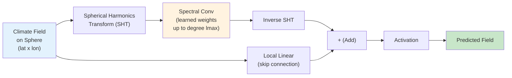
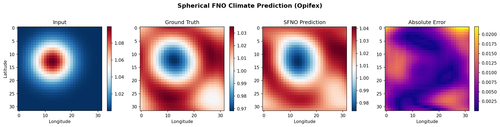

# Simple SFNO for Climate Modeling

| Metadata | Value |
|----------|-------|
| **Level** | Intermediate |
| **Runtime** | ~3 min (CPU/GPU) |
| **Prerequisites** | JAX, Flax NNX, Spherical Harmonics basics |
| **Format** | Python + Jupyter |
| **Memory** | ~1 GB RAM |

## Overview

The Spherical Fourier Neural Operator (SFNO) extends the FNO to spherical domains by
replacing standard Fourier transforms with spherical harmonic transforms. This makes it
the natural architecture for global climate and weather prediction, where data lives on
the surface of a sphere rather than a flat 2D grid.

This example demonstrates training a simple SFNO on synthetic shallow water equation
data using Opifex's `create_climate_sfno` factory, the `create_shallow_water_loader`
for building datarax data loaders, and the `Trainer` with `TrainingConfig` for the
training loop. In under 50 lines of configuration code, you build, train, and evaluate
a spherical neural operator.

## What You'll Learn

1. **Create** an SFNO with the `create_climate_sfno` factory
2. **Load** climate data with `create_shallow_water_loader` (datarax loaders)
3. **Train** with Opifex's `Trainer.fit()` API and `TrainingConfig`
4. **Evaluate** and visualize climate predictions on a spherical domain

## Coming from NeuralOperator (PyTorch)?

| NeuralOperator (PyTorch) | Opifex (JAX) |
|--------------------------|--------------|
| `SFNO(spectral_transform, ...)` | `create_climate_sfno(in_channels=, out_channels=, lmax=, rngs=)` |
| Manual spherical harmonics setup | Built-in SHT with configurable `lmax` |
| `torch.DataLoader(dataset)` | `create_shallow_water_loader()` (datarax) |
| `trainer.train(epochs=N)` | `Trainer(model, config, rngs).fit(train_data)` |
| Manual `torch.meshgrid` for sphere | Spherical grid handled internally by SFNO |
| `model.to(device)` | Automatic device placement via JAX |

**Key differences:**

1. **Factory function**: `create_climate_sfno` pre-configures spherical harmonic layers, reducing boilerplate
2. **Explicit PRNG**: Opifex uses JAX's explicit `rngs=nnx.Rngs(42)` instead of global random state
3. **XLA compilation**: Automatic JIT compilation of training steps for faster throughput
4. **datarax data loading**: Data loaders with built-in batching and train/val splitting

## Files

- **Python Script**: [`examples/neural-operators/sfno_climate_simple.py`](https://github.com/avitai/opifex/blob/main/examples/neural-operators/sfno_climate_simple.py)
- **Jupyter Notebook**: [`examples/neural-operators/sfno_climate_simple.ipynb`](https://github.com/avitai/opifex/blob/main/examples/neural-operators/sfno_climate_simple.ipynb)

## Quick Start

### Run the Python Script

```bash
source activate.sh && python examples/neural-operators/sfno_climate_simple.py
```

### Run the Jupyter Notebook

```bash
jupyter lab examples/neural-operators/sfno_climate_simple.ipynb
```

## Core Concepts

### Spherical Fourier Neural Operator

The SFNO adapts the Fourier Neural Operator to spherical geometry. Instead of the
standard 2D FFT used in flat-domain FNOs, the SFNO uses Spherical Harmonic Transforms
(SHT) to move between spatial and spectral representations on the sphere. The `lmax`
parameter controls how many spherical harmonic degrees are retained, analogous to the
`modes` parameter in a standard FNO.


```mermaid
graph LR
    A["Climate Field<br/>on Sphere<br/>(lat x lon)"] --> B["Spherical Harmonics<br/>Transform (SHT)"]
    B --> C["Spectral Conv<br/>(learned weights<br/>up to degree lmax)"]
    C --> D["Inverse SHT"]
    A --> E["Local Linear<br/>(skip connection)"]
    D --> F["+ (Add)"]
    E --> F
    F --> G["Activation"]
    G --> H["Predicted Field"]

    style A fill:#e3f2fd
    style H fill:#c8e6c9
    style C fill:#fff3e0
```

Each spectral layer in the SFNO performs:

1. **SHT**: Transform the input field from spatial (lat/lon) to spectral (spherical harmonic coefficients)
2. **Spectral convolution**: Apply learned weights to the harmonic coefficients up to degree `lmax`
3. **Inverse SHT**: Transform back to spatial domain
4. **Skip connection**: Add a local linear transform of the input
5. **Activation**: Apply nonlinearity (e.g., GELU)

### Shallow Water Equations

The shallow water equations are a standard benchmark for atmospheric modeling. They
describe the evolution of a fluid layer on a rotating sphere:

| Variable | Meaning | Role |
|----------|---------|------|
| $h$ | Fluid height | Prognostic variable |
| $u, v$ | Velocity components | Prognostic variables |
| $f$ | Coriolis parameter | Rotation effect |

The synthetic data generated by `create_shallow_water_loader` simulates these dynamics,
producing 3-channel fields (height + two velocity components) on a latitude-longitude grid.

## Implementation

### Step 1: Imports and Setup

```python
import math
import time
import warnings
from pathlib import Path

import jax
import jax.numpy as jnp
import matplotlib.pyplot as plt
import numpy as np
from flax import nnx

from opifex.core.training import Trainer, TrainingConfig
from opifex.data.loaders import create_shallow_water_loader
from opifex.neural.operators.fno.spherical import create_climate_sfno

print(f"JAX backend: {jax.default_backend()}")
print(f"JAX devices: {jax.devices()}")
```

**Terminal Output:**
```
======================================================================
Opifex Example: Simple Spherical FNO for Climate Modeling
======================================================================
JAX backend: gpu
JAX devices: [CudaDevice(id=0)]
```

### Step 2: Configuration

Define experiment parameters as simple variables. No YAML or Hydra config needed.

```python
RESOLUTION = 32
N_TRAIN = 50
N_TEST = 10
BATCH_SIZE = 4
NUM_EPOCHS = 5
LEARNING_RATE = 1e-3
SEED = 42

OUTPUT_DIR = Path("docs/assets/examples/sfno_climate_simple")
OUTPUT_DIR.mkdir(parents=True, exist_ok=True)
```

**Terminal Output:**
```
Resolution: 32x32
Training samples: 50, Test samples: 10
Batch size: 4, Epochs: 5
Output directory: docs/assets/examples/sfno_climate_simple
```

### Step 3: Load Data with datarax

Opifex provides `create_shallow_water_loader` which generates synthetic shallow water
equation data and returns a frozen `PDELoaders` (with `.train` and `.val` datarax
pipelines), splitting off a validation fraction internally.

```python
n_samples = N_TRAIN + N_TEST
loaders = create_shallow_water_loader(
    n_samples=n_samples,
    batch_size=BATCH_SIZE,
    resolution=RESOLUTION,
    val_fraction=N_TEST / n_samples,
    seed=SEED,
)

def _collect(pipeline) -> tuple[np.ndarray, np.ndarray]:
    # Batches are channels-first dicts: input/output each (batch, 3, H, W).
    inputs, outputs = [], []
    for batch in pipeline:
        inputs.append(np.asarray(batch["input"]))
        outputs.append(np.asarray(batch["output"]))
    return np.concatenate(inputs, axis=0), np.concatenate(outputs, axis=0)

x_train, y_train = _collect(loaders.train)
x_test, y_test = _collect(loaders.val)
```

**Terminal Output:**
```
Loading shallow water equation data via datarax...
Training data: X=(52, 3, 32, 32), Y=(52, 3, 32, 32)
Test data:     X=(12, 3, 32, 32), Y=(12, 3, 32, 32)
```

!!! note "Data Shape Convention"
    The data uses channels-first format `(batch, channels, height, width)` where the 3
    channels correspond to the shallow water equation prognostic variables (fluid height
    plus two velocity components). `in_channels` is derived directly from
    `x_train.shape[1]`, so it is 3 for this dataset.

### Step 4: Create the SFNO Model

The `create_climate_sfno` factory creates a Spherical FNO pre-configured for climate
modeling. It sets up spherical harmonic convolution layers with the specified maximum
degree `lmax`.

```python
in_channels = x_train.shape[1]
out_channels = y_train.shape[1]

model = create_climate_sfno(
    in_channels=in_channels,
    out_channels=out_channels,
    lmax=8,
    rngs=nnx.Rngs(SEED),
)
```

**Terminal Output:**
```
Creating Spherical FNO model...
Model: Spherical FNO (lmax=8)
Input channels: 3, Output channels: 3
```

### Step 5: Train with Opifex Trainer

Instead of writing a manual training loop, use Opifex's `Trainer` with `TrainingConfig`.
The `Trainer.fit()` method handles batched training with JIT compilation, validation,
and progress logging.

```python
config = TrainingConfig(
    num_epochs=NUM_EPOCHS,
    learning_rate=LEARNING_RATE,
    batch_size=BATCH_SIZE,
    verbose=True,
)

trainer = Trainer(
    model=model,
    config=config,
    rngs=nnx.Rngs(SEED),
)

trained_model, metrics = trainer.fit(
    train_data=(jnp.array(x_train), jnp.array(y_train)),
    val_data=(jnp.array(x_test), jnp.array(y_test)),
)
```

**Terminal Output:**
```
Setting up Trainer...
Optimizer: Adam (lr=0.001)

Starting training...
Training completed in 2.7s
Final train loss: 0.000446284597273916
Final val loss:   0.022472964599728584
```

### Step 6: Evaluation

Evaluate the trained model on the test set by computing MSE and relative L2 error.

```python
x_test_jnp = jnp.array(x_test)
y_test_jnp = jnp.array(y_test)

predictions = trained_model(x_test_jnp)

test_mse = float(jnp.mean((predictions - y_test_jnp) ** 2))

# Relative L2 error per sample
pred_diff = (predictions - y_test_jnp).reshape(predictions.shape[0], -1)
y_flat = y_test_jnp.reshape(y_test_jnp.shape[0], -1)
rel_l2 = float(
    jnp.mean(jnp.linalg.norm(pred_diff, axis=1) / jnp.linalg.norm(y_flat, axis=1))
)
```

**Terminal Output:**
```
Evaluating on test set...
Test MSE:         0.000339
Test Relative L2: 0.030804
```

### Visualization

The example generates a 4-panel visualization comparing input, ground truth, SFNO
prediction, and absolute error for a test sample.

```python
fig, axes = plt.subplots(1, 4, figsize=(16, 4))
fig.suptitle("Spherical FNO Climate Prediction (Opifex)", fontsize=14, fontweight="bold")

sample_idx = 0

# Input
im0 = axes[0].imshow(x_test[sample_idx, 0], cmap="RdBu_r", aspect="equal")
axes[0].set_title("Input")
axes[0].set_xlabel("Longitude")
axes[0].set_ylabel("Latitude")
plt.colorbar(im0, ax=axes[0], shrink=0.8)

# Ground truth
im1 = axes[1].imshow(y_test[sample_idx, 0], cmap="RdBu_r", aspect="equal")
axes[1].set_title("Ground Truth")
axes[1].set_xlabel("Longitude")
plt.colorbar(im1, ax=axes[1], shrink=0.8)

# Prediction
pred_np = np.array(predictions[sample_idx, 0])
im2 = axes[2].imshow(pred_np, cmap="RdBu_r", aspect="equal")
axes[2].set_title("SFNO Prediction")
axes[2].set_xlabel("Longitude")
plt.colorbar(im2, ax=axes[2], shrink=0.8)

# Absolute error
error = np.abs(pred_np - y_test[sample_idx, 0])
im3 = axes[3].imshow(error, cmap="plasma", aspect="equal")
axes[3].set_title("Absolute Error")
axes[3].set_xlabel("Longitude")
plt.colorbar(im3, ax=axes[3], shrink=0.8)

plt.tight_layout()
plt.savefig(OUTPUT_DIR / "sfno_results.png", dpi=150, bbox_inches="tight")
plt.close()
```

**Terminal Output:**
```
Generating visualization...
Visualization saved to docs/assets/examples/sfno_climate_simple/sfno_results.png
```



## Results Summary

| Metric | Value | Notes |
|--------|-------|-------|
| Final Train Loss | 0.00045 | After 5 epochs |
| Final Val Loss | 0.0225 | On held-out validation set |
| Test MSE | 0.000339 | Mean squared error |
| Test Relative L2 | 0.030804 | L2 relative error |
| Training Time | 2.7s | On single GPU |
| Resolution | 32x32 | Latitude x longitude grid |
| Spherical Modes | lmax=8 | Spherical harmonic degree |

### What We Achieved

- Trained a Spherical FNO on synthetic shallow water equation data in under 3 seconds
- Achieved a relative L2 error of ~0.031 with only 5 epochs and 52 training samples
- Demonstrated the full pipeline: data loading (datarax), model creation (factory), training (Trainer), evaluation, and visualization
- Used `create_climate_sfno` factory to set up spherical harmonic layers with minimal configuration

### Interpretation

The SFNO captures the global structure of the shallow water solution through spectral
convolutions in spherical harmonic space. With only 5 training epochs and 52 samples,
the relative L2 error of ~0.031 is reasonable for this quick demonstration. The error
map shows that prediction accuracy is relatively uniform across the spatial domain.
Increasing epochs, training samples, and `lmax` will improve accuracy further.

## Next Steps

### Experiments to Try

1. **Increase `lmax`**: Try `lmax=16` or `lmax=32` for higher spectral resolution and finer spatial detail
2. **More training data**: Increase `N_TRAIN` to 500+ samples for better generalization
3. **Longer training**: Train for 50-100 epochs to observe convergence behavior
4. **Mixed precision**: Use `jnp.bfloat16` for 40-50% memory reduction on larger resolutions
5. **Conservation analysis**: Check whether the SFNO preserves mass and energy (see full SFNO example)

### Related Examples

| Example | Level | What You'll Learn |
|---------|-------|-------------------|
| [SFNO Climate Full](sfno-climate-full.md) | Advanced | Conservation-aware loss, energy/mass analysis, production patterns |
| [FNO Darcy Full](fno-darcy.md) | Intermediate | Full FNO training pipeline on flat 2D domains |
| [UNO Darcy Framework](uno-darcy.md) | Intermediate | Multi-resolution U-shaped neural operator architecture |
| [Grid Embeddings](../layers/grid-embeddings.md) | Beginner | Spatial coordinate injection for neural operators |
| [Neural Operator Benchmark](../benchmarking/operator-benchmark.md) | Advanced | Cross-architecture performance comparison |

### API Reference

- [`create_climate_sfno`](../../api/neural.md) - SFNO factory for climate modeling
- [`create_shallow_water_loader`](../../api/data.md) - datarax shallow water data loader
- [`Trainer`](../../api/training.md) - Training orchestration
- [`TrainingConfig`](../../api/training.md) - Training hyperparameters

## Troubleshooting

### Low accuracy after training

**Symptom**: Relative L2 error remains high (> 0.5) after training.

**Cause**: Too few epochs or training samples for the model to learn the operator mapping.

**Solution**: Increase both training samples and epochs:
```python
N_TRAIN = 500
NUM_EPOCHS = 50
```

### OOM during training at high resolution

**Symptom**: `jaxlib.xla_extension.XlaRuntimeError: RESOURCE_EXHAUSTED`

**Cause**: High `RESOLUTION` or `lmax` values exceed available GPU memory.

**Solution**: Reduce resolution or enable gradient checkpointing:
```python
RESOLUTION = 32   # Start small, scale up
BATCH_SIZE = 2    # Reduce batch size

# Or enable gradient checkpointing via TrainingConfig
config = TrainingConfig(gradient_checkpointing=True, gradient_checkpoint_policy="dots_saveable")
```

### NaN in training loss

**Symptom**: Loss becomes `nan` after a few epochs.

**Cause**: Learning rate too high for spherical harmonic operations.

**Solution**: Reduce learning rate or add gradient clipping:
```python
import optax

optimizer = optax.chain(
    optax.clip_by_global_norm(1.0),
    optax.adam(1e-4),
)
```

### Data shape mismatch

**Symptom**: Shape error when passing data to the model.

**Cause**: `create_shallow_water_loader` yields channels-first 4D batches
`(batch, 3, height, width)`, and `in_channels` must match `x_train.shape[1]` (3 for
the shallow water fields). A mismatch usually means custom data with a different
channel count or a missing channel axis.

**Solution**: Derive the channel count from the data and add a channel axis if your
custom arrays are 3D:
```python
if x_train.ndim == 3:
    x_train = x_train[:, None, :, :]  # Add channel dimension

in_channels = x_train.shape[1]
```
