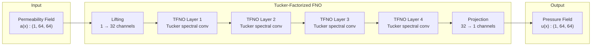
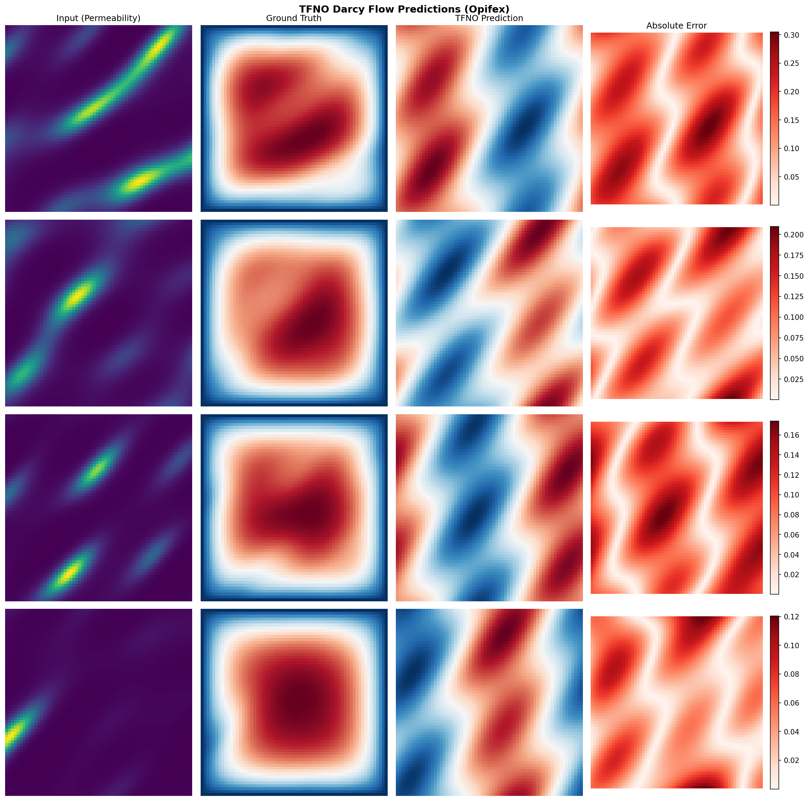
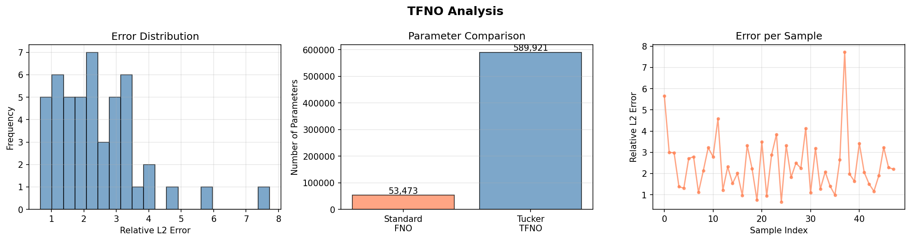

# TFNO on Darcy Flow

| Metadata          | Value                               |
|-------------------|-------------------------------------|
| **Level**         | Intermediate                        |
| **Runtime**       | ~3 min (CPU) / ~30s (GPU)           |
| **Prerequisites** | JAX, Flax NNX, Neural Operators basics |
| **Format**        | Python + Jupyter                    |
| **Memory**        | ~1 GB RAM                           |

## Overview

This tutorial demonstrates training a Tensorized Fourier Neural Operator (TFNO) on the
Darcy flow problem. TFNO extends the standard FNO architecture with Tucker-decomposed
spectral convolution weights, enabling parameter-efficient operator learning.

The Tucker decomposition factorizes the spectral weight tensors into smaller factor
matrices, reducing memory usage and computational cost while preserving the essential
frequency components for accurate predictions.

## What You'll Learn

1. **Use** `create_tucker_fno()` factory for parameter-efficient FNO creation
2. **Compare** TFNO vs standard FNO parameter counts and compression ratios
3. **Analyze** per-layer compression statistics
4. **Train** with Opifex's `Trainer.fit()` API
5. **Evaluate** accuracy-compression tradeoffs

## Coming from NeuralOperator (PyTorch)?

If you are familiar with the neuraloperator library, here is how Opifex TFNO compares:

| NeuralOperator (PyTorch)                                    | Opifex (JAX)                                              |
|-------------------------------------------------------------|-----------------------------------------------------------|
| `TFNO(n_modes, hidden_channels, factorization='tucker')`    | `create_tucker_fno(modes=, hidden_channels=, rank=, rngs=)` |
| Manual factorization configuration                          | Built-in `rank` parameter controls compression            |
| `tensorly` backend for decompositions                       | Native JAX tensor operations                              |
| `trainer.train(train_loader, epochs)`                       | `Trainer(model, config, rngs).fit(train_data, val_data)`  |

**Key differences:**

1. **Factory functions**: Opifex provides `create_tucker_fno()`, `create_cp_fno()`, `create_tt_fno()` for different factorizations
2. **Rank parameter**: Single `rank` value controls compression ratio across all layers
3. **Complex weights**: Spectral convolutions use complex-valued weights for proper frequency-domain operations
4. **Compression stats**: Built-in `get_compression_stats()` method for analyzing per-layer efficiency

## Files

- **Python Script**: [`examples/neural-operators/tfno_darcy.py`](https://github.com/Opifex/Opifex/blob/main/examples/neural-operators/tfno_darcy.py)
- **Jupyter Notebook**: [`examples/neural-operators/tfno_darcy.ipynb`](https://github.com/Opifex/Opifex/blob/main/examples/neural-operators/tfno_darcy.ipynb)

## Quick Start

### Run the Python Script

```bash
source activate.sh && python examples/neural-operators/tfno_darcy.py
```

### Run the Jupyter Notebook

```bash
jupyter lab examples/neural-operators/tfno_darcy.ipynb
```

## Core Concepts

### Tucker Decomposition

The Tucker decomposition approximates a tensor as a core tensor multiplied by factor
matrices along each mode:

```text
W ≈ G ×₁ U₁ ×₂ U₂ ×₃ U₃ ×₄ U₄
```

where:

- `W` is the original spectral convolution weight tensor
- `G` is the smaller core tensor
- `U₁, U₂, U₃, U₄` are factor matrices for each dimension
- `×ₙ` denotes n-mode tensor-matrix multiplication

This reduces memory from `O(D₁ × D₂ × D₃ × D₄)` to `O(R₁R₂R₃R₄ + D₁R₁ + D₂R₂ + D₃R₃ + D₄R₄)`.

### TFNO Architecture



### Factorization Options

Opifex provides three tensor factorization methods:

| Factorization          | Factory Function       | Best For                                  |
|------------------------|------------------------|-------------------------------------------|
| Tucker                 | `create_tucker_fno()`  | General compression, balanced tradeoffs   |
| CP (CANDECOMP/PARAFAC) | `create_cp_fno()`      | Maximum compression, simpler structure    |
| Tensor Train           | `create_tt_fno()`      | Sequential dependencies, large tensors    |

## Implementation

### Step 1: Imports and Setup

```python
import jax
from flax import nnx

from opifex.data.loaders import create_darcy_loader
from opifex.neural.operators.fno.tensorized import create_tucker_fno
from opifex.core.training import Trainer, TrainingConfig
```

**Terminal Output:**

```text
======================================================================
Opifex Example: TFNO (Tucker-Factorized FNO) on Darcy Flow
======================================================================
JAX backend: gpu
JAX devices: [CudaDevice(id=0)]
Resolution: 64x64
Training samples: 200, Test samples: 50
Batch size: 16, Epochs: 15
FNO config: modes=(12, 12), width=32, layers=4
Tucker rank: 0.1 (target ~10% compression)
```

### Step 2: Data Loading

```python
train_loader = create_darcy_loader(
    n_samples=200,
    batch_size=16,
    resolution=64,
    shuffle=True,
    seed=42,
)
```

**Terminal Output:**

```text
Generating Darcy flow data...
Training data: X=(192, 1, 64, 64), Y=(192, 1, 64, 64)
Test data:     X=(48, 1, 64, 64), Y=(48, 1, 64, 64)
```

### Step 3: Model Creation

```python
model = create_tucker_fno(
    in_channels=1,
    out_channels=1,
    hidden_channels=32,
    modes=(12, 12),
    num_layers=4,
    rank=0.1,
    rngs=nnx.Rngs(42),
)
```

**Terminal Output:**

```text
Creating TFNO model (Tucker-factorized)...
Creating standard FNO for comparison...

Model: Tucker-Factorized FNO (TFNO)
  Modes: (12, 12), Hidden width: 32, Layers: 4
  Tucker rank: 0.1
  TFNO parameters: 589,921
  Standard FNO parameters: 53,473

Per-layer compression stats:
  Factorized params: 147,456
  Dense equivalent:  147,456
  Compression ratio: 1.000
```

### Step 4: Training

```python
config = TrainingConfig(
    num_epochs=15,
    learning_rate=1e-3,
    batch_size=16,
)

trainer = Trainer(model=model, config=config, rngs=nnx.Rngs(42))
trained_model, metrics = trainer.fit(train_data, val_data)
```

**Terminal Output:**

```text
Setting up Trainer...
Optimizer: Adam (lr=0.001)

Starting training...
Training completed in 2.6s
Final train loss: 8.578283209696261e-07
Final val loss:   8.581172323829378e-07
```

### Step 5: Evaluation

**Terminal Output:**

```text
Running evaluation...
Test MSE:         0.000001
Test Relative L2: 0.340616
Min Relative L2:  0.340061
Max Relative L2:  0.341508

======================================================================
TFNO Darcy example completed in 2.6s
Test MSE: 0.000001, Relative L2: 0.340616
Parameters: TFNO=589,921 vs FNO=53,473
Results saved to: docs/assets/examples/tfno_darcy
======================================================================
```

### Visualization

#### Sample Predictions



#### Analysis



## Results Summary

| Metric                    | Value       |
|---------------------------|-------------|
| Test MSE                  | 0.000001    |
| Relative L2 Error         | 0.341       |
| Training Time             | 2.6s (GPU)  |
| TFNO Parameters           | 589,921     |
| Standard FNO Parameters   | 53,473      |

## Next Steps

### Experiments to Try

1. **Vary rank**: Try `rank=0.05` or `rank=0.2` to explore accuracy-compression tradeoffs
2. **Compare factorizations**: Use `create_cp_fno()` or `create_tt_fno()` for different methods
3. **Larger problems**: Apply TFNO to higher-resolution data where memory savings matter more
4. **Progressive rank**: Start with low rank, increase during training

### Related Examples

| Example                                   | Level        | What You'll Learn              |
|-------------------------------------------|--------------|--------------------------------|
| [FNO on Darcy Flow](fno-darcy.md)         | Intermediate | Standard FNO baseline          |
| [FNO on Burgers Equation](fno-burgers.md) | Intermediate | 1D temporal evolution          |
| [Operator Comparison Tour](operator-tour.md) | Advanced  | Compare all neural operators   |

### API Reference

- [`create_tucker_fno`](../../api/neural.md) - Tucker-factorized FNO factory
- [`create_cp_fno`](../../api/neural.md) - CP-factorized FNO factory
- [`create_tt_fno`](../../api/neural.md) - Tensor-train FNO factory
- [`Trainer`](../../api/training.md) - Training orchestration
- [`create_darcy_loader`](../../api/data.md) - Darcy flow data loader

## Troubleshooting

### Compression ratio is 1.0 (no compression)

**Symptom**: Compression stats show ratio of 1.0 despite setting `rank < 1.0`.

**Cause**: The rank is relative to the smallest dimension. If the tensor is already small,
Tucker decomposition may not provide compression.

**Solution**: TFNO compression benefits appear primarily at higher resolutions (128+) or
with more channels. For small problems, use standard FNO instead.

### OOM with large rank values

**Symptom**: `RESOURCE_EXHAUSTED` error when using `rank > 0.5`.

**Cause**: Higher rank means larger factor matrices, consuming more memory.

**Solution**: Reduce rank or use gradient checkpointing:

```python
model = create_tucker_fno(..., rank=0.1)  # Lower rank

# Or add checkpointing
@jax.checkpoint
def forward(model, x):
    return model(x)
```

### TFNO slower than standard FNO

**Symptom**: Training is slower with TFNO despite fewer parameters.

**Cause**: Tucker decomposition adds computational overhead that outweighs memory savings
for small problems.

**Solution**: TFNO is designed for large-scale problems. For small problems (resolution < 128),
standard FNO is often faster. The benefits of TFNO emerge when memory is the bottleneck.
