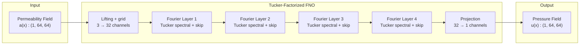
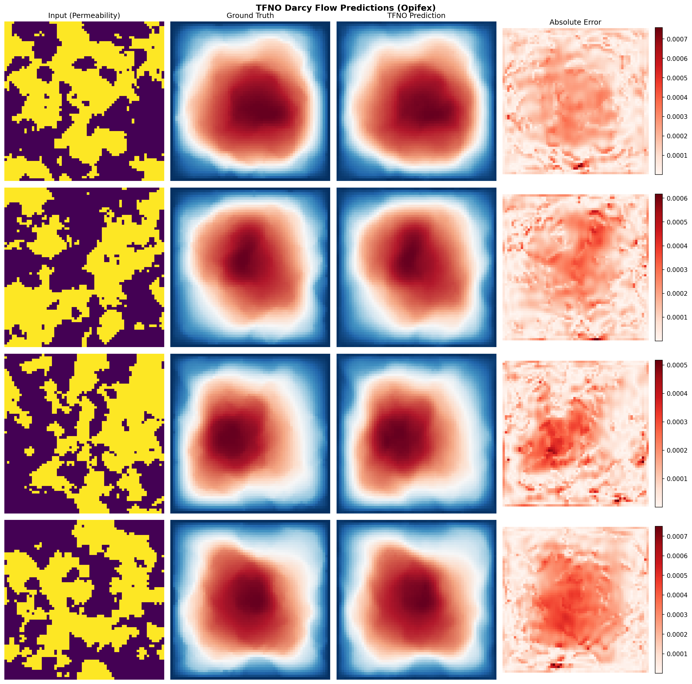
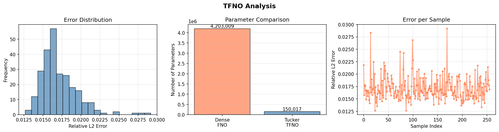

# TFNO on Darcy Flow

| Metadata          | Value                               |
|-------------------|-------------------------------------|
| **Level**         | Intermediate                        |
| **Runtime**       | ~5 min (CPU) / ~1 min (GPU)         |
| **Prerequisites** | JAX, Flax NNX, Neural Operators basics |
| **Format**        | Python + Jupyter                    |
| **Memory**        | ~2 GB RAM                           |

## Overview

This tutorial trains a Tensorized Fourier Neural Operator (TFNO) on the Darcy flow
problem. A TFNO is an ordinary FNO whose spectral-convolution weights are stored as a
low-rank **tensor factorization** (Tucker, CP, or Tensor-Train). At low rank this uses
a small fraction of the dense weight's parameters while retaining accuracy.

The Tucker decomposition factorizes each spectral weight tensor into a small core plus
per-mode factor matrices, cutting parameter count and memory while preserving the
frequency content needed for accurate predictions.

## What You'll Learn

1. **Use** `create_tucker_fno()` factory for a parameter-efficient FNO
2. **Measure** genuine spectral-weight compression with `get_compression_stats()`
3. **Train** with Gaussian input/output normalization and the relative-L2 loss
4. **Compare** TFNO vs dense FNO parameter counts and read the accuracy

## Coming from NeuralOperator (PyTorch)?

If you are familiar with the neuraloperator library, here is how Opifex TFNO compares:

| NeuralOperator (PyTorch)                                    | Opifex (JAX)                                              |
|-------------------------------------------------------------|-----------------------------------------------------------|
| `TFNO(n_modes, hidden_channels, factorization='tucker')`    | `create_tucker_fno(modes=, hidden_channels=, rank=, rngs=)` |
| Manual factorization configuration                          | Built-in `rank` parameter controls compression            |
| `tensorly` backend for decompositions                       | Native JAX tensor operations                              |
| `trainer.train(train_loader, epochs)`                       | `Trainer(model, config, rngs).fit(train_data, val_data)`  |

**Key differences:**

1. **Factory functions**: Opifex provides `create_tucker_fno()`, `create_cp_fno()`, `create_tt_fno()` for different factorizations
2. **Rank parameter**: Single `rank` value controls compression ratio across all layers
3. **Complex weights**: Spectral convolutions use complex-valued weights for proper frequency-domain operations
4. **Compression stats**: Built-in `get_compression_stats()` method for analyzing efficiency

## Files

- **Python Script**: [`examples/neural-operators/tfno_darcy.py`](https://github.com/avitai/opifex/blob/main/examples/neural-operators/tfno_darcy.py)
- **Jupyter Notebook**: [`examples/neural-operators/tfno_darcy.ipynb`](https://github.com/avitai/opifex/blob/main/examples/neural-operators/tfno_darcy.ipynb)

## Quick Start

### Run the Python Script

```bash
source activate.sh && python examples/neural-operators/tfno_darcy.py
```

### Run the Jupyter Notebook

```bash
jupyter lab examples/neural-operators/tfno_darcy.ipynb
```

## Core Concepts

### Tucker Decomposition

The Tucker decomposition approximates a tensor as a core tensor multiplied by factor
matrices along each mode:

```text
W ≈ G ×₁ U₁ ×₂ U₂ ×₃ U₃ ×₄ U₄
```

where:

- `W` is the original spectral convolution weight tensor
- `G` is the smaller core tensor
- `U₁, U₂, U₃, U₄` are factor matrices for each dimension
- `×ₙ` denotes n-mode tensor-matrix multiplication

This reduces memory from `O(D₁ × D₂ × D₃ × D₄)` to `O(R₁R₂R₃R₄ + D₁R₁ + D₂R₂ + D₃R₃ + D₄R₄)`.

### TFNO Architecture


```mermaid
graph LR
    subgraph Input
        A["Permeability Field<br/>a(x) : (1, 64, 64)"]
    end

    subgraph TFNO["Tucker-Factorized FNO"]
        B["Lifting + grid<br/>3 → 32 channels"]
        C["Fourier Layer 1<br/>Tucker spectral + skip"]
        D["Fourier Layer 2<br/>Tucker spectral + skip"]
        E["Fourier Layer 3<br/>Tucker spectral + skip"]
        F["Fourier Layer 4<br/>Tucker spectral + skip"]
        G["Projection<br/>32 → 1 channels"]
    end

    subgraph Output
        H["Pressure Field<br/>u(x) : (1, 64, 64)"]
    end

    A --> B --> C --> D --> E --> F --> G --> H
```

Each Fourier block applies `activation(tucker_spectral_conv(x) + W·x)` — a low-rank
spectral term plus a pointwise skip connection. Normalised grid coordinates are appended
as input channels (positional embedding) so the operator can resolve the Dirichlet
boundary layer.

### Factorization Options

Opifex provides three tensor factorization methods:

| Factorization          | Factory Function       | Best For                                  |
|------------------------|------------------------|-------------------------------------------|
| Tucker                 | `create_tucker_fno()`  | General compression, balanced tradeoffs   |
| CP (CANDECOMP/PARAFAC) | `create_cp_fno()`      | Maximum compression, simpler structure    |
| Tensor Train           | `create_tt_fno()`      | Sequential dependencies, large tensors    |

## Implementation

### Step 1: Imports and Setup

```python
import jax
from flax import nnx

from opifex.core.training import Trainer, TrainingConfig
from opifex.core.training.config import LossConfig
from opifex.data.loaders import create_darcy_loader
from opifex.neural.operators.fno.base import FourierNeuralOperator
from opifex.neural.operators.fno.tensorized import create_tucker_fno
```

**Terminal Output:**

```text
======================================================================
Opifex Example: TFNO (Tucker-Factorized FNO) on Darcy Flow
======================================================================
JAX backend: gpu
JAX devices: [CudaDevice(id=0)]
Resolution: 64x64
Training samples: 1024, Test samples: 256
Batch size: 32, Epochs: 100
FNO config: modes=(16, 16), width=32, layers=4
Tucker rank: 0.5
```

### Step 2: Data Loading

The loader generates a binary high-contrast permeability field `a(x) ∈ {3, 12}` (the
standard Darcy benchmark) and the exact pressure solution of `-∇·(a∇u) = 1` with zero
Dirichlet boundary conditions.

```python
train_loader = create_darcy_loader(
    n_samples=1024,
    batch_size=32,
    resolution=64,
    field_type="binary",  # high-contrast benchmark (a in {3, 12})
    viscosity_range=(3.0, 12.0),
    shuffle=True,
    seed=42,
)
```

**Terminal Output:**

```text
Generating Darcy flow data...
Training data: X=(1024, 1, 64, 64), Y=(1024, 1, 64, 64)
Test data:     X=(256, 1, 64, 64), Y=(256, 1, 64, 64)
Input mean/std:  7.5017 / 4.5000
Output mean/std: 0.005341 / 0.003578
```

### Step 3: Model Creation

```python
model = create_tucker_fno(
    in_channels=1,
    out_channels=1,
    hidden_channels=32,
    modes=(16, 16),
    num_layers=4,
    rank=0.5,
    rngs=nnx.Rngs(42),
)
stats = model.get_compression_stats()
```

**Terminal Output:**

```text
Creating TFNO model (Tucker-factorized)...
Creating dense FNO for comparison...

Model: Tucker-Factorized FNO (TFNO)
  Modes: (16, 16), Hidden width: 32, Layers: 4
  Tucker rank: 0.5
  TFNO parameters: 150,017
  Dense FNO parameters: 4,203,009
  Parameter reduction: 96.4%

Spectral-weight compression (all factorized layers):
  Factorized params: 70,656
  Dense equivalent:  1,048,576
  Compression ratio: 0.0674
```

### Step 4: Training

Train with the relative-L2 loss — the standard operator-learning objective — on the
Gaussian-normalized fields.

```python
config = TrainingConfig(
    num_epochs=100,
    learning_rate=1e-3,
    batch_size=32,
    loss_config=LossConfig(loss_type="relative_l2"),
)

trainer = Trainer(model=model, config=config, rngs=nnx.Rngs(42))
trained_model, metrics = trainer.fit(train_data, val_data)
```

**Terminal Output:**

```text
Setting up Trainer...
Optimizer: Adam (lr=0.001), loss: relative L2

Starting training...
Training completed in 21.4s
Final train loss: 0.031862245697993785
Final val loss:   0.0009037216077558696
```

### Step 5: Evaluation

Predictions are un-normalized to physical pressure before the relative L2 error is
measured.

**Terminal Output:**

```text
Running evaluation...
Test MSE:         2.518951e-08
Test Relative L2: 0.024156
Min Relative L2:  0.014786
Max Relative L2:  0.046641

======================================================================
TFNO Darcy example completed in 21.4s
Test MSE: 2.518951e-08, Relative L2: 0.024156
Parameters: TFNO=150,017 vs dense FNO=4,203,009
Results saved to: docs/assets/examples/tfno_darcy
======================================================================
```

### Visualization

#### Sample Predictions



#### Analysis



## Results Summary

| Metric                    | Value         |
|---------------------------|---------------|
| Test Relative L2          | 0.024         |
| Test MSE                  | 2.5e-08       |
| Training Time             | 21.4s (GPU)   |
| TFNO Parameters           | 150,017       |
| Dense FNO Parameters      | 4,203,009     |
| Parameter Reduction       | 96.4%         |

The Tucker factorization compresses the spectral weights by **15×** (96.4% fewer
parameters than the dense FNO) while the TFNO still reaches a **~2.4% relative L2 error**
on held-out Darcy flow — the prediction is visually indistinguishable from the
ground-truth pressure field.

## Next Steps

### Experiments to Try

1. **Vary rank**: Try `rank=0.25` or `rank=0.75` to explore the accuracy-compression tradeoff
2. **Compare factorizations**: Use `create_cp_fno()` or `create_tt_fno()` for different methods
3. **Larger problems**: Apply TFNO to higher-resolution data where memory savings matter more
4. **Progressive rank**: Start with low rank, increase during training

### Related Examples

| Example                                   | Level        | What You'll Learn              |
|-------------------------------------------|--------------|--------------------------------|
| [FNO on Darcy Flow](fno-darcy.md)         | Intermediate | Standard FNO baseline          |
| [FNO on Burgers Equation](fno-burgers.md) | Intermediate | 1D temporal evolution          |
| [Operator Comparison Tour](operator-tour.md) | Advanced  | Compare all neural operators   |

### API Reference

- [`create_tucker_fno`](../../api/neural.md) - Tucker-factorized FNO factory
- [`create_cp_fno`](../../api/neural.md) - CP-factorized FNO factory
- [`create_tt_fno`](../../api/neural.md) - Tensor-train FNO factory
- [`Trainer`](../../api/training.md) - Training orchestration
- [`create_darcy_loader`](../../api/data.md) - Darcy flow data loader

## Troubleshooting

### Lower accuracy than expected

**Symptom**: The relative L2 error is high (the prediction does not match the solution).

**Causes and fixes:**

- **Missing normalization** — fit Gaussian statistics on the training set and normalize
  inputs and outputs; un-normalize predictions before computing errors.
- **Wrong loss** — use `LossConfig(loss_type="relative_l2")`; plain MSE underweights
  low-magnitude samples for operator learning.
- **Too little data** — an FNO at 64×64 needs ~1000 training samples to generalize;
  with only a few hundred it memorizes the training set.

### Choosing the rank

Lower `rank` removes more parameters but eventually costs accuracy. `rank=0.5` gives a
~15× spectral-weight compression here with no measurable accuracy loss;
`get_compression_stats()` reports the true `compression_ratio` and `parameter_reduction`
so you can tune `rank` empirically.

### TFNO slower than standard FNO

**Symptom**: Training is slower with TFNO despite fewer parameters.

**Cause**: The factorized contraction adds overhead that can outweigh the memory savings
for small problems.

**Solution**: TFNO is designed for large-scale problems. For small problems (resolution < 128),
a dense FNO is often faster; the benefits of TFNO emerge when memory is the bottleneck.
